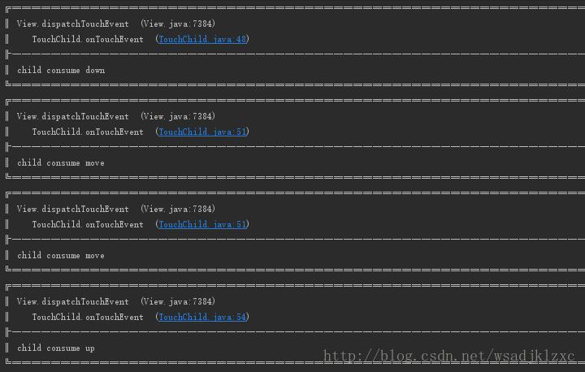
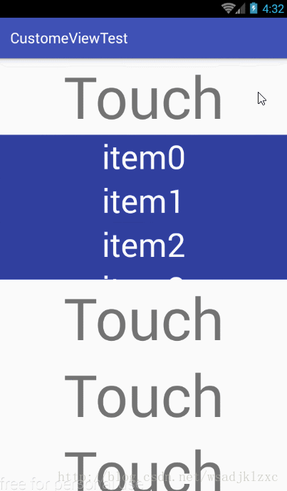

# Android View 事件分发机制

- [触摸事件处理框架](#触摸事件处理框架)
  - [核心方法](#核心方法)
  - [调用关系](#调用关系)
  - [触摸事件流向](#触摸事件流向)
- [部分方法内部实现](#部分方法内部实现)
  - [Activity-dispatchTouchEvent](#activity-dispatchtouchevent)
  - [View-dispatchTouchEvent](#view-dispatchtouchevent)
  - [Viewgroup-onInterceptTouchEvent](#viewgroup-onintercepttouchevent)
  - [View-onTouchEvent](#view-ontouchevent)
- [ViewGroup-dispatchTouchEvent 分析](#viewgroup-dispatchtouchevent-分析)
- [编码验证](#编码验证)
- [触摸事件冲突处理](#触摸事件冲突处理)
  - [外部拦截法](#外部拦截法)
  - [内部拦截法](#内部拦截法)
- [事件冲突处理实例](#事件冲突处理实例)


# 触摸事件处理框架

Android 的 View 和 ViewGroup 采用了 Composite(组合) 设计模式，View 的组合具有高度动态性，在这种情况下，由于触摸事件是从底层驱动传递至上层 View 对象，如果按照普通对象间传递信息的方式，将会很复杂，很难处理，这里 Android 采用了 Chain of Responsibility（责任链） 设计模式，触摸事件流将通过视图树，使每个 View 对象都有机会处理事件，一旦某个 View 选择接收事件流，那么整个事件将交给它处理，如果 View 选择不处理，那么事件流会继续传递，直到找到最后的处理者，在处理触摸事件时有几个重要的方法，在弄懂 Android 事件分发机制之前，需要先了解这几个方法的作用及关系。

## 核心方法

- ViewGroup 的三个重载方法

> `boolean dispatchEvent(MotionEvent e)` 当触摸事件传递给当前 View 或 ViewGroup 时，此方法将会被调用，它会负责事件的分发工作，可能会将事件交给自己的 `onTouchEvent` 方法或子View来处理，返回值为是否消耗事件
>
> `boolean onIntercepteEvent(MotionEvent e)` 此方法将被 `dispatchEvent` 方法调用，返回的是是否拦截此次事件，如果返回 true，事件将被拦截，事件交给自己的 `onTouchEvent` 处理，子 view 将不能接收到事件，否则交给子view处理，但子 view 可以通过一个方法设置一个标记来阻止事件的拦截。
>
> `boolean onTouchEvent(MotionEvent e)` 负责消耗触摸事件，一般在此处处理触摸事件，返回值为是否消耗事件，若不消耗事件，事件将不会再次被传递，而是交给上层 View 进行处理

- View 中存在两个方法，作用和 ViewGroup 相似

> `boolean dispatchEvent(MotionEvent e)` 作用和 ViewGroup 类似，由于 View 一定会处理事件，所以 View 不存在 `onIntercepteEvent` 这个方法，因此 `dispatchEvent` 最终会将事件交给 `onTouchEvent` 方法处理
>
> `boolean onTouchEvent(MotionEvent e)` 与 ViewGroup 作用相同

## 调用关系

上面介绍了每个方法的作用，下面用伪代码来描述他们的大致关系

```java
/* 事件交给 viewGroup 的 dispatchTouchEvent 进行处理 */
public boolean dispatchTouchEvent(MotionEvent event) {
  boolean consume = false;
  if (onIntercepteEvent(event)) {
    /* 决定拦截，事件将交给自己处理 */
    consume = onTouchEvent(event);
  } else {
    /* 否则交给子view或viewGroup继续分发事件 */
    consume = touchTarget.dispatchTouchEvent();
  }
  return consume;
}
```

上面的伪代码将事件处理模型描述了出来，事件总体是按照这个方式处理的，但涉及到 DOWN，MOVE 等具体事件时还需要详细探讨

## 触摸事件流向

上面介绍了触摸事件处理结构，下面介绍当一个触摸事件产生时，触摸事件的传递方向，当触摸屏幕产生触摸事件时，事件将会首先到达顶层 Activity 并交给它的 `dispatchTouchEvent` 方法来处理，虽然 Activity 不是 View，但它同样具有 `dispatchTouchEvent`和 `onTouchEvent` 方法，`dispatchTouchEvent` 会辗转调用顶层 View 的 `dispatchTouchEvent` 方法，并传递触摸事件，即开始按照上面伪代码描述的流程来传递事件，如果顶层 View 的 `dispatchTouchEvent` 返回 `false` 即事件没有被消耗，则会最终交给 Activity 自身的 `onTouchEvent` 方法处理

# 部分方法内部实现

在遇到事件冲突问题时，通常需要在自定义的 ViewGroup 或 View 中重写部分事件处理方法改变部分原有规则。

## Activity-dispatchTouchEvent

可以看到 Activity 的 `dispatchTouchEvent` 的处理，就是之前所描述的

```java
public boolean dispatchTouchEvent(MotionEvent ev) {
  if (ev.getAction() == MotionEvent.ACTION_DOWN) {
    onUserInteraction();
  }
  // Window 对象将会把事件传递给顶层 view(DecorView)
  if (getWindow().superDispatchTouchEvent(ev)) {
    return true;
  }
  // 否则交给自己
  return onTouchEvent(ev);
 }
```

## View-dispatchTouchEvent

View 的 dispatchEventEvent 方法，当 OnTouchListener 未处理事件，事件将交给 onTouchEvent 处理。 

```java
public boolean dispatchTouchEvent(MotionEvent event) {
    ...
    boolean result = false;
    if (mInputEventConsistencyVerifier != null) {
        mInputEventConsistencyVerifier.onTouchEvent(event, 0);
    }
    final int actionMasked = event.getActionMasked();
    if (actionMasked == MotionEvent.ACTION_DOWN) {
        stopNestedScroll();
    }
    if (onFilterTouchEventForSecurity(event)) { // 安全条件过滤后的事件
        if ((mViewFlags & ENABLED_MASK) == ENABLED && handleScrollBarDragging(event)) {
            result = true; // 处理滚动条
        }
      	// 如果 view 设置了 onTouchListener 并且它消耗了事件，
      	// 那么view 的 onTouchEvent 方法将不会再回调
        ListenerInfo li = mListenerInfo;
        if (li != null && li.mOnTouchListener != null
                && (mViewFlags & ENABLED_MASK) == ENABLED
                && li.mOnTouchListener.onTouch(this, event)) {
            result = true;
        }
        if (!result && onTouchEvent(event)) {
            result = true;
        }
    }
    if (actionMasked == MotionEvent.ACTION_UP || 
        actionMasked == MotionEvent.ACTION_CANCEL || 
        (actionMasked == MotionEvent.ACTION_DOWN && !result)) {
        stopNestedScroll();
    }
    return result;
}
```

## Viewgroup-onInterceptTouchEvent

ViewGroup 的 `onInterceptTouchEvent` 的方法实现，

```java
public boolean onInterceptTouchEvent(MotionEvent ev) {
    if (ev.isFromSource(InputDevice.SOURCE_MOUSE)
        && ev.getAction() == MotionEvent.ACTION_DOWN
        && ev.isButtonPressed(MotionEvent.BUTTON_PRIMARY)
        && isOnScrollbarThumb(ev.getX(), ev.getY())) {
      	return true;
    }
    return false;
}
```

常用的几个布局，包括 `LiearnLayout`、`RelativeLayout`、`FrameLayout`，都没有重写 `onInterceptTouchEvent` 方法，使用的都是 ViewGroup 的实现，只有在手指或者鼠标触摸时返回 `true` 选择拦截事件，其他情况都返回  `false`，不拦截事件，事件将交给子 View 处理，当需要拦截事件交给 ViewGroup 处理的时候，可以重写这个方法，改变它默认的规则。

## View-onTouchEvent

ViewGroup 和 View 使用相同的 `onTouchEvent` 方法实现，可以看出 View 默认实现了点击事件的处理，对于设置了 DISABLE 属性的 view，如果设置了可点击，例如 `CLICKABLE` 或 `LONGCLICKABLE` 属性，则会消耗事件，

```java
public boolean onTouchEvent(MotionEvent event) {
    final float x = event.getX();
    final float y = event.getY();
    final int viewFlags = mViewFlags;
    final int action = event.getAction();
  	// 当控件为 DISABLED 状态时，如果设置了点击属性，依然会消耗事件
    if ((viewFlags & ENABLED_MASK) == DISABLED) {
        if (action == MotionEvent.ACTION_UP && (mPrivateFlags & PFLAG_PRESSED) != 0) {
            setPressed(false);
        }
        return (((viewFlags & CLICKABLE) == CLICKABLE
                || (viewFlags & LONG_CLICKABLE) == LONG_CLICKABLE)
                || (viewFlags & CONTEXT_CLICKABLE) == CONTEXT_CLICKABLE);
    }
  	// 类似 onTouchListener
    if (mTouchDelegate != null) {
        if (mTouchDelegate.onTouchEvent(event)) {
            return true;
        }
    }
  	// 处理点击事件
    if (((viewFlags & CLICKABLE) == CLICKABLE ||
            (viewFlags & LONG_CLICKABLE) == LONG_CLICKABLE) ||
            (viewFlags & CONTEXT_CLICKABLE) == CONTEXT_CLICKABLE) {
        switch (action) {
            case MotionEvent.ACTION_UP:
                boolean prepressed = (mPrivateFlags & PFLAG_PREPRESSED) != 0;
                if ((mPrivateFlags & PFLAG_PRESSED) != 0 || prepressed) {
                    boolean focusTaken = false;
                    if (isFocusable() && isFocusableInTouchMode() && !isFocused()) {
                        focusTaken = requestFocus();
                    }
                    if (prepressed) {
                        setPressed(true, x, y);
                   }
                    if (!mHasPerformedLongPress && !mIgnoreNextUpEvent) {
                        removeLongPressCallback();
                        if (!focusTaken) {
                            if (mPerformClick == null) {
                                mPerformClick = new PerformClick();
                            }
                            if (!post(mPerformClick)) {
                                performClick();
                            }
                        }
                    }
                    if (mUnsetPressedState == null) {
                        mUnsetPressedState = new UnsetPressedState();
                    }
                    if (prepressed) {
                        postDelayed(mUnsetPressedState,
                                ViewConfiguration.getPressedStateDuration());
                    } else if (!post(mUnsetPressedState)) {
                        mUnsetPressedState.run();
                    }
                    removeTapCallback();
                }
                mIgnoreNextUpEvent = false;
                break;
            case MotionEvent.ACTION_DOWN:
                mHasPerformedLongPress = false;
                if (performButtonActionOnTouchDown(event)) {
                    break;
                }
                boolean isInScrollingContainer = isInScrollingContainer();
                if (isInScrollingContainer) {
                    mPrivateFlags |= PFLAG_PREPRESSED;
                    if (mPendingCheckForTap == null) {
                        mPendingCheckForTap = new CheckForTap();
                    }
                    mPendingCheckForTap.x = event.getX();
                    mPendingCheckForTap.y = event.getY();
                    postDelayed(mPendingCheckForTap, ViewConfiguration.getTapTimeout());
                } else {
                    setPressed(true, x, y);
                    checkForLongClick(0, x, y);
                }
                break;
            case MotionEvent.ACTION_CANCEL:
                setPressed(false);
                removeTapCallback();
                removeLongPressCallback();
                mInContextButtonPress = false;
                mHasPerformedLongPress = false;
                mIgnoreNextUpEvent = false;
                break;
            case MotionEvent.ACTION_MOVE:
                drawableHotspotChanged(x, y);
                if (!pointInView(x, y, mTouchSlop)) {
                    removeTapCallback();
                    if ((mPrivateFlags & PFLAG_PRESSED) != 0) {
                        removeLongPressCallback();
                        setPressed(false);
                    }
                }
                break;
        }
        return true;
    }
    return false;
}
```

# ViewGroup-dispatchTouchEvent 分析

上面是事件分发的流程和参与事件分发的部分方法实现，最后对 ViewGroup 的 dispatchTouchEvent 方法进行分析，它是事件分发机制的核心实现。

```java
@Override
public boolean dispatchTouchEvent(MotionEvent ev) {
  if (mInputEventConsistencyVerifier != null) {
    mInputEventConsistencyVerifier.onTouchEvent(ev, 1);
  }

  if (ev.isTargetAccessibilityFocus() && isAccessibilityFocusedViewOrHost()) {
    ev.setTargetAccessibilityFocus(false);
  }

  boolean handled = false;
  if (onFilterTouchEventForSecurity(ev)) {
    final int action = ev.getAction();
    final int actionMasked = action & MotionEvent.ACTION_MASK;

    // ------------------------------------------------ part 1 

    /* 在 DOWN事件(事件序列开始) 发生时初始化 */
    if (actionMasked == MotionEvent.ACTION_DOWN) {
      /* 清空 mFirstTouchTarget */
      cancelAndClearTouchTargets(ev);
      /* 清空状态包括 FLAG_DISALLOW_INTERCEPT */
      resetTouchState();
    }

    final boolean intercepted;
    if (actionMasked == MotionEvent.ACTION_DOWN || mFirstTouchTarget != null) {
      /* FLAG_DISALLOW_INTERCEPT 为子 View 设置的拦截标记 */
      final boolean disallowIntercept = (mGroupFlags & FLAG_DISALLOW_INTERCEPT) != 0;
      if (!disallowIntercept) {
        intercepted = onInterceptTouchEvent(ev);
        ev.setAction(action);
      } else {
        intercepted = false;
      }
    } else {
      intercepted = true;
    }

    // ------------------------------------------------ part 1 

    if (intercepted || mFirstTouchTarget != null) {
      ev.setTargetAccessibilityFocus(false);
    }

    // ------------------------------------------------ part 2 

    final boolean canceled = resetCancelNextUpFlag(this) ||
        actionMasked == MotionEvent.ACTION_CANCEL;

    final boolean split = (mGroupFlags & FLAG_SPLIT_MOTION_EVENTS) != 0;
    TouchTarget newTouchTarget = null;
    boolean alreadyDispatchedToNewTouchTarget = false;
    /*  不是 CANCEL 事件且未拦截 */
    if (!canceled && !intercepted) {
      View childWithAccessibilityFocus = ev.isTargetAccessibilityFocus()
          ? findChildWithAccessibilityFocus() : null;

      if (actionMasked == MotionEvent.ACTION_DOWN ||
          (split && actionMasked == MotionEvent.ACTION_POINTER_DOWN) ||
          actionMasked == MotionEvent.ACTION_HOVER_MOVE) {
        final int actionIndex = ev.getActionIndex();
        final int idBitsToAssign = split ? 1 << ev.getPointerId(actionIndex)
            : TouchTarget.ALL_POINTER_IDS;

        removePointersFromTouchTargets(idBitsToAssign);

        final int childrenCount = mChildrenCount;
        if (newTouchTarget == null && childrenCount != 0) {
          final float x = ev.getX(actionIndex);
          final float y = ev.getY(actionIndex);
          /* 寻找可以处理事件子View */
          final ArrayList<View> preorderedList = buildTouchDispatchChildList();
          final boolean customOrder = preorderedList == null && isChildrenDrawingOrderEnabled();

          final View[] children = mChildren;
          for (int i = childrenCount - 1; i >= 0; i--) {
            final int childIndex = getAndVerifyPreorderedIndex(childrenCount, i, customOrder);
            final View child = getAndVerifyPreorderedView(preorderedList, children, childIndex);

            if (childWithAccessibilityFocus != null) {
              if (childWithAccessibilityFocus != child) {
                continue;
              }
              childWithAccessibilityFocus = null;
              i = childrenCount - 1;
            }

            /* 子 View 不能接收事件（VISIBLE或动画执行中 或 事件坐标点未落在子 View 内 */
            if (!canViewReceivePointerEvents(child) ||
                !isTransformedTouchPointInView(x, y, child, null)) {
              ev.setTargetAccessibilityFocus(false);
              continue;
            }

            newTouchTarget = getTouchTarget(child);
            if (newTouchTarget != null) {
              newTouchTarget.pointerIdBits |= idBitsToAssign;
              break;
            }

            resetCancelNextUpFlag(child);
            /* 有子View处理了 DOWN 事件 */
            if (dispatchTransformedTouchEvent(ev, false, child, idBitsToAssign)) {
              mLastTouchDownTime = ev.getDownTime();
              if (preorderedList != null) {
                for (int j = 0; j < childrenCount; j++) {
                  if (children[childIndex] == mChildren[j]) {
                    mLastTouchDownIndex = j;
                    break;
                  }
                }
              } else {
                mLastTouchDownIndex = childIndex;
              }
              mLastTouchDownX = ev.getX();
              mLastTouchDownY = ev.getY();
              /* 添加到 TouchTarget 链表头部 */
              newTouchTarget = addTouchTarget(child, idBitsToAssign);
              alreadyDispatchedToNewTouchTarget = true;
              break;
            }

            ev.setTargetAccessibilityFocus(false);
          }
          if (preorderedList != null) preorderedList.clear();
        }

        if (newTouchTarget == null && mFirstTouchTarget != null) {
          /* 没有找到处理事件的子View，赋值最近的子View(链表尾部) */
          newTouchTarget = mFirstTouchTarget;
          while (newTouchTarget.next != null) {
            newTouchTarget = newTouchTarget.next;
          }
          newTouchTarget.pointerIdBits |= idBitsToAssign;
        }
      }
    }

    // ------------------------------------------------ part 2 

    // ------------------------------------------------ part 3

    if (mFirstTouchTarget == null) {
      // TouchTarget 为空，事件交给自己 onTouchEvent
      handled = dispatchTransformedTouchEvent(ev, canceled, null, TouchTarget.ALL_POINTER_IDS);
    } else {
      // 将事件分发给 TouchTarget 链表
      TouchTarget predecessor = null;
      TouchTarget target = mFirstTouchTarget;
      while (target != null) {
        final TouchTarget next = target.next;
        if (alreadyDispatchedToNewTouchTarget && target == newTouchTarget) {
          handled = true;
        } else {
          final boolean cancelChild = resetCancelNextUpFlag(target.child) || intercepted;
          /* 如果上次 TouchTarget 处理了事件，而这次被拦截 ，则会分发 CANCEL 事件给子View */
          if (dispatchTransformedTouchEvent(ev, cancelChild, target.child, target.pointerIdBits)) {
            handled = true;
          }
          if (cancelChild) {
            // 删除 TouchTarget
            if (predecessor == null) {
              mFirstTouchTarget = next;
            } else {
              predecessor.next = next;
            }
            target.recycle();
            target = next;
            continue;
          }
        }
        predecessor = target;
        target = next;
      }
    }

    // ------------------------------------------------ part 3

    if (canceled || actionMasked == MotionEvent.ACTION_UP
        || actionMasked == MotionEvent.ACTION_HOVER_MOVE) {
      resetTouchState();
    } else if (split && actionMasked == MotionEvent.ACTION_POINTER_UP) {
      final int actionIndex = ev.getActionIndex();
      final int idBitsToRemove = 1 << ev.getPointerId(actionIndex);
      removePointersFromTouchTargets(idBitsToRemove);
    }
  }

  if (!handled && mInputEventConsistencyVerifier != null) {
    mInputEventConsistencyVerifier.onUnhandledEvent(ev, 1);
  }
  return handled;
}
```

第一部分代码

1. 当 DOWN 事件到来时，清空保存的状态，包括 `mFirstTouchTarget` 和 重置 `FLAG_DISALLOW_INTERCEPT` 标志位。

2. 当 DOWN 事件到来时 或 `mFisrtTouchTarget` 不为空时，会调用 `onInterceptTouchEvent` 询问是否拦截事件，如果
   `FLAG_DISALLOW_INTERCEPT` 标志位被设置，则不会拦截事件。

从下一段代码可以获取到，`mFisrtTouchTarget` 代表是否有子View处理了事件，`FLAG_DISALLOW_INTERCEPT` 标志位可通过在子
View 中调用父 ViewGroup 的 `requestDisallowInterceptTouchEvent()` 方法来设置

第二部分代码

如果 ViewGroup 未拦截事件，那么开始寻找可以处理事件的子View，即利用 `dispatchTransformedTouchEvent` 方法把事件分
发给子 View，如果子 View 处理了，即子View的 `dispatchTouchEvent` 返回 `true`，那么将会调用 `addTouchTarget` 方法，将子
View 加入 `TouchTarget` 链表中，其中 `mFirstTouchTarget` 作为链表的头结点，这时 `mFirstTouchTarget` 被赋值，下次事件，如果
子 View 设置，`FLAG_DISALLOW_INTERCEPT` 标志，则可以阻止 ViewGroup 拦截事件。

在 `dispatchTransformedTouchEvent` 方法中，如果 `child` 参数不为空，就会调用子 View 的 `dispatchTouchEvent` 方法

```java
private boolean dispatchTransformedTouchEvent(MotionEvent event, boolean cancel,
                                              View child, int desiredPointerIdBits) {
  final boolean handled;

  /* 分发 CANCEL 事件 */
  final int oldAction = event.getAction();
  if (cancel || oldAction == MotionEvent.ACTION_CANCEL) {
    event.setAction(MotionEvent.ACTION_CANCEL);
    if (child == null) {
      handled = super.dispatchTouchEvent(event);
    } else {
      handled = child.dispatchTouchEvent(event);
    }
    event.setAction(oldAction);
    return handled;
  }

  /* 分发事件 child 为 null，则交给自己处理 */
  final int oldPointerIdBits = event.getPointerIdBits();
  final int newPointerIdBits = oldPointerIdBits & desiredPointerIdBits;

  if (newPointerIdBits == 0) { return false; }

  final MotionEvent transformedEvent;
  if (newPointerIdBits == oldPointerIdBits) {
    if (child == null || child.hasIdentityMatrix()) {
      if (child == null) {
        handled = super.dispatchTouchEvent(event);
      } else {
        final float offsetX = mScrollX - child.mLeft;
        final float offsetY = mScrollY - child.mTop;
        event.offsetLocation(offsetX, offsetY);
        handled = child.dispatchTouchEvent(event);
        event.offsetLocation(-offsetX, -offsetY);
      }
      return handled;
    }
    transformedEvent = MotionEvent.obtain(event);
  } else {
    transformedEvent = event.split(newPointerIdBits);
  }
  ...
}
```

第三部分代码则是将事件分发给子 View，如果没有子 View 处理事件，那么交给自己处理，其中如果子 View 处理过事件，但是下次
被父 ViewGroup 拦截了，那么 TouchTarget 当前处理事件的这个子 View 节点将被删除，本次会给子 View 分发 CANCEL 事件。

从以上代码分析可得出一些结论；

1. 如果 ViewGroup 在 DOWN事件 时拦截了事件，那么子 View 再也无法拦截事件，因为 
    `actionMasked == MotionEvent.ACTION_DOWN || mFirstTouchTarget != null` 这个条件不会再次被满足。

2. 如果在 DOWN事件 时被设置 `FLAG_DISALLOW_INTERCEPT`，则可以阻止 ViewGroup 拦截事件。

# 编码验证

现在在代码中通过一些用例对上面的分析即结论进行验证。

首先新建一个Activity，再实现它的 `onTouchEvent` 方法，并打印日志，日志使用了 Logger 开源库，日志更直观一些。

```java
@Override
public boolean onTouchEvent(MotionEvent event) {
    switch (event.getActionMasked()) {
        case MotionEvent.ACTION_DOWN:
            Logger.d("activity consume down");
            return true;
        case MotionEvent.ACTION_MOVE:
            Logger.d("activity consume move");
            return true;
        case MotionEvent.ACTION_UP:
            Logger.d("activity consume up");
            return true;
    }
    return super.onTouchEvent(event);
}
```

然后在 Activity 布局中加入自定义的 ViewGroup TouchParent， 内部只重写了 `onIntercepTouchEvent` 和 `onTouchEvent` 方法。

```java
@Override
    public boolean onInterceptTouchEvent(MotionEvent ev) {
        final int eventMasked = ev.getActionMasked();
        switch (eventMasked) {
            case MotionEvent.ACTION_DOWN:
                return false;
            case MotionEvent.ACTION_MOVE:
                return false;
            case MotionEvent.ACTION_UP:
                return false;
        }
        return super.onInterceptTouchEvent(ev);
    }

    @Override
    public boolean onTouchEvent(MotionEvent event) {
        final int eventMasked = event.getActionMasked();
        switch (eventMasked) {
            case MotionEvent.ACTION_DOWN:
                Logger.d("parent consume down");
                return false;
            case MotionEvent.ACTION_MOVE:
                Logger.d("parent consume move");
                return true;
            case MotionEvent.ACTION_UP:
                Logger.d("parent consume up");
                return true;
        }
        return super.onTouchEvent(event);
    }
```

上面的 TouchParent 里面包含了一个自定义的 View TouchChild，它只重写了 `onTouchEvent` 方法

```java
@Override
public boolean onTouchEvent(MotionEvent event) {
    final int eventMasked = event.getActionMasked();
    switch (eventMasked) {
        case MotionEvent.ACTION_DOWN:
            Logger.d("child consume down");
            return true;
        case MotionEvent.ACTION_MOVE:
            Logger.d("child consume move");
            return true;
        case MotionEvent.ACTION_UP:
            Logger.d("child consume up");
            return true;
    }
    return super.onTouchEvent(event);
}
```

好，现在上面都是默认情况，TouchParent 和 TouchChild 都默认处理所有事件，开始测试，现在用手指在 TouchChild 的绿色区域的位置向 TouchParent 的白色区域滑动并抬起手指，如下图


1. 正常情况，TouchParent不拦截事件，那么TouchChild会处理所有事件，结果如下：


2. 现在把 TouchParent 的 `onIntercepTouchEvent` 方法改一下，让它“只拦截” DOWN 事件，试试

   ```java
   switch (eventMasked) {
     	case MotionEvent.ACTION_DOWN:
       	return true;
     	case MotionEvent.ACTION_MOVE:
       	return false;
     	case MotionEvent.ACTION_UP:
       	return false;
   }

   ```

结果是：


   所以为什么是引号呢，这就验证了前面的，当 ViewGroup 决定拦截 DOWN 时，那么所有的事件都会交给它来处理，不会是表面上的只拦截DOWN事件，`onInterceptTouchEvent` 也将不会再被调用。

3.  在 2 的基础上，把 TouchParent 的 onTouchEvent 的 MOVE 事件改成返回 false，不处理 MOVE 事件看看会怎样

```java
@Override public boolean onTouchEvent(MotionEvent event) {
   case MotionEvent.ACTION_MOVE:
     // Logger.d("parent consume move");
     return false;
     ...
}
```


其中 MOVE 事件由于 TouchParent 没有处理，最终交给了 Activity 处理

4. 现在把 TouchParent 里的 `onInterceptTouchEvent` 方法改为 DOWN 事件不拦截，MOVE 和 UP 事件拦截

   ```java
   @Override
       public boolean onInterceptTouchEvent(MotionEvent ev) {
           final int eventMasked = ev.getActionMasked();
           switch (eventMasked) {
               case MotionEvent.ACTION_DOWN:
                   return false;
               case MotionEvent.ACTION_MOVE:
                   return true;
               case MotionEvent.ACTION_UP:
                   return true;
           }
           return super.onInterceptTouchEvent(ev);
       }
   ```

   然后把 TouchChild 里的 `onTouchEvent` 方法，在 DOWN 中调用 `getParent().requestDisallowInterceptTouchEvent(true);` 即，阻止 TouchParent 的事件拦截，测试一下：



   可以看到，事件完全被TouchChild处理了，因为 TouchChild 使用 `requestDisallowInterceptTouchEvent` 阻止了 TouchParent 的拦截，不过如果 TouchParent在down 事件里选择拦截的话，那么 TouchChild 将无法进行拦截，这里要注意的是 `requestDisallowInterceptTouchEvent` 是在 `onTouchEvent` 里调用的，推荐在 `dispatchTouchEvent` 方法里进行过拦截，`dispatchTouchEvent` 是必然会接受到事件的，而 `onTouchEvent` 可能受到 OnTouchListener 的影响而不被调用。

5. 现在再在4的基础上在 TouchChild 里面的 `onTouchEvent` 里 MOVE 事件里调用 `getParent().requestDisallowInterceptTouchEvent(false);` 把事件还给TouchParent会怎样


   这里多做了一次 MOVE 事件，为了看的更清楚，当 TouchChild 在 DOWN 事件里阻拦了 TouchParent 的时候，TouchChild 将会处理下一个 MOVE，在这里TouchChild有把事件交还给 TouchParent，这时 TouchParent 拦截了MOVE 事件，事件将会交给 TouchParent 来处理，但是很奇怪为什么会下一个 MOVE 会被 Activity 处理呢，然后才是 TouchParent 处理 MOVE，因为从前面的结论可以知道，上次是 TouchChild 处理的事件，这次被拦截的话，此次的事件将会变成一个 CANCEL 事件并分发给子 view，这里 TouchChild 没有处理 CANCEL 事件，所以最终交给了 Activity 处理，现在让 TouchChild 处理 CANCEL

   ```java
   @Override
   public boolean onTouchEvent(MotionEvent event) {
     //...
     case MotionEvent.ACTION_CANCEL:
       Logger.d("child consume cancel");
       return true;
     }
     return super.onTouchEvent(event);
   }
   ```


   好了，事件确实是 CANCEL 事件，这次被 TouchChild 消耗了，Activity 就不会处理了

   以上测试了几个典型例子，对结论进行了论证，下面是Android事件分发机制在处理事件冲突时的应用。


# 触摸事件冲突处理

一般在项目中可能会遇到界面比较复杂的情况，而且可能是可滑动的布局相互嵌套的情况，比如，ScrollView 里面有一个 ListView，两个 view 都是纵向划动的，一定会有冲突，还有 ViewPager 里面有 ScrollView，或 ScrollView 里面有 ViewPager，这两个是横向和纵向划动的冲突，这种情况可能与用户体验相关，应该根据滑动的动作来决定事件交给哪个 View 来处理，为了解决这个问题，就需要对事件分发机制有所熟悉。

​    例如或 ScrollView 里面有 ViewPager 这种情况，当用户偏向横划的时候，相应的 ViewPager 就要做出内容的偏移，当用户偏向竖划的时后，ScrollView 就要滚动里面的内容，针对这种情况，就产生了一个判断条件，就是用户横向或纵向划动，转化为逻辑就是，MOVE 事件时 x 和 y 轴 滑动距离相比较，伪代码如下：

```java
if (x > y /*横向滑动*/) {
    // ViewPager滚动
} else /*纵向滑动*/{
    // ScrollView滚动
}
```

那就是说，x > y 时，ViewPager会拦截 ScrollView 的事件，自己来处理，否则 ScrollView 拦截 ViewPager 的事件，自己来处理

针对此情况，一般有两种拦截的方法，也就是触摸事件冲突处理的方法。

## 外部拦截法

外部拦截法以嵌套布局外层 ViewGroup 为主，重写 `onInterceptTouchEvent` 方法，事件是否拦截，完全由 ViewGroup 决定。

```java
public void onInterceptTouch(MotionEvent ev){
    /*是否拦截*/
    boolean intercepted = false;
    switch(event.getAction()){
    case MotionEvent.ACTION_DOWN:
        /*不拦截Down事件*/
        intercepted = false;
        break;
    case MotionEvent.ACTION_MOVE:
        if(父容器自身需要此事件){
            intercepted = true;
        }else{
            intercepted = false;
        }
        break;
    case MotionEvent.ACTION_UP:
        /*不拦截Up事件,没有意义*/
        intercepted = false;
        break;
    }
    return intercepted;
}
```

这种方法的事件决定权完全在外部 ViewGroup 上，其中为什么不拦截 DOWN 事件呢，因为一旦拦截，那么事件就一定会给自己处理了，子 View 就没有选择的余地了。

## 内部拦截法

内部拦截法以嵌套布局内层 View 为主，主要重写子 View 的 `dispatchTouchEvent` 方法，这种方法需要 ViewGroup 不拦截 DOWN 事件，然后通过调用 ViewGroup 的 `requestDisallowInterceptTouchEvent` 来控制事件传递。

```java
/*子View*/
public void dispatchTouchEvent(MotionEvent ev){
    switch(event.getAction()){
    case MotionEvent.ACTION_DOWN:
        /*使父View不再调用事件拦截*/
        parent.requestDisallowInterceptTouchEvent(true);
    break;
    case MotionEvent.ACTION_MOVE:
        if(/*还给父view事件*/){
            parent.requestDisallowInterceptTouchEvent(false);
        }
        break;
    case MotionEvent.ACTION_UP:
        break;
    }
    return super.dispatchTouchEvent(event);
}
```

其实在 ScrollView 里面有 ViewPager 这种情况，源码里已经了处理，所以用的时候没有任何问题，下面截取了 ViewPager 的 `onInterceptTouchEvent` 的部分源码

```java
case MotionEvent.ACTION_DOWN: {
  	/*
  	* Remember location of down touch.
    * ACTION_DOWN always refers to pointer index 0.
    */
    mLastMotionX = mInitialMotionX = ev.getX();
    mLastMotionY = mInitialMotionY = ev.getY();
    mActivePointerId = ev.getPointerId(0);
    mIsUnableToDrag = false;

    mIsScrollStarted = true;
    mScroller.computeScrollOffset();
    if (mScrollState == SCROLL_STATE_SETTLING
      	&& Math.abs(mScroller.getFinalX() - mScroller.getCurrX()) > mCloseEnough) {
        // Let the user 'catch' the pager as it animates.
        mScroller.abortAnimation();
        mPopulatePending = false;
        populate();
        mIsBeingDragged = true;
        requestParentDisallowInterceptTouchEvent(true);
        setScrollState(SCROLL_STATE_DRAGGING);
  	} else {
    	completeScroll(false);
    	mIsBeingDragged = false;
  	}
  	// ...
 	break;
}
```

会发现在 DOWN 事件中有一个 `requestParentDisallowInterceptTouchEvent(true)`，这里就是拦截外层 View 使用的内部拦截法。

```java
private void requestParentDisallowInterceptTouchEvent(boolean disallowIntercept) {
    final ViewParent parent = getParent();
    if (parent != null) {
        parent.requestDisallowInterceptTouchEvent(disallowIntercept);
    }
}
```

在实际运用中，需要对于情况来选择合适的方法。

# 事件冲突处理实例

这里假设一种情况，ScrollView 里面有一个 ListView，这两个 View 嵌套一定会出现问题，首先正常的在 Activity 里面放上一个 ScrollView 然后在里面放上一个 ListView，其中 ScrollView 是可以滚动的，ListView 高度限制为 200dp，内部子元素有 20 个，代码很简单，核心部分如下：

```java
ListView listView = (ListView)findViewById(R.id.lv_content);
listView.setAdapter(
    new BaseAdapter() {
      @Override
      public int getCount() { return 20; }

      @Override
      public Object getItem(int position) { return null; }

      @Override
      public long getItemId(int position) { return position; }

      @Override
      public View getView(int position, View convertView, ViewGroup parent) {
        if (convertView == null) {
          TextView textView = new TextView(parent.getContext());
          textView.setLayoutParams(new AbsListView.LayoutParams(
              ViewGroup.LayoutParams.MATCH_PARENT,
              ViewGroup.LayoutParams.MATCH_PARENT
          ));
          textView.setTextSize(45);
          textView.setTextColor(Color.WHITE);
          textView.setGravity(Gravity.CENTER);
          textView.setText("item" + position);
          convertView = textView;
        } else {
          ((TextView)convertView).setText("item" + position);
        }
        return convertView;
      }
    }
);
```

运行一下



会发现 ListView 根本无法滑动，肯定是 MOVE 事件完全被 ScrollView 拦截了，导致 ListView 接收不到事件，也就无法响应滑动，DOWN事件一般是不会被 ScrollView 拦截的，现在就想办法让 ListView 滑动，解决它们的冲突

首先需要一个条件，就是什么时候让 ListView 滑动，什么时候再把事件交还给 ScrollView，让它继续滑动，那么现在条件是这样，当手指落在 ListView 上并移动时，ListView 完全处理 MOVE 事件，当 ListView 达到底部的极限时且手指继续向上滑动 或 当 ListView 达到顶部的极限时且手指继续向下滑动把事件交给 ScrollView 处理，针对这个条件，发现决定事件的主要是 ListView，那么这里采用内部拦截法，重写 ListView 的事件处理方法，下面是完整代码和实现效果

```java
public final class TouchListView extends ListView {
    public TouchListView(Context context) {
        super(context);
    }

    public TouchListView(Context context, AttributeSet attrs) {
        super(context, attrs);
    }

    public TouchListView(Context context, AttributeSet attrs, int defStyleAttr) {
        super(context, attrs, defStyleAttr);
    }
    private int mLastY;

    @Override
    public boolean dispatchTouchEvent(MotionEvent ev) {
        final int eventMasked = ev.getActionMasked();
        final int y = (int) ev.getY();
        switch (eventMasked) {
            case MotionEvent.ACTION_DOWN:
                mLastY = y;
                // 拦截事件
                getParent().requestDisallowInterceptTouchEvent(true);
                break;
            case MotionEvent.ACTION_MOVE:
                if (y < mLastY && checkScrollBottomLimit(this)) {
                    // 当ListView达到底部的极限时且手指继续向上滑动，释放事件
                    getParent().requestDisallowInterceptTouchEvent(false);
                } else if (y > mLastY && checkScrollTopLimit(this)) {
                    // 当ListView达到顶部的极限时且手指继续向下滑动，释放事件
                    getParent().requestDisallowInterceptTouchEvent(false);
                }
                mLastY = y;
                break;
            case MotionEvent.ACTION_UP:
                break;
        }
        return super.dispatchTouchEvent(ev);
    }

    /**
     * 判断ListView是否滚动到了底部
     *
     * @param listView target
     * @return 滚动到了底部返回true，否则false
     */
    private boolean checkScrollBottomLimit(ListView listView) {
        if (listView.getLastVisiblePosition() == listView.getCount() - 1) {
            final View lastChild = listView.getChildAt(
                    listView.getChildCount() - 1);
            int lastChildBottom = listView.getTop() + lastChild.getBottom();
            if (lastChildBottom == listView.getBottom()) {
                return true;
            }
        }
        return false;
    }

    /**
     * 判断ListView是否滚动到了顶部
     *
     * @param listView target
     * @return 滚动到了顶部返回true，否则false
     */
    private boolean checkScrollTopLimit(ListView listView) {
        if (listView.getFirstVisiblePosition() == 0) {
            final View lastChild = listView.getChildAt(0);
            if (lastChild.getTop() == 0) {
                return true;
            }
        }
        return false;
    }
}
```


感觉有点别扭，例如当 ListView 达到底部的极限时且手指继续向上滑动，释放事件，ScrollView 继续滚动，但是要再向下滑动时，手指还在ListView上，按自然滑动的规则 ListView 内容应该向下滚动，但这时事件还是 ScrollView 在处理，所以它会跟着手一起滚动，这里可以用另一种比较麻烦的方法，将事件直接通过 ListView 的对象，调用它的 `onTouchEvent` 传递过去，这个问题先留下来。
