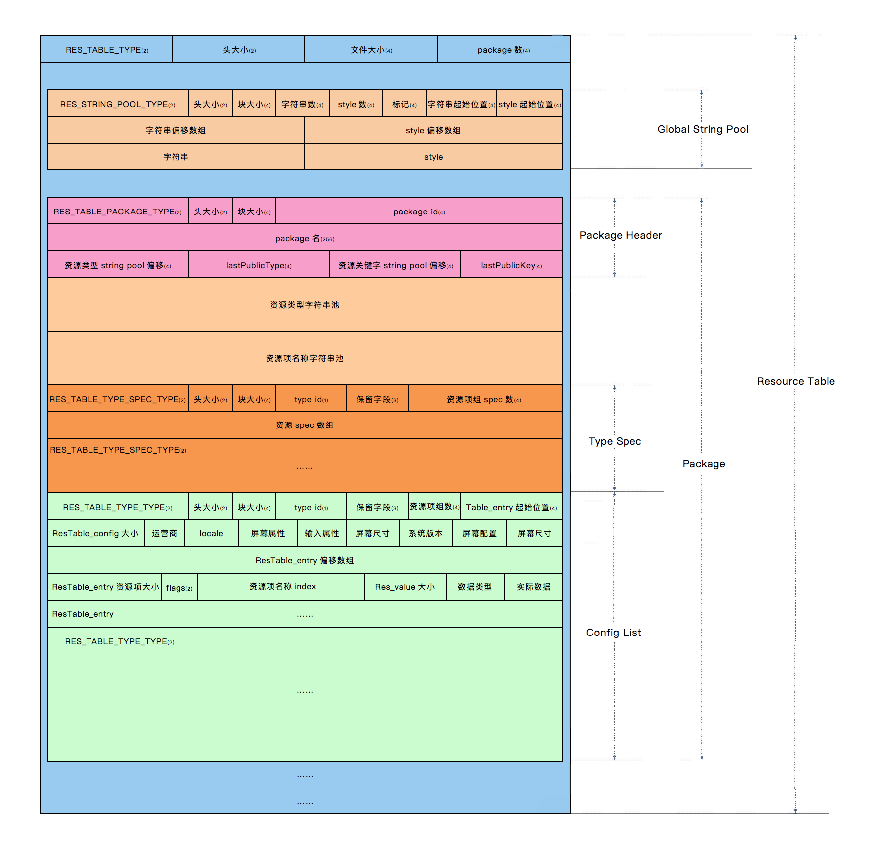

# Android arsc 文件解析

- [apk 文件结构](#apk-文件结构)
- [资源编译过程](#资源编译过程)
  - [1. Parse AndroidManifst.xml](#1-parse-androidmanifstxml)
  - [2. Add Included Resources](#2-add-included-resources)
  - [3. Collection Resource Files](#3-collection-resource-files)
  - [4. Add Resources to Resource Table](#4-add-resources-to-resource-table)
  - [5. Compile Values Resources](#5-compile-values-resources)
  - [6. Assign Resource ID to Bag](#6-assign-resource-id-to-bag)
  - [7. Compile Xml Resources](#7-compile-xml-resources)
  - [8. Add Resource Symbols](#8-add-resource-symbols)
  - [9. Write resource.arsc](#9-write-resourcearsc)
  - [10. Compile AndroidManifest.xml](#10-compile-androidmanifestxml)
  - [11. Write R.java](#11-write-rjava)
  - [12. Write APK](#12-write-apk)
- [arsc 文件结构](#arsc-文件结构)
- [arsc 文件解析](#arsc-文件解析)
  - [解析方法](#解析方法)
  - [parse RES_TABLE_TYPE](#parse-res_table_type)
  - [parse RES_STRING_POOL_TYPE](#parse-res_string_pool_type)
  - [parse RES_TABLE_PACKAGE_TYPE](#parse-res_table_package_type)
  - [parse RES_TABLE_TYPE_SPEC_TYPE](#parse-res_table_type_spec_type)
  - [parse RES_TABLE_TYPE_TYPE](#parse-res_table_type_type)
- [源码](#源码)
- [参考](#参考)


## apk 文件结构

在使用 android sdk 编译 android 工程时，它会将工程的源代码和资源打包为一个 apk 文件，apk 文件实质为一个压缩包，一个未签名的 apk 文件典型结构如下：

```
apk file:
assets/         - assets 原始资源文件
lib/            - so 库文件
res/            - 资源文件 
classes.dex     - 编译后的代码
resources.arsc  - 资源信息文件
AndroidManifest.xml - 二进制的清单文件
```

在 android 项目的编译过程中，java 代码将会被编译为 classes.dex 文件，jni 代码被编译为 so 文件存放在 lib 目录下，assets 目录和 res/raw 目录中文件的将不会发生变化，对于资源文件中 xml 形式的资源将会被编译为优化过的特定的二进制 xml 格式，而类似于图片这种本身为二进制的类型也不会发生变化，AndroidManifest.xml 清单文件被编译为优化过的二进制格式。

## 资源编译过程

在开发 android 项目时，需要在布局中引用资源，当资源在工程中被创建时，IDE 将会使用 android sdk 中的 aapt 工具自动生成 R.java 文件，这时在代码或布局文件中即可使用资源 id 来引用资源。

在 aapt 工具生成 R 文件的同时，还同时生成了一个 resources.arsc 文件，它负责记录资源信息，类似于一张表，当 apk 运行在 android 设备时，应用将会首先将 resources.arsc 包含的资源信息映射到内存中的数据结构中，当需要使用资源 id 引用具体资源时，只需要在内存中的数据结构中进行查询，即可得到具体的资源文件路径。

一个典型的资源 id 如下：

```C
0x7f020000
```

它由 3 部分组成：

1. 首字节为 Package ID，代表资源所在的资源包 ID，一般 apk 中只包含两种资源包，系统资源包和应用资源包，它们的包 ID 分别为 0x01 和 0x7f。
2. 次字节为 Type ID，代表资源类型，即 animator、anim、color、drawable、layout、menu、raw、string 和 xml 等类型，每种类型对应一个 id。
3. 末两个字节为 Entry ID，代表资源在其类型中的次序。

aapt 工具编译资源的过程是比较复杂的，其中的步骤非常细致，在它编译时会将资源逐步保存至一个 ResourceTable 类中，它的源码路径是 `frameworks\base\tools\aapt\ResourceTable`，下面简述资源编译过程（完全参考了老罗博客）。

### 1. Parse AndroidManifst.xml

解析 Android 清单文件中的 package 属性，为了提供生成 R 文件的包名。

### 2. Add Included Resources

添加被引用的资源包，此时会引用系统资源包，在 android 源码工程的 `out/target/common/obj/APPS/framework-res_intermediates/package-export.apk`，可通过资源 id 引用其中的资源。

### 3. Collection Resource Files

aapt 工具开始收集需要编译的资源，将每种类型的资源以及对应的配置维度保存起来。

```
Type         Name             Config         Data
anim
xml
color
drawable     main.png
...          sub.png
             ok.png            mdpi   
             ...               hdpi
                               xhdpi         binary
                               ...
```

### 4. Add Resources to Resource Table

将资源加入资源表。

```
Package         Type         Name             Config         Path
com.xx.xx       anim
                xml
                color
                drawable     main.png
                ...          sub.png
                             ok.png            mdpi   
                             ...               hdpi          res/drawable-hdpi/ok.png
                                               xhdpi         res/drawable-xhdpi/ok.png
                                               ...           ...
```

### 5. Compile Values Resources

收集 value 下的资源。

```
Package       Name              Config         Value
string        app_name          default        TestApp
string        sub_title         default        SubTitleText
...           ...               ...            ...
```

### 6. Assign Resource ID to Bag

给特殊的 Bag 资源类型分配 id，例如 style，array 等资源。

```
Type         Name                   Configt         Value
style        orientation            default         -
...          layout_vertical        default         0
             layout_horizontal      default         1
             ...                    ...             ...
```

### 7. Compile Xml Resources

这一步是将 xml 类型的资源编译为优化过后的二进制格式，便于压缩大小和解析时提高性能。有 6 个子步骤。

1. Parser Xml File（解析原始 xml 文件中的节点树）

   ```
   XMLNode
   -elementName   -Xml 元素标签
   -chars         -Xml 元素的文本内容
   -attributes    -Xml 元素的属性列表
   -children      -Xml 的子元素
   ```

2. Assign Resource IDs（赋予属性名资源 id）

   ```
    android:layout_width  -> find ResID From ResourceTable -> set ResID
    android:layout_height -> find ResID From ResourceTable -> set ResID
    android:gravity       -> find ResID From ResourceTable -> set ResID
    ...
   ```

3. Parse Values（解析属性的原始值）

   ```
   android:orientation = horizontal -> 0
   ...
   ```

   对于 `@+` 符号表示无此 id，则新建此 id。

   ```
   name            Config         Value
   et_name         default        -
   et_pwd          default        -
   ...
   ```

4. Flatten（平铺，即转化为最终的二进制格式）

   1. Collect Resource ID Strings（收集有资源 id 的属性的名称字符串）

      ```
      String         orientation  layout_width  layout_height  id           ...
      Resource ID    0x010100c4   0x010100f4    0x010100f5     0x010100d0   ...
      ```

   2. Collect Strings（收集其他字符串）

      ```
      String android  http://schemas.android.com/apk/res/android  LinearLayout ...
      ```

   3. Write Xml header（写入 xml 头部）

   4. Write String Pool（依 id 次序写入字符串池）

      ```
      orientation  layout_width  layout_height  id  android  http://schemas.android.com/apk/res/android  LinearLayout Button
      ```

   5. Write Resource IDs（写入资源 id 值二进制的 xml 文件中）

   6. Flatten Nodes（平铺，即将二进制的 xml 文件中的资源全部替换为资源索引）

### 8. Add Resource Symbols

添加资源符号，根据资源在其资源类型中的位置，为每个资源分配资源 id。

### 9. Write resource.arsc

将上述收集的资源写入 resoruce.arsc 文件中。分为 7 个步骤。

1. Collect Type Strings（收集每个 package 的类型字符串）

   ```
    drawable  layout  string  id  ...
   ```

2. Collect Key Strings（收集每个 package 的资源项的名称字符串）

   ```
   main icon  app_name  et_name ... 
   ```

3. Collect Value Strings（收集资源原始值字符串）

   ```
   res/drawable-ldpi/icon.png  TestApp  SubTitleText
   ```

4. Generate Package Trunk（生成 package 数据块）

   1. Write Package Header（写入 package 资源的原信息数据块）
   2. Write Type Strings（写入类型字符串资源池）
   3. Write Key Strings（写入资源项名称字符串资源池）
   4. Write Type Specification（写入类型规范数据块）
   5. Write Type Info（写入类型资源项数据块）

5. Write Resource Table Header（写入资源表的头部数据块）

6. Write Value Strings（ 写入上面收集的资源项的值字符串）

7. Write Package Trunk（写入上面收集的 Package 数据块）

### 10. Compile AndroidManifest.xml

将 AndroidManifest.xml 编译为二进制。

### 11. Write R.java

生成 R 文件。

### 12. Write APK

写入 apk 文件。

## arsc 文件结构

arsc 文件作为资源信息的存储结构，其结构将会遵循上述编译过程的写入顺序。整体结构如下图所示：



（图片来自互联网）

arsc 文件的由若干 chunk 结构组成，所有 chunk 在 android 源码中的 `ResourceTypes.h` 头文件中均有定义，路径为 `frameworks\base\include\utils\ResourceTypes.h`。

对于不同 android 版本的 `ResourceTypes.h` 头文件，为了保证向下兼容性，所以其定义的 chunk 结构相同，不过高版本相对于低版本可能增加了一些配置的常量，例如适配高分辨率设备的 xxhdpi，xxxhdpi 维度选项。

每个 chunk 都会包含一个基础描述类型的对象，它的原始定义如下：

```c++
struct ResChunk_header
{
    /* Chunk 类型 */
    uint16_t type;
    /* Chunk 头部大小 */
    uint16_t headerSize;
    /* Chunk 大小 */
    uint32_t size;
};
```

其中类型 type 的值定义如下：

```c++
enum {
    RES_NULL_TYPE               = 0x0000,
    RES_STRING_POOL_TYPE        = 0x0001,
    RES_TABLE_TYPE              = 0x0002,
    RES_XML_TYPE                = 0x0003,

    // Chunk types in RES_XML_TYPE
    RES_XML_FIRST_CHUNK_TYPE    = 0x0100,
    RES_XML_START_NAMESPACE_TYPE= 0x0100,
    RES_XML_END_NAMESPACE_TYPE  = 0x0101,
    RES_XML_START_ELEMENT_TYPE  = 0x0102,
    RES_XML_END_ELEMENT_TYPE    = 0x0103,
    RES_XML_CDATA_TYPE          = 0x0104,
    RES_XML_LAST_CHUNK_TYPE     = 0x017f,
    // This contains a uint32_t array mapping strings in the string
    // pool back to resource identifiers.  It is optional.
    RES_XML_RESOURCE_MAP_TYPE   = 0x0180,

    // Chunk types in RES_TABLE_TYPE
    RES_TABLE_PACKAGE_TYPE      = 0x0200,
    RES_TABLE_TYPE_TYPE         = 0x0201,
    RES_TABLE_TYPE_SPEC_TYPE    = 0x0202
};
```

它表示每种 chunk 的类型，类似于标识文件类型的魔数，而 chunk 大小 `size` 则表示此 chunk 的容量。

下面开始对 arsc 文件的结构进行解析，这里使用 java 语言进行解析，为了方便，对于 `ResourceTypes.h` 中的类型，在 java 中都应该定义对应的类，例如基础描述结构体 `ResChunk_header` 使用 java 定义如下：

```java
/**
 * 资源表 Chunk 基础描述结构。
 */
public class ResChunkHeader {
  /** Chunk 类型 */
  public short type;
  /** Chunk 头部大小 */
  public short headerSize;
  /** Chunk 大小 */
  public int size;
}
```

## arsc 文件解析

为了便于解析，这里使用了我自己写的工具类，参考这里的简介： [ObjectIO](./utils_parse.md)。

### 解析方法

针对上述 arsc 文件结构，采用如下方式进行解析：

1. 定义指针变量标识当前解析的字节位置，每解析完一个 chunk 则向下移动指针 chunk 的大小。
2. 采用循环解析的方式，通过 chunk 的 `type` 判断将要解析哪种 chunk，解析对应的结构。 

这里定义了 ArscParser 解析器，`mIndex` 为指针变量，`parse(ObjectIO objectIO)` 为解析子方法。

```java
public class ArscParser {
  private int mIndex;
  ...
      
  private void parse(ObjectIO objectIO) {
    // 是否到达文件底部。
    while (!objectIO.isEof(mIndex)) {
      // 获取将要解析的 chunk 头部信息。 
      ResChunkHeader header = objectIO.read(ResChunkHeader.class, mIndex);

      // 根据类型解析对应格式。
      switch (header.type) {
        case ResourceTypes.RES_TABLE_TYPE: ...
          break;
        case ResourceTypes.RES_STRING_POOL_TYPE: ...
          break;
        case ResourceTypes.RES_TABLE_PACKAGE_TYPE: ...
          break;
        case ResourceTypes.RES_TABLE_TYPE_SPEC_TYPE: ...
          break;
        case ResourceTypes.RES_TABLE_TYPE_TYPE: ...
          break;
        default:
      }
    }
}
```

### parse RES_TABLE_TYPE

参考上面的 arsc 结构所示，首先解析的是资源表头部，它描述了整个 arsc 文件的大小，以及包含的资源包数量。

它的 `type` 值为 `RES_TABLE_TYPE`，对应的数据结构为 `struct ResTable_header`，java 对应的表示为：

```java
/**
 * 资源表头结构，对应 ResourceTypes.h 中定义的 ResTable_header。
 */
public class ResTableHeader implements Struct {
  /**
   * {@link ResChunkHeader#type} = {@link ResourceTypes#RES_TABLE_TYPE}
   * <p>
   * {@link ResChunkHeader#headerSize} = sizeOf(ResTableHeader.class) 表示头部大小。
   * <p>
   * {@link ResChunkHeader#size} = 整个 resources.arsc 文件的大小。
   */
  public ResChunkHeader header;
  /**
   * 被编译的资源包数量。
   */
  public int packageCount;
}
```

那么解析代码即：

```java
// ArscParser.java

private void parse(ObjectIO objectIO) {
  ...
  ResChunkHeader header = objectIO.read(ResChunkHeader.class, mIndex);
  switch (header.type) {
    case ResourceTypes.RES_TABLE_TYPE:
      parseResTableType(objectIO);
      break;
      ...
  }
  ...
}
```

```java
// ArscParser.java

private void parseResTableType(ObjectIO objectIO) {
  final ResTableHeader tableType = objectIO.read(ResTableHeader.class, mIndex);
  System.out.println("resource table header:");
  System.out.println(tableType);

  // 向下移动资源表头部的大小。
  mIndex += tableType.header.headerSize;
}
```

测试广点通的 arsc 文件（resources_gdt1.arsc）打印结果如下：

```
resource table header:
{header={type=2(RES_TABLE_TYPE), headerSize=12, size=6384}, packageCount=1}
```

### parse RES_STRING_POOL_TYPE

接下来是全局字符串池的解析，它包括如下几个部分：

1. ResStringPool_header 字符串池头部，包含字符串池的信息，大小，数量，数组偏移等。
2. String Offset Array 字符串在字符串内容中的字节位置数组，32 位 int 类型。
3. Style Offset Array 字符串样式在字符串样式中的字节位置数组，32 位 int 类型。
4. String Content 字符串内容块。
5. Style Content 字符串样式块。

字符串池的头部使用 `struct ResStringPool_header` 数据结构描述，java 表示为：

```java
/**
 * 字符串池头部。
 */
public class ResStringPoolHeader implements Struct {
  public static final int SORTED_FLAG = 1;
  public static final int UTF8_FLAG = 1 << 8;

  /**
   * {@link ResChunkHeader#type} = {@link ResourceTypes#RES_STRING_POOL_TYPE}
   * <p>
   * {@link ResChunkHeader#headerSize} = sizeOf(ResStringPoolHeader.class) 表示头部大小。
   * <p>
   * {@link ResChunkHeader#size} = 整个字符串 Chunk 的大小，包括 headerSize 的大小。
   */
  public ResChunkHeader header;
  /** 字符串的数量 */
  public int stringCount;
  /** 字符串样式的数量 */
  public int styleCount;
  /** 0, SORTED_FLAG, UTF8_FLAG 它们的组合值 */
  public int flags;
  /** 字符串内容块相对于其头部的距离 */
  public int stringStart;
  /** 字符串样式块相对于其头部的距离 */
  public int styleStart;
}
```

其中 `flags` 包含 `UTF8_FLAG` 表示字符串格式为 utf8， `SORTED_FLAG` 表示已排序。

字符串的偏移数组使用 `struct ResStringPool_ref` 数据结构描述，java 表示为：

```java
/**
 * 字符串在字符串内容块中的字节偏移。
 */
public class ResStringPoolRef implements Struct{
  /** 字符串在字符串池中的索引 */
  public int index;
}
```

字符串样式则使用 `struct ResStringPool_span` 数据结构描述，java 表示为：

```java
/**
 * 字符串样式块中的字符串样式信息。
 */
public class ResStringPoolSpan implements Struct{
  public static final int END = 0xFFFFFFFF;

  /** 本样式在字符串内容块中的字节位置 */
  public ResStringPoolRef name;
  /** 包含样式的字符串的第一个字符索引 */
  public int firstChar;
  /** 包含样式的字符串的最后一个字符索引 */
  public int lastChar;
}
```

其中 `name` 表示字符串样式本身字符串的索引，比如 `<b>` 样式本身的字符串为 b，即为 b 在字符串池中的索引。 

`firstChar` 和 `lastChar` 则为具有样式的字符串的中字符串首位的索引，例如 `he<b>ll</b>o`，则为 2 和 3。

字符串样式块和字符串内容块是一一对应的，就是说第一个字符串的样式对应第一个字符串样式块中的样式，如果对应的字符串中有不具有样式的字符串，则对应的 `ResStringPool_span` 的 `name` 为 `0xFFFFFFFF`，起占位的作用。

解析过程如下：

1. 首先解析 `ResStringPool_header`，其中包含字符串和样式池的信息。
2. 通过 `header` 中 `stringCount`（字符串数量） 和 `styleContent`（样式数量）解析出字符串和样式偏移数组。
3. 通过 `header` 中的 `stringStart` 找到字符串块的起始字节位置，结合字符串偏移数组解析字符串内容。
4. 通过 `header` 中的 `styleStart` 找到样式块的起始字节位置，结合样式偏移数组解析样式内容。

需要注意的是每个字符串的前两个字节表示这个字符串的长度，末尾则为结束符 0。

下面是解析代码：

```java
// ArscParser.java

private void parse(ObjectIO objectIO) {
  ...
  ResChunkHeader header = objectIO.read(ResChunkHeader.class, mIndex);
  switch (header.type) {
    case ResourceTypes.RES_STRING_POOL_TYPE:
      parseStringPool(objectIO);
      break;
      ...
  }
  ...
}
```

```java
// ArscParser.java

...
private void parseStringPool(ObjectIO objectIO) throws Exception {
  final long stringPoolIndex = mIndex;
  ResStringPoolHeader stringPoolHeader = objectIO.read(ResStringPoolHeader.class, stringPoolIndex);
  System.out.println("string pool header:");
  System.out.println(stringPoolHeader);

  StringPoolChunkParser stringPoolChunkParser = new StringPoolChunkParser();
  stringPoolChunkParser.parseStringPoolChunk(objectIO, stringPoolHeader, stringPoolIndex);

  System.out.println();
  System.out.println("string index array:");
  System.out.println(Arrays.toString(stringPoolChunkParser.getStringIndexArray()));

  System.out.println();
  System.out.println("style index array:");
  System.out.println(Arrays.toString(stringPoolChunkParser.getStyleIndexArray()));

  stringPool = stringPoolChunkParser.getStringPool();

  System.out.println();
  System.out.println("string pool:");
  System.out.println(Arrays.toString(stringPool));

  System.out.println();
  System.out.println("style pool:");
  final List<ResStringPoolSpan>[] stylePool = stringPoolChunkParser.getStylePool();

  System.out.println(Arrays.toString(stylePool));

  System.out.println();
  System.out.println("style detail:");
  for (List<ResStringPoolSpan> spans : stylePool) {
    System.out.println("---------");
    for (ResStringPoolSpan span : spans) {
      System.out.println(stringPool[span.name.index]);
    }
  }

  // 向下移动字符串池的大小。
  mIndex += stringPoolHeader.header.size;
}
```

```java
// StringPoolChunkParser.java

public class StringPoolChunkParser {

  private ResStringPoolRef[] stringIndexArray;
  private ResStringPoolRef[] styleIndexArray;
  private String[] stringPool;
  private List<ResStringPoolSpan>[] stylePool;

  private ResStringPoolRef[] parseStringIndexArray(ObjectIO objectIO, ResStringPoolHeader header, long index)
      throws IOException {
    stringIndexArray = new ResStringPoolRef[header.stringCount];

    long start = index;
    final int resStringPoolRefSize = ObjectIO.sizeOf(ResStringPoolRef.class);

    for (int i = 0; i < header.stringCount; i++) {
      stringIndexArray[i] = objectIO.read(ResStringPoolRef.class, start);
      start += resStringPoolRefSize;
    }

    return stringIndexArray;
  }

  private ResStringPoolRef[] parseStyleIndexArray(ObjectIO objectIO, ResStringPoolHeader header, long index)
      throws IOException {
    styleIndexArray = new ResStringPoolRef[header.styleCount];

    long start = index;
    final int resStringPoolRefSize = ObjectIO.sizeOf(ResStringPoolRef.class);

    for (int i = 0; i < header.styleCount; i++) {
      styleIndexArray[i] = objectIO.read(ResStringPoolRef.class, start);
      start += resStringPoolRefSize;
    }

    return styleIndexArray;
  }

  private static int parseStringLength(byte[] b) {
    return b[1] & 0x7F;
  }

  private String[] parseStringPool(ObjectIO objectIO, ResStringPoolHeader header, long stringPoolIndex)
      throws IOException {
    String[] stringPool = new String[header.stringCount];

    for (int i = 0; i < header.stringCount; i++) {
      final long index = stringPoolIndex + stringIndexArray[i].index;
      final int parseStringLength = parseStringLength(objectIO.readBytes(index, Short.BYTES));
      // 经过测试，发现 flags 为0 时，字符串每个字符间会间隔一个空白符，长度变为 2 倍。
      final int stringLength = header.flags == 0 ? parseStringLength * 2 : parseStringLength;

      // trim 去除多余空白符。
      stringPool[i] = Formatter.trim(new String(objectIO.readBytes(index + Short.BYTES, stringLength), 0,
          stringLength, StandardCharsets.UTF_8));
    }

    return stringPool;
  }

  private List<ResStringPoolSpan>[] parseStylePool(ObjectIO objectIO, ResStringPoolHeader header, long stylePoolIndex)
      throws IOException {
    @SuppressWarnings("unchecked")
    List<ResStringPoolSpan>[] stylePool = new List[header.styleCount];

    for (int i = 0; i < header.styleCount; i++) {
      final long index = stylePoolIndex + styleIndexArray[i].index;
      int end = 0;
      long littleIndex = index;

      List<ResStringPoolSpan> stringPoolSpans = new ArrayList<>();
      while (end != ResStringPoolSpan.END) {
        ResStringPoolSpan stringPoolSpan = objectIO.read(ResStringPoolSpan.class, littleIndex);
        stringPoolSpans.add(stringPoolSpan);

        littleIndex += ObjectIO.sizeOf(ResStringPoolSpan.class);

        end = objectIO.readInt(littleIndex);
      }

      stylePool[i] = stringPoolSpans;
    }
    return stylePool;
  }

  public void parseStringPoolChunk(ObjectIO objectIO, ResStringPoolHeader header, long stringPoolHeaderIndex)
      throws IOException {
    // parse string index array.
    final long stringIndexArrayIndex = stringPoolHeaderIndex + ObjectIO.sizeOf(ResStringPoolHeader.class);

    stringIndexArray = header.stringCount == 0 ? new ResStringPoolRef[0] :
        parseStringIndexArray(objectIO, header, stringIndexArrayIndex);

    final long styleIndexArrayIndex = stringIndexArrayIndex + header.stringCount *
        ObjectIO.sizeOf(ResStringPoolRef.class);

    styleIndexArray = header.styleCount == 0 ? new ResStringPoolRef[0] :
        parseStyleIndexArray(objectIO, header, styleIndexArrayIndex);

    // parse string pool.
    if (header.stringCount != 0) {
      final long stringPoolIndex = stringPoolHeaderIndex + header.stringStart;
      stringPool = parseStringPool(objectIO, header, stringPoolIndex);
    } else {
      stringPool = new String[0];
    }

    // parse style pool.
    if (header.styleCount != 0) {
      final long stylePoolIndex = stringPoolHeaderIndex + header.styleStart;
      stylePool = parseStylePool(objectIO, header, stylePoolIndex);
    } else {
      //noinspection unchecked
      stylePool = new List[0];
    }
  }

  public ResStringPoolRef[] getStringIndexArray() {
    return stringIndexArray;
  }

  public ResStringPoolRef[] getStyleIndexArray() {
    return styleIndexArray;
  }

  public String[] getStringPool() {
    return stringPool;
  }

  public List<ResStringPoolSpan>[] getStylePool() {
    return stylePool;
  }
}
```

示例文件 resources_gdt1.arsc 的解析示例如下：

```
string pool header:
{header={type=1(RES_STRING_POOL_TYPE), headerSize=28, size=1220}, stringCount=42, styleCount=0, flags=256, stringStart=196, styleStart=0}

string index array:
[{index=0}, {index=25}, {index=52}, {index=78}, {index=110}, {index=135}, {index=181}, {index=205}, {index=240}, {index=278}, {index=315}, ... , {index=879}, {index=904}, {index=932}, {index=960}, {index=972}, {index=995}, {index=1010}]

style index array: []

string pool:
[res/drawable/arrow.png, res/drawable/gdticon.png, res/drawable/gridbt.png, res/drawable/header_arrow.png, res/drawable/icon1.png, ... , 应用墙, CustomFeeds2Activity, 加载更多, TranspAct]

style pool:[]

style detail:
```

这个文件没有样式，换一个示例文件 resources_cm.arsc 文件的 style 内容示例如下：

```
style pool:
[[{name={index=15915}, firstChar=13, lastChar=16}], [{name={index=15916}, firstChar=4, lastChar=7}, {name={index=15917}, firstChar=11, lastChar=14}], [{name={index=15916}, firstChar=4, lastChar=7}, {name={index=15917}, firstChar=11, lastChar=14}], [{name={index=15918}, firstChar=9, lastChar=12}], [{name={index=15919}, firstChar=66, lastChar=69}], [{name={index=15916}, firstChar=15, lastChar=26}, {name={index=15917}, firstChar=32, lastChar=45}]]

style detail:
---------
g;id=app_name
---------
a;href=http://www.cmcm.com/protocol/cmbackup/terms-of-use.html
a;href=http://www.cmcm.com/protocol/cmbackup/privacy.html
---------
a;href=http://www.cmcm.com/protocol/cmbackup/terms-of-use.html
a;href=http://www.cmcm.com/protocol/cmbackup/privacy.html
---------
g;id=number
---------
g;id=string
---------
a;href=http://www.cmcm.com/protocol/cmbackup/terms-of-use.html
a;href=http://www.cmcm.com/protocol/cmbackup/privacy.html
```

### parse RES_TABLE_PACKAGE_TYPE

下面是资源项元信息的解析，它包含如下几个部分：

1. ResTable_package 资源项元信息头部，包括 Package ID，包名和资源项索引信息。
2. Type String Pool 资源类型字符串池，例如 drawable, color, xml, animator。
3. Key String Pool 资源名字符串池。
4. Type Specification Trunk 类型规范数据块，描述资源的配置信息。
5. Type Info Trunk 类型资源项数据块。

资源项元信息头部使用 `struct ResTable_package` 数据结构描述，使用 java 表示为：

```java
/**
 * Package 资源项元信息头部。
 */
public class ResTablePackage implements Struct {
  /**
   * {@link ResChunkHeader#type} = {@link ResourceTypes#RES_TABLE_PACKAGE_TYPE}
   * <p>
   * {@link ResChunkHeader#headerSize} = sizeOf(ResTablePackage.class) 表示头部大小。
   * <p>
   * {@link ResChunkHeader#size} = head.headerSize + 类型字符串资源池大小 + 类型规范名称字符串池大小 +
   * 类型规范数据块大小 + 数据项信息数据块大小。
   */
  public ResChunkHeader header;
  /** Package ID */
  public int id;
  /** Package Name */
  public char[] name = new char[128];
  /**
   * 类型字符串资源池相对头部的偏移位置。
   */
  public int typeStrings;
  /**
   * 最后一个导出的 public 类型字符串在类型字符串资源池中的索引，目前这个值设置为类型字符串资源池的大小。
   */
  public int lastPublicType;
  /**
   * 资源项名称字符串相对头部的偏移位置。
   */
  public int keyStrings;
  /**
   * 最后一个导出的 public 资源项名称字符串在资源项名称字符串资源池中的索引，目前这个值设置为资源项名称字符串资源池的大小。
   */
  public int lastPublicKey;
}
```

Type String Pool 和 Key String Pool 的结构和上面的全局字符串结构完全相同。

Type Specification Trunk 和 Type Info Trunk 的 `chunk type` 分别为 `RES_TABLE_TYPE_SPEC_TYPE` 和 `RES_TABLE_TYPE_TYPE`，将在下面的步骤进行解析。

那么元信息头部和两个字符串池的解析代码如下：

```java
// ArscParser.java

private void parse(ObjectIO objectIO) {
  ...
  ResChunkHeader header = objectIO.read(ResChunkHeader.class, mIndex);
  switch (header.type) {
    case ResourceTypes.RES_STRING_POOL_TYPE:
      parseStringPool(objectIO);
      break;
    case ResourceTypes.RES_TABLE_PACKAGE_TYPE:
      parseTablePackageType(objectIO);
      break;
      ...
  }
  ...
}
```

```java
// ArscParser.java

private void parseTablePackageType(ObjectIO objectIO) throws IOException {
  final long tablePackageIndex = mIndex;
  final ResTablePackage tablePackage = objectIO.read(ResTablePackage.class, tablePackageIndex);

  System.out.println("table package type:");
  System.out.println(tablePackage);

  // 向下移动资源表元信息头部的大小。
  mIndex += tablePackage.header.headerSize;
}
```

解析示例文件 resources_gdt1.arsc 的结果为：

```j
=== RES_TABLE_PACKAGE_TYPE ===:
table package type:
{header={type=512(RES_TABLE_PACKAGE_TYPE), headerSize=288, size=5152}, id=0x7f000000, name=com.qq.e.demo, typeStrings=0, lastPublicType=0, keyStrings=0, lastPublicKey=0}

=== RES_STRING_POOL_TYPE (Type String Pool) ===:
string pool header:
{header={type=1(RES_STRING_POOL_TYPE), headerSize=28, size=136}, stringCount=9, styleCount=0, flags=256, stringStart=64, styleStart=0}

string index array:
[{index=0}, {index=7}, {index=18}, {index=27}, {index=35}, {index=43}, {index=52}, {index=60}, {index=67}]

style index array: []

string pool:
[attr, drawable, layout, color, dimen, string, style, menu, id]

style pool: []
style detail:

=== RES_STRING_POOL_TYPE (Key String Pool) ===:
string pool header:
{header={type=1(RES_STRING_POOL_TYPE), headerSize=28, size=1720}, stringCount=76, styleCount=0, flags=256, stringStart=332, styleStart=0}

string index array:
[{index=0}, {index=17}, {index=40}, {index=48}, {index=58}, {index=67}, {index=82}, {index=90}, {index=117}, {index=124}, {index=142}, {index=165}, {index=187}, {index=215}, {index=236}, {index=257}, {index=275}, {index=292}, {index=308}, {index=337}, {index=364}, {index=375},  ... , {index=1214}, {index=1234}, {index=1249}, {index=1265}, {index=1280}, {index=1301}, {index=1312}, {index=1324}, {index=1336}, {index=1350}, {index=1363}, {index=1373}]

style index array: []

string pool:
[buttonBarStyle, buttonBarButtonStyle, arrow, gdticon, gridbt, header_arrow, icon1, listview_item_background, logo, main_background, activity_banner_demo, activity_fullscreen, activity_gdtnativead_demo, activity_list_view, activity_main_demo, headercontainer, nativelistitem, ... , showBannerInListHeaderButton, destoryBtn, splashcontainer, btn_refresh, ad_container, list, showBannerButton, showInterstitialAdButton, showAppWallButton, splashButton, gdtnativeAdbt, imageButton1, headframecontainer, img_logo, text_name, text_desc, text_status, img_poster, divider, btn_download]

style pool: []
style detail:
```

### parse RES_TABLE_TYPE_SPEC_TYPE

类型规范数据块为了描述资源项的配置差异性，通过它可以了解到每类资源的配置情况。

类型规范数据块由 `ResTable_typeSpec` 数据结构描述，java 表示为：

```java
/**
 * 类型规范数据块。
 */
public class ResTableTypeSpec implements Struct {
  private static final int SPEC_PUBLIC = 0x40000000;
  /**
   * {@link ResChunkHeader#type} = {@link ResourceTypes#RES_TABLE_TYPE_SPEC_TYPE}
   * <p>
   * {@link ResChunkHeader#headerSize} = sizeOf(ResTableTypeSpec.class) 表示头部大小。
   * <p>
   * {@link ResChunkHeader#size} = header.headerSize + {@link Integer#BYTES} * {@link #entryCount}
   */
  public ResChunkHeader header;
  /** 资源 Type ID */
  public byte id;
  /** 0，保留 */
  public byte res0;
  /** 0，保留 */
  public short res1;
  /** 本类型的资源项个数，即名称相同的资源项的个数 */
  public int entryCount;
}
```

其中的 id 字段表示资源的类型 id，res0 和 res1 为固定的 0，entryCount 则为资源项的个数，在 ResTable_typeSpec 之后会有一个 int 型数组，来记录在哪些配置发生变化后，需要重新加载该资源。

配置项在 ResourceTypes.h 中有定义：

```c++
enum {
    CONFIG_MCC = ACONFIGURATION_MCC,
    CONFIG_MNC = ACONFIGURATION_MNC,
    CONFIG_LOCALE = ACONFIGURATION_LOCALE,
    CONFIG_TOUCHSCREEN = ACONFIGURATION_TOUCHSCREEN,
    CONFIG_KEYBOARD = ACONFIGURATION_KEYBOARD,
    CONFIG_KEYBOARD_HIDDEN = ACONFIGURATION_KEYBOARD_HIDDEN,
    CONFIG_NAVIGATION = ACONFIGURATION_NAVIGATION,
    CONFIG_ORIENTATION = ACONFIGURATION_ORIENTATION,
    CONFIG_DENSITY = ACONFIGURATION_DENSITY,
    CONFIG_SCREEN_SIZE = ACONFIGURATION_SCREEN_SIZE,
    CONFIG_SMALLEST_SCREEN_SIZE = ACONFIGURATION_SMALLEST_SCREEN_SIZE,
    CONFIG_VERSION = ACONFIGURATION_VERSION,
    CONFIG_SCREEN_LAYOUT = ACONFIGURATION_SCREEN_LAYOUT,
    CONFIG_UI_MODE = ACONFIGURATION_UI_MODE,
    CONFIG_LAYOUTDIR = ACONFIGURATION_LAYOUTDIR,
    CONFIG_SCREEN_ROUND = ACONFIGURATION_SCREEN_ROUND,
};
```

下面是解析过程：

```java
// ArscParser.java

private void parse(ObjectIO objectIO) {
  ...
  ResChunkHeader header = objectIO.read(ResChunkHeader.class, mIndex);
  switch (header.type) {
    case ResourceTypes.RES_TABLE_TYPE_SPEC_TYPE:
      parseTableTypeSpecType(objectIO);
      break;
      ...
  }
  ...
}
```

```java
// ArscParser.java

private void parseTableTypeSpecType(ObjectIO objectIO) throws IOException {
  final long typeSpecIndex = mIndex;
  ResTableTypeSpec tableTypeSpec = objectIO.read(ResTableTypeSpec.class, typeSpecIndex);

  System.out.println("table type spec type:");
  System.out.println(tableTypeSpec);

  int[] entryArray = TableTypeChunkParser.parseSpecEntryArray(objectIO, tableTypeSpec, typeSpecIndex);

  System.out.println();
  System.out.println("table type spec type entry array:");
  System.out.println(Arrays.toString(entryArray));

  // 向下移动资源表类型规范内容的大小。
  mIndex += tableTypeSpec.header.size;
}
```

```java
// TableTypeChunkParser.java

public static int[] parseSpecEntryArray(ObjectIO objectIO, ResTableTypeSpec tableTypeSpec, long typeSpecIndex)
    throws IOException {
  int[] entryArray = new int[tableTypeSpec.entryCount];
  long index = typeSpecIndex + tableTypeSpec.header.headerSize;

  for (int i = 0; i < entryArray.length; i++) {
    entryArray[i] = objectIO.readInt(index);
    index += Integer.BYTES;
  }
  return entryArray;
}
```

解析示例文件 resource_gdt1.arsc 的结构：

```
table type spec type:
{header={type=514(RES_TABLE_TYPE_SPEC_TYPE), headerSize=16, size=24}, id=0x01, res0=0, res1=0, entryCount=2}

table type spec type entry array:
[0, 0]
```

### parse RES_TABLE_TYPE_TYPE

最后是类型资源项数据块，它用来描述资源项的具体信息，通过它可以了解每一个资源项名称、值和配置等信息。类型资源项数据是按照类型和配置来组织的，也就是说，一个具有 N 个配置的类型一共对应有 N 个类型资源项数据块。

类型资源项数据块使用 `ResTable_type` 数据结构描述，java 表示为：

```java
/**
 * 类型资源项数据块。
 */
public class ResTableType implements Struct {
  public static final int NO_ENTRY = 0xFFFFFFFF;

  /**
   * {@link ResChunkHeader#type} = {@link ResourceTypes#RES_TABLE_TYPE_TYPE}
   * <p>
   * {@link ResChunkHeader#headerSize} = sizeOf(ResTableType.class) 表示头部大小。
   * <p>
   * {@link ResChunkHeader#size} = header.headerSize + {@link Integer#BYTES} * {@link #entryCount}
   */
  public ResChunkHeader header;
  /** 资源 Type ID */
  public byte id;
  /** 0，保留 */
  public byte res0;
  /** 0，保留 */
  public short res1;
  /** 本类型的资源项个数，即名称相同的资源项的个数 */
  public int entryCount;
  /** 资源项数据块相对头部的偏移值 */
  public int entriesStart;
  /** 描述配置信息 */
  public ResTableConfig tableConfig;
}
```

其中 `entryCount` 表示资源项的数量，`entriesStart` 表示数据块的其实位置字节偏移。

`ResTableConfig` 描述了资源的配置信息，内部由多个 Union 联合体构成，由于代码过长，所以具体结构可参考项目源码。

每个资源项通过 `ResTable_entry` 数据结构描述，java 表示为：

```java
/**
 * 资源项。
 */
public class ResTableEntry implements Struct {
  public static final int FLAG_COMPLEX = 0x0001;
  public static final int FLAG_PUBLIC = 0x0002;

  /** {@link #BYTES} 资源项头部大小 */
  public short size;
  /**
   * 资源项标志位。如果是一个 Bag 资源项，那么 FLAG_COMPLEX 位就等于 1，并且在 ResTable_entry 后面跟有一个 ResTable_map 数组，
   * 否则的话，在 ResTable_entry {@link ResTableEntry} 后面跟的是一个 Res_value。如果是一个可以被引用的资源项，那么 FLAG_PUBLIC 位就等于1
   */
  public short flags;
  /**
   * 资源项名称在资源项名称字符串资源池的索引。
   */
  public ResStringPoolRef key;
}
```

如果其中的 `flags` 的 `FLAG_COMPLEX` 位为 1，那么这个 `struct ResTable_entry` 则是一个 `struct ResTable_map_entry` 类型，然后下面就会跟一个 `struct ResTable_map` 的数组。

`struct ResTable_map_entry`  是 `struct ResTable_entry`  的子结构类型，java 表示为：

```java
public class ResTableMapEntry extends ResTableEntry {
  /**
   * 指向父 ResTable_map_entry 的资源 ID，如果没有父 ResTable_map_entry，则等于 0。
   */
  public ResTableRef parent;
  /** bag 项的个数。 */
  public int count;
}
```

ResTable_map 的 java 表示为：

```java
public class ResTableMap implements Struct {
  /** 引用资源地址 */
  public ResTableRef name;
  /** 资源值 */
  public ResValue value;
}
```

`ResValue` 对应数据结构 `struct Res_value`，它表示资源的具体数值。

```java
public class ResValue implements Struct {
  /** ResValue 值大小 */
  public short size;
  /** 0, 保留 */
  public byte res0;

  // 数据类型取值。
  public static final short TYPE_NULL = 0x00;
  public static final short TYPE_REFERENCE = 0x01;
  public static final short TYPE_ATTRIBUTE = 0x02;
  public static final short TYPE_STRING = 0x03;
  public static final short TYPE_FLOAT = 0x04;
  public static final short TYPE_DIMENSION = 0x05;
  public static final short TYPE_FRACTION = 0x06;
  public static final short TYPE_DYNAMIC_REFERENCE = 0x07;
  public static final short TYPE_FIRST_INT = 0x10;
  public static final short TYPE_INT_DEC = 0x10;
  public static final short TYPE_INT_HEX = 0x11;
  public static final short TYPE_INT_BOOLEAN = 0x12;
  public static final short TYPE_FIRST_COLOR_INT = 0x1c;
  public static final short TYPE_INT_COLOR_ARGB8 = 0x1c;
  public static final short TYPE_INT_COLOR_RGB8 = 0x1d;
  public static final short TYPE_INT_COLOR_ARGB4 = 0x1e;
  public static final short TYPE_INT_COLOR_RGB4 = 0x1f;
  public static final short TYPE_LAST_COLOR_INT = 0x1f;
  public static final short TYPE_LAST_INT = 0x1f;

  /** 数据类型 */
  public byte dataType;

  public static final int COMPLEX_UNIT_SHIFT = 0;
  public static final int COMPLEX_UNIT_MASK = 0xf;
  
  // 数据类型描述。
  public static final int COMPLEX_UNIT_PX = 0;
  public static final int COMPLEX_UNIT_DIP = 1;
  public static final int COMPLEX_UNIT_SP = 2;
  public static final int COMPLEX_UNIT_PT = 3;
  public static final int COMPLEX_UNIT_IN = 4;
  public static final int COMPLEX_UNIT_MM = 5;
  public static final int COMPLEX_UNIT_FRACTION = 0;
  public static final int COMPLEX_UNIT_FRACTION_PARENT = 1;
  public static final int COMPLEX_RADIX_SHIFT = 4;
  public static final int COMPLEX_RADIX_MASK = 0x3;
  public static final int COMPLEX_RADIX_23p0 = 0;
  public static final int COMPLEX_RADIX_16p7 = 1;
  public static final int COMPLEX_RADIX_8p15 = 2;
  public static final int COMPLEX_RADIX_0p23 = 3;
  public static final int COMPLEX_MANTISSA_SHIFT = 8;
  public static final int COMPLEX_MANTISSA_MASK = 0xffffff;

  public static final int DATA_NULL_UNDEFINED = 0;
  public static final int DATA_NULL_EMPTY = 1;

  /** 数据 */
  public int data;

  // 将 dataType 翻译为字符串。
  private String dataTypeStr() {
    switch (dataType) {
      case TYPE_NULL:
        return "TYPE_NULL";
      case TYPE_REFERENCE:
        return "TYPE_REFERENCE";
      case TYPE_ATTRIBUTE:
        return "TYPE_ATTRIBUTE";
      case TYPE_STRING:
        return "TYPE_STRING";
      case TYPE_FLOAT:
        return "TYPE_FLOAT";
      case TYPE_DIMENSION:
        return "TYPE_DIMENSION";
      case TYPE_FRACTION:
        return "TYPE_FRACTION";
      case TYPE_DYNAMIC_REFERENCE:
        return "TYPE_DYNAMIC_REFERENCE";
      // case TYPE_FIRST_INT: return "TYPE_FIRST_INT";
      case TYPE_INT_DEC:
        return "TYPE_INT_DEC";
      case TYPE_INT_HEX:
        return "TYPE_INT_HEX";
      case TYPE_INT_BOOLEAN:
        return "TYPE_INT_BOOLEAN";
      // case TYPE_FIRST_COLOR_INT: return "TYPE_FIRST_COLOR_INT";
      case TYPE_INT_COLOR_ARGB8:
        return "TYPE_INT_COLOR_ARGB8";
      case TYPE_INT_COLOR_RGB8:
        return "TYPE_INT_COLOR_RGB8";
      case TYPE_INT_COLOR_ARGB4:
        return "TYPE_INT_COLOR_ARGB4";
      case TYPE_INT_COLOR_RGB4:
        return "TYPE_INT_COLOR_RGB4";
      // case TYPE_LAST_COLOR_INT: return "TYPE_LAST_COLOR_INT";
      // case TYPE_LAST_INT: return "TYPE_LAST_INT";
      default:
        return "" + dataType;
    }
  }

  // 将值翻译为对应类型的
  public String dataStr() {
    switch (dataType) {
      case TYPE_NULL:
        return "null";
      case TYPE_REFERENCE:
        return "@" + Formatter.toHex(Formatter.fromInt(data, true));
      case TYPE_ATTRIBUTE:
        return "@:id/" + Formatter.toHex(Formatter.fromInt(data, true));
      case TYPE_STRING:
        return "stringPool[" + data + ']';
      case TYPE_FLOAT:
        return String.valueOf(data);
      case TYPE_DIMENSION:
        int complex = data & (COMPLEX_UNIT_MASK << COMPLEX_UNIT_SHIFT);
        switch (complex) {
          case COMPLEX_UNIT_PX:
            return data + "px";
          case COMPLEX_UNIT_DIP:
            return data + "dip";
          case COMPLEX_UNIT_SP:
            return data + "sp";
          case COMPLEX_UNIT_PT:
            return data + "pt";
          case COMPLEX_UNIT_IN:
            return data + "in";
          case COMPLEX_UNIT_MM:
            return data + "mm";
          default:
            return data + "(dimension)";
        }
      case TYPE_FRACTION:
        return data + "(fraction)";
      case TYPE_DYNAMIC_REFERENCE:
        return data + "(dynamic_reference)";
      // case TYPE_FIRST_INT: return "TYPE_FIRST_INT";
      case TYPE_INT_DEC:
        return String.valueOf(data);
      case TYPE_INT_HEX:
        return Formatter.toHex(Formatter.fromInt(data, true));
      case TYPE_INT_BOOLEAN:
        return data == 0 ? "false" : "true";
      // case TYPE_FIRST_COLOR_INT: return "TYPE_FIRST_COLOR_INT";
      case TYPE_INT_COLOR_ARGB8:
        return data + "(argb8)";
      case TYPE_INT_COLOR_RGB8:
        return data + "(rgb8)";
      case TYPE_INT_COLOR_ARGB4:
        return data + "(argb4)";
      case TYPE_INT_COLOR_RGB4:
        return data + "(rgb4)";
      // case TYPE_LAST_COLOR_INT: return "TYPE_LAST_COLOR_INT";
      // case TYPE_LAST_INT: return "TYPE_LAST_INT";
      default:
        return Formatter.toHex(Formatter.fromInt(data, true));
    }
  }
}
```

解析过程：

```java
// ArscParser.java

private void parse(ObjectIO objectIO) {
  ...
  ResChunkHeader header = objectIO.read(ResChunkHeader.class, mIndex);
  switch (header.type) {
    case ResourceTypes.RES_TABLE_TYPE_TYPE:
      parseTableTypeType(arsc, header);
      break;
      ...
  }
  ...
}
```

```java
// ArscParser.java

private void parseTableTypeType(ObjectIO objectIO) throws IOException {
  final long tableTypeIndex = mIndex;
  final ResTableType tableType = objectIO.read(ResTableType.class, tableTypeIndex);

  System.out.println("table type type:");
  System.out.println(tableType);

  int[] offsetArray = TableTypeChunkParser.parseTypeOffsetArray(objectIO, tableType, tableTypeIndex);

  System.out.println();
  System.out.println("offset array:");
  System.out.println(Arrays.toString(offsetArray));

  final long tableEntryIndex = tableTypeIndex + tableType.entriesStart;

  for (int i = 0; i < offsetArray.length; i++) {
    final long entryIndex = offsetArray[i] + tableEntryIndex;
    final ResTableEntry tableEntry = objectIO.read(ResTableEntry.class, entryIndex);

    System.out.println();
    System.out.println("table type type entry " + i + ":");
    System.out.println("header: " + tableEntry);
    System.out.println("entry name: " + typeStringPool[tableEntry.key.index]);

    if (tableEntry.flags == ResTableEntry.FLAG_COMPLEX) {
      // parse ResTable_map
      final ResTableMapEntry tableMapEntry = objectIO.read(ResTableMapEntry.class, entryIndex);

      System.out.println(tableMapEntry);

      int index = 0;

      for (int j = 0; j < tableMapEntry.count; j++) {
        final long tableMapIndex = index + entryIndex + tableMapEntry.size;

        ResTableMap tableMap = objectIO.read(ResTableMap.class, tableMapIndex);
        System.out.println("table map " + j + ":");
        System.out.println(tableMap);

        index += ObjectIO.sizeOf(ResTableMap.class);
      }
    } else {
      // parse Res_value
      final int entrySize = ObjectIO.sizeOf(ResTableEntry.class);
      final ResValue value = objectIO.read(ResValue.class, entryIndex + entrySize);

      System.out.println(value);
    }
  }

  mIndex = objectIO.size();
}
```

```java
// TableTypeChunkParser.java

public static int[] parseTypeOffsetArray(ObjectIO objectIO, ResTableType tableType, long typeIndex)
    throws IOException {
  int[] entryArray = new int[tableType.entryCount];
  long index = typeIndex + tableType.header.headerSize;

  for (int i = 0; i < entryArray.length; i++) {
    entryArray[i] = objectIO.readInt(index);
    index += Integer.BYTES;
  }
  return entryArray;
}
```

示例文件 resources_gdt1.arsc 的解析结果为：

```java
table type type:
{header={type=513(RES_TABLE_TYPE_TYPE), headerSize=68, size=132}, id=0x01, res0=0, res1=0, entryCount=2, entriesStart=76, config={size=48, localeScript=    , localeVariant=        , mobile={data=Struct{mcc=0, mnc=0}, imsi=0}, locale={data={language=  , country=  }, locale=0}, screenType={data={orientation=0, touchscreen=0, density=0}, screenType=0}, input={data={keyboard=0, navigation=0, inputFlags=0, inputPad0=0}, input=0}, screenSize={data={screenWidth=0, screenHeight=0}, screenSize=0}, version={data={sdkVersion=0, minorVersion=0}, screenSize=0}, screenConfig={data={screenLayout=0, uiMode=0, screenConfigPad1=0, screenConfigPad2=0}, screenConfig=0}, screenSizeDp={data={screenWidth=0, screenHeight=0}, screenSizeDp=0}, screenConfig2={data={screenLayout2=0, screenConfigPad1=0, screenConfigPad2=0}, screenConfig2=0}}}

offset array:
[0, 28]

table type type entry 0:
header: {size=16, flags=1, key={index=0}}
entry name: buttonBarStyle
{parent={ident=0x00000000}, count=1, size=16, flags=1, key={index=0}}
table map 0:
{name={ident=0x01000000}, value={size=8, res0=0, dataType=TYPE_INT_DEC, data=1}}

table type type entry 1:
header: {size=16, flags=1, key={index=1}}
entry name: buttonBarButtonStyle
{parent={ident=0x00000000}, count=1, size=16, flags=1, key={index=1}}
table map 0:
{name={ident=0x01000000}, value={size=8, res0=0, dataType=TYPE_INT_DEC, data=1}}
```

## 源码

[ArscParser](./project/android_arsc_parse)

## 参考

- [Android应用程序资源的编译和打包过程分析](https://blog.csdn.net/luoshengyang/article/details/8744683)

- [https://github.com/fourbrother/parse_androidarsc](https://github.com/fourbrother/parse_androidarsc) 