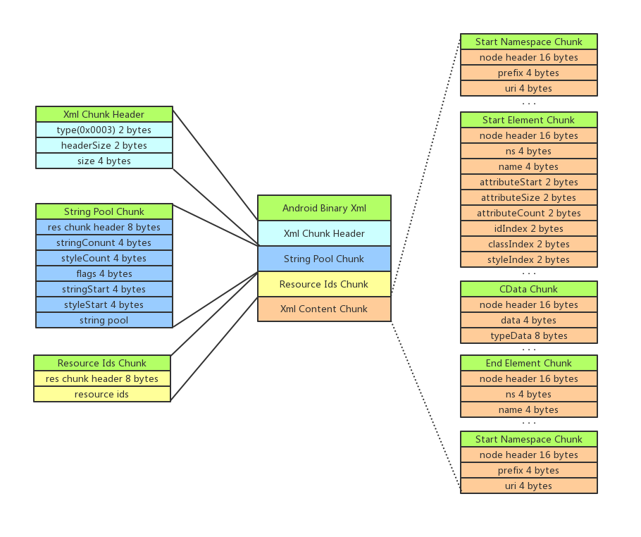

# Android 二进制 XML 文件解析

- [前言](#前言)
- [Xml 文件结构](#xml-文件结构)
  - [Xml Chunk Header](#xml-chunk-header)
  - [String Pool Chunk](#string-pool-chunk)
  - [Resource Ids Chunk](#resource-ids-chunk)
  - [Xml Content Chunk](#xml-content-chunk)
    - [ResXMLTree_node](#resxmltree_node)
    - [Start Element Chunk](#start-element-chunk)
    - [CData Chunk](#cdata-chunk)
    - [End Element Chunk](#end-element-chunk)
    - [End Namespace Chunk](#end-namespace-chunk)
  - [Chunk Header Type](#chunk-header-type)
- [Xml 文件解析](#xml-文件解析)
  - [解析方法](#解析方法)
  - [Xml Chunk Header](#xml-chunk-header-1)
  - [String Pool Chunk](#string-pool-chunk-1)
  - [Resource Ids Chunk](#resource-ids-chunk-1)
  - [Xml Content Chunk](#xml-content-chunk-1)
    - [Start Namespace Chunk](#start-namespace-chunk)
    - [Start Element Chunk](#start-element-chunk-1)
    - [CData Chunk](#cdata-chunk-1)
    - [End Element Chunk](#end-element-chunk-1)
    - [End Namespace Chunk](#end-namespace-chunk-1)
  - [Xml 文档输出](#xml-文档输出)
- [源码](#源码)
- [参考](#参考)


## 前言

Android SDK 在编译 Android 工程时，将会把诸如资源文件和清单文件之类的相关 XML 文件编译为特定的二进制格式，目的是为了压缩其容量以及优化其在运行时的解析效率。

将 XML 文件编译为二进制的 XML 文件是 Android 编译资源时的一个子步骤，Android 在完整的资源编译过程结束后将会生成一个 `resources.arsc` 文件，它是一个资源文件表，应用在运行时会将它映射在内存中，为了资源的查询和引用。编译 Xml 文件为生成 arsc 文件的一个子步骤，如果 Xml 文件中引用了资源，例如字符串资源，那么 Xml 文件中引用字符串的位置将会包含一个全局字串池的索引，通过索引在 arsc 文件中的全局字符串池中即可查询到引用的具体字符串。

有关 arsc 文件的结构和解析方法可参考：[Android arsc 文件解析](./android_arsc_parse.md)。

## XML 文件结构

编译后的二进制文件结构如下图：



和 arsc 文件的构成方式类似，二进制 XML 文件的结构也是由若干 Chunk 结构组成，且它们在 Android 源码中的 `ResourceTypes.h` 头文件中均有对应结构的定义。下面分别说明二进制 Xml 中 4 部分 Chunk 的内容。

### XML Chunk Header

XML Chunk Header 描述了 XML 文件的基本信息，它在 `ResourceTypes.h` 中的结构为 `struct ResXMLTree_header`，这里使用 Java 描述为：

```java
public class ResXMLTreeHeader implements Struct {
  /**
   * {@link ResChunkHeader#type} = {@link ResourceTypes#RES_XML_TYPE}
   * <p>
   * {@link ResChunkHeader#headerSize} = sizeOf(ResXMLTreeHeader.class) 表示头部大小。
   * <p>
   * {@link ResChunkHeader#size} = 整个二进制 Xml 文件的大小，包括头部的大小。
   */
  public ResChunkHeader header;
}
```

其中 `ResChunkHeader` 为资源 Chunk 的基础描述头部结构，对应的定义为 `struct ResChunk_header`，Java 表示为：

```java
public class ResChunkHeader implements Struct {
  /** Chunk 类型 */
  public short type;
  /** Chunk 头部大小 */
  public short headerSize;
  /** Chunk 大小 */
  public int size;
}
```

在 XML 文件中，此时的 `type` 值为 `0x003`  等于 `ResourceTypes.h` 中定义的 XML 类型的 type 值：

```java
// 这里使用 Java 描述。
public class ResourceTypes {
	public static final short RES_XML_TYPE = 0x0003;
    ...
}
```

`headerSize` 为 `ResXMLTreeHeader` 头部结构自身的大小，即 `ResChunkHeader` 的大小，为 8 字节。

`size` 为当前 Chunk 大小，此时为 XML 文件的大小，包括头结构的大小。

### String Pool Chunk

String Pool Chunk 为字符串池结构，它包含了此 XML 文件中出现的所有字符串内容。它的结构和 arsc 文件中的全局字符串结构完全一致，下面是引用上篇解析 arsc 文件中的字符串池的描述：

字符串池包括如下几个部分：

1. ResStringPool_header 字符串池头部，包含字符串池的信息，大小，数量，数组偏移等。
2. String Offset Array 字符串在字符串内容中的字节位置数组，32 位 int 类型。
3. Style Offset Array 字符串样式在字符串样式中的字节位置数组，32 位 int 类型。
4. String Content 字符串内容块。
5. Style Content 字符串样式块。

字符串池的头部使用 `struct ResStringPool_header` 数据结构描述，Java 表示为：

```java
/**
 * 字符串池头部。
 */
public class ResStringPoolHeader implements Struct {
  public static final int SORTED_FLAG = 1;
  public static final int UTF8_FLAG = 1 << 8;

  /**
   * {@link ResChunkHeader#type} = {@link ResourceTypes#RES_STRING_POOL_TYPE}
   * <p>
   * {@link ResChunkHeader#headerSize} = sizeOf(ResStringPoolHeader.class) 表示头部大小。
   * <p>
   * {@link ResChunkHeader#size} = 整个字符串 Chunk 的大小，包括 headerSize 的大小。
   */
  public ResChunkHeader header;
  /** 字符串的数量 */
  public int stringCount;
  /** 字符串样式的数量 */
  public int styleCount;
  /** 0, SORTED_FLAG, UTF8_FLAG 它们的组合值 */
  public int flags;
  /** 字符串内容块相对于其头部的距离 */
  public int stringStart;
  /** 字符串样式块相对于其头部的距离 */
  public int styleStart;
}
```

其中 `flags` 包含 `UTF8_FLAG` 表示字符串格式为 utf8， `SORTED_FLAG` 表示已排序。

字符串的偏移数组使用 `struct ResStringPool_ref` 数据结构描述，Java 表示为：

```java
/**
 * 字符串在字符串内容块中的字节偏移。
 */
public class ResStringPoolRef implements Struct{
  /** 字符串在字符串池中的索引 */
  public int index;
}
```

字符串样式则使用 `struct ResStringPool_span` 数据结构描述，Java 表示为：

```java
/**
 * 字符串样式块中的字符串样式信息。
 */
public class ResStringPoolSpan implements Struct{
  public static final int END = 0xFFFFFFFF;

  /** 本样式在字符串内容块中的字节位置 */
  public ResStringPoolRef name;
  /** 包含样式的字符串的第一个字符索引 */
  public int firstChar;
  /** 包含样式的字符串的最后一个字符索引 */
  public int lastChar;
}
```

其中 `name` 表示字符串样式本身字符串的索引，比如 `<b>` 样式本身的字符串为 b，即为 b 在字符串池中的索引。 

`firstChar` 和 `lastChar` 则为具有样式的字符串的中字符串首位的索引，例如 `he<b>ll</b>o`，则为 2 和 3。

字符串样式块和字符串内容块是一一对应的，就是说第一个字符串的样式对应第一个字符串样式块中的样式，如果对应的字符串中有不具有样式的字符串，则对应的 `ResStringPool_span` 的 `name` 为 `0xFFFFFFFF`，起占位的作用。

### Resource Ids Chunk

Resource Ids Chunk 包含了 xml 文件中相关的资源 ID，例如 AndroidManifest.xml 中 `versionCode` 属性的 id 为 `0x0101021b`，那么 Resource Ids 块中就包括这个 id 值。

这里 Resource Ids Chunk 的结构很简单，包含一个 `struct ResChunk_header` 结构的 `header`，然后后面包含一个大小为 `header.size - header.headerSize` 的 int 型 id 数组。

### XML Content Chunk

XML Content Chunk 是二进制 XML 的核心块结构，包含了 XML 的主要内容。

#### ResXMLTree_node

此 Chunk 结构包含多种子 Chunk 结构，它们都有相同的头部结构，使用 `struct ResXMLTree_node` 结构描述，Java 表示为：

```java
public class ResXMLTreeNode implements Struct {
  /**
   * {@link ResChunkHeader#type} =
   * {@link ResourceTypes#RES_XML_START_NAMESPACE_TYPE} or
   * {@link ResourceTypes#RES_XML_END_NAMESPACE_TYPE} or
   * {@link ResourceTypes#RES_XML_START_ELEMENT_TYPE} or
   * {@link ResourceTypes#RES_XML_END_ELEMENT_TYPE} or
   * {@link ResourceTypes#RES_XML_CDATA_TYPE}
   * <p>
   * {@link ResChunkHeader#headerSize} = sizeOf(ResXMLTreeNode.class) 表示头部大小。
   * <p>
   * if (type == RES_XML_START_NAMESPACE_TYPE)
   * <p>
   * {@link ResChunkHeader#size} = sizeof(ResXMLTreeNode.class) + sizeof(ResXMLTreeNamespaceExt.class)
   */
  public ResChunkHeader header;
  /**
   * 命名空间开始标签在原来文本格式的 XML 文件出现的行号
   */
  public int lineNumber;
  /**
   * 命名空间的注释在字符池资源池的索引。
   */
  public ResStringPoolRef comment;
}
```

其中 `header` 描述此 Chunk 的基本信息，`lineNumber` 保存了原始行号，`comment` 则为注释信息。

Start Namespace Chunk

当一个 XML 文件包含命名空间时，首次解析到的 Chunk 为 `Start Namespace Chunk`，然后后面解析到和 XML 命名空间数量一致的 `Start Namespace Chunk`，它们使用 `struct ResXMLTree_namespaceExt ` 结构描述，Java 表示为：

```java
public class ResXMLTreeNamespaceExt implements Struct {
  /** 命名空间字符串在字符串资源池中的索引 */
  public ResStringPoolRef prefix;
  /** uri 字符串在字符串资源池中的索引 */
  public ResStringPoolRef uri;
}
```

其中包含命名空间的 `prefix` 和 `uri`，例如布局文件中经常出现的：

```xml
xmlns:http://schemas.android.com/apk/res/android="android"
```

它的 `prefix` 为 `android`，`uri` 为 `http://schemas.android.com/apk/res/android`

#### Start Element Chunk

当有 XML 元素标签出现时，将会解析到 `Start Element Chunk`，它表示一个元素标签的开始，使用 `struct  ResXMLTree_attrExt` 结构描述，Java 表示为：

```java
public class ResXMLTreeAttrExt implements Struct {
  /** 元素所在命令空间在字符池资源池的索引，未指定则为 -1 */
  public ResStringPoolRef ns;
  /** 元素名称在字符串池资源的索引 */
  public ResStringPoolRef name;
  /**
   * 等于 sizeOf(ResXMLTreeAttrExt.class)，表示元素属性 chunk 相对于 RES_XML_START_ELEMENT_TYPE 头部的偏移。
   */
  public short attributeStart;
  /** sizeOf(ResXMLTreeAttribute.class)，表示每一个属性占据的 chunk 大小 */
  public short attributeSize;
  /** 表示属性 chunk 数量 */
  public short attributeCount;
  /**
   * 如果元素有一个名称为 id 的属性，那么将它出现在属性列表中的位置再加上 1 的值记录在 idIndex 中，否则 idIndex 的值等于 0。
   */
  public short idIndex;
  /**
   * 如果元素有一个名称为 class 的属性，那么将它出现在属性列表中的位置再加上 1 的值记录在 classIndex 中，否则 classIndex 的值等于 0。
   */
  public short classIndex;
  /**
   * 如果元素有一个名称为 style 的属性，那么将它出现在属性列表中的位置再加上 1 的值记录在 styleIndex 中，否则 styleIndex 的值等于 0。
   */
  public short styleIndex;
}
```

例如：

```xml
<LinearLayout xmlns:http://schemas.android.com/apk/res/android="android" xmlns:http://schemas.android.com/apk/res-auto="app" layout_gravity="0x00000050" id="@0x7f09002b" background="@0x0106000d" layout_width="-1" layout_height="-2">
  ...
</LinearLayout>
```

它的 `name` 为 `LinearLayout`，`ns` 为 `null`，`attributeCount` 等于 `5`。

通过 `ResXMLTree_attrExt` 结构给出的元素信息，可以解析出它所包含的属性，属性使用 `struct ResXMLTree_attribute` 结构描述，使用 Java 表示为：

```java
public class ResXMLTreeAttribute implements Struct {
  /** 表示属性的命令空间在字符池资源池的索引，未指定则等于 -1 */
  public ResStringPoolRef ns;
  /** 属性名称字符串在字符池资源池的索引 */
  public ResStringPoolRef name;
  /** 属性的原始值在字符池资源池的索引，这是可选的，如果不保留，它的值等于 -1 */
  public ResStringPoolRef rawValue;
  /** resValue */
  public ResValue typeValue;
}
```

#### CData Chunk

当一个元素标签包含值内容时，将会解析到 CData Chunk 结构。

例如 `<string>abc</string>`，其中的 `CData` 为 abc，CData Chunk 使用 `struct ResXMLTree_cdataExt` 描述，Java 表示为：

```java
public class ResXMLTreeCdataExt implements Struct {
  /** CDATA 原始值在字符串池中的索引 */
  public ResStringPoolRef data;
  /** CDATA 的资源类型 */
  public ResValue typeData;
}
```

#### End Element Chunk

End Element Chunk 表示元素标签的结束，和 Start Element Chunk 对应，它使用 `struct ResXMLTree_endElementExt` 描述，Java 表示为：

```java
public class ResXMLTreeEndElementExt implements Struct {
  /** 元素的命名空间的字符串在字符串池中的索引，未指定则为 -1 */
  public ResStringPoolRef ns;
  /** 元素名称字符串在字符串池中的索引 */
  public ResStringPoolRef name;
}
```

#### End Namespace Chunk

End Element Chunk 表示命名空间的结束符，和 Start Namespace Chunk 对应，描述结构也是一样的。

### Chunk Header Type

上述结构对应的 Chunk Header 的 type 值如下：

```java
public class ResourceTypes {
  // XML Chunk Header.
  public static final short RES_XML_TYPE = 0x0003;
  // String Pool Chunk.
  public static final short RES_STRING_POOL_TYPE = 0x0001;
  // Start Namespace Chunk.
  public static final short RES_XML_START_NAMESPACE_TYPE = 0x0100;
  // End Namspace Chunk.
  public static final short RES_XML_END_NAMESPACE_TYPE = 0x0101;
  // Start Element Chunk.
  public static final short RES_XML_START_ELEMENT_TYPE = 0x0102;
  // End ELement Chunk.
  public static final short RES_XML_END_ELEMENT_TYPE = 0x0103;
  // CData Chunk.
  public static final short RES_XML_CDATA_TYPE = 0x0104;
  // Resource IDs Chunk.
  public static final short RES_XML_RESOURCE_MAP_TYPE = 0x0180;
}
```

## XML 文件解析

为了便于解析，这里使用了我自己写的工具类，参考这里的简介： [ObjectIO](./utils_parse.md)。

### 解析方法

针对上述二进制 XML 文件结构，采用如下方式进行解析：

1. 定义指针变量标识当前解析的字节位置，每解析完一个 chunk 则向下移动指针 chunk 的大小。
2. 采用循环解析的方式，通过 chunk 的 `type` 判断将要解析哪种 chunk，解析对应的结构。

这里定义了 `AXmlParser` 解析器，`mIndex` 为指针变量，`parse(ObjectIO objectIO)` 为解析子方法。

```java
private void parse(ObjectInput objectInput) throws IOException {
  // 是否到达文件底部。
  while (!objectInput.isEof(mIndex)) {
    // 获取将要解析的 chunk 头部信息。 
    ResChunkHeader header = objectInput.read(ResChunkHeader.class, mIndex);

    // 根据类型解析对应格式。
    switch (header.type) {
      case ResourceTypes.RES_XML_TYPE: ...
        break;
      case ResourceTypes.RES_STRING_POOL_TYPE: ...
        break;
      case ResourceTypes.RES_XML_RESOURCE_MAP_TYPE: ...
        break;
      case ResourceTypes.RES_XML_START_NAMESPACE_TYPE: ...
        break;
      case ResourceTypes.RES_XML_START_ELEMENT_TYPE: ...
        break;
      case ResourceTypes.RES_XML_CDATA_TYPE: ...
        break;
      case ResourceTypes.RES_XML_END_ELEMENT_TYPE: ...
        break;
      case ResourceTypes.RES_XML_END_NAMESPACE_TYPE: ...
        break;
    }
  }
}
```

### XML Chunk Header

首先解析 XML Chunk Header，直接一步就行。

```java
// AXmlParser.java

private void parse(ObjectInput objectInput) throws IOException {
  // ...
  ResChunkHeader header = objectInput.read(ResChunkHeader.class, mIndex);

  switch (header.type) {
    case ResourceTypes.RES_XML_TYPE:
      parseXMLTreeHeader(objectInput);
      break;
      ...
  }
}
```

```java
// AXmlParser.java

private void parseXMLTreeHeader(ObjectInput objectInput) throws IOException {
  ResXMLTreeHeader xmlTreeHeader = objectInput.read(ResXMLTreeHeader.class, mIndex);

  System.out.println(xmlTreeHeader);
  // 移动到下一个位置。
  mIndex += xmlTreeHeader.header.headerSize;
}
```

### String Pool Chunk

接下来是符串池的解析了，解析代码如下：

```java
// AXmlParser.java

private void parse(ObjectIO objectIO) {
  ...
  ResChunkHeader header = objectIO.read(ResChunkHeader.class, mIndex);

  switch (header.type) {
    case ResourceTypes.RES_STRING_POOL_TYPE:
      parseStringPool(objectIO);
      break;
      ...
  }
  ...
}
```

```java
// AXmlParser.java

...
private void parseStringPool(ObjectIO objectIO) throws Exception {
  final long stringPoolIndex = mIndex;
  ResStringPoolHeader stringPoolHeader = objectIO.read(ResStringPoolHeader.class, stringPoolIndex);
  System.out.println("string pool header:");
  System.out.println(stringPoolHeader);

  StringPoolChunkParser stringPoolChunkParser = new StringPoolChunkParser();
  stringPoolChunkParser.parseStringPoolChunk(objectIO, stringPoolHeader, stringPoolIndex);

  System.out.println();
  System.out.println("string index array:");
  System.out.println(Arrays.toString(stringPoolChunkParser.getStringIndexArray()));

  System.out.println();
  System.out.println("style index array:");
  System.out.println(Arrays.toString(stringPoolChunkParser.getStyleIndexArray()));

  stringPool = stringPoolChunkParser.getStringPool();

  System.out.println();
  System.out.println("string pool:");
  System.out.println(Arrays.toString(stringPool));

  System.out.println();
  System.out.println("style pool:");
  final List<ResStringPoolSpan>[] stylePool = stringPoolChunkParser.getStylePool();

  System.out.println(Arrays.toString(stylePool));

  System.out.println();
  System.out.println("style detail:");
  for (List<ResStringPoolSpan> spans : stylePool) {
    System.out.println("---------");
    for (ResStringPoolSpan span : spans) {
      System.out.println(stringPool[span.name.index]);
    }
  }

  // 向下移动字符串池的大小。
  mIndex += stringPoolHeader.header.size;
}
```

```java
// StringPoolChunkParser.java

public class StringPoolChunkParser {

  private ResStringPoolRef[] stringIndexArray;
  private ResStringPoolRef[] styleIndexArray;
  private String[] stringPool;
  private List<ResStringPoolSpan>[] stylePool;

  private ResStringPoolRef[] parseStringIndexArray(ObjectIO objectIO, ResStringPoolHeader header, long index)
      throws IOException {
    stringIndexArray = new ResStringPoolRef[header.stringCount];

    long start = index;
    final int resStringPoolRefSize = ObjectIO.sizeOf(ResStringPoolRef.class);

    for (int i = 0; i < header.stringCount; i++) {
      stringIndexArray[i] = objectIO.read(ResStringPoolRef.class, start);
      start += resStringPoolRefSize;
    }

    return stringIndexArray;
  }

  private ResStringPoolRef[] parseStyleIndexArray(ObjectIO objectIO, ResStringPoolHeader header, long index)
      throws IOException {
    styleIndexArray = new ResStringPoolRef[header.styleCount];

    long start = index;
    final int resStringPoolRefSize = ObjectIO.sizeOf(ResStringPoolRef.class);

    for (int i = 0; i < header.styleCount; i++) {
      styleIndexArray[i] = objectIO.read(ResStringPoolRef.class, start);
      start += resStringPoolRefSize;
    }

    return styleIndexArray;
  }

  private static int parseStringLength(byte[] b) {
    return b[1] & 0x7F;
  }

  private String[] parseStringPool(ObjectIO objectIO, ResStringPoolHeader header, long stringPoolIndex)
      throws IOException {
    String[] stringPool = new String[header.stringCount];

    for (int i = 0; i < header.stringCount; i++) {
      final long index = stringPoolIndex + stringIndexArray[i].index;
      final int parseStringLength = parseStringLength(objectIO.readBytes(index, Short.BYTES));
      // 经过测试，发现 flags 为0 时，字符串每个字符间会间隔一个空白符，长度变为 2 倍。
      final int stringLength = header.flags == 0 ? parseStringLength * 2 : parseStringLength;

      // trim 去除多余空白符。
      stringPool[i] = Formatter.trim(new String(objectIO.readBytes(index + Short.BYTES, stringLength), 0,
          stringLength, StandardCharsets.UTF_8));
    }

    return stringPool;
  }

  private List<ResStringPoolSpan>[] parseStylePool(ObjectIO objectIO, ResStringPoolHeader header, long stylePoolIndex)
      throws IOException {
    @SuppressWarnings("unchecked")
    List<ResStringPoolSpan>[] stylePool = new List[header.styleCount];

    for (int i = 0; i < header.styleCount; i++) {
      final long index = stylePoolIndex + styleIndexArray[i].index;
      int end = 0;
      long littleIndex = index;

      List<ResStringPoolSpan> stringPoolSpans = new ArrayList<>();
      while (end != ResStringPoolSpan.END) {
        ResStringPoolSpan stringPoolSpan = objectIO.read(ResStringPoolSpan.class, littleIndex);
        stringPoolSpans.add(stringPoolSpan);

        littleIndex += ObjectIO.sizeOf(ResStringPoolSpan.class);

        end = objectIO.readInt(littleIndex);
      }

      stylePool[i] = stringPoolSpans;
    }
    return stylePool;
  }

  public void parseStringPoolChunk(ObjectIO objectIO, ResStringPoolHeader header, long stringPoolHeaderIndex)
      throws IOException {
    // parse string index array.
    final long stringIndexArrayIndex = stringPoolHeaderIndex + ObjectIO.sizeOf(ResStringPoolHeader.class);

    stringIndexArray = header.stringCount == 0 ? new ResStringPoolRef[0] :
        parseStringIndexArray(objectIO, header, stringIndexArrayIndex);

    final long styleIndexArrayIndex = stringIndexArrayIndex + header.stringCount *
        ObjectIO.sizeOf(ResStringPoolRef.class);

    styleIndexArray = header.styleCount == 0 ? new ResStringPoolRef[0] :
        parseStyleIndexArray(objectIO, header, styleIndexArrayIndex);

    // parse string pool.
    if (header.stringCount != 0) {
      final long stringPoolIndex = stringPoolHeaderIndex + header.stringStart;
      stringPool = parseStringPool(objectIO, header, stringPoolIndex);
    } else {
      stringPool = new String[0];
    }

    // parse style pool.
    if (header.styleCount != 0) {
      final long stylePoolIndex = stringPoolHeaderIndex + header.styleStart;
      stylePool = parseStylePool(objectIO, header, stylePoolIndex);
    } else {
      //noinspection unchecked
      stylePool = new List[0];
    }
  }

  public ResStringPoolRef[] getStringIndexArray() {
    return stringIndexArray;
  }

  public ResStringPoolRef[] getStyleIndexArray() {
    return styleIndexArray;
  }

  public String[] getStringPool() {
    return stringPool;
  }

  public List<ResStringPoolSpan>[] getStylePool() {
    return stylePool;
  }
}
```

### Resource Ids Chunk

解析如下，根据 Chunk 头部，解析出 id 数量，然后逐个解析。

```java
// AXmlParser.java

private void parse(ObjectInput objectInput) throws IOException {
  // ...
  ResChunkHeader header = objectInput.read(ResChunkHeader.class, mIndex);

  switch (header.type) {
    case ResourceTypes.RES_XML_RESOURCE_MAP_TYPE:
      parseResourceIds(objectInput);
      break;
      ...
  }
}
```

```java
// AXmlParser.java

private void parseResourceIds(ObjectInput objectInput) throws IOException {
  ResChunkHeader header = objectInput.read(ResChunkHeader.class, mIndex);
  // 解析 xml 文件中出现的资源 ID。
  final int size = header.size;
  final int count = (size - header.headerSize) / Integer.BYTES;
  int index = mIndex + header.headerSize;

  for (int i = 0; i < count; i++) {
    // 转化为 16 进制输出。
    System.out.println("resId: " + Formatter.toHex(Formatter.fromInt(
        objectInput.readInt(index), true
    )));
    index += i * Integer.BYTES;
  }

  mIndex += header.size;
}
```

### XML Content Chunk

解析来是解析 XML 内容，每种 XML Chunk 都包含有相同的头部结构 `struct ResXMLTree_node`，它包含一个 XML Chunk 块的基本信息和行号，所以需要首先解析它。

#### Start Namespace Chunk

直接解析即可：

```java
// AXmlParser.java

private void parse(ObjectInput objectInput) throws IOException {
  // ...
  ResChunkHeader header = objectInput.read(ResChunkHeader.class, mIndex);

  switch (header.type) {
    case ResourceTypes.RES_XML_START_NAMESPACE_TYPE:
      parseStartNamespace(objectInput);
      break;
      ...
  }
}
```

```java
// AXmlPArser.java

private void parseStartNamespace(ObjectInput objectInput) throws IOException {
  ResXMLTreeNode node = objectInput.read(ResXMLTreeNode.class, mIndex);
  // 跳过已解析过的头部字节。
  int namespaceExtIndex = mIndex + node.header.headerSize;
  // 解析注释。
  System.out.println("node comment: " + (node.comment.index != -1 ? stringPool[node.comment.index] : ""));

  final ResXMLTreeNamespaceExt namespaceExt =
      objectInput.read(ResXMLTreeNamespaceExt.class, namespaceExtIndex);
  // 解析命名空间名字。
  String namespace = stringPool[namespaceExt.prefix.index];
  System.out.println("namepsace name: " + namespace);
  // 解析命名空间 uri。
  String namespaceUri = stringPool[namespaceExt.uri.index];
  System.out.println("namepsace uri: " + namespaceUri);

  mIndex += node.header.size;
}
```

#### Start Element Chunk

直接上代码：

```java
// AXmlParser.java

private void parse(ObjectInput objectInput) throws IOException {
  // ...
  ResChunkHeader header = objectInput.read(ResChunkHeader.class, mIndex);

  switch (header.type) {
    case ResourceTypes.RES_XML_START_ELEMENT_TYPE:
      parseStartElement(objectInput);
      break;
      ...
  }
}
```

```java
// AXmlParser.java

private void parseStartElement(ObjectInput objectInput) throws IOException {
  ResXMLTreeNode node = objectInput.read(ResXMLTreeNode.class, mIndex);
  System.out.println("node comment: " + (node.comment.index != -1 ? stringPool[node.comment.index] : ""));
  int index = mIndex + node.header.headerSize;

  ResXMLTreeAttrExt attrExt = objectInput.read(ResXMLTreeAttrExt.class, index);
  // 解析元素命名空间 uri。
  String ns = attrExt.ns.index != -1 ?
      stringPool[attrExt.ns.index] : null;
  System.out.println("element ns: " + ns);
  // 解析元素名字。
  final String elementName = stringPool[attrExt.name.index];
  System.out.println("element name: " + elementName);
  // 跳过头部字节。
  index += ObjectInput.sizeOf(ResXMLTreeAttrExt.class);
  // 解析元素属性。
  for (int i = 0; i < attrExt.attributeCount; i++) {
    ResXMLTreeAttribute attr = objectInput.read(ResXMLTreeAttribute.class, index);
    // 解析属性命名空间 uri。
    final String namespace = attr.ns.index != -1 ?
        stringPool[attr.ns.index] : null;
    System.out.println("attr ns: " + namespace);
    // 解析属性名字。    
    final String attrName = stringPool[attr.name.index];
    System.out.println("attr name: " + attrName);
    // 解析输属性文本或数值。
    final String attrText = attr.rawValue.index != -1 ?
        stringPool[attr.rawValue.index] : null;
    System.out.println("attr text: " + attrText);

    final String attrValue = attr.typeValue.dataStr();
    System.out.println("attr value: " + attr.typeValue);

    index += ObjectInput.sizeOf(ResXMLTreeAttribute.class);
  }

  mIndex += node.header.size;
}
```

上面的属性数值可能为任何资源类型，其中 `Res_Value` 结构会包含资源类型，这里根据它的 `dataType` 简单解析了对应类型。

```java
// ResValue.java

public String dataStr() {
  switch (dataType) {
    case TYPE_NULL:
      return "null";
    case TYPE_REFERENCE:
      return "@" + Formatter.toHex(Formatter.fromInt(data, true));
    case TYPE_ATTRIBUTE:
      return "@:id/" + Formatter.toHex(Formatter.fromInt(data, true));
    case TYPE_STRING:
      return "stringPool[" + data + ']';
    case TYPE_FLOAT:
      return String.valueOf(data);
    case TYPE_DIMENSION:
      int complex = data & (COMPLEX_UNIT_MASK << COMPLEX_UNIT_SHIFT);
      switch (complex) {
        case COMPLEX_UNIT_PX:
          return data + "px";
        case COMPLEX_UNIT_DIP:
          return data + "dip";
        case COMPLEX_UNIT_SP:
          return data + "sp";
        case COMPLEX_UNIT_PT:
          return data + "pt";
        case COMPLEX_UNIT_IN:
          return data + "in";
        case COMPLEX_UNIT_MM:
          return data + "mm";
        default:
          return data + "(dimension)";
      }
    case TYPE_FRACTION:
      return data + "(fraction)";
    case TYPE_DYNAMIC_REFERENCE:
      return data + "(dynamic_reference)";
    // case TYPE_FIRST_INT: return "TYPE_FIRST_INT";
    case TYPE_INT_DEC:
      return String.valueOf(data);
    case TYPE_INT_HEX:
      return Formatter.toHex(Formatter.fromInt(data, true));
    case TYPE_INT_BOOLEAN:
      return data == 0 ? "false" : "true";
    // case TYPE_FIRST_COLOR_INT: return "TYPE_FIRST_COLOR_INT";
    case TYPE_INT_COLOR_ARGB8:
      return data + "(argb8)";
    case TYPE_INT_COLOR_RGB8:
      return data + "(rgb8)";
    case TYPE_INT_COLOR_ARGB4:
      return data + "(argb4)";
    case TYPE_INT_COLOR_RGB4:
      return data + "(rgb4)";
    // case TYPE_LAST_COLOR_INT: return "TYPE_LAST_COLOR_INT";
    // case TYPE_LAST_INT: return "TYPE_LAST_INT";
    default:
      return Formatter.toHex(Formatter.fromInt(data, true));
  }
}
```

#### CData Chunk

```java
// AXmlParser.java

private void parse(ObjectInput objectInput) throws IOException {
  // ...
  ResChunkHeader header = objectInput.read(ResChunkHeader.class, mIndex);

  switch (header.type) {
    case ResourceTypes.RES_XML_CDATA_TYPE:
      parseCData(objectInput);
      break;
      ...
  }
}
```

```java
// AXmlParser.java

private void parseCData(ObjectInput objectInput) throws IOException {
  ResXMLTreeNode node = objectInput.read(ResXMLTreeNode.class, mIndex);
  System.out.println("node comment: " + (node.comment.index != -1 ? stringPool[node.comment.index] : ""));
  int index = mIndex + node.header.headerSize;

  ResXMLTreeCdataExt cdataExt = objectInput.read(ResXMLTreeCdataExt.class, index);
  // 解析标签内部内容。
  final String cdata = stringPool[cdataExt.data.index];
  System.out.println("cdata:" + cdata);

  mIndex += node.header.size;
}
```

#### End Element Chunk

```java
// AXmlParser.java

private void parse(ObjectInput objectInput) throws IOException {
  // ...
  ResChunkHeader header = objectInput.read(ResChunkHeader.class, mIndex);

  switch (header.type) {
    case ResourceTypes.RES_XML_END_ELEMENT_TYPE:
      parseEndElement(objectInput);
      break;
      ...
  }
}
```

```java
// AXmlParser.java

private void parseEndElement(ObjectInput objectInput) throws IOException {
  ResXMLTreeNode node = objectInput.read(ResXMLTreeNode.class, mIndex);
  System.out.println("node comment: " + (node.comment.index != -1 ? stringPool[node.comment.index] : ""));

  int index = mIndex + node.header.headerSize;
  
  ResXMLTreeEndElementExt endElementExt = objectInput.read(ResXMLTreeEndElementExt.class, index);
  // 解析结束元素命名空间 Uri。
  final String ns = endElementExt.ns.index != -1 ?
      stringPool[endElementExt.ns.index] : "";
  System.out.println("element end ns: " + ns);
  // 解析结束元素名字。
  final String elementName = stringPool[endElementExt.name.index];
  System.out.println("element end name: " + elementName);

  mIndex += node.header.size;
}
```

#### End Namespace Chunk

```java
// AXmlParser.java

private void parse(ObjectInput objectInput) throws IOException {
  // ...
  ResChunkHeader header = objectInput.read(ResChunkHeader.class, mIndex);

  switch (header.type) {
    case ResourceTypes.RES_XML_END_NAMESPACE_TYPE:
      parseEndNamespace(objectInput);
      break;
      ...
  }
}
```

```java
// AXmlParser.java

private void parseEndNamespace(ObjectInput objectInput) throws IOException {
  ResXMLTreeNode node = objectInput.read(ResXMLTreeNode.class, mIndex);
  System.out.println("node comment: " + (node.comment.index != -1 ? stringPool[node.comment.index] : ""));

  int index = mIndex + node.header.headerSize;

  ResXMLTreeNamespaceExt namespaceExt = objectInput.read(ResXMLTreeNamespaceExt.class, index);
  // 解析结束命名空间名字。
  String namespace = stringPool[namespaceExt.prefix.index];
  System.out.println("namepsace end name: " + namespace);
  // 解析结束命名空间 uri。
  String namespaceUri = stringPool[namespaceExt.uri.index];
  System.out.println("namepsace end uri: " + namespaceUri);

  mIndex += node.header.size;
}
```

### XML 文档输出

上面的解析只是将数值打印出来，看起来，并不直观，所以现在需求是将二进制的 XML 转化为一个可读且格式标准的 XML 文档。

这里首先定义了一个 `AXmlEditor` 负责将解析的数值输出为一个标准 XML 文档。

```java
/**
 * Android XML 编辑工具。
 */
class AXmlEditor {
  private static final String ACTION_OPEN = "open";
  private static final String ACTION_DATA = "data";
  private static final String ACTION_CLOSE = "close";

  private final StringBuilder xmlBuilder;
  private String tab = "";
  private List<String[]> namespaceUris = new ArrayList<>();
  private String lastAction;

  AXmlEditor() {
    xmlBuilder = new StringBuilder();
    addHeader();
  }

  private void addHeader() {
    xmlBuilder.append("<?xml version=\"1.0\" encoding=\"utf-8\"?>").append('\n');
  }

  /** 输入一个元素的开始 */
  void openElement(String elementName) {
    // 上次是 open 操作，证明本次打开了子标签。
    if (ACTION_OPEN.equals(lastAction)) {
      xmlBuilder.append(">\n");
    }

    xmlBuilder.append(tab).append('<').append(elementName);

    // 最外层的标签添加命名空间。
    if (!namespaceUris.isEmpty()) {
      for (String[] nu : namespaceUris) {
        xmlBuilder.append(' ')
            .append("xmlns:").append(nu[0]).append("=\"").append(nu[1]).append("\"");
      }
      namespaceUris.clear();
    }

    // 每打开一个新元素就增加 tab。
    tab = tab + "  ";
    lastAction = ACTION_OPEN;
  }

  /** 输入一个命名空间的开始 */
  void addNamespace(String namespace, String uri) {
    namespaceUris.add(new String[]{namespace, uri});
  }

  /** 输入一个元素的属性 */
  void addAttribute(String name, String value) {
    xmlBuilder.append(' ')
        .append(name).append("=\"").append(value).append("\"");
  }

  /** 输入一个元素的标签内容 */
  void addData(String data) {
    xmlBuilder.append('>').append(data);

    lastAction = ACTION_DATA;
  }

  /** 输入一个元素的结束 */
  void closeElement(String elementName) {
    // 每关闭一个元素就减少 tab。
    tab = tab.substring(2);

    StringBuilder t = new StringBuilder();

    // 上次是 open 操作，证明不含有子标签。
    if (ACTION_OPEN.equals(lastAction)) {
      t.append(">");
    } else if (ACTION_CLOSE.equals(lastAction)) {
      t.append(tab);
    }

    t.append("</").append(elementName).append(">\n");

    // 空标签化简。
    if (t.toString().contains("><")) {
      t.delete(0, t.length()).append(" />\n");
    }

    xmlBuilder.append(t);

    lastAction = ACTION_CLOSE;
  }

  /** 输出 xml 文档 */
  String print() {
    return xmlBuilder.toString();
  }
}
```

通过使用上面的解析器即可打印出如下形式的 XML 文档，除了相关资源需要对应的 arsc 文件才能解析出来，输出的文档和标准文档一致。

实例 AM.xml：

```xml
<?xml version="1.0" encoding="utf-8"?>
<manifest xmlns:http://schemas.android.com/apk/res/android="android" versionCode="2017082900" versionName="1.2.455" package="com.zuoxia.iconpack" platformBuildVersionCode="25" platformBuildVersionName="7.1.1">
  <uses-sdk minSdkVersion="16" targetSdkVersion="25" />
  <uses-permission name="android.permission.WRITE_EXTERNAL_STORAGE" />
  <uses-permission name="android.permission.INTERNET" />
  <uses-permission name="android.permission.ACCESS_NETWORK_STATE" />
  <uses-permission name="android.permission.ACCESS_WIFI_STATE" />
  <uses-permission name="android.permission.SET_WALLPAPER" />
  <uses-permission name="android.permission.SET_WALLPAPER_HINTS" />
  <uses-permission name="android.permission.WAKE_LOCK" />
  <uses-permission name="android.permission.RECEIVE_BOOT_COMPLETED" />
  <uses-permission name="android.permission.VIBRATE" />
  <supports-screens anyDensity="true" smallScreens="true" normalScreens="true" largeScreens="true" resizeable="true" xlargeScreens="true" />
  <uses-permission name="com.google.android.c2dm.permission.RECEIVE" />
  <permission name="com.zuoxia.iconpack.permission.C2D_MESSAGE" protectionLevel="0x00000002" />
  <uses-permission name="com.zuoxia.iconpack.permission.C2D_MESSAGE" />
  <application theme="@0x7f0b0059" label="@0x7f0800f2" icon="@0x7f030000" allowBackup="true" largeHeap="true" supportsRtl="true">
    <uses-library name="com.sec.android.app.multiwindow" required="false" />
    <meta-data name="com.sec.android.support.multiwindow" value="true" />
    <meta-data name="com.sec.android.multiwindow.DEFAULT_SIZE_W" value="632.0dip" />
    <meta-data name="com.sec.android.multiwindow.DEFAULT_SIZE_H" value="598.0dip" />
    <meta-data name="com.sec.android.multiwindow.MINIMUM_SIZE_W" value="632.0dip" />
    <meta-data name="com.sec.android.multiwindow.MINIMUM_SIZE_H" value="598.0dip" />
    <meta-data name="com.lge.support.SPLIT_WINDOW" value="true" />
    <activity theme="@0x7f0b00d1" label="@0x7f0800f2" name="com.zuoxia.iconpack.HomeActivity" noHistory="true">
      <intent-filter>
        <action name="android.intent.action.MAIN" />
        <category name="android.intent.category.LAUNCHER" />
        <category name="android.intent.category.MULTIWINDOW_LAUNCHER" />
      </intent-filter>
      <meta-data name="android.app.shortcuts" resource="@0x7f070008" />
    </activity>
    <service name="com.zuoxia.iconpack.FirebaseService">
      <intent-filter>
        <action name="com.google.firebase.MESSAGING_EVENT" />
      </intent-filter>
    </service>
    <meta-data name="com.google.firebase.messaging.default_notification_icon" resource="@0x7f02014d" />
    <meta-data name="com.google.firebase.messaging.default_notification_color" resource="@0x7f0e0063" />
    <activity label="@0x7f0800f2" name="jahirfiquitiva.iconshowcase.activities.ShowcaseActivity">
      <intent-filter>
        <action name="android.intent.action.VIEW" />
        <category name="android.intent.category.DEFAULT" />
        <category name="android.intent.category.BROWSABLE" />
      </intent-filter>
      <intent-filter>
        <action name="android.intent.action.SET_WALLPAPER" />
        <category name="android.intent.category.DEFAULT" />
      </intent-filter>
      <intent-filter>
        <action name="android.intent.action.GET_CONTENT" />
        <category name="android.intent.category.DEFAULT" />
        <category name="android.intent.category.OPENABLE" />
        <data mimeType="image/*" />
      </intent-filter>
      
      ...
      
      <intent-filter>
        <action name="android.intent.action.MAIN" />
        <action name="com.lge.launcher2.THEME" />
        <category name="android.intent.category.DEFAULT" />
      </intent-filter>
    </activity>
    <activity theme="@0x7f0b0059" label="@0x7f0800c6" name="jahirfiquitiva.iconshowcase.activities.AltWallpaperViewerActivity" />
    <service label="@0x7f0800f9" icon="@0x7f020149" name="jahirfiquitiva.iconshowcase.services.MuzeiArtSourceService" description="@0x7f0800f8">
      <intent-filter>
        <action name="com.google.android.apps.muzei.api.MuzeiArtSource" />
      </intent-filter>
      <meta-data name="color" value="@0x7f0e01be" />
      <meta-data name="settingsActivity" value="jahirfiquitiva.iconshowcase.activities.MuzeiSettings" />
    </service>
    <activity theme="@0x7f0b00d1" label="@0x7f080080" name="jahirfiquitiva.iconshowcase.activities.MuzeiSettings" exported="true" />
    <receiver label="@0x7f080064" icon="@0x7f020064" name="jahirfiquitiva.iconshowcase.widgets.IconRestorerWidget">
      <intent-filter>
        <action name="android.appwidget.action.APPWIDGET_UPDATE" />
      </intent-filter>
      <meta-data name="android.appwidget.provider" resource="@0x7f070005" />
    </receiver>
    <activity theme="@0x7f0b0108" label="@0x7f0800f2" name="jahirfiquitiva.iconshowcase.activities.LauncherIconRestorerActivity" noHistory="true">
      <intent-filter>
        <action name="android.intent.action.MAIN" />
      </intent-filter>
    </activity>
    <receiver label="@0x7f080035" name="jahirfiquitiva.iconshowcase.widgets.ClockWidget">
      <intent-filter>
        <action name="android.appwidget.action.APPWIDGET_UPDATE" />
      </intent-filter>
      <meta-data name="android.appwidget.oldName" value="com.android.deskclock.AnalogAppWidgetProvider" />
      <meta-data name="android.appwidget.provider" resource="@0x7f070003" />
    </receiver>
    <meta-data name="jahirfiquitiva.iconshowcase.utilities.GlideConfiguration" value="GlideModule" />
    <service name="com.google.firebase.messaging.FirebaseMessagingService" exported="true">
      <intent-filter priority="-500">
        <action name="com.google.firebase.MESSAGING_EVENT" />
      </intent-filter>
    </service>
    <receiver name="com.google.firebase.iid.FirebaseInstanceIdReceiver" permission="com.google.android.c2dm.permission.SEND" exported="true">
      <intent-filter>
        <action name="com.google.android.c2dm.intent.RECEIVE" />
        <action name="com.google.android.c2dm.intent.REGISTRATION" />
        <category name="com.zuoxia.iconpack" />
      </intent-filter>
    </receiver>
    <receiver name="com.google.firebase.iid.FirebaseInstanceIdInternalReceiver" exported="false" />
    <service name="com.google.firebase.iid.FirebaseInstanceIdService" exported="true">
      <intent-filter priority="-500">
        <action name="com.google.firebase.INSTANCE_ID_EVENT" />
      </intent-filter>
    </service>
    <provider name="com.google.firebase.provider.FirebaseInitProvider" exported="false" authorities="com.zuoxia.iconpack.firebaseinitprovider" initOrder="100" />
    <meta-data name="com.google.android.gms.version" value="@0x7f0d000e" />
  </application>
</manifest>
```

实例 layout.xml：

```xml
<?xml version="1.0" encoding="utf-8"?>
<LinearLayout xmlns:http://schemas.android.com/apk/res/android="android" xmlns:http://schemas.android.com/apk/res-auto="app" layout_gravity="0x00000050" id="@0x7f09002b" background="@0x0106000d" layout_width="-1" layout_height="-2">
  <LinearLayout orientation="0" id="@0x7f09002a" background="@0x7f08044a" paddingTop="@0x7f07006f" paddingBottom="@0x7f07006f" layout_width="-1" layout_height="-2" baselineAligned="false">
    <RelativeLayout id="@0x7f0900a1" background="@:id/0x7f040199" clipChildren="false" layout_width="1dip" layout_height="-2" layout_weight="1065353216">
      <ImageView id="@0x7f0900a0" padding="@0x7f07006f" focusable="false" clickable="false" clipChildren="false" layout_width="-2" layout_height="-2" layout_marginTop="@0x7f07006f" layout_marginBottom="@0x7f07006f" layout_centerInParent="true" contentDescription="@0x7f100093" srcCompat="@0x7f0804ee" />
    </RelativeLayout>
    <RelativeLayout id="@0x7f090065" background="@:id/0x7f040199" clipChildren="false" layout_width="1dip" layout_height="-2" layout_weight="1065353216">
      <ImageView id="@0x7f090064" padding="@0x7f07006f" focusable="false" clickable="false" layout_width="-2" layout_height="-2" layout_marginTop="@0x7f07006f" layout_marginBottom="@0x7f07006f" layout_centerInParent="true" contentDescription="@0x7f100073" srcCompat="@0x7f0804e3" />
    </RelativeLayout>
    <RelativeLayout id="@0x7f090024" background="@:id/0x7f040199" clipChildren="false" layout_width="1dip" layout_height="-2" layout_weight="1065353216">
      <ImageView id="@0x7f090023" padding="@0x7f07006f" focusable="false" clickable="false" layout_width="-2" layout_height="-2" layout_marginTop="@0x7f07006f" layout_marginBottom="@0x7f07006f" layout_centerInParent="true" contentDescription="@0x7f100038" srcCompat="@0x7f0804d4" />
    </RelativeLayout>
    <RelativeLayout id="@0x7f09007a" background="@:id/0x7f040199" clipChildren="false" layout_width="1dip" layout_height="-2" layout_weight="1065353216">
      <ImageView id="@0x7f090079" padding="@0x7f07006f" focusable="false" clickable="false" clipChildren="false" layout_width="-2" layout_height="-2" layout_marginTop="@0x7f07006f" layout_marginBottom="@0x7f07006f" layout_centerInParent="true" contentDescription="@0x7f100080" />
    </RelativeLayout>
  </LinearLayout>
</LinearLayout>
```

## 源码

源码包含两块，打印器和解析器。

[AXmlParser](./project/android_arsc_parse) 可直接打印标准格式的文档。

[AXmlParser export](./project/android_arsc_parse) 可在 Android 中作为解析器使用，去除多余了调试代码。

## 参考

- [Android应用程序资源的编译和打包过程分析](https://blog.csdn.net/luoshengyang/article/details/8744683)