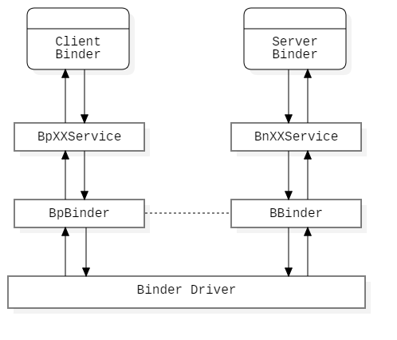

# Android Binder 的设计、实现与应用 - 文档概要

## 前言

Binder 是 Android 系统中的主要进程间通信方式，如果要深入理解 Android 系统各部分的实现原理，各个系统服务的功能实现，Binder 框架的设计实现以及应用是必须首先学习的，只有跨过这道栏杆才能顺利的学习 Android 系统原理。

Android Binder 的设计、实现与应用一系列的文档记录了个人 Binder 学习以及分析过程。

分析使用了 Android 6.0.1 系统的源码，首先是因为 Android 6.0 目前是比较主流的系统，拥有动态权限申请等诸多新特性，为了解 Android 系统原理起到了承上启下的作用，其次是网络上也有 Android 开发者前辈（袁辉辉 [http://gityuan.com](http://gityuan.com/)）分析过基于 Android 6.0 系统，不会在个人学习的过程中因为遇到重大困难导致放弃（背后有强大支柱）。

### 感谢

感谢以下资料以及作者（按照参考顺序排序）：

> - [Android Bander 设计与实现 - 设计篇](https://blog.csdn.net/universus/article/details/6211589) - universus
> - 《深入理解 Android 卷 1》 - 邓凡平
> - 《深入理解 Android 卷 2》 - 邓凡平
> - [Android 深入浅出之 Binder 机制](https://www.cnblogs.com/innost/archive/2011/01/09/1931456.html) - innost (邓凡平)
> - [Binder 系列](http://gityuan.com/2015/10/31/binder-prepare/) - Gityuan (袁辉辉)

## Binder 概要

Binder 是 Android 系统中的进程间通信方式之一，Binder 定义的整个进程间通信框架贯穿了 Android 系统的底层到上层，如果要深入理解 Binder 原理，那么必须对每个层次的 Binder 架构进行分析。

下面简述每个层次的 Binder 职责：

- 应用层，为应用程序提供进程间通信服务，可使用 aidl 描述语言定义远程服务之间的 Binder 通信接口，并实现面向对象的进程间通信。
- java 层，为 Framework java 层服务提供进程间通信服务，例如 AMS，PMS 等服务。
- native 层，为 Framework native 层的服务提供进程间通信，例如 MediaPlayerService 服务；管理 native 层服务的注册获取，native 层实现了 Binder 服务注册统一管理者 ServiceManager。
- driver 层，为 Binder 核心通信方法的实现，以驱动的形式存在于 Android 系统中。

## Binder 架构

通过分析参与 Binder 通信的相关服务对于 Binder 框架每一层的实现，描述每个层次的架构以及绘制图形。

### Java 层

java 层 Binder 框架是 native 的一个映射，所以和 native 框架很类似，客户端和服务端都有其对应的代理对象。

- XXManager 为服务端提供给用户的客户端接口，为用户提供真实服务端所需的服务，与服务端接口保持一致，例如 `ActivityManager`。
- XXManagerProxy 是客户端的代理，负责处理用户向客户端的提出的服务请求，将数据打包发送至服务端。
- BinderProxy 是客户端 Binder 的在 java 层的表示，它是 native 层 BpBinder 的映射类型。
- JavaBBinder 是 java 层服务端在 native 层的表示，同时也是服务端 Binder 的表示，它是一个 BBinder 类型。
- XXManagerNative 是服务端的代理，负责处理客户端向服务端发送的请求，解析数据包转发给服务端处理。
- XXManagerService 是服务端的实现类，为用户提供具体的服务。

### Native 层

- `BpXXService` 是客户端的代理类型，负责与服务的交互，隐藏数据包的收发细节，使客户端专注于自身的客户端逻辑。
- `BpBinder` 表示客户端 Binder 对象，内部封装了服务端 Binder 引用号和向驱动发送数据的交互细节。
- `Binder Driver` 驱动实现进程间通信的核心功能（利用共享内存），管理 Binder 实体和对应的 Binder 引用。
- `BBinder` 表示服务端 Binder 对象，抽象了 `onTransact` 函数。
- `BnXXService` 使服务端的代理类型，服务处理客户端的数据包，它隐藏了数据包的收发细节，使服务端专注于自身的业务逻辑。

### Driver 层

[todo]

## Binder 框架应用

[todo]

### 文档列表

下面将几份文档分析每个层次的实现：

- Binder 设计

[Android Binder 的设计、实现与应用 - Binder 设计分析](./android_binder_design.md)

- Binder native 层实现

[Android Binder 的设计、实现与应用 - Native 层实现分析](./android_binder_implement_native.md)

[Android Binder 的设计、实现与应用 - Native 层 Client-Server 通信分析](./android_binder_implement_native_cs.md)

- Binder java 层实现

[Android Binder 的设计、实现与应用 - Java 层实现分析](./android_binder_implement_java.md)

- Binder driver 层实现

[todo]