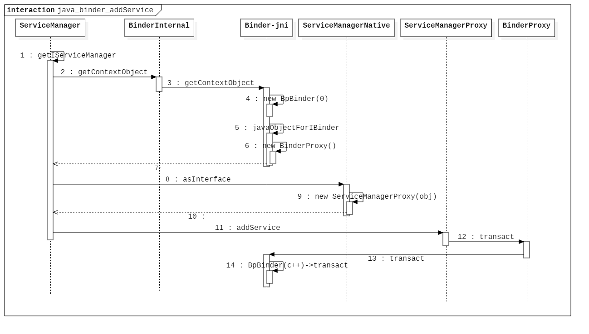

# Android Binder 的设计、实现与应用 - Java 层实现分析

## 前言

Binder 的核心逻辑都在 Native 层进行实现，例如 Binder 服务端总管 ServiceManager 以及相关服务端和客户端的 Binder 表示类型 `BBinder` 和 `BpBinder` 类型，那么 java 层的 Binder 没有必要重新实现一遍这些过程，所以 java 层 Binder 框架作为上层服务与 Native 层 Binder 框架的交互接口而存在，java 层 Binder 框架是对 Native 层 Binder 框架的一个映射。

java 层存在 native 层的多个映射类型，java 层的 `ServiceManager` 负责管理服务的注册和获取接口，java 层的 `Binder` 类型作为 java 层 Binder 代表类型而存在，在前面的文档中分析了 Native 层时如何实现的 Binder 框架，那么这里可以按照分析 native 层的实现顺序来分析 java 层的实现。

下面基于 Android 6.0 源码分析 java 层的 Binder 框架的实现。

## Binder 框架准备工作

### AndroidRuntime

java 层 Binder 框架与 native 层关系密切，在 Android 系统启动时会做一些初始化相关的 jni 资源的工作，其中就包含 java 层 Binder 框架的相关资源，java 层 Binder 框架与 Native 层交互的工作由 `android_util_Binder.cpp` 负责实现。

在 Zygote 进程启动时会做这些资源的工作，它的入口在 `AndroidRuntime::startReg` 函数中：

```c++
// AndroidRuntime.cpp

int AndroidRuntime::startReg(JNIEnv* env)
{
    /*
     * This hook causes all future threads created in this process to be
     * attached to the JavaVM.  (This needs to go away in favor of JNI
     * Attach calls.)
     */
    androidSetCreateThreadFunc((android_create_thread_fn) javaCreateThreadEtc);

    ALOGV("--- registering native functions ---\n");

    /*
     * Every "register" function calls one or more things that return
     * a local reference (e.g. FindClass).  Because we haven't really
     * started the VM yet, they're all getting stored in the base frame
     * and never released.  Use Push/Pop to manage the storage.
     */
    env->PushLocalFrame(200);
	// 这里会初始化 jni 相关资源。
    if (register_jni_procs(gRegJNI, NELEM(gRegJNI), env) < 0) {
        env->PopLocalFrame(NULL);
        return -1;
    }
    env->PopLocalFrame(NULL);

    //createJavaThread("fubar", quickTest, (void*) "hello");
    return 0;
}
```

其中的 `register_jni_procs` 会遍历调用一个初始化函数列表。

```c++
// AdroidRuntime.cpp

static int register_jni_procs(const RegJNIRec array[], size_t count, JNIEnv* env)
{
    for (size_t i = 0; i < count; i++) {
        if (array[i].mProc(env) < 0) {
#ifndef NDEBUG
            ALOGD("----------!!! %s failed to load\n", array[i].mName);
#endif
            return -1;
        }
    }
    return 0;
}
```

```c++
static const RegJNIRec gRegJNI[] = {
    REG_JNI(register_com_android_internal_os_RuntimeInit),
    REG_JNI(register_android_os_SystemClock),
    REG_JNI(register_android_util_EventLog),
    REG_JNI(register_android_util_Log),
    REG_JNI(register_android_content_AssetManager),
    ...
    REG_JNI(register_android_os_Process),
    REG_JNI(register_android_os_SystemProperties),
    REG_JNI(register_android_os_Binder),
    REG_JNI(register_android_os_Parcel),
    ...
};
```

其中 `REG_JNI` 是一个宏，用于初始化结构体：

```c++
// AdroidRuntime.cpp

#define REG_JNI(name)      { name }
struct RegJNIRec {
    int (*mProc)(JNIEnv*);
};
```

而上面循环中的 `mProce` 函数就指向每个初始化的 `name` 函数，即调结构体数组中的一个函数进行它们的初始化工作，其中就包括一个函数 `register_android_os_Binder`，它负责初始化 Binder 类型在 jni 层的资源。

### Binder-jni

进入 Binder 初始化 jni 资源的入口：

```c++
// android_util_Binder.cpp

int register_android_os_Binder(JNIEnv* env)
{
    if (int_register_android_os_Binder(env) < 0)
        return -1;
    if (int_register_android_os_BinderInternal(env) < 0)
        return -1;
    if (int_register_android_os_BinderProxy(env) < 0)
        return -1;

    // 保存一些 java 层类型的指针。
    jclass clazz = FindClassOrDie(env, "android/util/Log");
    gLogOffsets.mClass = MakeGlobalRefOrDie(env, clazz);
    gLogOffsets.mLogE = GetStaticMethodIDOrDie(env, clazz, "e",
            "(Ljava/lang/String;Ljava/lang/String;Ljava/lang/Throwable;)I");

    clazz = FindClassOrDie(env, "android/os/ParcelFileDescriptor");
    gParcelFileDescriptorOffsets.mClass = MakeGlobalRefOrDie(env, clazz);
    gParcelFileDescriptorOffsets.mConstructor = GetMethodIDOrDie(env, clazz, "<init>",
                                                                 "(Ljava/io/FileDescriptor;)V");

    clazz = FindClassOrDie(env, "android/os/StrictMode");
    gStrictModeCallbackOffsets.mClass = MakeGlobalRefOrDie(env, clazz);
    gStrictModeCallbackOffsets.mCallback = GetStaticMethodIDOrDie(env, clazz,
            "onBinderStrictModePolicyChange", "(I)V");

    return 0;
}
```

```c++
// android_util_Binder.cpp

const char* const kBinderPathName = "android/os/Binder";

static int int_register_android_os_Binder(JNIEnv* env)
{
    // 保存 java 层 Binder 类型的指针。
    jclass clazz = FindClassOrDie(env, kBinderPathName);

    gBinderOffsets.mClass = MakeGlobalRefOrDie(env, clazz);
    // 保存 Bindre 类型的 execTransact 方法和 mObject 指针。
    gBinderOffsets.mExecTransact = GetMethodIDOrDie(env, clazz, "execTransact", "(IJJI)Z");
    gBinderOffsets.mObject = GetFieldIDOrDie(env, clazz, "mObject", "J");

    // 注册 java 层函数到 native 层。
    return RegisterMethodsOrDie(
        env, kBinderPathName,
        gBinderMethods, NELEM(gBinderMethods));
}

```

```c++
// android_util_Binder.cpp

const char* const kBinderInternalPathName = "com/android/internal/os/BinderInternal";

static int int_register_android_os_BinderInternal(JNIEnv* env)
{
    // 保存 java 层 BinderInternal 类型指针和 forceBinderGc 方法。
    jclass clazz = FindClassOrDie(env, kBinderInternalPathName);

    gBinderInternalOffsets.mClass = MakeGlobalRefOrDie(env, clazz);
    gBinderInternalOffsets.mForceGc = GetStaticMethodIDOrDie(env, clazz, "forceBinderGc", "()V");

    return RegisterMethodsOrDie(
        env, kBinderInternalPathName,
        gBinderInternalMethods, NELEM(gBinderInternalMethods));
}
```

```c++
// android_util_Binder.cpp

const char* const kBinderProxyPathName = "android/os/BinderProxy";

static int int_register_android_os_BinderProxy(JNIEnv* env)
{
    jclass clazz = FindClassOrDie(env, "java/lang/Error");
    gErrorOffsets.mClass = MakeGlobalRefOrDie(env, clazz);

    // 保存 java 层 BinderProxy 类型的相关信息。
    clazz = FindClassOrDie(env, kBinderProxyPathName);
    gBinderProxyOffsets.mClass = MakeGlobalRefOrDie(env, clazz);
    gBinderProxyOffsets.mConstructor = GetMethodIDOrDie(env, clazz, "<init>", "()V");
    gBinderProxyOffsets.mSendDeathNotice = GetStaticMethodIDOrDie(env, clazz, "sendDeathNotice",
            "(Landroid/os/IBinder$DeathRecipient;)V");

    gBinderProxyOffsets.mObject = GetFieldIDOrDie(env, clazz, "mObject", "J");
    gBinderProxyOffsets.mSelf = GetFieldIDOrDie(env, clazz, "mSelf",
                                                "Ljava/lang/ref/WeakReference;");
    gBinderProxyOffsets.mOrgue = GetFieldIDOrDie(env, clazz, "mOrgue", "J");

    clazz = FindClassOrDie(env, "java/lang/Class");
    gClassOffsets.mGetName = GetMethodIDOrDie(env, clazz, "getName", "()Ljava/lang/String;");

    return RegisterMethodsOrDie(
        env, kBinderProxyPathName,
        gBinderProxyMethods, NELEM(gBinderProxyMethods));
}
```

可以看到，上面的主要工作就是保存 java 层三个类型的信息，方便后面的逻辑与 java 层进行交互。

三个类型分别为 `Binder`，`BinderInternal`，`BinderProxy`。

## Binder 服务总管

下面按照签名分析 native 层的顺序，首先分析 ServiceManager 类，它负责管理服务的注册和获取。

### ServiceManager

首先看到 `ServiceManager` 类具有和 native 层 ServiceManager 名字相同的几个管理 Binder 的方法：

```java
public static IBinder getService(String name);
public static void addService(String name, IBinder service);
public static IBinder checkService(String name);
public static String[] listServices(); throws RemoteException
```

这里首先看用于注册服务的 `addService` 方法。

```java
// ServiceManager.java

/**
 * Place a new @a service called @a name into the service
 * manager.
 * 
 * @param name the name of the new service
 * @param service the service object
 */
public static void addService(String name, IBinder service) {
    try {
        getIServiceManager().addService(name, service, false);
    } catch (RemoteException e) {
        Log.e(TAG, "error in addService", e);
    }
}

```

它是由 `getIServiceManager` 返回的一个 `IServiceManager` 类型的对象的 `addService` 方法实现。

`IServiceManager` 这个类，它是一个接口，定义如下：

```java
// IServiceManager.java

public interface IServiceManager extends IInterface
{
    /**
     * Retrieve an existing service called @a name from the
     * service manager.  Blocks for a few seconds waiting for it to be
     * published if it does not already exist.
     */
    public IBinder getService(String name) throws RemoteException;
    
    /**
     * Retrieve an existing service called @a name from the
     * service manager.  Non-blocking.
     */
    public IBinder checkService(String name) throws RemoteException;

    /**
     * Place a new @a service called @a name into the service
     * manager.
     */
    public void addService(String name, IBinder service, boolean allowIsolated)
                throws RemoteException;

    /**
     * Return a list of all currently running services.
     */
    public String[] listServices() throws RemoteException;

    /**
     * Assign a permission controller to the service manager.  After set, this
     * interface is checked before any services are added.
     */
    public void setPermissionController(IPermissionController controller)
            throws RemoteException;
    
    static final String descriptor = "android.os.IServiceManager";

    int GET_SERVICE_TRANSACTION = IBinder.FIRST_CALL_TRANSACTION;
    int CHECK_SERVICE_TRANSACTION = IBinder.FIRST_CALL_TRANSACTION+1;
    int ADD_SERVICE_TRANSACTION = IBinder.FIRST_CALL_TRANSACTION+2;
    int LIST_SERVICES_TRANSACTION = IBinder.FIRST_CALL_TRANSACTION+3;
    int CHECK_SERVICES_TRANSACTION = IBinder.FIRST_CALL_TRANSACTION+4;
    int SET_PERMISSION_CONTROLLER_TRANSACTION = IBinder.FIRST_CALL_TRANSACTION+5;
}
```

它也和 native 层的 ServiceManager 函数相对应。

通过查看 `ServiceManager` 其他方法的实现，发现它们都是通过 `IServiceManager` 去实现的功能，看来 `ServiceManager` 只是一个外壳，真正的实现在 `getIServiceManager` 方法里。

```java
// ServiceManager.java

private static IServiceManager getIServiceManager() {
    if (sServiceManager != null) {
        return sServiceManager;
    }

    // Find the service manager
    sServiceManager = ServiceManagerNative.asInterface(BinderInternal.getContextObject());
    return sServiceManager;
}
```

`ServiceManagerNative` 的 `asInterface` 返回了 `IServiceManager` 对象。

### BinderInternal

首先看 `BinderInternal` 的 `getContextObject` 方法，它是一个 native 方法。

```java
// ServiceManager.java

public static final native IBinder getContextObject();
```

实现在 `android_util_Binder.cpp` 中：

```c++
// android_util_Binder.cpp

static jobject android_os_BinderInternal_getContextObject(JNIEnv* env, jobject clazz)
{
    sp<IBinder> b = ProcessState::self()->getContextObject(NULL);
    return javaObjectForIBinder(env, b);
}
```

第一行代码很熟悉，就是之前分析过的 `ProcessState` 里的 `getContextObject` 函数，它的内部会打开 Binder 驱动，最终会返回一个 `new BpBinder(0)`，表示 ServiceManager 的客户端 Binder 类型。

那么看 `javaObjectForIBinder` 的实现：

```c++
// android_util_Binder.cpp

jobject javaObjectForIBinder(JNIEnv* env, const sp<IBinder>& val)
{
    if (val == NULL) return NULL;

    // BpBinder 的默认实现为 false。
    if (val->checkSubclass(&gBinderOffsets)) {
        // One of our own!
        jobject object = static_cast<JavaBBinder*>(val.get())->object();
        LOGDEATH("objectForBinder %p: it's our own %p!\n", val.get(), object);
        return object;
    }

    // For the rest of the function we will hold this lock, to serialize
    // looking/creation of Java proxies for native Binder proxies.
    AutoMutex _l(mProxyLock);

    // Someone else's...  do we know about it?
    // 从 BpBinder 的 mObjects(Vector) 缓存里面查询对象，对应下面的 attachObject。
    jobject object = (jobject)val->findObject(&gBinderProxyOffsets);
    if (object != NULL) {
        jobject res = jniGetReferent(env, object);
        if (res != NULL) {
            ALOGV("objectForBinder %p: found existing %p!\n", val.get(), res);
            return res;
        }
        LOGDEATH("Proxy object %p of IBinder %p no longer in working set!!!", object, val.get());
        android_atomic_dec(&gNumProxyRefs);
        val->detachObject(&gBinderProxyOffsets);
        env->DeleteGlobalRef(object);
    }

    // 创建 BinderProxy 的对象。
    object = env->NewObject(gBinderProxyOffsets.mClass, gBinderProxyOffsets.mConstructor);
    if (object != NULL) {
        LOGDEATH("objectForBinder %p: created new proxy %p !\n", val.get(), object);
        // 同时将 BpBinder 的引用绑定在 BinderProxy 中。
        // The proxy holds a reference to the native object.
        env->SetLongField(object, gBinderProxyOffsets.mObject, (jlong)val.get());
        val->incStrong((void*)javaObjectForIBinder);

        // The native object needs to hold a weak reference back to the
        // proxy, so we can retrieve the same proxy if it is still active.
        jobject refObject = env->NewGlobalRef(
                env->GetObjectField(object, gBinderProxyOffsets.mSelf));
        // 放入 BpBinder 的 mObjects 缓存。
        val->attachObject(&gBinderProxyOffsets, refObject,
                jnienv_to_javavm(env), proxy_cleanup);

        // Also remember the death recipients registered on this proxy
        sp<DeathRecipientList> drl = new DeathRecipientList;
        drl->incStrong((void*)javaObjectForIBinder);
        env->SetLongField(object, gBinderProxyOffsets.mOrgue, reinterpret_cast<jlong>(drl.get()));

        // Note that a new object reference has been created.
        android_atomic_inc(&gNumProxyRefs);
        incRefsCreated(env);
    }

    return object;
}
```

分析到这里了解到了 `BinderInternal.getContextObject()` 方法内部创建了一个 `BpBinder(0)` 对象，最终返回了一个 `BinderProxy` 对象，而且 `BinderProxy` 和 `BpBinder` 互相绑定，都持有对方的引用。

### ServiceManagerNative

接下来看 `ServiceManagerNative.asInterface` 的实现：

```java
// ServiceManagerNative.java

static public IServiceManager asInterface(IBinder obj)
{
    if (obj == null) {
        return null;
    }
    // BinderProxy 的 queryLocalInterface 返回 null。
    IServiceManager in =
        (IServiceManager)obj.queryLocalInterface(descriptor);
    if (in != null) {
        return in;
    }

    return new ServiceManagerProxy(obj);
}
```

最终创建了 `ServiceManagerProxy` 类型，即 `IServiceManager` 的实现类。

### ServiceManagerProxy

追溯 `addService` 方法的实现：

```java
// ServiceManagerProxy.java

public void addService(String name, IBinder service, boolean allowIsolated)
    throws RemoteException {
    // Parcel 为 native 层 Parcel 映射类。
    Parcel data = Parcel.obtain();
    Parcel reply = Parcel.obtain();
    data.writeInterfaceToken(IServiceManager.descriptor);
    data.writeString(name);
    data.writeStrongBinder(service);
    data.writeInt(allowIsolated ? 1 : 0);
    // mRemote 为传入的 BinderProxy 对象。
    mRemote.transact(ADD_SERVICE_TRANSACTION, data, reply, 0);
    reply.recycle();
    data.recycle();
}
```

最终调用了 `BinderProxy` 的 `transact` 方法发送注册消息。

### BinderProxy

`BinderProxy` 是 `Binder` 的内部类型，查看它的 `transact` 方法实现：

```java
// BinderProxy.java

public boolean transact(int code, Parcel data, Parcel reply, int flags) throws RemoteException {
    Binder.checkParcel(this, code, data, "Unreasonably large binder buffer");
    return transactNative(code, data, reply, flags);
}

public native boolean transactNative(int code, Parcel data, Parcel reply,
                                     int flags) throws RemoteException;
```

还是由 native 层实现。

```c++
// android_util_Binder.cpp

static jboolean android_os_BinderProxy_transact(JNIEnv* env, jobject obj,
        jint code, jobject dataObj, jobject replyObj, jint flags) // throws RemoteException
{
    if (dataObj == NULL) {
        jniThrowNullPointerException(env, NULL);
        return JNI_FALSE;
    }

    // java 层 Parcel 映射成 native 层 Parcel。
    Parcel* data = parcelForJavaObject(env, dataObj);
    if (data == NULL) {
        return JNI_FALSE;
    }
    Parcel* reply = parcelForJavaObject(env, replyObj);
    if (reply == NULL && replyObj != NULL) {
        return JNI_FALSE;
    }

    IBinder* target = (IBinder*)
        env->GetLongField(obj, gBinderProxyOffsets.mObject);
    if (target == NULL) {
        jniThrowException(env, "java/lang/IllegalStateException", "Binder has been finalized!");
        return JNI_FALSE;
    }

    ...
    
    // target 就是 BpBinder，保存在了 BinderProxy 的 mObject 成员变量里面。
    //printf("Transact from Java code to %p sending: ", target); data->print();
    status_t err = target->transact(code, *data, reply, flags);
    //if (reply) printf("Transact from Java code to %p received: ", target); reply->print();

    if (kEnableBinderSample) {
        if (time_binder_calls) {
            conditionally_log_binder_call(start_millis, target, code);
        }
    }

    if (err == NO_ERROR) {
        return JNI_TRUE;
    } else if (err == UNKNOWN_TRANSACTION) {
        return JNI_FALSE;
    }

    signalExceptionForError(env, obj, err, true /*canThrowRemoteException*/, data->dataSize());
    return JNI_FALSE;
}
```

这里就明确了，`BinderProxy` 最终还是使用 `BpBinder` 的函数向 native 层的 `ServiceManager` 发送消息的。

其他相关方法和 `addService` 方法实现最终都会调用对应的 `BpBinder` 的通信函数实现。

下面用时序图表示上述 `addService` 过程。

### 时序图



## Binder 通信框架

上面分析了实现 java 层 ServiceManager 的几个重要类型，接下来完成 java 层 Binder 具体通信的实现方式，两者结合起来就能准确表达出 java 层 Binder 框架的设计了。

