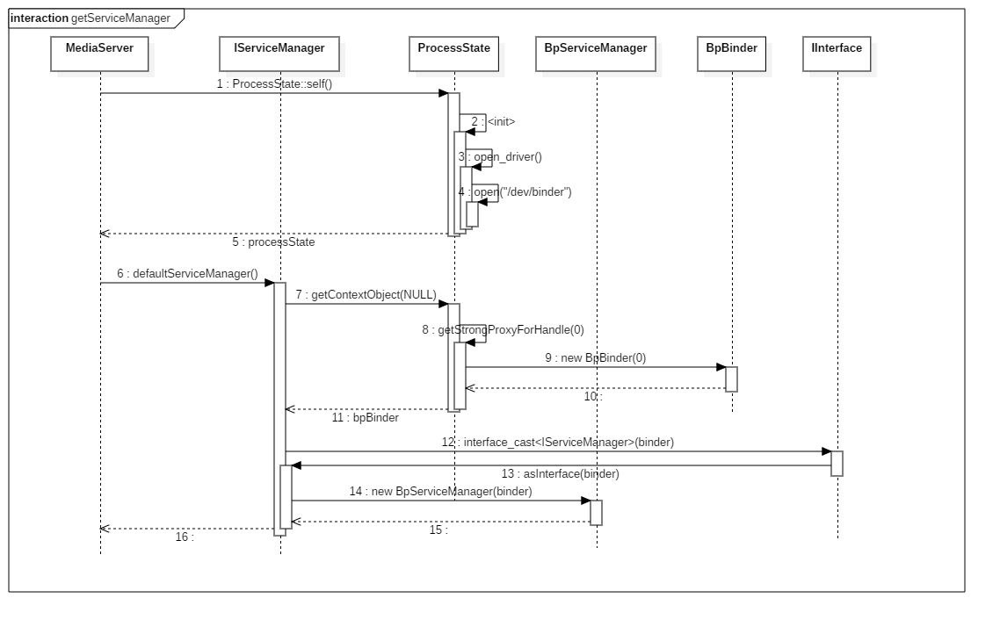

# Android Binder 的设计、实现与应用 - Native 层实现分析

- [前言](#前言)
- [ServiceManager](#servicemanager)
  - [ServiceManager 的注册](#servicemanager-的注册)
  - [请求处理](#请求处理)
  - [addService](#addservice)
  - [getService](#getservice)
- [Server Binder](#server-binder)
  - [ServiceManager 的获取](#servicemanager-的获取)
  - [Server Binder 的注册](#server-binder-的注册)
- [Client Binder](#client-binder)

## 前言

通过分析 Native 层的 Binder 框架，了解 Binder 的进程间通信原理，以及 Android 系统服务与 Binder 的关系。

从 Binder 的设计了解到，Binder 的目标是为进程间通信服务，Binder 基于 Client/Server 架构，进程间通信发生时，参与通信的角色包括客户端和服务端，客户端请求服务端处理请求，客户端收到请求，然后两者持续进行交互，那么交互过程如下：

首先一个进程需要成为一个 Server Binder，即服务端的角色，那么它需要首先向服务注册的管理者 ServiceManager 请求注册自身为 Server 端，ServiceManager 需要在所有进程注册之前将自己初始化，并向 Binder 驱动注册自身成为服务管理器，然后，当 Server BInder 向 ServiceManager 注册完毕，客户端即可向服务端发出请求，它会首先向 ServiceManager 请求获取对应的服务端 Binder，获取到服务端 Binder 的引用后即可向服务端发出请求，执行完整的进程间通信。

那么分析时，可以按照时间顺序，依次递进，下面基于 Android 6.0.1 的系统源码分析 Binder 在 Native 层的实现：

## ServiceManager

首先分析 ServiceManager 自身的初始化以及注册过程，ServiceManager 作为 Server Binder 注册的管理者，必须首先实现自身的注册，然后才能接收 Server Binder 的注册信息，处理注册请求，下面分析其实现：

### ServiceManager 的注册

ServiceManager 的实现在 `service_manager.c` 中，入口点在 `main` 函数中。

 ```c
// service_manager.c

int main(int argc, char **argv)
{
    struct binder_state *bs;
	// 1. 打开 binder 驱动。
    bs = binder_open(128*1024);
    if (!bs) {
        ALOGE("failed to open binder driver\n");
        return -1;
    }
    
	// 2. 注册当前进程为 ServiceManager。
    if (binder_become_context_manager(bs)) {
        ALOGE("cannot become context manager (%s)\n", strerror(errno));
        return -1;
    }

    // 安全系统相关的检查。
    selinux_enabled = is_selinux_enabled();
    sehandle = selinux_android_service_context_handle();
    selinux_status_open(true);

    if (selinux_enabled > 0) {
        if (sehandle == NULL) {
            ALOGE("SELinux: Failed to acquire sehandle. Aborting.\n");
            abort();
        }

        if (getcon(&service_manager_context) != 0) {
            ALOGE("SELinux: Failed to acquire service_manager context. Aborting.\n");
            abort();
        }
    }

    union selinux_callback cb;
    cb.func_audit = audit_callback;
    selinux_set_callback(SELINUX_CB_AUDIT, cb);
    cb.func_log = selinux_log_callback;
    selinux_set_callback(SELINUX_CB_LOG, cb);

    // 3. 开启 binder 循环。
    binder_loop(bs, svcmgr_handler);
    return 0;
}
 ```

首先看第一步：

```c
// service_manager.c

struct binder_state *binder_open(size_t mapsize)
{
    struct binder_state *bs;
    struct binder_version vers;

    bs = malloc(sizeof(*bs));
    if (!bs) {
        errno = ENOMEM;
        return NULL;
    }

    // 通过系统调用打开 binder 驱动设备，得到 binder 文件描述符。
    bs->fd = open("/dev/binder", O_RDWR);
    if (bs->fd < 0) {
        fprintf(stderr,"binder: cannot open device (%s)\n", strerror(errno));
        goto fail_open;
    }

    // 通过 BINDER_VERSION 命令获取 binder 驱动版本并检查是否和内核版本相同。
    if ((ioctl(bs->fd, BINDER_VERSION, &vers) == -1) ||
        (vers.protocol_version != BINDER_CURRENT_PROTOCOL_VERSION)) {
        fprintf(stderr,
                "binder: kernel driver version (%d) differs from user space version (%d)\n",
                vers.protocol_version, BINDER_CURRENT_PROTOCOL_VERSION);
        goto fail_open;
    }

    bs->mapsize = mapsize;
    // 分配一份映射内存。
    bs->mapped = mmap(NULL, mapsize, PROT_READ, MAP_PRIVATE, bs->fd, 0);
    // 映射出错。
    if (bs->mapped == MAP_FAILED) {
        fprintf(stderr,"binder: cannot map device (%s)\n", strerror(errno));
        goto fail_map;
    }

    return bs;

fail_map:
    close(bs->fd);
fail_open:
    free(bs);
    return NULL;
}
```

它做了打开驱动并且分配了内存缓冲区，第二步：

```c
// service_manager.c

int binder_become_context_manager(struct binder_state *bs)
{
    // 使用 BINDER_SET_CONTEXT_MGR 注册当前进程为 ServiceManager。
    return ioctl(bs->fd, BINDER_SET_CONTEXT_MGR, 0);
}
```

通过命令注册自身进程为 ServiceManager，这里就完成了 ServiceManager 的注册，注册后，前面相关系统服务将可以通过  0 号引用通过驱动向 ServiceManager 发送注册请求。

第三步时，就进入了 ServiceManager 的请求处理部分。

### 请求处理

```c
// service_manager.c

void binder_loop(struct binder_state *bs, binder_handler func)
{
    int res;
    struct binder_write_read bwr;
    uint32_t readbuf[32];

    bwr.write_size = 0;
    bwr.write_consumed = 0;
    bwr.write_buffer = 0;

    readbuf[0] = BC_ENTER_LOOPER;
    // 发送 BC_ENTER_LOOPER 命令通知驱动该线程已经进入主循环，可以接受数据。
    binder_write(bs, readbuf, sizeof(uint32_t));

    // 开启消息读取解析循环。
    for (;;) {
        bwr.read_size = sizeof(readbuf);
        bwr.read_consumed = 0;
        bwr.read_buffer = (uintptr_t) readbuf;

        // 不断读取消息。
        res = ioctl(bs->fd, BINDER_WRITE_READ, &bwr);

        if (res < 0) {
            ALOGE("binder_loop: ioctl failed (%s)\n", strerror(errno));
            break;
        }
		
        // 解析处理消息。
        res = binder_parse(bs, 0, (uintptr_t) readbuf, bwr.read_consumed, func);
        if (res == 0) {
            ALOGE("binder_loop: unexpected reply?!\n");
            break;
        }
        
        if (res < 0) {
            ALOGE("binder_loop: io error %d %s\n", res, strerror(errno));
            break;
        }
    }
}
```

追溯 `binder_parse` 的实现：

```c
// service_manager.c

int binder_parse(struct binder_state *bs, struct binder_io *bio,
                 uintptr_t ptr, size_t size, binder_handler func)
{
    int r = 1;
    uintptr_t end = ptr + (uintptr_t) size;

    while (ptr < end) {
        uint32_t cmd = *(uint32_t *) ptr;
        ptr += sizeof(uint32_t);
        switch(cmd) {
        case BR_NOOP:
            break;
        case BR_TRANSACTION_COMPLETE:
            break;
        case BR_INCREFS:
        case BR_ACQUIRE:
        case BR_RELEASE:
        case BR_DECREFS:
            ptr += sizeof(struct binder_ptr_cookie);
            break;
        case BR_TRANSACTION: {
            struct binder_transaction_data *txn = (struct binder_transaction_data *) ptr;
            if ((end - ptr) < sizeof(*txn)) {
                ALOGE("parse: txn too small!\n");
                return -1;
            }
            
            binder_dump_txn(txn);
            // 消息最终由 func 处理。
            if (func) {
                unsigned rdata[256/4];
                struct binder_io msg;
                struct binder_io reply;
                int res;

                bio_init(&reply, rdata, sizeof(rdata), 4);
                bio_init_from_txn(&msg, txn);
                res = func(bs, txn, &msg, &reply);
                binder_send_reply(bs, &reply, txn->data.ptr.buffer, res);
            }
            ptr += sizeof(*txn);
            break;
        }
        case BR_REPLY: {
            struct binder_transaction_data *txn = (struct binder_transaction_data *) ptr;
            if ((end - ptr) < sizeof(*txn)) {
                ALOGE("parse: reply too small!\n");
                return -1;
            }
            
            binder_dump_txn(txn);
            if (bio) {
                bio_init_from_txn(bio, txn);
                bio = 0;
            } else {
                /* todo FREE BUFFER */
            }
            
            ptr += sizeof(*txn);
            r = 0;
            break;
        }
        case BR_DEAD_BINDER: {
            struct binder_death *death = (struct binder_death *)(uintptr_t) *(binder_uintptr_t *)ptr;
            ptr += sizeof(binder_uintptr_t);
            death->func(bs, death->ptr);
            break;
        }
        case BR_FAILED_REPLY:
            r = -1;
            break;
        case BR_DEAD_REPLY:
            r = -1;
            break;
        default:
            ALOGE("parse: OOPS %d\n", cmd);
            return -1;
        }
    }

    return r;
}
```

可以看到，消息最终由上面传入的 `func` 函数指针处理了。

```c
binder_loop(bs, svcmgr_handler);
```

即 `svcmgr_handler` 函数：

```c
// service_manager.c

int svcmgr_handler(struct binder_state *bs,
                   struct binder_transaction_data *txn,
                   struct binder_io *msg,
                   struct binder_io *reply)
{
    struct svcinfo *si;
    uint16_t *s;
    size_t len;
    uint32_t handle;
    uint32_t strict_policy;
    int allow_isolated;

    //ALOGI("target=%p code=%d pid=%d uid=%d\n",
    //      (void*) txn->target.ptr, txn->code, txn->sender_pid, txn->sender_euid);

    if (txn->target.ptr != BINDER_SERVICE_MANAGER)
        return -1;

    if (txn->code == PING_TRANSACTION)
        return 0;

    // Equivalent to Parcel::enforceInterface(), reading the RPC
    // header with the strict mode policy mask and the interface name.
    // Note that we ignore the strict_policy and don't propagate it
    // further (since we do no outbound RPCs anyway).
    strict_policy = bio_get_uint32(msg);
    s = bio_get_string16(msg, &len);
    if (s == NULL) {
        return -1;
    }

    if ((len != (sizeof(svcmgr_id) / 2)) ||
        memcmp(svcmgr_id, s, sizeof(svcmgr_id))) {
        fprintf(stderr,"invalid id %s\n", str8(s, len));
        return -1;
    }

    if (sehandle && selinux_status_updated() > 0) {
        struct selabel_handle *tmp_sehandle = selinux_android_service_context_handle();
        if (tmp_sehandle) {
            selabel_close(sehandle);
            sehandle = tmp_sehandle;
        }
    }

    switch(txn->code) {
    // 对应 IPCThreadState 中的 GET_SERVICE_TRANSACTION 命令号，处理前面的 getService 请求。
    case SVC_MGR_GET_SERVICE:
    // 对应 CHECK_SERVICE_TRANSACTION 命令号，处理 checkService 请求。
    case SVC_MGR_CHECK_SERVICE:
        s = bio_get_string16(msg, &len);
        if (s == NULL) {
            return -1;
        }
        
        // 处理 getSerice 请求。
        handle = do_find_service(bs, s, len, txn->sender_euid, txn->sender_pid);
        if (!handle)
            break;
        bio_put_ref(reply, handle);
        return 0;
	// 对应 ADD_SERVICE_TRANSACTION 命令号，处理 addService 请求。
    case SVC_MGR_ADD_SERVICE:
        s = bio_get_string16(msg, &len);
        if (s == NULL) {
            return -1;
        }
        handle = bio_get_ref(msg);
        allow_isolated = bio_get_uint32(msg) ? 1 : 0;
        // 处理 addService 请求。
        if (do_add_service(bs, s, len, handle, txn->sender_euid,
            allow_isolated, txn->sender_pid))
            return -1;
        break;
    // 对应 LIST_SERVICES_TRANSACTION 命令号，处理 listService 请求。
    case SVC_MGR_LIST_SERVICES: {
        uint32_t n = bio_get_uint32(msg);
		// 检查是否有权限。
        if (!svc_can_list(txn->sender_pid)) {
            ALOGE("list_service() uid=%d - PERMISSION DENIED\n",
                    txn->sender_euid);
            return -1;
        }
        // 从已注册的 server 链表读取指定索引的 server。
        si = svclist;
        while ((n-- > 0) && si)
            si = si->next;
        if (si) {
            // 将索引对应的 server 名字填入返回数据包。
            bio_put_string16(reply, si->name);
            return 0;
        }
        return -1;
    }
    default:
        ALOGE("unknown code %d\n", txn->code);
        return -1;
    }

    bio_put_uint32(reply, 0);
    return 0;
}
```

这里真正处理了前面所分析过的 Server Binder 的注册请求，下面分别看每个请求对应的处理方法。

### addService

addService 请求的由 `do_add_service` 函数处理，它负责处理服务端 Binder 的注册请求。

```c
// service_manager.c

int do_add_service(struct binder_state *bs,
                   const uint16_t *s, size_t len,
                   uint32_t handle, uid_t uid, int allow_isolated,
                   pid_t spid)
{
    struct svcinfo *si;

    //ALOGI("add_service('%s',%x,%s) uid=%d\n", str8(s, len), handle,
    //        allow_isolated ? "allow_isolated" : "!allow_isolated", uid);

    if (!handle || (len == 0) || (len > 127))
        return -1;

    // 检查是否有权限注册，例如 root 用户进程或 system 用户进程拥有合法权限。
    if (!svc_can_register(s, len, spid)) {
        ALOGE("add_service('%s',%x) uid=%d - PERMISSION DENIED\n",
             str8(s, len), handle, uid);
        return -1;
    }
    
    // 查找已经注册的 server。
    si = find_svc(s, len);
    if (si) {
        if (si->handle) {
            ALOGE("add_service('%s',%x) uid=%d - ALREADY REGISTERED, OVERRIDE\n",
                 str8(s, len), handle, uid);
            // 查找到同名的 server 释放它。
            svcinfo_death(bs, si);
        }
        si->handle = handle;
    } else {
        si = malloc(sizeof(*si) + (len + 1) * sizeof(uint16_t));
        if (!si) {
            ALOGE("add_service('%s',%x) uid=%d - OUT OF MEMORY\n",
                 str8(s, len), handle, uid);
            return -1;
        }
        si->handle = handle;
        si->len = len;
        memcpy(si->name, s, (len + 1) * sizeof(uint16_t));
        si->name[len] = '\0';
        si->death.func = (void*) svcinfo_death;
        si->death.ptr = si;
        si->allow_isolated = allow_isolated;
        // 加入已注册的 server 链表。
        si->next = svclist;
        svclist = si;
    }

    // 请求驱动增加 binder 实体。
    binder_acquire(bs, handle);
    // 通过 BC_REQUEST_DEATH_NOTIFICATION 命令请求驱动在 Binder 实体销毁时得到通知。
    binder_link_to_death(bs, handle, &si->death);
    return 0;
}
```

```c
// service_manager.c

struct svcinfo *find_svc(const uint16_t *s16, size_t len)
{
    struct svcinfo *si;

    for (si = svclist; si; si = si->next) {
        if ((len == si->len) &&
            !memcmp(s16, si->name, len * sizeof(uint16_t))) {
            return si;
        }
    }
    return NULL;
}
```

```c
// service_manager.c

void svcinfo_death(struct binder_state *bs, void *ptr)
{
    struct svcinfo *si = (struct svcinfo* ) ptr;

    ALOGI("service '%s' died\n", str8(si->name, si->len));
    if (si->handle) {
        binder_release(bs, si->handle);
        si->handle = 0;
    }
}
```

```c
// binder.c

void binder_acquire(struct binder_state *bs, uint32_t target)
{
    uint32_t cmd[2];
    cmd[0] = BC_ACQUIRE;
    cmd[1] = target;
    // 发送 BC_ACQUIRE 命令请求在驱动中增加 binder 实体的引用。
    binder_write(bs, cmd, sizeof(cmd));
}
```

```c
// binder.c

void binder_release(struct binder_state *bs, uint32_t target)
{
    uint32_t cmd[2];
    cmd[0] = BC_RELEASE;
    cmd[1] = target;
    // 发送 BC_RELEASE 命令请求释放引用。
    binder_write(bs, cmd, sizeof(cmd));
}
```

```c
// binder.c

void binder_link_to_death(struct binder_state *bs, uint32_t target, struct binder_death *death)
{
    struct {
        uint32_t cmd;
        struct binder_handle_cookie payload;
    } __attribute__((packed)) data;

    data.cmd = BC_REQUEST_DEATH_NOTIFICATION;
    data.payload.handle = target;
    data.payload.cookie = (uintptr_t) death;
    binder_write(bs, &data, sizeof(data));
}
```

### getService

getService 请求由 `do_find_service` 函数处理，它负责处理客户端请求获取服务端 Binder 的请求。

```c
// service_manager.c

uint32_t do_find_service(struct binder_state *bs, const uint16_t *s, size_t len, uid_t uid, pid_t spid)
{
    // 从已注册的 server 链表中寻找目标。
    struct svcinfo *si = find_svc(s, len);

    if (!si || !si->handle) {
        return 0;
    }

    // 检查是否允许从隔离独立进行访问服务。
    if (!si->allow_isolated) {
        // If this service doesn't allow access from isolated processes,
        // then check the uid to see if it is isolated.
        uid_t appid = uid % AID_USER;
        if (appid >= AID_ISOLATED_START && appid <= AID_ISOLATED_END) {
            return 0;
        }
    }

    // 检查服务是否满足权限。
    if (!svc_can_find(s, len, spid)) {
        return 0;
    }

    return si->handle;
}
```

## Server Binder

分析进程向 ServiceManager 注册自身为服务端 Binder 的过程。

这里选择 Android 系统中多媒体服务 `MediaPlayerService` 作为典型案例，理解服务端 Binder 的注册过程。

`MediaPlayerService` 的初始化在 `main_mediaserver.cpp` 中，它是 Android 系统中的一个重要的可执行程序 MediaServer，它管理了多个媒体相关的多个运行在系统 frameowrk 层的核心服务，包括：AuditFlinger(音频核心服务)，AudiaPolicyService(音频系统策略相关服务)，MediaPlayerService(多媒体系统服务)，CameraService(相机相关服务)。

MediaServer 的入口：

```c++
// main_mediaserver.cpp

int main(int argc __unuserd, char** argv)
{
  	// 省略两行无关代码。
    // 初始化 Unicode 支持这里与 binder 无关。
    InitializeIcuOrDie();
    // sp 为 Android 定义的智能指针，StrongPointer。
    // 获取 ProcessState 在进程中的单例，其内部会打开 binder 驱动。
    sp<ProcessState> proc(ProcessState::self());
    // 获取 ServiceManager，为注册 Server 端服务。
    sp<IServiceManager> sm = defaultServiceManager();
    ALOGI("ServiceManager: %p", sm.get());
    // 注册 AudioFlinger。
    AudioFlinger::instantiate();
    // 注册 MediaPlayerService。
    MediaPlayerService::instantiate();
    // 注册相关服务。
    ResourceManagerService::instantiate();
    CameraService::instantiate();
    AudioPolicyService::instantiate();
    SoundTriggerHwService::instantiate();
    RadioService::instantiate();
    registerExtensions();
    // 启用线程收发 Binder 数据包。
    ProcessState::self()->startThreadPool();
    IPCThreadState::self()->joinThreadPool();
}
```

其中 `MediaPlayerService::instantiate();` 为 `MediaPlayerService` 服务的初始化入口，下面开始分析其实现。

`MediaPlayerService` 的实现在 `MediaPlayerService.cpp` 中，定义在 `MediaPlayerService.h` 中。

```c++
void MediaPlayerService::instantiate() {
    defaultServiceManager()->addService(
            String16("media.player"), new MediaPlayerService());
}
```

可以看到逻辑很简单，通过 `defaultServiceManager` 函数获得 ServiceManager 的引用，然后通过 `addService` 函数将自己注册为服务端 Binder，携带一个服务的唯一标识字符串。

那么首先分析 `defaultServiceManager`  函数的实现。

### ServiceManager 的获取

`defaultServiceManager`  函数在 `IServiceManager.cpp` 中。

#### defaultServiceManager

```c++
// IServiceManager.cpp

sp<IServiceManager> defaultServiceManager()
{
    if (gDefaultServiceManager != NULL) return gDefaultServiceManager;
    {
        AutoMutex _l(gDefaultServiceManagerLock);
        while (gDefaultServiceManager == NULL) {
            gDefaultServiceManager = interface_cast<IServiceManager>(
                ProcessState::self()->getContextObject(NULL));
            if (gDefaultServiceManager == NULL)
                sleep(1);
        }
    }
    
    return gDefaultServiceManager;
}
```

这里也使用了单例模式，`gDefaultServiceManager` 通过一个 `interface_cast` 操作获得，内部传递了一个 `ProcessState` 的 `getContextObject(NULL)` 方法返回的对象。

首先需要分析 `ProcessState::Self` 函数，它返回了一个 `ProcessState` 的对象实例。

#### ProcessState

```c++
// ProcessState.cpp

sp<ProcessState> ProcessState::self()
{
    // 持有线程锁。
    Mutex::Autolock _l(gProcessMutex);
    if (gProcess != NULL) {
        return gProcess;
    }
    gProcess = new ProcessState;
    return gProcess;
}
```

这里用单例模式来保证 `ProcessState` 在当前进程中只有一个实例，下面是构造器。

```c++
// ProcessState.cpp

ProcessState::ProcessState()
    // 内部打开 binder 驱动。
    : mDriverFD(open_driver())
    , mVMStart(MAP_FAILED)
    , mThreadCountLock(PTHREAD_MUTEX_INITIALIZER)
    , mThreadCountDecrement(PTHREAD_COND_INITIALIZER)
    , mExecutingThreadsCount(0)
    // #define DEFAULT_MAX_BINDER_THREADS 15，最大线程数。
    , mMaxThreads(DEFAULT_MAX_BINDER_THREADS)
    , mManagesContexts(false)
    , mBinderContextCheckFunc(NULL)
    , mBinderContextUserData(NULL)
    , mThreadPoolStarted(false)
    , mThreadPoolSeq(1)
{
    if (mDriverFD >= 0) {
// 这里 HAVE_WIN32_IPC 未定义值，所以判断为 true。
#if !defined(HAVE_WIN32_IPC)
        // #define BINDER_VM_SIZE ((1*1024*1024) - (4096 *2))，即 1M-8k 大小。
        // 为接受方进程创建了一片大小为 BINDER_VM_SIZE 的接收缓存区，mmap() 返回内存映射在用户空间的地址，这段空间由驱动管理，用户不能直接访问（类型为 PROT_READ 只读映射）
        mVMStart = mmap(0, BINDER_VM_SIZE, PROT_READ, MAP_PRIVATE | MAP_NORESERVE, mDriverFD, 0);
        if (mVMStart == MAP_FAILED) {
            ALOGE("Using /dev/binder failed: unable to mmap transaction memory.\n");
            close(mDriverFD);
            mDriverFD = -1;
        }
#else
        mDriverFD = -1;
#endif
    }
    LOG_ALWAYS_FATAL_IF(mDriverFD < 0, "Binder driver could not be opened.  Terminating.");
}
```

ProcessState 类的构造器中做了两个重要的工作：

1. 打开驱动。
2. 为接受方创建接收缓存区。

下面是 `open_driver()` 函数所做的工作：

```c++
// ProcessState.cpp

static int open_driver()
{
	// 通过系统调用打开 binder 驱动设备，得到 binder 文件描述符。
    int fd = open("/dev/binder", O_RDWR);
    if (fd >= 0) {
        fcntl(fd, F_SETFD, FD_CLOEXEC);
        int vers = 0;
       	// 通过 BINDER_VERSION 命令获取 binder 驱动版本。
        status_t result = ioctl(fd, BINDER_VERSION, &vers);
        if (result == -1) {
            ALOGE("Binder ioctl to obtain version failed: %s", strerror(errno));
            close(fd);
            fd = -1;
        }
        // #define BINDER_CURRENT_PROTOCOL_VERSION 7，当前驱动版本为 7。
        if (result != 0 || vers != BINDER_CURRENT_PROTOCOL_VERSION) {
            ALOGE("Binder driver protocol does not match user space protocol!");
            close(fd);
            fd = -1;
        }
        size_t maxThreads = DEFAULT_MAX_BINDER_THREADS;
        // 通过 BINDER_SET_MAX_THREADS 命令告知 Binder 驱动接收方（Server 端）线程池的最大线程数，为了让驱动发现线程数达到该值时不要再命令接收端启动新的线程。
        result = ioctl(fd, BINDER_SET_MAX_THREADS, &maxThreads);
        if (result == -1) {
            ALOGE("Binder ioctl to set max threads failed: %s", strerror(errno));
        }
    } else {
        ALOGW("Opening '/dev/binder' failed: %s\n", strerror(errno));
    }
    return fd;
}
```

可以看到 `ProcessState` 打开了 binder 驱动并保存了其描述符作为访问标识，并检查了驱动版本以及设置了接收端线程池的最大值。

至此 `ProcessState` 完成了它的构造任务。

继续向下看，分析 `ProcessState` 的 `getContextObject(NULL)`  函数返回了什么对象。

```c++
// ProcessState.cpp

sp<IBinder> ProcessState::getContextObject(const sp<IBinder>& /*caller*/)
{
    return getStrongProxyForHandle(0);
}
```

```c++
// ProcessState.cpp

sp<IBinder> ProcessState::getStrongProxyForHandle(int32_t handle)
{
    sp<IBinder> result;
    AutoMutex _l(mLock);
    // 从列表中查询并插入新 handle_entry（handle），如果有则返回。
    handle_entry* e = lookupHandleLocked(handle);
    if (e != NULL) {
        IBinder* b = e->binder;
        // 如果为 NULL 或弱引用失效，则创建一个新的 BpBinder 对象。
        if (b == NULL || !e->refs->attemptIncWeak(this)) {
            if (handle == 0) {
                Parcel data;
                // 通过 0 号引用和 PING_TRANSACTION 操作测试 ServiceManager 是否有效。
                // 后面会分析 IPCThreadState。
                status_t status = IPCThreadState::self()->transact(
                        0, IBinder::PING_TRANSACTION, data, NULL, 0);
                if (status == DEAD_OBJECT)
                   return NULL;
            }
            // 创建 BpBinder 对象。
            b = new BpBinder(handle); 
            e->binder = b;
            if (b) e->refs = b->getWeakRefs();
            result = b;
        } else {
            result.force_set(b);
            e->refs->decWeak(this);
        }
    }
    return result;
}
```

`handle_entry` 结构体：

```c++
struct handle_entry {
    IBinder* binder;
    RefBase::weakref_type* refs;
};
```

查询并插入元素，`mHandleToObject` 为 `KeyedVector` 类型。

```c++
// ProcessState.cpp

ProcessState::handle_entry* ProcessState::lookupHandleLocked(int32_t handle)
{
    const size_t N=mHandleToObject.size();
    if (N <= (size_t)handle) {
        handle_entry e;
        e.binder = NULL;
        e.refs = NULL;
        // 扩容并向 N 位置插入元素。
        status_t err = mHandleToObject.insertAt(e, N, handle+1-N);
        if (err < NO_ERROR) return NULL;
    }
    return &mHandleToObject.editItemAt(handle);
}
```

由上可以看出 `ProcessState::self()->getContextObject(NULL)` 函数返回的是一个 `new BpBinder(0)` 对象。

那么看 `BpBinder` 的实现。

#### BpBinder

查看 `BpBinder` 的构造器，在 `BpBinder.cpp` 中：

```c++
// BpBinder.cpp

BpBinder::BpBinder(int32_t handle)
    // 保存 handle 值。
    : mHandle(handle)
    , mAlive(1)
    , mObitsSent(0)
    , mObituaries(NULL)
{
    ALOGV("Creating BpBinder %p handle %d\n", this, mHandle);
    // BpBinder 继承于 IBinder 和 RefBase。这是智能指针的方法，可控制自身对象的生命周期。
    // 延长自身生命周期，OBJECT_LIFETIME_WEAK 表示当强引用计数值和弱引用计数都为 0 时才释放对象内存。
    extendObjectLifetime(OBJECT_LIFETIME_WEAK);
    // 内部通过 BC_INCREFS 命令通知 binder 驱动增加 handle 的弱引用计数。
    IPCThreadState::self()->incWeakHandle(handle);
}
```

```c++
// IPCThreadState.cpp

void IPCThreadState::incWeakHandle(int32_t handle)
{
    LOG_REMOTEREFS("IPCThreadState::incWeakHandle(%d)\n", handle);
    mOut.writeInt32(BC_INCREFS);
    mOut.writeInt32(handle);
}
```

`BpBinder` 对象的作用就是保存 `mHandle` 的值和增加引用计数。

回到上面，此时 `gDefaultServiceManager` 将可改写成如下形式：

```c++
gDefaultServiceManager = interface_cast<IServiceManager>(new BpBinder(0));
```

`interface_cast` 将 `BpBinder ` 类型转化为 `IServiceManager` 类型，它的定义在 `IInterface.h` 中，它是一个模板类型。

```c++
// IInterface.h

template<typename INTERFACE>
inline sp<INTERFACE> interface_cast(const sp<IBinder>& obj)
{
    return INTERFACE::asInterface(obj);
}
```

将 `IServiceManager` 替换可得到：

```c++
template<typename IServiceManager>
inline sp<IServiceManager> interface_cast(const sp<IBinder>& obj)
{
    return IServiceManager::asInterface(obj);
}
```

追溯 `IServiceManager` 的 `asInterface()` 方法，发现没有这个方法，但是在 `IServiceManager.h`  中声明了一个 `DECLARE_META_INTERFACE` 宏。

```c++
// IServiceManager.h

DECLARE_META_INTERFACE(ServiceManager);
```

它的定义在 `IInterface.h` 中。

```c++
// IInterface.h

// ## 表示字符串连接。

#define DECLARE_META_INTERFACE(INTERFACE)                               \
    static const android::String16 descriptor;                          \
    static android::sp<I##INTERFACE> asInterface(                       \
            const android::sp<android::IBinder>& obj);                  \
    virtual const android::String16& getInterfaceDescriptor() const;    \
    I##INTERFACE();                                                     \
    virtual ~I##INTERFACE();                                            \
```

替换 `INTERFACE` 为 `ServiceManager` 得到如下定义：

```c++
// 描述字符串。
static const android::String16 descriptor;
// 这里定义了 asInterface 函数。
static android::sp<IServiceManager> asInterface(
    const android::sp<android::IBinder>& obj
);
// 获取描述字符串。
virtual const android::String16& getInterfaceDescriptor() const;
// 构造/析构器。
IServiceManager();
virtual ~IServiceManager();
```

`IInterface.h` 中还包含一个 `IMPLEMENT_META_INTERFACE` 宏，对应它的实现。

在 `IServiceManager.cpp` 中使用了它：

```c++
// IServiceManager.cpp

IMPLEMENT_META_INTERFACE(ServiceManager, "android.os.IServiceManager");
```

下面是它的实现：

```c++
// IInterface.cpp

#define IMPLEMENT_META_INTERFACE(INTERFACE, NAME)                       \
    const android::String16 I##INTERFACE::descriptor(NAME);             \
    const android::String16&                                            \
            I##INTERFACE::getInterfaceDescriptor() const {              \
        return I##INTERFACE::descriptor;                                \
    }                                                                   \
    android::sp<I##INTERFACE> I##INTERFACE::asInterface(                \
            const android::sp<android::IBinder>& obj)                   \
    {                                                                   \
        android::sp<I##INTERFACE> intr;                                 \
        if (obj != NULL) {                                              \
            intr = static_cast<I##INTERFACE*>(                          \
                obj->queryLocalInterface(                               \
                        I##INTERFACE::descriptor).get());               \
            if (intr == NULL) {                                         \
                intr = new Bp##INTERFACE(obj);                          \
            }                                                           \
        }                                                               \
        return intr;                                                    \
    }                                                                   \
    I##INTERFACE::I##INTERFACE() { }                                    \
    I##INTERFACE::~I##INTERFACE() { }                                   \
```

将上面的使用替换得到：

```c++
// 标识符为 "android.os.IServiceManager"
const android::String16 IServiceManager::descriptor("android.os.IServiceManager");
const android::String16& IServiceManager::getInterfaceDescriptor() const {
    return IServiceManager::descriptor;
}

android::sp<IServiceManager> IServiceManager::asInterface(
    const android::sp<android::IBinder>& obj)
{
    android::sp<IServiceManager> intr;
    if (obj != NULL) {
        intr = static_cast<IServiceManager*> (
            obj->queryLocalInterface(IServiceManager::descriptor).get());
        if (intr == NULL) {
            // 创建了 BpServiceManager 的实例。
            intr = new BpServiceManager(obj);
        }
    }

    return intr;
}

IServiceManager::IServiceManager() { }
IServiceManager::~IServiceManager() { }
```

其中的 `queryLocalInterface` 方法，`BpBinder` 并没有实现，所以是 `IBinder` 提供的默认实现：

```c++
// Binder.cpp

sp<IInterface>  IBinder::queryLocalInterface(const String16& /*descriptor*/)
{
    return NULL;
}
```

则由上面可以看出，`IServiceManager::asInterface` 函数最终返回的是一个 `new BpServiceManager(obj)`，回到上面的 `gDefaultServiceManager` 的获取：

```c++
gDefaultServiceManager = interface_cast<IServiceManager>(new BpBinder(0));
```

此时可表示为：

```c++
gDefaultServiceManager = new BpServiceManager(new BpBinder(0));
```

那么最终得到的 `gDefaultServiceManager` 对象实质上为 `new BpServiceManage(new BpBinder(0))`。

最后再看一下 `BpServiceManager` 的实现。

#### BpServiceManager

`BpServiceManager` 的实现在 `IServiceManager.cpp` 中。

```c++
// IServiceManager.cpp

class BpServiceManager : public BpInterface<IServiceManager>
{
public:
    BpServiceManager(const sp<IBinder>& impl)
        : BpInterface<IServiceManager>(impl) {}

    // 获得已注册过的 Service。
    virtual sp<IBinder> getService(const String16& name) const
    {
        unsigned n;
        for (n = 0; n < 5; n++){
            sp<IBinder> svc = checkService(name);
            if (svc != NULL) return svc;
            ALOGI("Waiting for service %s...\n", String8(name).string());
            sleep(1);
        }
        return NULL;
    }

    // 检查 Service 是否注册。
    virtual sp<IBinder> checkService( const String16& name) const
    {
        Parcel data, reply;
        data.writeInterfaceToken(IServiceManager::getInterfaceDescriptor());
        data.writeString16(name);
        remote()->transact(CHECK_SERVICE_TRANSACTION, data, &reply);
        return reply.readStrongBinder();
    }

    // 注册 Service。
    virtual status_t addService(const String16& name, const sp<IBinder>& service,
            bool allowIsolated)
    {
        Parcel data, reply;
        data.writeInterfaceToken(IServiceManager::getInterfaceDescriptor());
        data.writeString16(name);
        data.writeStrongBinder(service);
        data.writeInt32(allowIsolated ? 1 : 0);
        status_t err = remote()->transact(ADD_SERVICE_TRANSACTION, data, &reply);
        return err == NO_ERROR ? reply.readExceptionCode() : err;
    }

    // 列出注册的所有 Service。
    virtual Vector<String16> listServices()
    {
        Vector<String16> res;
        int n = 0;

        for (;;) {
            Parcel data, reply;
            data.writeInterfaceToken(IServiceManager::getInterfaceDescriptor());
            data.writeInt32(n++);
            status_t err = remote()->transact(LIST_SERVICES_TRANSACTION, data, &reply);
            if (err != NO_ERROR)
                break;
            res.add(reply.readString16());
        }
        return res;
    }
}
```

其中父类 `BpInterface` 定义在 `IInterface.h` 中。

```c++
// IInterface.h

template<typename INTERFACE>
class BpInterface : public INTERFACE, public BpRefBase
{
public:
                                BpInterface(const sp<IBinder>& remote);
protected:
    virtual IBinder*            onAsBinder();
};

template<typename INTERFACE>
inline BpInterface<INTERFACE>::BpInterface(const sp<IBinder>& remote)
    : BpRefBase(remote) {}

template<typename INTERFACE>
inline IBinder* BpInterface<INTERFACE>::onAsBinder()
{    return remote();    }
```

`BpRefBase` 定义在了 `Binder.h` 中，内部持有一个 `mRemote` 对象，通过 `remote()` 函数获取。

`mRemote`  就是之前  `new BpServiceManager(new BpBinder(0))` 的 `new BpBinder(0)` 对象。

以上就是获取 ServiceManager 的整个过程，并追溯到了它的实现类型。

#### 时序图

使用时序图表示 ServiceManager 的获取过程如下：



### Server Binder 的注册

上面分析完 `defaultServiceManager` 的实现，下面看 `addService` 的实现，怎么把自己注册为 Server Binder。

#### addService

通过前面的分析获取到的 `defaultServiceManager` 对象是 `BpServiceManager` 的实例。

```c++
// IServiceMnager.cpp

class BpServiceManager : public BpInterface<IServiceManager>
{
public:
	// 注册 Service。
    virtual status_t addService(const String16& name, const sp<IBinder>& service,
            bool allowIsolated)
    {
        // data 为请求数据包，reply 为返回数据包。
        Parcel data, reply;
        data.writeInterfaceToken(IServiceManager::getInterfaceDescriptor());
        data.writeString16(name);
        data.writeStrongBinder(service);
        data.writeInt32(allowIsolated ? 1 : 0);
        //  通过 transact 发送 ADD_SERVICE_TRANSACTION 请求。
        status_t err = remote()->transact(ADD_SERVICE_TRANSACTION, data, &reply);
        return err == NO_ERROR ? reply.readExceptionCode() : err;
    }
    ...
}
```

`addService()` 函数中，通过数据包包将服务描述和服务对象打包通过 `remote()` 对象的 `transact()` 发送出去。

前面分析过，`remote()` 返回的是 `new BpBinder(0)`。

```c++
// BpBinder.cpp

status_t BpBinder::transact(
    uint32_t code, const Parcel& data, Parcel* reply, uint32_t flags)
{
    // Once a binder has died, it will never come back to life.
    // 一但 binder 死亡了，它就永远不会复活了。
    if (mAlive) {
        status_t status = IPCThreadState::self()->transact(
            mHandle, code, data, reply, flags);
        if (status == DEAD_OBJECT) mAlive = 0;
        return status;
    }

    return DEAD_OBJECT;
}
```

这里使用了 `IPCThreadState` 的 `transact` 函数将数据包发数出去，下面看一下它的实现。

#### IPCThreadState

首先通过 `IPCThreadState::self` 函数获得对象实例，这里采用了线程本地存储来保存 `IPCThreadState` 对象，即每个线程有自己独立的 `IPCThreadState` 对象负责通信。

```c++
// IPCThreadState.cpp

IPCThreadState* IPCThreadState::self()
{
    if (gHaveTLS) {
restart:
        const pthread_key_t k = gTLS;
        // 取出线程本地存储的 IPCThreadState 对象。
        IPCThreadState* st = (IPCThreadState*)pthread_getspecific(k);
        if (st) return st;
        // 创建新的 IPCThreadState 对象。
        return new IPCThreadState;
    }
    
    if (gShutdown) return NULL;
    
    pthread_mutex_lock(&gTLSMutex);
    if (!gHaveTLS) {
        if (pthread_key_create(&gTLS, threadDestructor) != 0) {
            pthread_mutex_unlock(&gTLSMutex);
            return NULL;
        }
        gHaveTLS = true;
    }
    pthread_mutex_unlock(&gTLSMutex);
    goto restart;
}
```

下面是它的构造函数：

```c++
// IPCThreadState.cpp

IPCThreadState::IPCThreadState()
    // 这里持有了 ProcessState 对象。
    : mProcess(ProcessState::self()),
      mMyThreadId(gettid()),
      mStrictModePolicy(0),
      mLastTransactionBinderFlags(0)
{
    // 设置对象至本地线程存储。
    pthread_setspecific(gTLS, this);
    clearCaller();
    // 设置通信缓冲区。
    mIn.setDataCapacity(256);
    mOut.setDataCapacity(256);
}
```

```c++
// IPCThreadState.cpp

void IPCThreadState::clearCaller()
{
    mCallingPid = getpid();
    mCallingUid = getuid();
}
```

下面是 `transact` 函数的实现：

```c++
// IPCThreadState.cpp

status_t IPCThreadState::transact(int32_t handle,
                                  uint32_t code, const Parcel& data,
                                  Parcel* reply, uint32_t flags)
{
    status_t err = data.errorCheck();
    flags |= TF_ACCEPT_FDS;
    
    if (err == NO_ERROR) {
        LOG_ONEWAY(">>>> SEND from pid %d uid %d %s", getpid(), getuid(),
            (flags & TF_ONE_WAY) == 0 ? "READ REPLY" : "ONE WAY");
        // 1. 处理数据包（BC_TRANSACTION 命令表示数据请求）。
        err = writeTransactionData(BC_TRANSACTION, flags, handle, code, data, NULL);
    }
    
    if (err != NO_ERROR) {
        if (reply) reply->setError(err);
        return (mLastError = err);
    }
    
    // 2. 等待对方响应。
    if ((flags & TF_ONE_WAY) == 0) {
        if (reply) {
            err = waitForResponse(reply);
        } else {
            Parcel fakeReply;
            err = waitForResponse(&fakeReply);
        }
    } else {
        err = waitForResponse(NULL, NULL);
    }
    
    return err;
}
```

可以看到 `IPCThreadState::transact` 函数包含两个重要操作，发送请求和接收响应。

首先分析 `writeTransactionData` 函数。

```c++
// IPCThreadState.cpp

status_t IPCThreadState::writeTransactionData(int32_t cmd, uint32_t binderFlags,
    int32_t handle, uint32_t code, const Parcel& data, status_t* statusBuffer)
{
    binder_transaction_data tr;

    tr.target.ptr = 0; /* Don't pass uninitialized stack data to a remote process */
    tr.target.handle = handle;
    tr.code = code;
    tr.flags = binderFlags;
    tr.cookie = 0;
    tr.sender_pid = 0;
    tr.sender_euid = 0;
    
    const status_t err = data.errorCheck();
    if (err == NO_ERROR) {
        tr.data_size = data.ipcDataSize();
        tr.data.ptr.buffer = data.ipcData();
        tr.offsets_size = data.ipcObjectsCount()*sizeof(binder_size_t);
        tr.data.ptr.offsets = data.ipcObjects();
    } else if (statusBuffer) {
        tr.flags |= TF_STATUS_CODE;
        *statusBuffer = err;
        tr.data_size = sizeof(status_t);
        tr.data.ptr.buffer = reinterpret_cast<uintptr_t>(statusBuffer);
        tr.offsets_size = 0;
        tr.data.ptr.offsets = 0;
    } else {
        return (mLastError = err);
    }
    
    // 将数据写入缓冲区。
    mOut.writeInt32(cmd);
    mOut.write(&tr, sizeof(tr));
    
    return NO_ERROR;
}
```

`writeTransactionData` 只是将数据包写入了前面创建的缓冲区中。

接着分析 `waitForResponse` 函数。

```c++
// IPCThreadState.cpp

status_t IPCThreadState::waitForResponse(Parcel *reply, status_t *acquireResult)
{
    uint32_t cmd;
    int32_t err;

    while (1) {
        // 1. 和驱动进行通信交互。
        if ((err=talkWithDriver()) < NO_ERROR) break;
        err = mIn.errorCheck();
        if (err < NO_ERROR) break;
        if (mIn.dataAvail() == 0) continue;
        
        cmd = (uint32_t)mIn.readInt32();

        // 处理返回命令。
        switch (cmd) {
        // 发送消息成功。
        case BR_TRANSACTION_COMPLETE:
            if (!reply && !acquireResult) goto finish;
            break;
        // 对方进程或线程已经死亡。
        case BR_DEAD_REPLY:
            err = DEAD_OBJECT;
            goto finish;
        // 发送非法引用号。
        case BR_FAILED_REPLY:
            err = FAILED_TRANSACTION;
            goto finish;
        
        case BR_ACQUIRE_RESULT:
            {
                ALOG_ASSERT(acquireResult != NULL, "Unexpected brACQUIRE_RESULT");
                const int32_t result = mIn.readInt32();
                if (!acquireResult) continue;
                *acquireResult = result ? NO_ERROR : INVALID_OPERATION;
            }
            goto finish;
        // 对应接收方的 BC_REPLY 回执操作。
        case BR_REPLY:
            {
                binder_transaction_data tr;
                err = mIn.read(&tr, sizeof(tr));
                ALOG_ASSERT(err == NO_ERROR, "Not enough command data for brREPLY");
                if (err != NO_ERROR) goto finish;
                if (reply) {
                    if ((tr.flags & TF_STATUS_CODE) == 0) {
                        reply->ipcSetDataReference(
                            reinterpret_cast<const uint8_t*>(tr.data.ptr.buffer),
                            tr.data_size,
                            reinterpret_cast<const binder_size_t*>(tr.data.ptr.offsets),
                            tr.offsets_size/sizeof(binder_size_t),
                            freeBuffer, this);
                    } else {
                        err = *reinterpret_cast<const status_t*>(tr.data.ptr.buffer);
                        freeBuffer(NULL,
                            reinterpret_cast<const uint8_t*>(tr.data.ptr.buffer),
                            tr.data_size,
                            reinterpret_cast<const binder_size_t*>(tr.data.ptr.offsets),
                            tr.offsets_size/sizeof(binder_size_t), this);
                    }
                } else {
                    freeBuffer(NULL,
                        reinterpret_cast<const uint8_t*>(tr.data.ptr.buffer),
                        tr.data_size,
                        reinterpret_cast<const binder_size_t*>(tr.data.ptr.offsets),
                        tr.offsets_size/sizeof(binder_size_t), this);
                    continue;
                }
            }
            goto finish;

        default:
            // 2. 处理对方的消息。
            err = executeCommand(cmd);
            if (err != NO_ERROR) goto finish;
            break;
        }
    }

finish:
    if (err != NO_ERROR) {
        if (acquireResult) *acquireResult = err;
        if (reply) reply->setError(err);
        mLastError = err;
    }
    
    return err;
}
```

上面有两个地方需要注意，`talkWithDriver` 负责于驱动交互，`executeCommand` 负责进一步处理对方数据。

首先是 `talkWithDriver ` 的实现：

```c++
// IPCThreadState.cpp

status_t IPCThreadState::talkWithDriver(bool doReceive)
{
    if (mProcess->mDriverFD <= 0) {
        return -EBADF;
    }
    
    binder_write_read bwr;
    
    // Is the read buffer empty?
    const bool needRead = mIn.dataPosition() >= mIn.dataSize();
    
    // We don't want to write anything if we are still reading
    // from data left in the input buffer and the caller
    // has requested to read the next data.
    const size_t outAvail = (!doReceive || needRead) ? mOut.dataSize() : 0;
    
    bwr.write_size = outAvail;
    // 将缓冲区数据放入数据包中。
    bwr.write_buffer = (uintptr_t)mOut.data();

    // This is what we'll read.
    if (doReceive && needRead) {
        bwr.read_size = mIn.dataCapacity();
        // 初始化接收缓冲区。
        bwr.read_buffer = (uintptr_t)mIn.data();
    } else {
        bwr.read_size = 0;
        bwr.read_buffer = 0;
    }
    
    // Return immediately if there is nothing to do.
    if ((bwr.write_size == 0) && (bwr.read_size == 0)) return NO_ERROR;

    bwr.write_consumed = 0;
    bwr.read_consumed = 0;
    status_t err;
    do {
        // 使用 ioctl 操作，通过 mDriverFD 与驱动直接进行通信。
        // BINDER_WRITE_READ 命令为向驱动请求发送数据。
        if (ioctl(mProcess->mDriverFD, BINDER_WRITE_READ, &bwr) >= 0)
            err = NO_ERROR;
        else
            err = -errno;
        
        if (mProcess->mDriverFD <= 0) {
            err = -EBADF;
        }
    } while (err == -EINTR);

    if (err >= NO_ERROR) {
        if (bwr.write_consumed > 0) {
            if (bwr.write_consumed < mOut.dataSize())
                mOut.remove(0, bwr.write_consumed);
            else
                mOut.setDataSize(0);
        }
        if (bwr.read_consumed > 0) {
            mIn.setDataSize(bwr.read_consumed);
            mIn.setDataPosition(0);
        }
        return NO_ERROR;
    }
    
    return err;
}
```

可以看到，在 `talkWithDriver` 函数中，将 `mOut` 携带的数据放入数据包，并将 `mIn` 作为返回接收数据的缓冲区，使用 `ioctl`  通过 Binder 驱动向接收方发送数据。

最后是 `executeCommand` 的实现：

```c++
// IPCThreadState.cpp

status_t IPCThreadState::executeCommand(int32_t cmd)
{
    BBinder* obj;
    RefBase::weakref_type* refs;
    status_t result = NO_ERROR;
    
    switch ((uint32_t)cmd) {
    // 发生内部错误。
    case BR_ERROR:
        result = mIn.readInt32();
        break;
        
    case BR_OK:
        break;
    // 获取指针引用。
    case BR_ACQUIRE:
        refs = (RefBase::weakref_type*)mIn.readPointer();
        obj = (BBinder*)mIn.readPointer();
        ALOG_ASSERT(refs->refBase() == obj,
                   "BR_ACQUIRE: object %p does not match cookie %p (expected %p)",
                   refs, obj, refs->refBase());
        obj->incStrong(mProcess.get());
        mOut.writeInt32(BC_ACQUIRE_DONE);
        mOut.writePointer((uintptr_t)refs);
        mOut.writePointer((uintptr_t)obj);
        break;
    // 释放指针引用。
    case BR_RELEASE:
        refs = (RefBase::weakref_type*)mIn.readPointer();
        obj = (BBinder*)mIn.readPointer();
        ALOG_ASSERT(refs->refBase() == obj,
                   "BR_RELEASE: object %p does not match cookie %p (expected %p)",
                   refs, obj, refs->refBase());
        mPendingStrongDerefs.push(obj);
        break;
    // 增加引用计数。
    case BR_INCREFS:
        refs = (RefBase::weakref_type*)mIn.readPointer();
        obj = (BBinder*)mIn.readPointer();
        refs->incWeak(mProcess.get());
        mOut.writeInt32(BC_INCREFS_DONE);
        mOut.writePointer((uintptr_t)refs);
        mOut.writePointer((uintptr_t)obj);
        break;
    // 减少引用计数。
    case BR_DECREFS:
        refs = (RefBase::weakref_type*)mIn.readPointer();
        obj = (BBinder*)mIn.readPointer();
        // NOTE: This assertion is not valid, because the object may no
        // longer exist (thus the (BBinder*)cast above resulting in a different
        // memory address).
        //ALOG_ASSERT(refs->refBase() == obj,
        //           "BR_DECREFS: object %p does not match cookie %p (expected %p)",
        //           refs, obj, refs->refBase());
        mPendingWeakDerefs.push(refs);
        break;
        
    case BR_ATTEMPT_ACQUIRE:
        refs = (RefBase::weakref_type*)mIn.readPointer();
        obj = (BBinder*)mIn.readPointer();
         
        {
            const bool success = refs->attemptIncStrong(mProcess.get());
            ALOG_ASSERT(success && refs->refBase() == obj,
                       "BR_ATTEMPT_ACQUIRE: object %p does not match cookie %p (expected %p)",
                       refs, obj, refs->refBase());
            
            mOut.writeInt32(BC_ACQUIRE_RESULT);
            mOut.writeInt32((int32_t)success);
        }
        break;
    // 发送数据包成功。
    case BR_TRANSACTION:
        {
            binder_transaction_data tr;
            result = mIn.read(&tr, sizeof(tr));
            ALOG_ASSERT(result == NO_ERROR,
                "Not enough command data for brTRANSACTION");
            if (result != NO_ERROR) break;
            
            Parcel buffer;
            buffer.ipcSetDataReference(
                reinterpret_cast<const uint8_t*>(tr.data.ptr.buffer),
                tr.data_size,
                reinterpret_cast<const binder_size_t*>(tr.data.ptr.offsets),
                tr.offsets_size/sizeof(binder_size_t), freeBuffer, this);
            
            const pid_t origPid = mCallingPid;
            const uid_t origUid = mCallingUid;
            const int32_t origStrictModePolicy = mStrictModePolicy;
            const int32_t origTransactionBinderFlags = mLastTransactionBinderFlags;

            mCallingPid = tr.sender_pid;
            mCallingUid = tr.sender_euid;
            mLastTransactionBinderFlags = tr.flags;

            int curPrio = getpriority(PRIO_PROCESS, mMyThreadId);
            if (gDisableBackgroundScheduling) {
                if (curPrio > ANDROID_PRIORITY_NORMAL) {
                    // We have inherited a reduced priority from the caller, but do not
                    // want to run in that state in this process.  The driver set our
                    // priority already (though not our scheduling class), so bounce
                    // it back to the default before invoking the transaction.
                    setpriority(PRIO_PROCESS, mMyThreadId, ANDROID_PRIORITY_NORMAL);
                }
            } else {
                if (curPrio >= ANDROID_PRIORITY_BACKGROUND) {
                    // We want to use the inherited priority from the caller.
                    // Ensure this thread is in the background scheduling class,
                    // since the driver won't modify scheduling classes for us.
                    // The scheduling group is reset to default by the caller
                    // once this method returns after the transaction is complete.
                    set_sched_policy(mMyThreadId, SP_BACKGROUND);
                }
            }

            Parcel reply;
            status_t error;
            if (tr.target.ptr) {
                // 需要注意这里的 BBinder，表示服务端 binder 引用。 
                sp<BBinder> b((BBinder*)tr.cookie);
                error = b->transact(tr.code, buffer, &reply, tr.flags);

            } else {
                error = the_context_object->transact(tr.code, buffer, &reply, tr.flags);
            }

            //ALOGI("<<<< TRANSACT from pid %d restore pid %d uid %d\n",
            //     mCallingPid, origPid, origUid);
            
            if ((tr.flags & TF_ONE_WAY) == 0) {
                LOG_ONEWAY("Sending reply to %d!", mCallingPid);
                if (error < NO_ERROR) reply.setError(error);
                sendReply(reply, 0);
            } else {
                LOG_ONEWAY("NOT sending reply to %d!", mCallingPid);
            }
            
            mCallingPid = origPid;
            mCallingUid = origUid;
            mStrictModePolicy = origStrictModePolicy;
            mLastTransactionBinderFlags = origTransactionBinderFlags;
        }
        break;
    // 向对方发送 binder 死亡通知。
    case BR_DEAD_BINDER:
        {
            BpBinder *proxy = (BpBinder*)mIn.readPointer();
            proxy->sendObituary();
            mOut.writeInt32(BC_DEAD_BINDER_DONE);
            mOut.writePointer((uintptr_t)proxy);
        } break;
    // 对方收到 binder 死亡通知。
    case BR_CLEAR_DEATH_NOTIFICATION_DONE:
        {
            BpBinder *proxy = (BpBinder*)mIn.readPointer();
            proxy->getWeakRefs()->decWeak(proxy);
        } break;
        
    case BR_FINISHED:
        result = TIMED_OUT;
        break;
    // 操作完成。
    case BR_NOOP:
        break;
    // 对方要求创建更多处理线程。
    case BR_SPAWN_LOOPER:
        mProcess->spawnPooledThread(false);
        break;
        
    default:
        printf("*** BAD COMMAND %d received from Binder driver\n", cmd);
        result = UNKNOWN_ERROR;
        break;
    }

    if (result != NO_ERROR) {
        mLastError = result;
    }
    
    return result;
}
```

上面需要注意的一点是 `BBinder` 类型，它表示服务端 Binder 的引用，与 `BpBinder` 表示的客户端对应。

那么到这里就分析完了服务端 Binder 注册的实现过程。

`addService` 的消息将最终会发送到上面分析过的 ServiceManager 的 addService 处理方法 `do_add_service` 函数中，它会向驱动请求添加一个 Binder 实体。

#### 时序图

通过以上分析过程可以绘制出服务端 Binder 的注册过程时序图如下：


## Client Binder

客户端在需要向服务端 Binder 请求时，首先也会通过  `defaultServiceManager` 函数获得 ServiceManager 的引用，然后通过它的 `getService` 函数，传入字符串标识获取目标服务端 Binder 的引用号后，使用它来向服务端 Binder 发起请求，Client Binder 与 Server Binder 的完整通信过程放在另一个单独的文档中分析。

[Android Binder 的设计、实现与应用 - Native 层 Client-Server 通信分析](./android_binder_implement_native_cs.md)