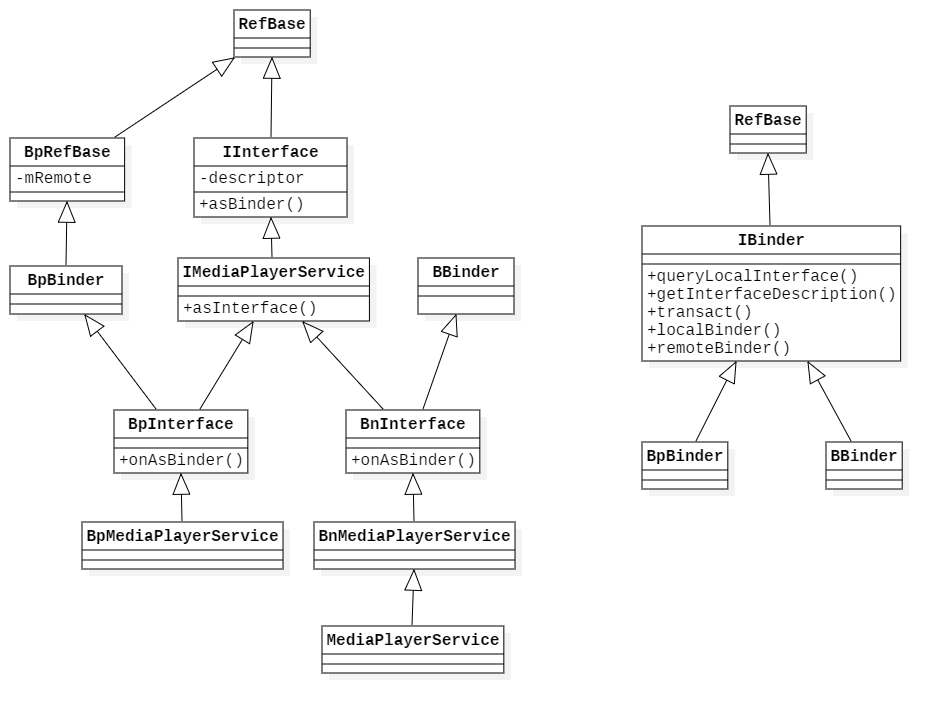
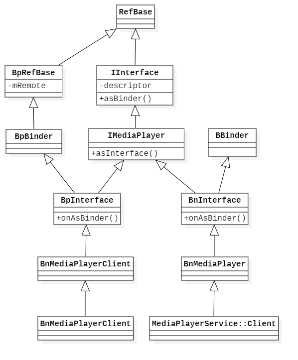
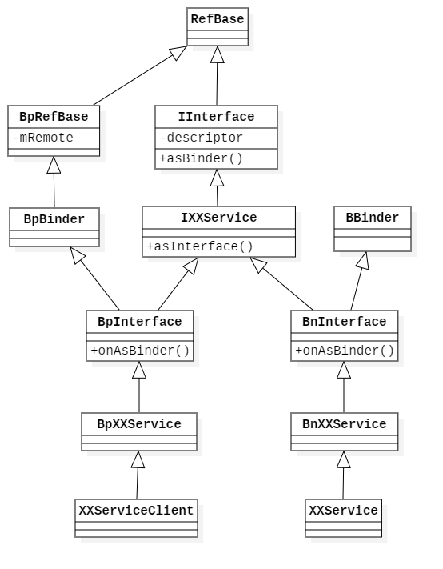

# Android Binder 的设计、实现与应用 - Native 层 Client-Server 通信分析

- [前言](#前言)
- [MediaPlayer 实现分析](#mediaplayer-实现分析)
  - [MediaPlayer-java](#mediaplayer-java)
  - [MediaPlayer-cpp](#mediaplayer-cpp)
  - [BpMediaPlayerService](#bpmediaplayerservice)
  - [IMediaPlayerService](#imediaplayerservice)
  - [MediaPlayerService](#mediaplayerservice)
  - [BnMediaPlayerService](#bnmediaplayerservice)
  - [Parcel](#parcel)
  - [BpMediaPlayerService](#bpmediaplayerservice)
  - [MediaPlayer-cpp](#mediaplayer-cpp)
  - [BnMediaPlayerClient](#bnmediaplayerclient)
  - [时序图](#时序图)
  - [UML 类图](#uml-类图)
- [Binder 的死亡通知](#binder-的死亡通知)
  - [死亡通知的定义](#死亡通知的定义)
  - [死亡通知的注册](#死亡通知的注册)
  - [死亡通知的分发](#死亡通知的分发)
- [Binder 通信框架](#binder-通信框架)
  - [数据流图](#数据流图)
  - [类图](#类图)
- [实现自定义服务](#实现自定义服务)
  - [定义服务端](#定义服务端)
  - [实现服务端](#实现服务端)
  - [注册服务端](#注册服务端)
  - [提供服务端接口](#提供服务端接口)
  - [开启服务线程](#开启服务线程)

## 前言

通过分析客户端进程与服务端进程的完整通信过程了解 Android Binder 框架结构，接着上篇文档，继续分析 native 层服务，上篇文档中通过分析 `MediaPlayerService` 服务了解了服务端 Binder 的注册过程和 ServiceManager 的注册过程，但是并没有对 Binder 的 Native 层框架有一个概要认识，对于里面出现的 BpServceManager 和 BpBinder 类型也并不知道它们具体表示什么，所以还需要分析 Client-Server 通信过程，结合前面的分析之后得出结论。

那么就从 `MediaPlayerService` 开始，既然他作为服务端 Binder 而存在，那么必定有一个客户端在同它进行通信，这里选择 Android 中常用的 `MediaPlayer` 开始分析，看起来似乎与 `MediaPlayerService` 有联系。

以下源码基于 Android 6.0.1 系统。

## MediaPlayer 实现分析

### MediaPlayer-java

MediaPalyer 是 Android 中的多媒体播放器，通过查看它的代码发现其功能都是由 native 层实现的，首先在起始代码处加载了对应的 c++ 库，调用了初始化方法。

```java
// MediaPlayer.java

static {
  System.loadLibrary("media_jni");
  native_init();
}
```

找一个常用方法看它的实现，例如 `setDataSource` 方法，发现它会调用到对应的 native 函数。

```java
// MediaPlayer.java

public void setDataSource(MediaDataSource dataSource) throws IllegalArgumentException, IllegalStateException {
  _setDataSource(dataSource);
}

private native void _setDataSource(MediaDataSource dataSource) throws IllegalArgumentException, IllegalStateException;
```

`start` 方法，也会调用到 native 函数。

```java
public void start() throws IllegalStateException {
  if (isRestricted()) {
    _setVolume(0, 0);
  }
  stayAwake(true);
  _start();
}

private native void _start() throws IllegalStateException;
```

通过阅读其他方法的实现，发现 MediaPlayer 完全是由 native 层实现的，它只是一个为应用层提供的接口。

jni 层对应的实现在 `android_media_MediaPlayer.cpp` 文件中，它会在 jni 初始化时注册一个全局的函数表，映射对应 java 层定义的 native 方法，例如 `_setDataSource` 方法，对应 c++ 中的 `android_media_MediaPlayer_setDataSourceCallback` 函数。

```c++
// android_media_MediaPlayer.cpp

static JNINativeMethod gMethods[] = {
    ...
    {"_setDataSource",      "(Landroid/media/MediaDataSource;)V",(void *)android_media_MediaPlayer_setDataSourceCallback },
    ...
```

追溯其实现：

```c++
// android_media_MediaPlayer.cpp

static void
android_media_MediaPlayer_setDataSourceCallback(JNIEnv *env, jobject thiz, jobject dataSource)
{
    sp<MediaPlayer> mp = getMediaPlayer(env, thiz);
    // 获取 native 层 MediaPlayer 的指针。
    if (mp == NULL ) {
        jniThrowException(env, "java/lang/IllegalStateException", NULL);
        return;
    }

    if (dataSource == NULL) {
        jniThrowException(env, "java/lang/IllegalArgumentException", NULL);
        return;
    }
    sp<IDataSource> callbackDataSource = new JMediaDataSource(env, dataSource);
    // 调用 mp 的 setDataSource 函数。
    process_media_player_call(env, thiz, mp->setDataSource(callbackDataSource), "java/lang/RuntimeException", "setDataSourceCallback failed." );
}
```

发现它获取了 c++ 实现的一个 `MediaPlayer` 类的对象指针，然后调用了它的 `setDataSource` 函数。

其他 jni 函数的实现都类似，最终都使了 `MediaPlayer` 这个类的对象，它实现和定义在 `mediaplayer.cpp` 和 `mediaplayer.h` 文件中，那么 java 层的 `MediaPlayer` 其实是 c++ 层 `MediaPlayer` 的一个接口层。

### MediaPlayer-cpp

首先看 `MediaPlayer` 的类定义：

```c++
// mediaplayer.cpp

class MediaPlayer : public BnMediaPlayerClient,
                    public virtual IMediaDeathNotifier
{
    ...                    
}
```

它继承了一个 `BnMediaPlayerPlayerClient`，看起来是一个服务端 Binder 类型，但是命名中却有客户端的意思，这里先不管，继续往下看。

分析的目标是搞清楚 Binder 通信规则，所以分析 `mediaplayer.cpp` 源码并不是主要目的，那么这里直接看 `setDataSource` 函数的实现，继续接着上面的 `setDataSource` 函数。

```c++
// mediaplayer.cpp

status_t MediaPlayer::setDataSource(const sp<IStreamSource> &source)
{
    ALOGV("setDataSource");
    status_t err = UNKNOWN_ERROR;
    // 创建 IMediaPlayerService 对象。
    const sp<IMediaPlayerService>& service(getMediaPlayerService());
    if (service != 0) {
        // 创建 IMediaPlayer 对象。
        sp<IMediaPlayer> player(service->create(this, mAudioSessionId));
        if ((NO_ERROR != doSetRetransmitEndpoint(player)) ||
            (NO_ERROR != player->setDataSource(source))) {
            player.clear();
        }
        err = attachNewPlayer(player);
    }
    return err;
}
```

这里首先获取了 `IMediaPlayerService` 对象，它表示 native 层的 `MediaPlayerService` 服务，然后通过它的 `create` 函数创建了一个 `IMediaPlayer` 的对象实例，它表示 native 层的 `MediaPlayer` 媒体播放器的实现。

首先看 `getMediaPlayerService()` 函数，在 `MediaPlayer` 类的父类 `IMediaDeathNotifier.cpp` 文件中：

```c++
// IMediaDeathNotifier.cpp

/*static*/const sp<IMediaPlayerService>& IMediaDeathNotifier::getMediaPlayerService()
{
    ALOGV("getMediaPlayerService");
    Mutex::Autolock _l(sServiceLock);
    if (sMediaPlayerService == 0) {
        // 获取 ServiceManager 的引用。
        sp<IServiceManager> sm = defaultServiceManager();
        sp<IBinder> binder;
        do {
            // 使用 getService 函数获得 MediaPlayerService 服务的引用。
            binder = sm->getService(String16("media.player"));
            if (binder != 0) {
                break;
            }
            ALOGW("Media player service not published, waiting...");
            // 未获取到，等待 0.5 秒后在再次获取。
            usleep(500000); // 0.5 s
        } while (true);

        if (sDeathNotifier == NULL) {
            sDeathNotifier = new DeathNotifier();
        }
        binder->linkToDeath(sDeathNotifier);
        // 注意这里又使用了 interface_cast 这个模板函数。
        sMediaPlayerService = interface_cast<IMediaPlayerService>(binder);
    }
    ALOGE_IF(sMediaPlayerService == 0, "no media player service!?");
    return sMediaPlayerService;
}
```

前面分析过 ，使用 `ServiceManager` 的 `getService` 函数将获得 `MediaPlayerService` 的 Binder 代理对象，即 `BpBinder`, 它的内部包含服务的引用号，`interface_cast` 这个模板函数将有如下作用：

```c++
interface_cast<IMediaPlayerService>(binder);
```

最终可转化为：

```c++
new BpMediaPlayerService(new BpBinder());
```

那么回到上面：

```c++
const sp<IMediaPlayerService>& service(getMediaPlayerService());
```

这里 `service` 换成 `BpMediaPlayerSevice` 的对象，继续看下一句：

```c++
sp<IMediaPlayer> player(service->create(this, mAudioSessionId));
```

追溯 `service` 的 `create` 函数，在 `BpMediaPlayerSevice` 类中，它在 `IServiceManager.cpp` 文件中。

### BpMediaPlayerService

 ```c++
// BpMediaPlayerService.cpp

class BpMediaPlayerService: public BpInterface<IMediaPlayerService>
{
public:
    BpMediaPlayerService(const sp<IBinder>& impl)
        : BpInterface<IMediaPlayerService>(impl) {}
    ...
    virtual sp<IMediaPlayer> create(
            const sp<IMediaPlayerClient>& client, int audioSessionId) {
        Parcel data, reply;
        data.writeInterfaceToken(IMediaPlayerService::getInterfaceDescriptor());
        data.writeStrongBinder(IInterface::asBinder(client));
        data.writeInt32(audioSessionId);

		// 通过 Binder 驱动向服务端发送消息。
        remote()->transact(CREATE, data, &reply);
        return interface_cast<IMediaPlayer>(reply.readStrongBinder());
    }
    ...
};
 ```

通过前面 Service Binder 的注册过程了解到，`remote()` 是 `BpBinder` 对象，然后它内部会通过对 Binder 服务端的引用号通过驱动向服务端 Binder 发送消息，这里这个 `remote()` 含有 `MediaPlayerService` 服务的引用号，前面的文档分析过最终接收者为 `BBinder` 类型，它表示服务端 Binder，这里就其实就是 `MediaPlayerService` 对象，那么最终驱动将会把消息传递给 `MediaPlayerService` 服务。

上面还传递了一个 `IMediaPlayerClient`，就是 `MediaPlayer` 自己，通过 `writeStrongBinder` 函数写入了一个 `IInterface::asBinder(client)` 的对象，查看 `asBinder` 函数的实现：

```c++
// IInterface.h

sp<IBinder> IInterface::asBinder(const sp<IInterface>& iface)
{
    if (iface == NULL) return NULL;
    return iface->onAsBinder();
}
```

```c++
// IInterface.h

template<typename INTERFACE>
IBinder* BnInterface<INTERFACE>::onAsBinder()
{
    return this;
}
```

发现只要是实现了 `BnInterface` 的类，它们的 `onAsBinder` 函数都是相同的实现，返回自己。

### IMediaPlayerService

`IMediaPlayerService` 类型负责定义客户端与服务端双方沟通的接口：

```c++
// IMediaPlayerService.h

class IMediaPlayerService: public IInterface
{
public:
    DECLARE_META_INTERFACE(MediaPlayerService);

    virtual sp<IMediaRecorder> createMediaRecorder(const String16 &opPackageName) = 0;
    virtual sp<IMediaMetadataRetriever> createMetadataRetriever() = 0;
    virtual sp<IMediaPlayer> create(const sp<IMediaPlayerClient>& client, int audioSessionId = 0)
            = 0;

    virtual sp<IOMX>            getOMX() = 0;
    virtual sp<ICrypto>         makeCrypto() = 0;
    virtual sp<IDrm>            makeDrm() = 0;
    virtual sp<IHDCP>           makeHDCP(bool createEncryptionModule) = 0;
    virtual sp<IMediaCodecList> getCodecList() const = 0;

    // Connects to a remote display.
    // 'iface' specifies the address of the local interface on which to listen for
    // a connection from the remote display as an ip address and port number
    // of the form "x.x.x.x:y".  The media server should call back into the provided remote
    // display client when display connection, disconnection or errors occur.
    // The assumption is that at most one remote display will be connected to the
    // provided interface at a time.
    virtual sp<IRemoteDisplay> listenForRemoteDisplay(const String16 &opPackageName,
            const sp<IRemoteDisplayClient>& client, const String8& iface) = 0;

    // codecs and audio devices usage tracking for the battery app
    enum BatteryDataBits {
        // tracking audio codec
        kBatteryDataTrackAudio          = 0x1,
        // tracking video codec
        kBatteryDataTrackVideo          = 0x2,
        // codec is started, otherwise codec is paused
        kBatteryDataCodecStarted        = 0x4,
        // tracking decoder (for media player),
        // otherwise tracking encoder (for media recorder)
        kBatteryDataTrackDecoder        = 0x8,
        // start to play an audio on an audio device
        kBatteryDataAudioFlingerStart   = 0x10,
        // stop/pause the audio playback
        kBatteryDataAudioFlingerStop    = 0x20,
        // audio is rounted to speaker
        kBatteryDataSpeakerOn           = 0x40,
        // audio is rounted to devices other than speaker
        kBatteryDataOtherAudioDeviceOn  = 0x80,
    };

    virtual void addBatteryData(uint32_t params) = 0;
    virtual status_t pullBatteryData(Parcel* reply) = 0;
};

```

### MediaPlayerService

下面看 `MediaPlayerService` 的类定义，在 `MediaPlayerService.h` 头文件中：

```c++
// MediaPlayerService.h

class MediaPlayerService : public BnMediaPlayerService
{
    ...
}
```

它实现了一个 `BnMediaPlayerService` 类型，`BnMediaPlayerService` 从名字上看起来和上面的 `BpMediaPlayerService` 有一个对应关系，它的定义在 `IMediaPlayerService,h` 文件中：

### BnMediaPlayerService

```c++
// IMediaPlayerService.h

class BnMediaPlayerService: public BnInterface<IMediaPlayerService>
{
public:
    virtual status_t onTransact( uint32_t code,
                                    const Parcel& data,
                                    Parcel* reply,
                                    uint32_t flags = 0);
};
```

继续看它的父类 `BnInterface<IMediaPlayerService>`，在 `IInterface.h` 中。

```c++
// IInterface.h

template<typename INTERFACE>
class BnInterface : public INTERFACE, public BBinder
{
public:
    virtual sp<IInterface>      queryLocalInterface(const String16& _descriptor);
    virtual const String16&     getInterfaceDescriptor() const;

protected:
    virtual IBinder*            onAsBinder();
};

template<typename INTERFACE>
inline sp<IInterface> BnInterface<INTERFACE>::queryLocalInterface(
        const String16& _descriptor)
{
    if (_descriptor == INTERFACE::descriptor) return this;
    return NULL;
}

template<typename INTERFACE>
inline const String16& BnInterface<INTERFACE>::getInterfaceDescriptor() const
{
    return INTERFACE::getInterfaceDescriptor();
}

template<typename INTERFACE>
IBinder* BnInterface<INTERFACE>::onAsBinder()
{
    return this;
}
```

也是一个模板类，和 `BpInterface` 类似，替换 `IMediaPlayerService` 后得到：	

```c++
class BnInterface : public IMediaPlayerService, public BBinder
{
public:
    virtual sp<IInterface>      queryLocalInterface(const String16& _descriptor);
    virtual const String16&     getInterfaceDescriptor() const;

protected:
    virtual IBinder*            onAsBinder();
};

inline sp<IInterface> BnInterface<IMediaPlayerService>::queryLocalInterface(
        const String16& _descriptor)
{
    if (_descriptor == IMediaPlayerService::descriptor) return this;
    return NULL;
}

inline const String16& BnInterface<IMediaPlayerService>::getInterfaceDescriptor() const
{
    return IMediaPlayerService::getInterfaceDescriptor();
}

IBinder* BnInterface<IMediaPlayerService>::onAsBinder()
{
    return this;
}
```

`BnMediaPlayerService` 的 `onTransact` 将会收到客户端请求的消息并处理：

```c++
// IMediaPlayerService.cpp

status_t BnMediaPlayerService::onTransact(
    uint32_t code, const Parcel& data, Parcel* reply, uint32_t flags)
{
    switch (code) {
        case CREATE: {
            CHECK_INTERFACE(IMediaPlayerService, data, reply);
            sp<IMediaPlayerClient> client =
                interface_cast<IMediaPlayerClient>(data.readStrongBinder());
            int audioSessionId = data.readInt32();
            sp<IMediaPlayer> player = create(client, audioSessionId);
            reply->writeStrongBinder(IInterface::asBinder(player));
            return NO_ERROR;
        } break;
        case CREATE_MEDIA_RECORDER: {
            CHECK_INTERFACE(IMediaPlayerService, data, reply);
            const String16 opPackageName = data.readString16();
            sp<IMediaRecorder> recorder = createMediaRecorder(opPackageName);
            reply->writeStrongBinder(IInterface::asBinder(recorder));
            return NO_ERROR;
        } break;
        ...
        default:
            return BBinder::onTransact(code, data, reply, flags);
    }
}
```

前面 `BpMediaPlayerService` 的 `create` 函数向服务端请求了 `CREATE` 编号，对应这里的 `CREATE` 编号。

这里读取了上面传递的 `IMediaPlayerClient` 对象，然后使用了 `create` 函数返回了一个 `IMediaPlayer` 的对象。

`IMediaPlayer` 同样是一个服务的进程间交互接口的定义。

```c++
// IMediaPlayer.h

class IMediaPlayer: public IInterface
{
    ...
}
```

```c++
// MediaPlayerService.cpp

sp<IMediaPlayer> MediaPlayerService::create(const sp<IMediaPlayerClient>& client,
        int audioSessionId)
{
    pid_t pid = IPCThreadState::self()->getCallingPid();
    int32_t connId = android_atomic_inc(&mNextConnId);

    sp<Client> c = new Client(
            this, pid, connId, client, audioSessionId,
            IPCThreadState::self()->getCallingUid());

    ALOGV("Create new client(%d) from pid %d, uid %d, ", connId, pid,
         IPCThreadState::self()->getCallingUid());

    wp<Client> w = c;
    {
        Mutex::Autolock lock(mLock);
        mClients.add(w);
    }
    return c;
}
```

可以看到上面创建了一个 `Client` 对象。

```c++
// MediaPlayerService.h

class Client : public BnMediaPlayer {
    // IMediaPlayer interface
    virtual void            disconnect();
    virtual status_t        setVideoSurfaceTexture(
        const sp<IGraphicBufferProducer>& bufferProducer);
    virtual status_t        prepareAsync();
    virtual status_t        start();
    virtual status_t        stop();
    virtual status_t        pause();
    virtual status_t        isPlaying(bool* state);
    ... 省略
}; // Client
```

原来这个 `Client` 也是一个服务端 Binder 对象，从命名上可以看到，它就是 `MediaPlayer` 的最终服务实现类。

回到上一级，使用 `writeStorngBinder` 向返回数据包写入了一个 `IInterface::asBinder(player)` 对象。

前面分析过，`asBinder` 将会返回 `this`，那么看 `writeStorngBinder` 做了什么，它在数据包的 `Parcel` 类型中。

### Parcel

```c++
// Parcel.cpp

status_t Parcel::writeStrongBinder(const sp<IBinder>& val)
{
    return flatten_binder(ProcessState::self(), val, this);
}
```

```c++
// Parcel.cpp

status_t flatten_binder(const sp<ProcessState>& /*proc*/,
    const sp<IBinder>& binder, Parcel* out)
{
    flat_binder_object obj;

    obj.flags = 0x7f | FLAT_BINDER_FLAG_ACCEPTS_FDS;
    if (binder != NULL) {
        IBinder *local = binder->localBinder();
        if (!local) {
            // 处理 BpBinder 类型，客户端 Binder。
            BpBinder *proxy = binder->remoteBinder();
            if (proxy == NULL) {
                ALOGE("null proxy");
            }
            const int32_t handle = proxy ? proxy->handle() : 0;
            obj.type = BINDER_TYPE_HANDLE;
            obj.binder = 0; /* Don't pass uninitialized stack data to a remote process */
            obj.handle = handle;
            obj.cookie = 0;
        } else {
            // 处理 BBinder 类型，服务端 Binder。
            obj.type = BINDER_TYPE_BINDER;
            obj.binder = reinterpret_cast<uintptr_t>(local->getWeakRefs());
            obj.cookie = reinterpret_cast<uintptr_t>(local);
        }
    } else {
        obj.type = BINDER_TYPE_BINDER;
        obj.binder = 0;
        obj.cookie = 0;
    }

    return finish_flatten_binder(binder, obj, out);
}
```

前门的 Binder 设计部分提到过，Binder 是通过 `flat_binder_object` 结构在进程间进程传输的，这里构造了一个 `flat_binder_object` 对象，上面通过 `localBinder` 判断构造不同的结构。

前面写入的是一个 `BnMediaPlayer` 对象，即 `BBinder` 类型，它的实现如下：

```c++
// Parcel.cpp

BBinder* BBinder::localBinder()
{
    return this;
}
```

那么走下面的分支，将本地 Binder 对象 `local` 的指针保存在 `obj.cookie` 里，`obj.type` 设置为 `BINDER_TYPE_BINDER`，当驱动接收到此类型，将会去除对应的 Binder 引用号，返回给客户端，返回给客户端的 `obj.type` 将被自动转化为 `BINDER_TYPE_HANDLE` 或 `BINDER_TYPE_WEAK_HANDLE`。

最后的 `finish_flat_binder` 将 `flat_binder_object` 结构保存至缓冲区：

```c++
// Parcel.cpp

inline static status_t finish_flatten_binder(
    const sp<IBinder>& /*binder*/, const flat_binder_object& flat, Parcel* out)
{
    return out->writeObject(flat, false);
}
```

那么上面使用 `readStrongBinder` 读取到的 `IMediaPlayerClient` 对象也只是一个引用号。

至此 `MediaPlayerService` 完成了它 `create` 一个 `MediaPlayerClient` 的工作，此时，一个 `Client` 对象，即 `BnMediaPlayer` 服务端 Binder 对象将通过 Binder 驱动被发送到客户端，客户端会收到服务端 Binder 的引用号，可以使用它来向服务端 Binder 发起请求。

### BpMediaPlayerService

那么这时得到了返回数据，回到最初的 `BnMediaPlayerService` 里面。

```c++
// BpMediaPlayerService.cpp

class BpMediaPlayerService: public BpInterface<IMediaPlayerService>
{
public:
    BpMediaPlayerService(const sp<IBinder>& impl)
        : BpInterface<IMediaPlayerService>(impl) {}
    ...
    virtual sp<IMediaPlayer> create(
            const sp<IMediaPlayerClient>& client, int audioSessionId) {
        Parcel data, reply;
        data.writeInterfaceToken(IMediaPlayerService::getInterfaceDescriptor());
        data.writeStrongBinder(IInterface::asBinder(client));
        data.writeInt32(audioSessionId);

		// 通过 Binder 驱动向服务端发送消息。
        remote()->transact(CREATE, data, &reply);
        return interface_cast<IMediaPlayer>(reply.readStrongBinder());
    }
    ...
};
```

最后一句依然使用到了`interface_cast`，这里 `BpMediaPlayerService` 作为与 `BnMediaPlayerService` 服务端通信的客户端，前面发送的 `BnMediaPlayer` 服务端 BInder 对象在驱动中被转化为对应的 Binder 引用号，返回到这里，即 `replay.readStringBinder()` 的返回值。

那么这里 `return` 的就是一个 `BpMediaPlayer`，是对应 `BnMediaPlayer` 服务的客户端。

回到 `MediaPlayer` 中。

### MediaPlayer-cpp

```c++
// mediaplayer.cpp

status_t MediaPlayer::setDataSource(const sp<IStreamSource> &source)
{
    ALOGV("setDataSource");
    status_t err = UNKNOWN_ERROR;
    // 创建 IMediaPlayerService 对象。
    const sp<IMediaPlayerService>& service(getMediaPlayerService());
    if (service != 0) {
        // 这里的 player 为 BpMediaPlayer。
        sp<IMediaPlayer> player(service->create(this, mAudioSessionId));
        if ((NO_ERROR != doSetRetransmitEndpoint(player)) ||
            // setDateSource 将通过 Binder 发起进程间通信，最终交给 BnMediaPlayer 服务处理。
            (NO_ERROR != player->setDataSource(source))) {
            player.clear();
        }
        err = attachNewPlayer(player);
    }
    return err;
}
```

分析到这里可以看到，java 层的 `MediaPlayer` 只是为了给应用层提供接口，它在 c 层有一个负责通信的客户端的 `BpMediaPlayer` 的实现，通过它与真正的功能实现者，即服务端的 `BnMediaPlayer` 进行进程间通信，从而实现具体功能。

### BnMediaPlayerClient

其实从前面 `MediaPlayer` 是一个 `BnMediaPlayerClient` 对象，以及 `IMediaPlayerClient` 被发送给服务端 `BnMediaPlayer` 可以看出来，`MediaPlayer` 自己也是一个服务端， 查看 `IMediaPlayerClient`：

```c++
// IMediaPlayerClient.cpp

class IMediaPlayerClient: public IInterface
{
public:
    DECLARE_META_INTERFACE(MediaPlayerClient);

    virtual void notify(int msg, int ext1, int ext2, const Parcel *obj) = 0;
};
```

里面只有一个 `notify` 函数，看来是需要主动得到服务端的通知而设计的。

所以 `MediaPlayer` 和 `BnMediaPlayer` 是双向通信的客户端和服务端模型。

### 时序图

以上调用 `setDataSource` 函数的过程用时序图表示为：


### UML 类图

以上参与进程间通信的相关类图。

- MediaPlayerService



- MediaPlayer



## Binder 的死亡通知

前面分析了 MediaPlayer 服务中 Binder 的通信过程，还有一点没有分析到，就是 Binder 的死亡通知。

在 Client-Server 通信场景中，通常会见到这种情况，当服务端由于异常情况退出时，客户端应该有权得到通知。

当一个服务端 Binder 死亡时（可能由于进程异常导致），客户端可以得到其死亡的通知，在服务端死亡时做一些善后工作，Binder 框架提供了注册服务端 Binder 的死亡通知监听的服务。

### 死亡通知的定义

在分析 `MediaPlayer-cpp` 的过程中，发现它的父类有一个是 `IMediaDeathNotifier` ，它有一个内部类 `DeathNotifier` 继承了 `IBinder::DeathRecipient`，这个 `DeathRecipient` 就表示死亡通知。

```c++
// IBinder.h

class DeathRecipient : public virtual RefBase
{
public:
    virtual void binderDied(const wp<IBinder>& who) = 0;
};
```

里面只有一个方法，就是得到 Binder 的死亡通知，在 `IMediaDeathNotifier` 的实现如下，即 `MediaPlayer-cpp` 这个 `MediaPlayerService` 客户端的处理情况。

```c++
// IMediaDeathNotifier.cpp

void IMediaDeathNotifier::DeathNotifier::binderDied(const wp<IBinder>& who __unused) {
    ALOGW("media server died");

    // Need to do this with the lock held
    SortedVector< wp<IMediaDeathNotifier> > list;
    {
        Mutex::Autolock _l(sServiceLock);
        // 清除服务端引用。
        sMediaPlayerService.clear();
        list = sObitRecipients;
    }

    // Notify application when media server dies.
    // Don't hold the static lock during callback in case app
    // makes a call that needs the lock.
    size_t count = list.size();
    
    for (size_t iter = 0; iter < count; ++iter) {
        sp<IMediaDeathNotifier> notifier = list[iter].promote();
        if (notifier != 0) {
            // 通知注册了死亡通知的用户（IMediaDeathNotifier）。
            notifier->died();
        }
    }
}
```

其中的 `list` 即 `sObitRecipients` 在 `addObitRecipient` 函数中进行了注册。

```c++
// IMediaDeathNotifier.cpp

/*static*/ void IMediaDeathNotifier::addObitRecipient(const wp<IMediaDeathNotifier>& recipient)
{
    ALOGV("addObitRecipient");
    Mutex::Autolock _l(sServiceLock);
    sObitRecipients.add(recipient);
}
```

还有对应的 remove 方法，分别存在于构造函数中和析构函数中：

```c++
// IMediaDeathNotifier.h

IMediaDeathNotifier() { addObitRecipient(this); }
virtual ~IMediaDeathNotifier() { removeObitRecipient(this); }
```

### 死亡通知的注册

在之前分析过的 `getMediaPlayerService` 函数中体现了死亡通知的注册：

```c++
// IMediaDeathNotifier.cpp

/*static*/const sp<IMediaPlayerService>&
IMediaDeathNotifier::getMediaPlayerService()
{
    ALOGV("getMediaPlayerService");
    Mutex::Autolock _l(sServiceLock);
    if (sMediaPlayerService == 0) {
        sp<IServiceManager> sm = defaultServiceManager();
        sp<IBinder> binder;
        do {
            binder = sm->getService(String16("media.player"));
            if (binder != 0) {
                break;
            }
            ALOGW("Media player service not published, waiting...");
            usleep(500000); // 0.5 s
        } while (true);

        if (sDeathNotifier == NULL) {
            sDeathNotifier = new DeathNotifier();
        }
        // 注册死亡通知（IBinder 为 BpBinder）。
        binder->linkToDeath(sDeathNotifier);
        sMediaPlayerService = interface_cast<IMediaPlayerService>(binder);
    }
    ALOGE_IF(sMediaPlayerService == 0, "no media player service!?");
    return sMediaPlayerService;
}
```

上面创建了一个 `DeathNotifiter` 的对象，并使用 `IBinder` 的 `linkToDeath` 函数进行了注册。

```c++
// BpBinder.cpp

status_t BpBinder::linkToDeath(
    const sp<DeathRecipient>& recipient, void* cookie, uint32_t flags)
{
    Obituary ob;
    ob.recipient = recipient;
    ob.cookie = cookie;
    ob.flags = flags;
    LOG_ALWAYS_FATAL_IF(recipient == NULL,
                        "linkToDeath(): recipient must be non-NULL");
    {
        AutoMutex _l(mLock);

        if (!mObitsSent) {
            if (!mObituaries) {
                mObituaries = new Vector<Obituary>;
                if (!mObituaries) {
                    return NO_MEMORY;
                }
                ALOGV("Requesting death notification: %p handle %d\n", this, mHandle);
                getWeakRefs()->incWeak(this);
                IPCThreadState* self = IPCThreadState::self();
                // 向驱动写入监听死亡通知的命令。
                self->requestDeathNotification(mHandle, this);
                // 发送命令 (talkWithDriver)。
                self->flushCommands();
            }
            // 添加到通知执行队列。
            ssize_t res = mObituaries->add(ob);
            return res >= (ssize_t)NO_ERROR ? (status_t)NO_ERROR : res;
        }
    }

    return DEAD_OBJECT;
}
```

```c++
// IPCThreadState.cpp

status_t IPCThreadState::requestDeathNotification(int32_t handle, BpBinder* proxy)
{
    // 请求驱动在 Binder 实体销毁时得到通知。
    mOut.writeInt32(BC_REQUEST_DEATH_NOTIFICATION);
    mOut.writeInt32((int32_t)handle);
    mOut.writePointer((uintptr_t)proxy);
    return NO_ERROR;
}
```

客户端在不需要关心服务端状态时，比如退出自己时，可选择主动取消对死亡通知的注册，在 `IMediaDeathNotifier` 的析构函数中包含取消注册的方法。

```c++
// IMediaDeathNotifier.cpp

IMediaDeathNotifier::DeathNotifier::~DeathNotifier()
{
    ALOGV("DeathNotifier::~DeathNotifier");
    Mutex::Autolock _l(sServiceLock);
    sObitRecipients.clear();
    if (sMediaPlayerService != 0) {
        // unlinkToDeath 内部发送 BC_CLEAR_DEATH_NOTIFICATION 命令，取消监听。
        IInterface::asBinder(sMediaPlayerService)->unlinkToDeath(this);
    }
}
```

### 死亡通知的分发

死亡通知将在客户端的代理 `BpBinder` 与驱动沟通时分发，在 `IPCThreadState.cpp` 的 `executeCommant` 函数中：

```c++
// IPCThreadState.cpp

status_t IPCThreadState::executeCommand(int32_t cmd)
{
    BBinder* obj;
    RefBase::weakref_type* refs;
    status_t result = NO_ERROR;
    
    switch ((uint32_t)cmd) {
    ...
    // 收到驱动发送的 Binder 死亡消息。
    case BR_DEAD_BINDER:
        {
            BpBinder *proxy = (BpBinder*)mIn.readPointer();
            // 分发死亡通知。 
            proxy->sendObituary();
            // 发送确认指令回执。
            mOut.writeInt32(BC_DEAD_BINDER_DONE);
            mOut.writePointer((uintptr_t)proxy);
        } break;
    // 收到确认指令的回复。
    case BR_CLEAR_DEATH_NOTIFICATION_DONE:
        {
            BpBinder *proxy = (BpBinder*)mIn.readPointer();
            proxy->getWeakRefs()->decWeak(proxy);
        } break;
     ...
    }

    if (result != NO_ERROR) {
        mLastError = result;
    }
    return result;
}
```

```c++

void BpBinder::sendObituary()
{
    ALOGV("Sending obituary for proxy %p handle %d, mObitsSent=%s\n",
        this, mHandle, mObitsSent ? "true" : "false");

    mAlive = 0;
    if (mObitsSent) return;

    mLock.lock();
    Vector<Obituary>* obits = mObituaries;
    if(obits != NULL) {
        ALOGV("Clearing sent death notification: %p handle %d\n", this, mHandle);
        IPCThreadState* self = IPCThreadState::self();
        self->clearDeathNotification(mHandle, this);
        self->flushCommands();
        mObituaries = NULL;
    }
    mObitsSent = 1;
    mLock.unlock();

    ALOGV("Reporting death of proxy %p for %zu recipients\n",
        this, obits ? obits->size() : 0U);

    if (obits != NULL) {
        const size_t N = obits->size();
        for (size_t i=0; i<N; i++) {
            reportOneDeath(obits->itemAt(i));
        }

        delete obits;
    }
}

void BpBinder::reportOneDeath(const Obituary& obit)
{
    sp<DeathRecipient> recipient = obit.recipient.promote();
    ALOGV("Reporting death to recipient: %p\n", recipient.get());
    if (recipient == NULL) return;
	// 调用 binderDied 函数发出通知。
    recipient->binderDied(this);
}
```

对于驱动何时发出 Binder 实体的死亡通知，还需要进一步分析 Binder 驱动的具体实现。

## Binder 通信框架

从上面分析 MediaPlayer 的实现，以及前面分析 Native 层服务的注册和获取过程，总结出如下 Binder 通信框架，看起来并不复杂。

### 数据流图


- BpXXService 是客户端的代理类型，负责与服务的交互，隐藏数据包的收发细节，使客户端专注于自身的客户端逻辑。
- BpBinder 表示客户端 Binder 对象，内部封装了服务端 Binder 引用号和向驱动发送数据的交互细节。
- Binder Driver 驱动实现进程间通信的核心功能（利用共享内存），管理 Binder 实体和对应的 Binder 引用。
- BBinder 表示服务端 Binder 对象，抽象了 `onTransact` 函数。
- BnXXService 使服务端的代理类型，服务处理客户端的数据包，它隐藏了数据包的收发细节，使服务端专注于自身的业务逻辑。

### 类图



# 实现自定义服务

前面分析了 Native 层 Binder 客户端与服务端的通信过程，为了加深理解，下面模拟一个使用 Binder 进行通信的 Native 服务的实现过程。

### 定义服务端

这里假设要提供一个计算两数之和服务的一个 `CalculationService` 服务，那么首先需要定义服务端和客户端的通用接口函数，首先实现 `ICalculationService` 类，然后使用 `DECLEAR_METH_INTERFACE` 宏声明服务的字符串描述函数 `getInterfaceDescriptor` 和接口获取函数 `asInterface`。

```c++
// ICalculationService.h

class ICalculationService : public IInterface
{
    DECLEAR_METH_INTERFACE(CalculationService);
	
    int add(int a, int b);
}
```

然后需要定义服务端的代理 `BnCalculationService` 类型，它负责接收客户端发送的消息并处理。

```c++
// ICalculationService.h

class BnCalculationService : public BnInterface<ICalculationService>
{
	virtual status_t onTransact(uint32_t code,
                                const Parcel& data,
                                Parcel* reply,
                                uint32_t flags = 0);
}
```

### 实现服务端

实现服务端分两部分，首先实现 `BnCalculationService` 的命令接收函数 `onTransact`。

```c++
// ICalculationService.cpp

// ICalculationService.h
enum {
    ADD = IBinder::FIRST_CALL_TRANSACTION,
}
// ICalculationService.h

status_t BnCalculationService::onTransact(uint32_t code, const Parcel &data, Parcel* replay, uint32_t flags)
{
	  switch (code) {
        case ADD: {
            CHECK_INTERFACE(ICalculationService, data, reply);
            int32_t a = data.readInt32();
            int32_t b = data.readInt32();
            int32_t result = add(a, b);
            replay.writeInt32(result);
            return NO_ERROR;
        } break;
	  default:
        return BBinder::onTransact(code, data, reply, flags);		
	  }
}
```

这里首先需要定义双方约定的通信码 `ADD`，然后实现了 `ADD` 服务，从数据包读取客户端待求和的两个数，然后通过自己的 `add` 函数求出结果，最后写入返回数据包。

下面实现具体服务端类型，首先是头文件中的定义： 

```c++
// CalculationService.h

class CalculationService : public BnCalculationService
{
    virtual int32_t add(int32_t a, int32_t b);
}
```

实现：

```c++
// CalculationService.cpp

int32_t CalculationService::add(int32_t a, int32_t b) {
    return a + b;
}
```

至此服务端工作完成，接下来需要将服务端注册到 ServiceManager，才能成为真正的服务端 Binder 进程。

### 注册服务端

一行代码实现：

```c++
void CalculationService::instantiate() {
    defaultServiceManager()->addService(
            String16("calculation"), new CalculationService());
}
```

### 提供服务端接口

接下来需要为服务端提供接口访问服务端，首先提供服务端的代理，即 `BpCalculationService`。

```c++
// ICalculationService.cpp

class BpCalculationService : public BpInterface<ICalculationService>
{
public:
    BpCalculationService(const sp<IBinder>& impl)
      : BpInterface<ICalculationService>(impl)
    {
    }

    virtual int32_t add(int32_t a, int32_t b) {
        Parcel data, reply;
        data.writeInterfacefaceToken(ICalculationService::getInterfaceDescription());
        data.writeInt32(a);
        data.writeInt32(b);
        remote()->transact(ADD, data, &reply);
        return reply.readInt32();
    }
}

IMPLEMENT_META_INTERFACE(CalculationService, "example.ICalculationService");
```

上面为调用服务端 `add` 函数实现了代理，将数据通过写入数据包发送至远程服务端，读取服务端返回数据包中的结果并返回。

最后还需要使用 `IMPLEMENT_META_INTERFACE` 宏，补充前面定义的服务端字符串描述和实现 `asInterface` 函数。 

现在客户端只要实现 `BpCalculationService` 类型，就能使用自己的 `add` 函数进行计算了，使用起来就像调用本地函数一样。

### 开启服务线程

最后开启服务线程，使服务端可以正常接收客户端信息，数据包可以得到驱动的处理。

```c++
ProcessState::self()->startThreadPool();
IPCThreadState::self()->joinThreadPool();
```