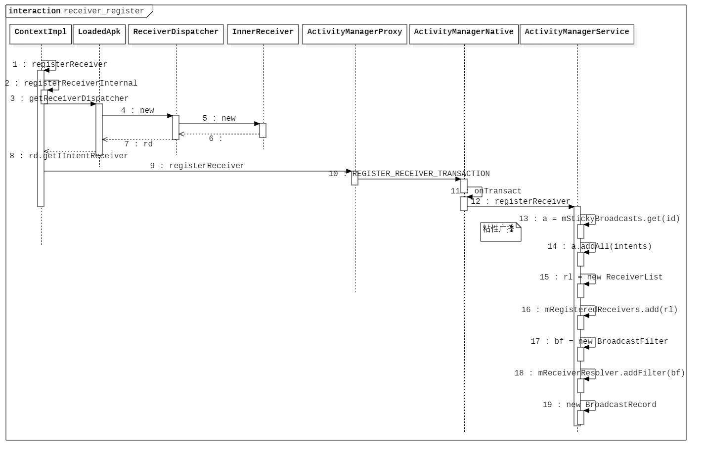
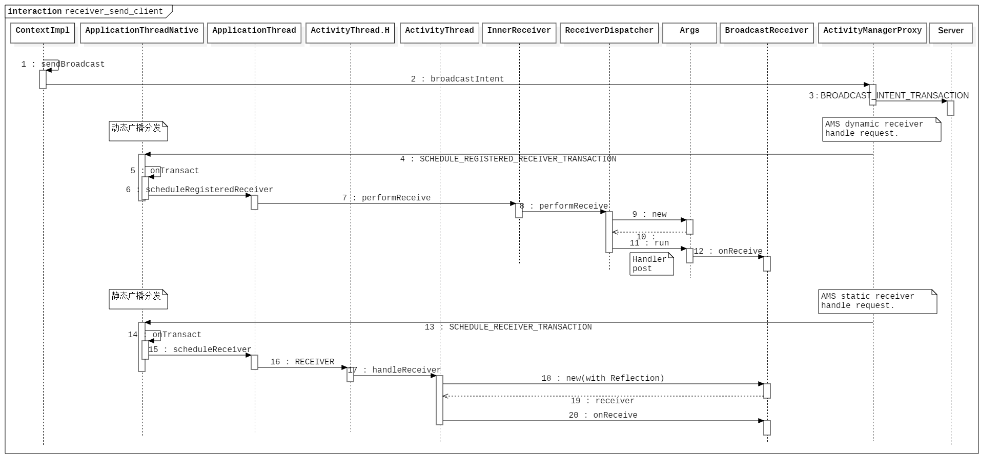
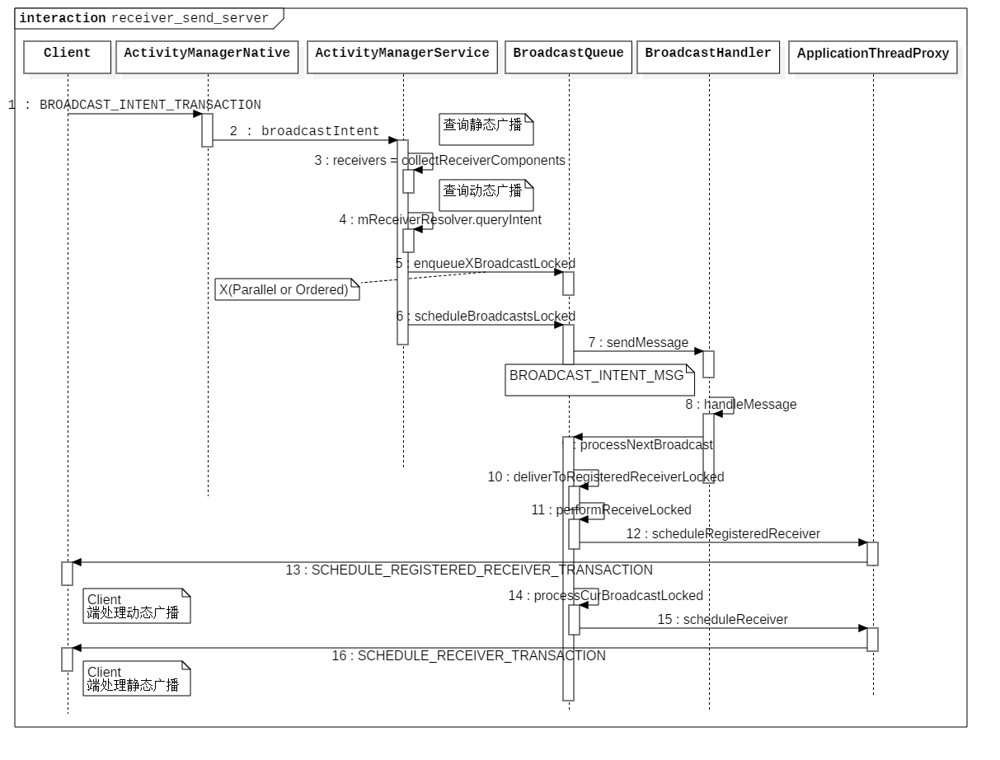

# Android Receiver 实现原理分析

- [前言](#前言)
- [广播注册方式](#广播注册方式)
  - [静态注册](#静态注册)
  - [动态注册](#动态注册)
- [注册流程分析](#注册流程分析)
  - [Client](#client)
    - [ContextImpl](#contextimpl)
    - [LoadedApk](#loadedapk)
    - [ReceiverDispatcher](#receiverdispatcher)
    - [ActivityManagerProxy](#activitymanagerproxy)
  - [Server](#server)
    - [ActivityManagerNative](#activitymanagernative)
    - [ActivityManagerService](#activitymanagerservice)
    - [IntentFilter](#intentfilter)
- [时序图](#时序图)
- [广播发送方式](#广播发送方式)
  - [无序广播](#无序广播)
  - [有序广播](#有序广播)
  - [粘性广播](#粘性广播)
- [ 发送流程分析](#-发送流程分析)
  - [Client](#client)
    - [ContextImpl](#contextimpl)
    - [ActivityManagerProxy](#activitymanagerproxy)
  - [Server](#server)
    - [ActivityManagerNative](#activitymanagernative)
    - [ActivityManagerService](#activitymanagerservice)
    - [BroadcastQueue](#broadcastqueue)
- [分发流程分析](#分发流程分析)
  - [Server](#server)
    - [BroadcastQueue](#broadcastqueue)
    - [BroadcastHandler](#broadcasthandler)
  - [动态注册广播分发](#动态注册广播分发)
    - [ApplicationThreadProxy](#applicationthreadproxy)
  - [Client](#client)
    - [ApplicationThreadNative](#applicationthreadnative)
    - [ApplicationThread](#applicationthread)
    - [InnerReceiver](#innerreceiver)
    - [ReceiverDispatcher](#receiverdispatcher)
    - [Args](#args)
  - [静态注册广播分发](#静态注册广播分发)
    - [BroadcastHandler](#broadcasthandler)
    - [ApplicationThread](#applicationthread)
    - [ActivityThread.H](#activitythread.h)
    - [ActivityThread](#activitythread)
- [时序图](#时序图)

## 前言

广播是 Android 系统的四大组件之一，是进程间通信的的一种方式，下面基于 Android 6.0.1 系统源码分析广播的实现原理，实现分为两个部分，注册和发送，首先分析广播的注册。

## 广播注册方式

### 静态注册

Receiver 可通过两种方式注册，可在清单文件中直接进行静态注册：

```java
// 实现广播接收器。

public static final class ExampleReceiver implements BroadcastReceiver {
    
    private static final String EXAMPLE_ACTION = "static.example.receiver.action"
    
    @Override
    public void onReceive(Context context, Intent intent) {
        // ...
    }
}
```

```xml
<!-- AndroidManifest.xml -->
<!-- 清单文件静态注册 -->
...

<application ...>
	<receiver android:name="com.example.ExampleReceiver">
    	<intent-filter>
        	<action android:name="static.example.receiver.action"/>
        </intent-filter>
    </receiver>
</application>
```

### 动态注册

可在代码逻辑中，使用 Context 对象动态注册广播接收器：

```java
// XXXActivity.java

@Override
public void onCreate(Bundle saveInstanceState) {
    ...
    IntentFilter filter = new IntentFilter();
    filter.addAction("static.example.receiver.action");
    registerReceiver(new ExampleReceiver(), filter);
}
```

## 注册流程分析

静态注册的广播接收者将在发送广播时由系统查询并激活，这里从动态注册的方式开始分析。

首先是 Context 的 `registerReceiver`，Context 的实现类为 `ContextImpl`：

### Client

#### ContextImpl

```java
// ContextImpl.java

@Override
public Intent registerReceiver(BroadcastReceiver receiver, IntentFilter filter) {
    return registerReceiver(receiver, filter, null, null);
}

@Override
public Intent registerReceiver(BroadcastReceiver receiver, IntentFilter filter,
        String broadcastPermission, Handler scheduler) {
    return registerReceiverInternal(receiver, getUserId(),
            filter, broadcastPermission, scheduler, getOuterContext());
}

@Override
public Intent registerReceiverAsUser(BroadcastReceiver receiver, UserHandle user,
        IntentFilter filter, String broadcastPermission, Handler scheduler) {
    return registerReceiverInternal(receiver, user.getIdentifier(),
            filter, broadcastPermission, scheduler, getOuterContext());
}

private Intent registerReceiverInternal(BroadcastReceiver receiver, int userId,
        IntentFilter filter, String broadcastPermission,
        Handler scheduler, Context context) {
    IIntentReceiver rd = null;
    if (receiver != null) {
        if (mPackageInfo != null && context != null) {
            if (scheduler == null) {
                // scheduler 为 ActivityThread 的 H 类。
                scheduler = mMainThread.getHandler();
            }
            // 获得广播分发器。
            rd = mPackageInfo.getReceiverDispatcher(
                receiver, context, scheduler,
                mMainThread.getInstrumentation(), true);
        } else {
            if (scheduler == null) {
                scheduler = mMainThread.getHandler();
            }
            rd = new LoadedApk.ReceiverDispatcher(
                    receiver, context, scheduler, null, true).getIIntentReceiver();
        }
    }
    try {
        // 请求 AMS 注册广播接收者。
        return ActivityManagerNative.getDefault().registerReceiver(
                mMainThread.getApplicationThread(), mBasePackageName,
                rd, filter, broadcastPermission, userId);
    } catch (RemoteException e) {
        return null;
    }
}
```

首先看一下 `IIntentReceiver` 是怎样获取的：

#### LoadedApk

```java
// LoadedApk.java

public IIntentReceiver getReceiverDispatcher(BroadcastReceiver r,
        Context context, Handler handler,
        Instrumentation instrumentation, boolean registered) {
    synchronized (mReceivers) {
        LoadedApk.ReceiverDispatcher rd = null;
        // 广播和分发器对象的映射。
        ArrayMap<BroadcastReceiver, LoadedApk.ReceiverDispatcher> map = null;
        if (registered) {
            // mReceivers 是以 Context 为 Key 到上面 Map 的映射。
            // 表示这个 Context 相关的广播接收器以及对应的分发对象。
            map = mReceivers.get(context);
            if (map != null) {
                rd = map.get(r);
            }
        }
        if (rd == null) {
            rd = new ReceiverDispatcher(r, context, handler,
                    instrumentation, registered);
            if (registered) {
                if (map == null) {
                    map = new ArrayMap<BroadcastReceiver, LoadedApk.ReceiverDispatcher>();
                    mReceivers.put(context, map);
                }
                map.put(r, rd);
            }
        } else {
            rd.validate(context, handler);
        }
        rd.mForgotten = false;
        return rd.getIIntentReceiver();
    }
}

```

#### ReceiverDispatcher

```java
// LoadedApk.java - class ReceiverDispatcher

static final class ReceiverDispatcher {

    final static class InnerReceiver extends IIntentReceiver.Stub {
        final WeakReference<LoadedApk.ReceiverDispatcher> mDispatcher;
        final LoadedApk.ReceiverDispatcher mStrongRef;

        InnerReceiver(LoadedApk.ReceiverDispatcher rd, boolean strong) {
            // 持有分发器的弱引用。
            mDispatcher = new WeakReference<LoadedApk.ReceiverDispatcher>(rd);
            mStrongRef = strong ? rd : null;
        }
        public void performReceive(Intent intent, int resultCode, String data,
                Bundle extras, boolean ordered, boolean sticky, int sendingUser) {
            LoadedApk.ReceiverDispatcher rd = mDispatcher.get();
            ...
            // 通知 BroadcastReceiver 的 onReceive 方法。
        }
    }

    final IIntentReceiver.Stub mIIntentReceiver;
    final BroadcastReceiver mReceiver;
    final Context mContext;
    final Handler mActivityThread;
    final Instrumentation mInstrumentation;
    final boolean mRegistered;
    final IntentReceiverLeaked mLocation;
    RuntimeException mUnregisterLocation;
    boolean mForgotten;

    ...
    
    ReceiverDispatcher(BroadcastReceiver receiver, Context context,
            Handler activityThread, Instrumentation instrumentation,
            boolean registered) {
        if (activityThread == null) {
            throw new NullPointerException("Handler must not be null");
        }

        mIIntentReceiver = new InnerReceiver(this, !registered);
        mReceiver = receiver;
        mContext = context;
        mActivityThread = activityThread;
        mInstrumentation = instrumentation;
        mRegistered = registered;
        mLocation = new IntentReceiverLeaked(null);
        mLocation.fillInStackTrace();
    }
  
    IIntentReceiver getIIntentReceiver() {
        return mIIntentReceiver;
    }
    ...
}
```

可以看到，返回了一个 `InnerReceiver` 内部类的对象，它持有广播分发器的弱引用，同时它是以个 Binder 的服务端（实现了 aidl 协议中的 Stub 端），负责在合适的时候通知最终的 BroadcastReceiver。

回到上面，获得广播分发器后，下面开始请求 ActivityManagerService 注册广播。

#### ActivityManagerProxy

```java
// ActivityManagerProxy.java

public Intent registerReceiver(IApplicationThread caller, String packageName,
        IIntentReceiver receiver,
        IntentFilter filter, String perm, int userId) throws RemoteException
{
    Parcel data = Parcel.obtain();
    Parcel reply = Parcel.obtain();
    data.writeInterfaceToken(IActivityManager.descriptor);
    data.writeStrongBinder(caller != null ? caller.asBinder() : null);
    data.writeString(packageName);
    data.writeStrongBinder(receiver != null ? receiver.asBinder() : null);
    filter.writeToParcel(data, 0);
    data.writeString(perm);
    data.writeInt(userId);
    mRemote.transact(REGISTER_RECEIVER_TRANSACTION, data, reply, 0);
    reply.readException();
    Intent intent = null;
    int haveIntent = reply.readInt();
    if (haveIntent != 0) {
        intent = Intent.CREATOR.createFromParcel(reply);
    }
    reply.recycle();
    data.recycle();
    return intent;
}
```

### Server

#### ActivityManagerNative

```java
@Override
public boolean onTransact(int code, Parcel data, Parcel reply, int flags)
        throws RemoteException {
    switch (code) {
    ...
    case REGISTER_RECEIVER_TRANSACTION:
    {
        data.enforceInterface(IActivityManager.descriptor);
        IBinder b = data.readStrongBinder();
        IApplicationThread app =
            b != null ? ApplicationThreadNative.asInterface(b) : null;
        String packageName = data.readString();
        b = data.readStrongBinder();
        IIntentReceiver rec
            = b != null ? IIntentReceiver.Stub.asInterface(b) : null;
        IntentFilter filter = IntentFilter.CREATOR.createFromParcel(data);
        String perm = data.readString();
        int userId = data.readInt();
        Intent intent = registerReceiver(app, packageName, rec, filter, perm, userId);
        reply.writeNoException();
        if (intent != null) {
            reply.writeInt(1);
            intent.writeToParcel(reply, 0);
        } else {
            reply.writeInt(0);
        }
        return true;
    }
    ...
}
```

#### ActivityManagerService

```java
// ActivityManagerService.java

public Intent registerReceiver(IApplicationThread caller, String callerPackage,
        IIntentReceiver receiver, IntentFilter filter, String permission, int userId) {
    enforceNotIsolatedCaller("registerReceiver");
    ArrayList<Intent> stickyIntents = null;
    ProcessRecord callerApp = null;
    int callingUid;
    int callingPid;
    synchronized(this) {
        if (caller != null) {
            // 获得调用者进程记录。
            callerApp = getRecordForAppLocked(caller);
            if (callerApp == null) {
                throw new SecurityException(
                        "Unable to find app for caller " + caller
                        + " (pid=" + Binder.getCallingPid()
                        + ") when registering receiver " + receiver);
            }
            if (callerApp.info.uid != Process.SYSTEM_UID &&
                    !callerApp.pkgList.containsKey(callerPackage) &&
                    !"android".equals(callerPackage)) {
                throw new SecurityException("Given caller package " + callerPackage
                        + " is not running in process " + callerApp);
            }
            callingUid = callerApp.info.uid;
            callingPid = callerApp.pid;
        } else {
            callerPackage = null;
            callingUid = Binder.getCallingUid();
            callingPid = Binder.getCallingPid();
        }

        userId = handleIncomingUser(callingPid, callingUid, userId,
                true, ALLOW_FULL_ONLY, "registerReceiver", callerPackage);

        Iterator<String> actions = filter.actionsIterator();
        if (actions == null) {
            ArrayList<String> noAction = new ArrayList<String>(1);
            noAction.add(null);
            actions = noAction.iterator();
        }

        // 收集用户发出的粘性广播。
        int[] userIds = { UserHandle.USER_ALL, UserHandle.getUserId(callingUid) };
        while (actions.hasNext()) {
            String action = actions.next();
            for (int id : userIds) {
                // mStickyBroadcasts(SpareArray) 表示用户发出的粘性广播。
                ArrayMap<String, ArrayList<Intent>> stickies = mStickyBroadcasts.get(id);
                if (stickies != null) {
                    // 筛选出其中的粘性广播 Intent。
                    ArrayList<Intent> intents = stickies.get(action);
                    if (intents != null) {
                        if (stickyIntents == null) {
                            stickyIntents = new ArrayList<Intent>();
                        }
                        // 添加所有的粘性广播。
                        stickyIntents.addAll(intents);
                    }
                }
            }
        }
    }

    ArrayList<Intent> allSticky = null;
    if (stickyIntents != null) {
        final ContentResolver resolver = mContext.getContentResolver();
        // 寻找所有匹配的粘性广播……
        for (int i = 0, N = stickyIntents.size(); i < N; i++) {
            Intent intent = stickyIntents.get(i);
            // 如果 intent 的 scheme 属性中有 "content"，则需要访问需要在 ActivityThread
            // 中锁定 mProviderMap 的 Provider，并且还可能需要等待应用程序响应，因此我们无法
            // 在此处锁定 ActivityManagerService。
            if (filter.match(resolver, intent, true, TAG) >= 0) {
                if (allSticky == null) {
                    allSticky = new ArrayList<Intent>();
                }
                allSticky.add(intent);
            }
        }
    }

    // 列表中的第一个粘性广播的 Intent 将直接返回给客户端。
    Intent sticky = allSticky != null ? allSticky.get(0) : null;
    if (DEBUG_BROADCAST) Slog.v(TAG_BROADCAST, "Register receiver " + filter + ": " + sticky);
    if (receiver == null) {
        return sticky;
    }

    synchronized (this) {
        if (callerApp != null && (callerApp.thread == null
                || callerApp.thread.asBinder() != caller.asBinder())) {
            // 原始调用者已经死亡。
            return null;
        }
        // mRegisteredReceivers 保存已注册的 Receiver，已广播分发器为 Key。
        ReceiverList rl = mRegisteredReceivers.get(receiver.asBinder());
        if (rl == null) {
            // 如果没有注册过，则创建新的接收器队列。
            rl = new ReceiverList(this, callerApp, callingPid, callingUid,
                    userId, receiver);
            if (rl.app != null) {
                // rl.app.receivers 表示进程已注册的广播，加入进程已注册广播队列。
                rl.app.receivers.add(rl);
            } else {
                try {
                    // 死亡通知。
                    receiver.asBinder().linkToDeath(rl, 0);
                } catch (RemoteException e) {
                    return sticky;
                }
                rl.linkedToDeath = true;
            }
            // 加入已注册广播接收器。
            mRegisteredReceivers.put(receiver.asBinder(), rl);
        } else if (rl.uid != callingUid) {
            throw new IllegalArgumentException(
                    "Receiver requested to register for uid " + callingUid
                    + " was previously registered for uid " + rl.uid);
        } else if (rl.pid != callingPid) {
            throw new IllegalArgumentException(
                    "Receiver requested to register for pid " + callingPid
                    + " was previously registered for pid " + rl.pid);
        } else if (rl.userId != userId) {
            throw new IllegalArgumentException(
                    "Receiver requested to register for user " + userId
                    + " was previously registered for user " + rl.userId);
        }
        BroadcastFilter bf = new BroadcastFilter(filter, rl, callerPackage,
                permission, callingUid, userId);
        // 加入广播对应的 Intent 过滤器。
        rl.add(bf);
        if (!bf.debugCheck()) {
            Slog.w(TAG, "==> For Dynamic broadcast");
        }
        // mReceiverResolver 表示广播的解析器，这里提前添加广播的过滤器。
        mReceiverResolver.addFilter(bf);

        // 将与此过滤器匹配的所有粘性广播加入队列。
        if (allSticky != null) {
            ArrayList receivers = new ArrayList();
            receivers.add(bf);

            final int stickyCount = allSticky.size();
            for (int i = 0; i < stickyCount; i++) {
                Intent intent = allSticky.get(i);
                BroadcastQueue queue = broadcastQueueForIntent(intent);
                // 创建广播记录。
                BroadcastRecord r = new BroadcastRecord(queue, intent, null,
                        null, -1, -1, null, null, AppOpsManager.OP_NONE, null, receivers,
                        null, 0, null, null, false, true, true, -1);
                queue.enqueueParallelBroadcastLocked(r);
                queue.scheduleBroadcastsLocked();
            }
        }

        return sticky;
    }
}
```

看一下上面是如何匹配粘性广播的，`filter.match(...)`

#### IntentFilter

```java
// IntentFilter.java

public final int match(ContentResolver resolver, Intent intent,
        boolean resolve, String logTag) {
    String type = resolve ? intent.resolveType(resolver) : intent.getType();
    return match(intent.getAction(), type, intent.getScheme(),
                 intent.getData(), intent.getCategories(), logTag);
}

public final int match(String action, String type, String scheme,
        Uri data, Set<String> categories, String logTag) {
    // 1. 匹配 action。
    if (action != null && !matchAction(action)) {
        if (false) Log.v(
            logTag, "No matching action " + action + " for " + this);
        return NO_MATCH_ACTION;
    }

    // 2. 匹配 type, scheme, data。
    int dataMatch = matchData(type, scheme, data);
    if (dataMatch < 0) {
        if (false) {
            if (dataMatch == NO_MATCH_TYPE) {
                Log.v(logTag, "No matching type " + type
                      + " for " + this);
            }
            if (dataMatch == NO_MATCH_DATA) {
                Log.v(logTag, "No matching scheme/path " + data
                      + " for " + this);
            }
        }
        return dataMatch;
    }

    // 3. 匹配 category。
    String categoryMismatch = matchCategories(categories);
    if (categoryMismatch != null) {
        if (false) {
            Log.v(logTag, "No matching category " + categoryMismatch + " for " + this);
        }
        return NO_MATCH_CATEGORY;
    }
    
    return dataMatch;
}
```

匹配中的 action，type，scheme，data，category 都必须相同。

这里就完成了广播的注册，上面广播相关的数据结构这里使用伪代码表示如下（`{}` 表示类成员）：

```java
LoadedApk {
  // 表示这个 Context 相关的广播接收器以及对应的分发对象。
  ArrayMap<Context, ArrayMap<BroadcastReceiver, ReceiverDispatcher>> mReceivers;
}

ActivityManagerService {
  // 表示用户发出的粘性广播。
  SparseArray<ArrayMap<String, ArrayList<Intent>>> mStickyBroadcasts;
  // 保存已注册的 Receiver。
  HashMap<IBinder, ReceiverList> mRegisteredReceivers;
}

ProcessRecord {
  // 表示这个进程注册的所有 Receiver。
  ArraySet<ReceiverList> receivers = new ArraySet<>();
}
```

广播的注册过程使用时序图表示为：

## 时序图



## 广播发送方式

### 无序广播

可并行发送，广播接收器接收到消息的顺序与发送时的顺序无关。

```java
context.sendBroadcast(new Intent("com.example.receiver.action"));
```

### 有序广播

广播接收器接收到的消息将遵循发送时的顺序。

```java
context.sendOrderedBroadcast(new Intent("com.example.receiver.action"), null);
```

### 粘性广播

广播发送后的 Intent 将被缓存起来，后续注册的接收器可持续接收（由安全性不能保证，在 API 21 已过时）。

```java
context.sendStickyBroadcast(new Intent("com.example.receiver.action"));
```

##  发送流程分析

下面开始分析广播的发送流程。

### Client

#### ContextImpl

```java
// ContextImpl.java

//  发送无序广播。
@Override
public void sendBroadcast(Intent intent) {
    warnIfCallingFromSystemProcess();
    String resolvedType = intent.resolveTypeIfNeeded(getContentResolver());
    try {
        intent.prepareToLeaveProcess();
        ActivityManagerNative.getDefault().broadcastIntent(
                mMainThread.getApplicationThread(), intent, resolvedType, null,
                Activity.RESULT_OK, null, null, null, AppOpsManager.OP_NONE, null, false, false,
                getUserId());
    } catch (RemoteException e) {
        throw new RuntimeException("Failure from system", e);
    }
}

// 发送有序广播。
@Override
public void sendOrderedBroadcast(Intent intent, String receiverPermission) {
    warnIfCallingFromSystemProcess();
    String resolvedType = intent.resolveTypeIfNeeded(getContentResolver());
    String[] receiverPermissions = receiverPermission == null ? null
            : new String[] {receiverPermission};
    try {
        intent.prepareToLeaveProcess();
        ActivityManagerNative.getDefault().broadcastIntent(
                mMainThread.getApplicationThread(), intent, resolvedType, null,
                Activity.RESULT_OK, null, null, receiverPermissions, AppOpsManager.OP_NONE,
                null, true, false, getUserId());
    } catch (RemoteException e) {
        throw new RuntimeException("Failure from system", e);
    }
}

// 发送粘性广播。
@Override
@Deprecated
public void sendStickyBroadcast(Intent intent) {
    warnIfCallingFromSystemProcess();
    String resolvedType = intent.resolveTypeIfNeeded(getContentResolver());
    try {
        intent.prepareToLeaveProcess();
        ActivityManagerNative.getDefault().broadcastIntent(
            mMainThread.getApplicationThread(), intent, resolvedType, null,
            Activity.RESULT_OK, null, null, null, AppOpsManager.OP_NONE, null, false, true,
            getUserId());
    } catch (RemoteException e) {
        throw new RuntimeException("Failure from system", e);
    }
}
```

可以看到三种广播的发送最终都是调用了 `broadcastIntent` 方法发送广播消息，广播属性由后面的两个 boolean 类型的参数决定。

#### ActivityManagerProxy

```java
// ActivityManagerNative.java - class ActivityManagerProxy

public int broadcastIntent(IApplicationThread caller,
        Intent intent, String resolvedType, IIntentReceiver resultTo,
        int resultCode, String resultData, Bundle map,
        String[] requiredPermissions, int appOp, Bundle options, boolean serialized,
        boolean sticky, int userId) throws RemoteException
{
    Parcel data = Parcel.obtain();
    Parcel reply = Parcel.obtain();
    data.writeInterfaceToken(IActivityManager.descriptor);
    data.writeStrongBinder(caller != null ? caller.asBinder() : null);
    intent.writeToParcel(data, 0);
    data.writeString(resolvedType);
    data.writeStrongBinder(resultTo != null ? resultTo.asBinder() : null);
    data.writeInt(resultCode);
    data.writeString(resultData);
    data.writeBundle(map);
    data.writeStringArray(requiredPermissions);
    data.writeInt(appOp);
    data.writeBundle(options);
    data.writeInt(serialized ? 1 : 0);
    data.writeInt(sticky ? 1 : 0);
    data.writeInt(userId);
    mRemote.transact(BROADCAST_INTENT_TRANSACTION, data, reply, 0);
    reply.readException();
    int res = reply.readInt();
    reply.recycle();
    data.recycle();
    return res;
}
```

广播类型与参数对应（`serialized` 表示连续，`sticky` 表示粘性）。

```java
无序广播 serialized = false; sticky = false;
有序广播 serialized = true;  sticky = false;
粘性广播 serialized = false; sticky = true;
```

### Server

#### ActivityManagerNative

```java
// ActivityManagerNative.java

@Override
public boolean onTransact(int code, Parcel data, Parcel reply, int flags)
        throws RemoteException {
    switch (code) {
    ....
    case BROADCAST_INTENT_TRANSACTION:
    {
        data.enforceInterface(IActivityManager.descriptor);
        IBinder b = data.readStrongBinder();
        IApplicationThread app =
            b != null ? ApplicationThreadNative.asInterface(b) : null;
        Intent intent = Intent.CREATOR.createFromParcel(data);
        String resolvedType = data.readString();
        b = data.readStrongBinder();
        IIntentReceiver resultTo =
            b != null ? IIntentReceiver.Stub.asInterface(b) : null;
        int resultCode = data.readInt();
        String resultData = data.readString();
        Bundle resultExtras = data.readBundle();
        String[] perms = data.readStringArray();
        int appOp = data.readInt();
        Bundle options = data.readBundle();
        boolean serialized = data.readInt() != 0;
        boolean sticky = data.readInt() != 0;
        int userId = data.readInt();
        int res = broadcastIntent(app, intent, resolvedType, resultTo,
                resultCode, resultData, resultExtras, perms, appOp,
                options, serialized, sticky, userId);
        reply.writeNoException();
        reply.writeInt(res);
        return true;
    }
    ...
}
```

#### ActivityManagerService

```java
// ActivityManagerService.java

private final int broadcastIntentLocked(ProcessRecord callerApp,
        String callerPackage, Intent intent, String resolvedType,
        IIntentReceiver resultTo, int resultCode, String resultData,
        Bundle resultExtras, String[] requiredPermissions, int appOp, Bundle options,
        boolean ordered, boolean sticky, int callingPid, int callingUid, int userId) {
    intent = new Intent(intent);

    // 默认情况下，广播不会发送到已停止的包。
    intent.addFlags(Intent.FLAG_EXCLUDE_STOPPED_PACKAGES);

    // 如果我们没有完成启动，不允许启动新的进程。
    if (!mProcessesReady && (intent.getFlags()&Intent.FLAG_RECEIVER_BOOT_UPGRADE) == 0) {
        intent.addFlags(Intent.FLAG_RECEIVER_REGISTERED_ONLY);
    }

    if (DEBUG_BROADCAST_LIGHT) Slog.v(TAG_BROADCAST,
            (sticky ? "Broadcast sticky: ": "Broadcast: ") + intent
            + " ordered=" + ordered + " userid=" + userId);
    if ((resultTo != null) && !ordered) {
        Slog.w(TAG, "Broadcast " + intent + " not ordered but result callback requested!");
    }

    userId = handleIncomingUser(callingPid, callingUid, userId,
            true, ALLOW_NON_FULL, "broadcast", callerPackage);

    // 确保接收广播用户此时正在运行。
    // 如果没有，我们会跳过它，除了关闭广播和升级步骤除外。

    if (userId != UserHandle.USER_ALL && !isUserRunningLocked(userId, false)) {
        if ((callingUid != Process.SYSTEM_UID
                || (intent.getFlags() & Intent.FLAG_RECEIVER_BOOT_UPGRADE) == 0)
                && !Intent.ACTION_SHUTDOWN.equals(intent.getAction())) {
            Slog.w(TAG, "Skipping broadcast of " + intent
                    + ": user " + userId + " is stopped");
            return ActivityManager.BROADCAST_FAILED_USER_STOPPED;
        }
    }

    BroadcastOptions brOptions = null;
    if (options != null) {
        brOptions = new BroadcastOptions(options);
        if (brOptions.getTemporaryAppWhitelistDuration() > 0) {
            // 查看是否允许调用者执行此操作。注意我们实际上正在检查真实的调用者
            //（不是提供操作的人， 例如 PendingIntent），要看实际上谁提供了参数。
            if (checkComponentPermission(
                    android.Manifest.permission.CHANGE_DEVICE_IDLE_TEMP_WHITELIST,
                    Binder.getCallingPid(), Binder.getCallingUid(), -1, true)
                    != PackageManager.PERMISSION_GRANTED) {
                String msg = "Permission Denial: " + intent.getAction()
                        + " broadcast from " + callerPackage + " (pid=" + callingPid
                        + ", uid=" + callingUid + ")"
                        + " requires "
                        + android.Manifest.permission.CHANGE_DEVICE_IDLE_TEMP_WHITELIST;
                Slog.w(TAG, msg);
                throw new SecurityException(msg);
            }
        }
    }

    /*
     * 阻止非系统代码（这里定义为非 persistend 的进程）发送受保护的广播。
     */
    int callingAppId = UserHandle.getAppId(callingUid);
    if (callingAppId == Process.SYSTEM_UID || callingAppId == Process.PHONE_UID
        || callingAppId == Process.SHELL_UID || callingAppId == Process.BLUETOOTH_UID
        || callingAppId == Process.NFC_UID || callingUid == 0) {
        // 始终 OK。
    } else if (callerApp == null || !callerApp.persistent) {
        try {
            if (AppGlobals.getPackageManager().isProtectedBroadcast(
                    intent.getAction())) {
                String msg = "Permission Denial: not allowed to send broadcast "
                        + intent.getAction() + " from pid="
                        + callingPid + ", uid=" + callingUid;
                Slog.w(TAG, msg);
                throw new SecurityException(msg);
            } else if (AppWidgetManager.ACTION_APPWIDGET_CONFIGURE.equals(intent.getAction())) {
                // 兼容性的特殊情况，我们不希望应用程序发送此消息，但从历史上看它
                // 没有受到保护，应用程序可能会使用它来推送自己的应用程序小部件。
                // 因此不要将其保护，而是将其限制为调用者。
                if (callerApp == null) {
                    String msg = "Permission Denial: not allowed to send broadcast "
                            + intent.getAction() + " from unknown caller.";
                    Slog.w(TAG, msg);
                    throw new SecurityException(msg);
                } else if (intent.getComponent() != null) {
                    // 它们能够被发送到确定的组件上……
                    // 验证它是否被发送到了调用的应用程序上。
                    if (!intent.getComponent().getPackageName().equals(
                            callerApp.info.packageName)) {
                        String msg = "Permission Denial: not allowed to send broadcast "
                                + intent.getAction() + " to "
                                + intent.getComponent().getPackageName() + " from "
                                + callerApp.info.packageName;
                        Slog.w(TAG, msg);
                        throw new SecurityException(msg);
                    }
                } else {
                    // 限制广播到它们自己的包。
                    intent.setPackage(callerApp.info.packageName);
                }
            }
        } catch (RemoteException e) {
            Slog.w(TAG, "Remote exception", e);
            return ActivityManager.BROADCAST_SUCCESS;
        }
    }

    final String action = intent.getAction();
    if (action != null) {
        switch (action) {
            case Intent.ACTION_UID_REMOVED:
            case Intent.ACTION_PACKAGE_REMOVED:
            case Intent.ACTION_PACKAGE_CHANGED:
            case Intent.ACTION_EXTERNAL_APPLICATIONS_UNAVAILABLE:
            case Intent.ACTION_EXTERNAL_APPLICATIONS_AVAILABLE:
                // 处理特殊意图：如果此广播来自 PackageManager 和包被删除有关，
                // 我们需要从历史 Activity 栈中删除其所有 Activity。
                if (checkComponentPermission(
                        android.Manifest.permission.BROADCAST_PACKAGE_REMOVED,
                        callingPid, callingUid, -1, true)
                        != PackageManager.PERMISSION_GRANTED) {
                    String msg = "Permission Denial: " + intent.getAction()
                            + " broadcast from " + callerPackage + " (pid=" + callingPid
                            + ", uid=" + callingUid + ")"
                            + " requires "
                            + android.Manifest.permission.BROADCAST_PACKAGE_REMOVED;
                    Slog.w(TAG, msg);
                    throw new SecurityException(msg);
                }
                switch (action) {
                    case Intent.ACTION_UID_REMOVED:
                        final Bundle intentExtras = intent.getExtras();
                        final int uid = intentExtras != null
                                ? intentExtras.getInt(Intent.EXTRA_UID) : -1;
                        if (uid >= 0) {
                            mBatteryStatsService.removeUid(uid);
                            mAppOpsService.uidRemoved(uid);
                        }
                        break;
                    case Intent.ACTION_EXTERNAL_APPLICATIONS_UNAVAILABLE:
                        // 如果资源不可用，则强制停止所有这些包并刷新属性缓存。
                        String list[] =
                                intent.getStringArrayExtra(Intent.EXTRA_CHANGED_PACKAGE_LIST);
                        if (list != null && list.length > 0) {
                            for (int i = 0; i < list.length; i++) {
                                forceStopPackageLocked(list[i], -1, false, true, true,
                                        false, false, userId, "storage unmount");
                            }
                            mRecentTasks.cleanupLocked(UserHandle.USER_ALL);
                            sendPackageBroadcastLocked(
                                    IApplicationThread.EXTERNAL_STORAGE_UNAVAILABLE, list,
                                    userId);
                        }
                        break;
                    case Intent.ACTION_EXTERNAL_APPLICATIONS_AVAILABLE:
                        mRecentTasks.cleanupLocked(UserHandle.USER_ALL);
                        break;
                    case Intent.ACTION_PACKAGE_REMOVED:
                    case Intent.ACTION_PACKAGE_CHANGED:
                        Uri data = intent.getData();
                        String ssp;
                        if (data != null && (ssp=data.getSchemeSpecificPart()) != null) {
                            boolean removed = Intent.ACTION_PACKAGE_REMOVED.equals(action);
                            boolean fullUninstall = removed &&
                                    !intent.getBooleanExtra(Intent.EXTRA_REPLACING, false);
                            final boolean killProcess =
                                    !intent.getBooleanExtra(Intent.EXTRA_DONT_KILL_APP, false);
                            if (killProcess) {
                                forceStopPackageLocked(ssp, UserHandle.getAppId(
                                        intent.getIntExtra(Intent.EXTRA_UID, -1)),
                                        false, true, true, false, fullUninstall, userId,
                                        removed ? "pkg removed" : "pkg changed");
                            }
                            if (removed) {
                                sendPackageBroadcastLocked(IApplicationThread.PACKAGE_REMOVED,
                                        new String[] {ssp}, userId);
                                if (fullUninstall) {
                                    mAppOpsService.packageRemoved(
                                            intent.getIntExtra(Intent.EXTRA_UID, -1), ssp);

                                    // 删除来自/向授予的所有权限。
                                    removeUriPermissionsForPackageLocked(ssp, userId, true);

                                    removeTasksByPackageNameLocked(ssp, userId);
                                    mBatteryStatsService.notePackageUninstalled(ssp);
                                }
                            } else {
                                cleanupDisabledPackageComponentsLocked(ssp, userId, killProcess,
                                        intent.getStringArrayExtra(
                                                Intent.EXTRA_CHANGED_COMPONENT_NAME_LIST));
                            }
                        }
                        break;
                }
                break;
            case Intent.ACTION_PACKAGE_ADDED:
                // 添加包的特殊情况：默认情况下启动兼容模式。
                Uri data = intent.getData();
                String ssp;
                if (data != null && (ssp = data.getSchemeSpecificPart()) != null) {
                    final boolean replacing =
                            intent.getBooleanExtra(Intent.EXTRA_REPLACING, false);
                    mCompatModePackages.handlePackageAddedLocked(ssp, replacing);

                    try {
                        ApplicationInfo ai = AppGlobals.getPackageManager().
                                getApplicationInfo(ssp, 0, 0);
                        mBatteryStatsService.notePackageInstalled(ssp,
                                ai != null ? ai.versionCode : 0);
                    } catch (RemoteException e) {
                    }
                }
                break;
            case Intent.ACTION_TIMEZONE_CHANGED:
                // 如果这是时区更改操作，请向队列插入一条消息，该消息将重置所有
                // 当前正在运行的进程的时区。 在广播发生之前，此消息将排队等候。
                mHandler.sendEmptyMessage(UPDATE_TIME_ZONE);
                break;
            case Intent.ACTION_TIME_CHANGED:
                // 如果用户设置了时间，请让所有正在运行的进程知道。
                final int is24Hour =
                        intent.getBooleanExtra(Intent.EXTRA_TIME_PREF_24_HOUR_FORMAT, false) ? 1: 0;
                mHandler.sendMessage(mHandler.obtainMessage(UPDATE_TIME, is24Hour, 0));
                BatteryStatsImpl stats = mBatteryStatsService.getActiveStatistics();
                synchronized (stats) {
                    stats.noteCurrentTimeChangedLocked();
                }
                break;
            case Intent.ACTION_CLEAR_DNS_CACHE:
                mHandler.sendEmptyMessage(CLEAR_DNS_CACHE_MSG);
                break;
            case Proxy.PROXY_CHANGE_ACTION:
                ProxyInfo proxy = intent.getParcelableExtra(Proxy.EXTRA_PROXY_INFO);
                mHandler.sendMessage(mHandler.obtainMessage(UPDATE_HTTP_PROXY_MSG, proxy));
                break;
        }
    }

    // 如果需要添加到粘性广播列表中。
    if (sticky) {
        if (checkPermission(android.Manifest.permission.BROADCAST_STICKY,
                callingPid, callingUid)
                != PackageManager.PERMISSION_GRANTED) {
            String msg = "Permission Denial: broadcastIntent() requesting a sticky broadcast from pid="
                    + callingPid + ", uid=" + callingUid
                    + " requires " + android.Manifest.permission.BROADCAST_STICKY;
            Slog.w(TAG, msg);
            throw new SecurityException(msg);
        }
        if (requiredPermissions != null && requiredPermissions.length > 0) {
            Slog.w(TAG, "Can't broadcast sticky intent " + intent
                    + " and enforce permissions " + Arrays.toString(requiredPermissions));
            return ActivityManager.BROADCAST_STICKY_CANT_HAVE_PERMISSION;
        }
        if (intent.getComponent() != null) {
            throw new SecurityException(
                    "Sticky broadcasts can't target a specific component");
        }
        // 我们这里直接使用 userId，因为 "all" 这个目标是作为一组独立的粘性广播维护的。
        if (userId != UserHandle.USER_ALL) {
            // 但是首先，如果这不是对所有用户的广播，那么请确保它不与现有的所有用户的广播冲突。
            ArrayMap<String, ArrayList<Intent>> stickies = mStickyBroadcasts.get(
                    UserHandle.USER_ALL);
            if (stickies != null) {
                ArrayList<Intent> list = stickies.get(intent.getAction());
                if (list != null) {
                    int N = list.size();
                    int i;
                    for (i=0; i<N; i++) {
                        if (intent.filterEquals(list.get(i))) {
                            throw new IllegalArgumentException(
                                    "Sticky broadcast " + intent + " for user "
                                    + userId + " conflicts with existing global broadcast");
                        }
                    }
                }
            }
        }
        ArrayMap<String, ArrayList<Intent>> stickies = mStickyBroadcasts.get(userId);
        if (stickies == null) {
            stickies = new ArrayMap<>();
            mStickyBroadcasts.put(userId, stickies);
        }
        ArrayList<Intent> list = stickies.get(intent.getAction());
        if (list == null) {
            list = new ArrayList<>();
            stickies.put(intent.getAction(), list);
        }
        final int stickiesCount = list.size();
        int i;
        for (i = 0; i < stickiesCount; i++) {
            if (intent.filterEquals(list.get(i))) {
                // 这个粘性广播已经存在，替换它。
                list.set(i, new Intent(intent));
                break;
            }
        }
        if (i >= stickiesCount) {
            list.add(new Intent(intent));
        }
    }

    int[] users;
    if (userId == UserHandle.USER_ALL) {
        // 调用者希望将广播发送到所有启动的用户。
        users = mStartedUserArray;
    } else {
        // 调用者希望将广播发送到指定的用户。
        users = new int[] {userId};
    }

    // 找出所有会接收这个广播的人。
    List receivers = null;
    List<BroadcastFilter> registeredReceivers = null;
    // 需要从 intent 解析出感兴趣的广播接收器……
    if ((intent.getFlags()&Intent.FLAG_RECEIVER_REGISTERED_ONLY)
             == 0) {
        // 查询出静态注册广播。
        receivers = collectReceiverComponents(intent, resolvedType, callingUid, users);
    }
    if (intent.getComponent() == null) {
        if (userId == UserHandle.USER_ALL && callingUid == Process.SHELL_UID) {
            // 一次查询一个目标用户，不包括 shell 限制用户。
            UserManagerService ums = getUserManagerLocked();
            for (int i = 0; i < users.length; i++) {
                if (ums.hasUserRestriction(
                        UserManager.DISALLOW_DEBUGGING_FEATURES, users[i])) {
                    continue;
                }
                List<BroadcastFilter> registeredReceiversForUser =
                        mReceiverResolver.queryIntent(intent,
                                resolvedType, false, users[i]);
                if (registeredReceivers == null) {
                    registeredReceivers = registeredReceiversForUser;
                } else if (registeredReceiversForUser != null) {
                    registeredReceivers.addAll(registeredReceiversForUser);
                }
            }
        } else {
            // 查询出动态注册的广播。
            registeredReceivers = mReceiverResolver.queryIntent(intent,
                    resolvedType, false, userId);
        }
    }

    final boolean replacePending =
            (intent.getFlags()&Intent.FLAG_RECEIVER_REPLACE_PENDING) != 0;

    if (DEBUG_BROADCAST) Slog.v(TAG_BROADCAST, "Enqueing broadcast: " + intent.getAction()
            + " replacePending=" + replacePending);

    int NR = registeredReceivers != null ? registeredReceivers.size() : 0;
    if (!ordered && NR > 0) {
        // 如果我们没有序列化此广播，则单独发送已注册的广播接收器，为了不让它们等待组件启动。
        final BroadcastQueue queue = broadcastQueueForIntent(intent);
        BroadcastRecord r = new BroadcastRecord(queue, intent, callerApp,
                callerPackage, callingPid, callingUid, resolvedType, requiredPermissions,
                appOp, brOptions, registeredReceivers, resultTo, resultCode, resultData,
                resultExtras, ordered, sticky, false, userId);
        if (DEBUG_BROADCAST) Slog.v(TAG_BROADCAST, "Enqueueing parallel broadcast " + r);
        final boolean replaced = replacePending && queue.replaceParallelBroadcastLocked(r);
        if (!replaced) {
            // 将广播记录加入到无序广播队列。
            queue.enqueueParallelBroadcastLocked(r);
            // 分发无序广播队列中的广播。
            queue.scheduleBroadcastsLocked();
        }
        // 处理后将动态广播列表置空。
        registeredReceivers = null;
        NR = 0;
    }

    // 合并为一个列表。
    int ir = 0;
    if (receivers != null) {
        // PACKAGE_ADDED 的一个特例：不允许包在添加时来接收到此广播。
        // 这可以防止它们将其用作后门，以便在安装后立即运行。 
        // 也许将来我们希望有一个特殊的安装广播或类似的应用程序，但我们想故意做出这个决定。
        String skipPackages[] = null;
        if (Intent.ACTION_PACKAGE_ADDED.equals(intent.getAction())
                || Intent.ACTION_PACKAGE_RESTARTED.equals(intent.getAction())
                || Intent.ACTION_PACKAGE_DATA_CLEARED.equals(intent.getAction())) {
            Uri data = intent.getData();
            if (data != null) {
                String pkgName = data.getSchemeSpecificPart();
                if (pkgName != null) {
                    skipPackages = new String[] { pkgName };
                }
            }
        } else if (Intent.ACTION_EXTERNAL_APPLICATIONS_AVAILABLE.equals(intent.getAction())) {
            skipPackages = intent.getStringArrayExtra(Intent.EXTRA_CHANGED_PACKAGE_LIST);
        }
        if (skipPackages != null && (skipPackages.length > 0)) {
            for (String skipPackage : skipPackages) {
                if (skipPackage != null) {
                    int NT = receivers.size();
                    for (int it=0; it<NT; it++) {
                        ResolveInfo curt = (ResolveInfo)receivers.get(it);
                        if (curt.activityInfo.packageName.equals(skipPackage)) {
                            receivers.remove(it);
                            it--;
                            NT--;
                        }
                    }
                }
            }
        }

        // 合并 registeredReceivers 到 receivers 中去。
        int NT = receivers != null ? receivers.size() : 0;
        int it = 0;
        ResolveInfo curt = null;
        BroadcastFilter curr = null;
        while (it < NT && ir < NR) {
            if (curt == null) {
                curt = (ResolveInfo)receivers.get(it);
            }
            if (curr == null) {
                curr = registeredReceivers.get(ir);
            }
            if (curr.getPriority() >= curt.priority) {
                // 将此广播记录插入最终列表。
                receivers.add(it, curr);
                ir++;
                curr = null;
                it++;
                NT++;
            } else {
                // 跳到最终列表中的下一个ResolveInfo。
                it++;
                curt = null;
            }
        }
    }
    while (ir < NR) {
        if (receivers == null) {
            receivers = new ArrayList();
        }
        receivers.add(registeredReceivers.get(ir));
        ir++;
    }

    if ((receivers != null && receivers.size() > 0)
            || resultTo != null) {
        BroadcastQueue queue = broadcastQueueForIntent(intent);
        BroadcastRecord r = new BroadcastRecord(queue, intent, callerApp,
                callerPackage, callingPid, callingUid, resolvedType,
                requiredPermissions, appOp, brOptions, receivers, resultTo, resultCode,
                resultData, resultExtras, ordered, sticky, false, userId);

        if (DEBUG_BROADCAST) Slog.v(TAG_BROADCAST, "Enqueueing ordered broadcast " + r
                + ": prev had " + queue.mOrderedBroadcasts.size());
        if (DEBUG_BROADCAST) Slog.i(TAG_BROADCAST,
                "Enqueueing broadcast " + r.intent.getAction());
       
        boolean replaced = replacePending && queue.replaceOrderedBroadcastLocked(r);
        if (!replaced) {
            // 将广播记录加入有序广播队列中。
            queue.enqueueOrderedBroadcastLocked(r);
            // 分发有序广播队列中的广播。
            queue.scheduleBroadcastsLocked();
        }
    }

    return ActivityManager.BROADCAST_SUCCESS;
}
```

上面主要做了如下几件事：

1. 设置 Flags（不发送给停止的包，不允许启动新进程）。
2. 检查用户状态，验证广播是否受保护。
3. 处理系统相关的广播（PACKAGE_ADD、ACTION_TIME_CHANGED）。
4. 收集粘性广播，将其存放在 `mStickyBroadcasts`。
5. 收集动态和静态广播列表，处理无序广播。
6. 合并动态广播列表 `registeredReceivers` 至 `receivers` 列表。
7. 处理有序广播。

其中有几个方法单独提取出来分析：

`collectReceiverComponents` 收集静态广播：

```java
// ActivityManagerService.java

private List<ResolveInfo> collectReceiverComponents(Intent intent, String resolvedType,
        int callingUid, int[] users) {
    List<ResolveInfo> receivers = null;
    try {
        HashSet<ComponentName> singleUserReceivers = null;
        boolean scannedFirstReceivers = false;
        for (int user : users) {
            // 跳过具有 shell 限制的用户。
            if (callingUid == Process.SHELL_UID
                    && getUserManagerLocked().hasUserRestriction(
                            UserManager.DISALLOW_DEBUGGING_FEATURES, user)) {
                continue;
            }
            List<ResolveInfo> newReceivers = AppGlobals.getPackageManager()
                    .queryIntentReceivers(intent, resolvedType, STOCK_PM_FLAGS, user);
            if (user != UserHandle.USER_OWNER && newReceivers != null) {
                // 如果这不是主用户，我们需要检查应该过滤掉的任何广播接收器。
                for (int i=0; i<newReceivers.size(); i++) {
                    ResolveInfo ri = newReceivers.get(i);
                    if ((ri.activityInfo.flags&ActivityInfo.FLAG_PRIMARY_USER_ONLY) != 0) {
                        newReceivers.remove(i);
                        i--;
                    }
                }
            }
            if (newReceivers != null && newReceivers.size() == 0) {
                newReceivers = null;
            }
            if (receivers == null) {
                receivers = newReceivers;
            } else if (newReceivers != null) {
                // 我们需要将额外的广播接收器与我们迄今为止所做的相结合。
                // 这很容易，但我们还需要对任何单用户广播接收器进行去重。
                if (!scannedFirstReceivers) {
                    // 收集我们已经检索过的任何单用户广播接收器。
                    scannedFirstReceivers = true;
                    for (int i=0; i<receivers.size(); i++) {
                        ResolveInfo ri = receivers.get(i);
                        if ((ri.activityInfo.flags&ActivityInfo.FLAG_SINGLE_USER) != 0) {
                            ComponentName cn = new ComponentName(
                                    ri.activityInfo.packageName, ri.activityInfo.name);
                            if (singleUserReceivers == null) {
                                singleUserReceivers = new HashSet<ComponentName>();
                            }
                            singleUserReceivers.add(cn);
                        }
                    }
                }
                // 添加新结果到现有结果中，跟踪和去重单用户广播接收器。
                for (int i=0; i<newReceivers.size(); i++) {
                    ResolveInfo ri = newReceivers.get(i);
                    if ((ri.activityInfo.flags&ActivityInfo.FLAG_SINGLE_USER) != 0) {
                        ComponentName cn = new ComponentName(
                                ri.activityInfo.packageName, ri.activityInfo.name);
                        if (singleUserReceivers == null) {
                            singleUserReceivers = new HashSet<ComponentName>();
                        }
                        if (!singleUserReceivers.contains(cn)) {
                            singleUserReceivers.add(cn);
                            receivers.add(ri);
                        }
                    } else {
                        receivers.add(ri);
                    }
                }
            }
        }
    } catch (RemoteException ex) {
        // pm 在同一个进程中，这永远不可能发生。
    }
    return receivers;
}
```

`BroadcastQueue queue = broadcastQueueForIntent(intent);` 获得广播队列：

```java
// ActivityManagerService.java

BroadcastQueue broadcastQueueForIntent(Intent intent) {
    // 返回前台或后台广播队列。
    final boolean isFg = (intent.getFlags() & Intent.FLAG_RECEIVER_FOREGROUND) != 0;
    if (DEBUG_BROADCAST_BACKGROUND) Slog.i(TAG_BROADCAST,
            "Broadcast intent " + intent + " on "
            + (isFg ? "foreground" : "background") + " queue");
    return (isFg) ? mFgBroadcastQueue : mBgBroadcastQueue;
}
```

`queue.enqueueParallelBroadcastLocked(r);` 加入无序广播队列。

#### BroadcastQueue

```java
// BroadcastQueue.java

public void enqueueParallelBroadcastLocked(BroadcastRecord r) {
    mParallelBroadcasts.add(r);
    r.enqueueClockTime = System.currentTimeMillis();
}
```

`queue.enqueueOrderedBroadcastLocked(r);` 加入有序广播队列。

```java
// BroadcastQueue.java

public void enqueueOrderedBroadcastLocked(BroadcastRecord r) {
    mOrderedBroadcasts.add(r);
    r.enqueueClockTime = System.currentTimeMillis();
}
```

下面分析广播的分发过程，上面不管是无需还是有序广播，都调用了 `BroadcasrQueue` 的 `scheduleBroadcastsLocked` 方法进行广播的分发。

## 分发流程分析

### Server

#### BroadcastQueue

```java
public void scheduleBroadcastsLocked() {
    if (DEBUG_BROADCAST) Slog.v(TAG_BROADCAST, "Schedule broadcasts ["
            + mQueueName + "]: current="
            + mBroadcastsScheduled);

    if (mBroadcastsScheduled) {
        return;
    }
    mHandler.sendMessage(mHandler.obtainMessage(BROADCAST_INTENT_MSG, this));
    mBroadcastsScheduled = true;
}
```

`mHandler` 是 `BroadcastHandler` 类型，它在 `BroadcastQueue` 的构造器中被创建：

```java
// BroadcastQueue.java

// handler = new MainHandler(mHandlerThread.getLooper());。
 mHandler = new BroadcastHandler(handler.getLooper());
```

#### BroadcastHandler

```java
// BroadcastQueue.java - class BroadcastHandler

@Override
public void handleMessage(Message msg) {
    switch (msg.what) {
        case BROADCAST_INTENT_MSG: {
            if (DEBUG_BROADCAST) Slog.v(
                    TAG_BROADCAST, "Received BROADCAST_INTENT_MSG");
            processNextBroadcast(true);
        } break;
    }
}
```

```java
// BroadcastQueue.java - class BroadcastHandler

final void processNextBroadcast(boolean fromMsg) {
    synchronized(mService) {
        BroadcastRecord r;

        if (DEBUG_BROADCAST) Slog.v(TAG_BROADCAST, "processNextBroadcast ["
                + mQueueName + "]: "
                + mParallelBroadcasts.size() + " broadcasts, "
                + mOrderedBroadcasts.size() + " ordered broadcasts");

        mService.updateCpuStats();

        if (fromMsg) {
            mBroadcastsScheduled = false;
        }

        // 1. 首先，立即发送所有无序广播。
        while (mParallelBroadcasts.size() > 0) {
            r = mParallelBroadcasts.remove(0);
            r.dispatchTime = SystemClock.uptimeMillis();
            r.dispatchClockTime = System.currentTimeMillis();
            final int N = r.receivers.size();
            if (DEBUG_BROADCAST_LIGHT) Slog.v(TAG_BROADCAST, "Processing parallel broadcast ["
                    + mQueueName + "] " + r);
            for (int i=0; i<N; i++) {
                Object target = r.receivers.get(i);
                if (DEBUG_BROADCAST)  Slog.v(TAG_BROADCAST,
                        "Delivering non-ordered on [" + mQueueName + "] to registered "
                        + target + ": " + r);
                // 分发广播给已注册的广播接收器。
                deliverToRegisteredReceiverLocked(r, (BroadcastFilter)target, false);
            }
            // 将广播加入历史记录。
            addBroadcastToHistoryLocked(r);
            if (DEBUG_BROADCAST_LIGHT) Slog.v(TAG_BROADCAST, "Done with parallel broadcast ["
                    + mQueueName + "] " + r);
        }

        // 2. 现在处理下一个有序广播。

        // 如果我们正在等待一个进程来处理下一个广播，那么此时什么都不做。
        // 为了以防万一，我们检查我们正在等待的过程是否仍然存在。
        if (mPendingBroadcast != null) {
            if (DEBUG_BROADCAST_LIGHT) Slog.v(TAG_BROADCAST,
                    "processNextBroadcast [" + mQueueName + "]: waiting for "
                    + mPendingBroadcast.curApp);

            boolean isDead;
            synchronized (mService.mPidsSelfLocked) {
                ProcessRecord proc = mService.mPidsSelfLocked.get(mPendingBroadcast.curApp.pid);
                isDead = proc == null || proc.crashing;
            }
            if (!isDead) {
                // 它还活着，所以保持等待。
                return;
            } else {
                Slog.w(TAG, "pending app  ["
                        + mQueueName + "]" + mPendingBroadcast.curApp
                        + " died before responding to broadcast");
                mPendingBroadcast.state = BroadcastRecord.IDLE;
                mPendingBroadcast.nextReceiver = mPendingBroadcastRecvIndex;
                mPendingBroadcast = null;
            }
        }

        boolean looped = false;
        
        do {
            if (mOrderedBroadcasts.size() == 0) {
                // 没有更多的广播在等待，所以全部完成！
                mService.scheduleAppGcsLocked();
                if (looped) {
                    // 如果我们完成了最后一次有序广播，
                    // 那么请确保所有进程都调整为正确的 oom 和 sched。
                    mService.updateOomAdjLocked();
                }
                return;
            }
            r = mOrderedBroadcasts.get(0);
            boolean forceReceive = false;

            // 确保即使出现超时检测错误，我们也会在此处捕获“挂起”广播，
            // 丢弃它们并继续进度。
            
            // 仅在系统准备就绪时才执行此操作，以便 PRE_BOOT_COMPLETED 接收器不
            // 会因超时而执行。 它们在系统升级后一次性重型启动，可能需要花费大量时间。
            int numReceivers = (r.receivers != null) ? r.receivers.size() : 0;
            if (mService.mProcessesReady && r.dispatchTime > 0) {
                long now = SystemClock.uptimeMillis();
                if ((numReceivers > 0) &&
                        (now > r.dispatchTime + (2*mTimeoutPeriod*numReceivers))) {
                    Slog.w(TAG, "Hung broadcast ["
                            + mQueueName + "] discarded after timeout failure:"
                            + " now=" + now
                            + " dispatchTime=" + r.dispatchTime
                            + " startTime=" + r.receiverTime
                            + " intent=" + r.intent
                            + " numReceivers=" + numReceivers
                            + " nextReceiver=" + r.nextReceiver
                            + " state=" + r.state);
                    broadcastTimeoutLocked(false); // 强制结束这个广播。
                    forceReceive = true;
                    r.state = BroadcastRecord.IDLE;
                }
            }

            if (r.state != BroadcastRecord.IDLE) {
                if (DEBUG_BROADCAST) Slog.d(TAG_BROADCAST,
                        "processNextBroadcast("
                        + mQueueName + ") called when not idle (state="
                        + r.state + ")");
                return;
            }

            if (r.receivers == null || r.nextReceiver >= numReceivers
                    || r.resultAbort || forceReceive) {
                // 对于这个广播没有更多的接收器了！如果请求那么发送最终结果……
                if (r.resultTo != null) {
                    try {
                        if (DEBUG_BROADCAST) Slog.i(TAG_BROADCAST,
                                "Finishing broadcast [" + mQueueName + "] "
                                + r.intent.getAction() + " app=" + r.callerApp);
                        // 安排 onReceive()。
                        performReceiveLocked(r.callerApp, r.resultTo,
                            new Intent(r.intent), r.resultCode,
                            r.resultData, r.resultExtras, false, false, r.userId);
                        // 将此值设置为 null，以便引用（本地和远程）
                        // 不保留在 mBroadcastHistory 中。
                        r.resultTo = null;
                    } catch (RemoteException e) {
                        r.resultTo = null;
                        Slog.w(TAG, "Failure ["
                                + mQueueName + "] sending broadcast result of "
                                + r.intent, e);
                    }
                }

                if (DEBUG_BROADCAST) Slog.v(TAG_BROADCAST, "Cancelling BROADCAST_TIMEOUT_MSG");
                // 取消超时的消息。
                cancelBroadcastTimeoutLocked();

                if (DEBUG_BROADCAST_LIGHT) Slog.v(TAG_BROADCAST,
                        "Finished with ordered broadcast " + r);

                // ... 然后是下一个有序广播……
                addBroadcastToHistoryLocked(r);
                mOrderedBroadcasts.remove(0);
                r = null;
                looped = true;
                continue;
            }
        } while (r == null);

        // 获取下一个广播接收器……
        int recIdx = r.nextReceiver++;

        // 跟踪此广播接收器何时启动，并确保在需要时有待处理的超时消息。
        r.receiverTime = SystemClock.uptimeMillis();
        if (recIdx == 0) {
            r.dispatchTime = r.receiverTime;
            r.dispatchClockTime = System.currentTimeMillis();
            if (DEBUG_BROADCAST_LIGHT) Slog.v(TAG_BROADCAST, "Processing ordered broadcast ["
                    + mQueueName + "] " + r);
        }
        if (! mPendingBroadcastTimeoutMessage) {
            long timeoutTime = r.receiverTime + mTimeoutPeriod;
            if (DEBUG_BROADCAST) Slog.v(TAG_BROADCAST,
                    "Submitting BROADCAST_TIMEOUT_MSG ["
                    + mQueueName + "] for " + r + " at " + timeoutTime);
            // 发送广播超时消息。
            setBroadcastTimeoutLocked(timeoutTime);
        }

        final BroadcastOptions brOptions = r.options;
        final Object nextReceiver = r.receivers.get(recIdx);

        if (nextReceiver instanceof BroadcastFilter) {
            // 简单示例：这是一个直接调用的已注册的广播接收器。
            BroadcastFilter filter = (BroadcastFilter)nextReceiver;
            if (DEBUG_BROADCAST)  Slog.v(TAG_BROADCAST,
                    "Delivering ordered ["
                    + mQueueName + "] to registered "
                    + filter + ": " + r);
            deliverToRegisteredReceiverLocked(r, filter, r.ordered);
            if (r.receiver == null || !r.ordered) {
                // 这个广播接收器已经完成，因此安排处理下一个广播接收器。
                if (DEBUG_BROADCAST) Slog.v(TAG_BROADCAST, "Quick finishing ["
                        + mQueueName + "]: ordered="
                        + r.ordered + " receiver=" + r.receiver);
                r.state = BroadcastRecord.IDLE;
                scheduleBroadcastsLocked();
            } else {
                if (brOptions != null && brOptions.getTemporaryAppWhitelistDuration() > 0) {
                    scheduleTempWhitelistLocked(filter.owningUid,
                            brOptions.getTemporaryAppWhitelistDuration(), r);
                }
            }
            return;
        }

        // 硬示例：需要实例化接收器，可能启动它的应用进程来支持它。

        ResolveInfo info = (ResolveInfo)nextReceiver;
        ComponentName component = new ComponentName(
                info.activityInfo.applicationInfo.packageName,
                info.activityInfo.name);

        boolean skip = false;
        // 权限检查。
        int perm = mService.checkComponentPermission(info.activityInfo.permission,
                r.callingPid, r.callingUid, info.activityInfo.applicationInfo.uid,
                info.activityInfo.exported);
        if (perm != PackageManager.PERMISSION_GRANTED) {
            if (!info.activityInfo.exported) {
                Slog.w(TAG, "Permission Denial: broadcasting "
                        + r.intent.toString()
                        + " from " + r.callerPackage + " (pid=" + r.callingPid
                        + ", uid=" + r.callingUid + ")"
                        + " is not exported from uid " + info.activityInfo.applicationInfo.uid
                        + " due to receiver " + component.flattenToShortString());
            } else {
                Slog.w(TAG, "Permission Denial: broadcasting "
                        + r.intent.toString()
                        + " from " + r.callerPackage + " (pid=" + r.callingPid
                        + ", uid=" + r.callingUid + ")"
                        + " requires " + info.activityInfo.permission
                        + " due to receiver " + component.flattenToShortString());
            }
            skip = true;
        } else if (info.activityInfo.permission != null) {
            final int opCode = AppOpsManager.permissionToOpCode(info.activityInfo.permission);
            if (opCode != AppOpsManager.OP_NONE
                    && mService.mAppOpsService.noteOperation(opCode, r.callingUid,
                            r.callerPackage) != AppOpsManager.MODE_ALLOWED) {
                Slog.w(TAG, "Appop Denial: broadcasting "
                        + r.intent.toString()
                        + " from " + r.callerPackage + " (pid="
                        + r.callingPid + ", uid=" + r.callingUid + ")"
                        + " requires appop " + AppOpsManager.permissionToOp(
                                info.activityInfo.permission)
                        + " due to registered receiver "
                        + component.flattenToShortString());
                skip = true;
            }
        }
        if (!skip && info.activityInfo.applicationInfo.uid != Process.SYSTEM_UID &&
            r.requiredPermissions != null && r.requiredPermissions.length > 0) {
            for (int i = 0; i < r.requiredPermissions.length; i++) {
                String requiredPermission = r.requiredPermissions[i];
                try {
                    perm = AppGlobals.getPackageManager().
                            checkPermission(requiredPermission,
                                    info.activityInfo.applicationInfo.packageName,
                                    UserHandle
                                            .getUserId(info.activityInfo.applicationInfo.uid));
                } catch (RemoteException e) {
                    perm = PackageManager.PERMISSION_DENIED;
                }
                if (perm != PackageManager.PERMISSION_GRANTED) {
                    Slog.w(TAG, "Permission Denial: receiving "
                            + r.intent + " to "
                            + component.flattenToShortString()
                            + " requires " + requiredPermission
                            + " due to sender " + r.callerPackage
                            + " (uid " + r.callingUid + ")");
                    skip = true;
                    break;
                }
                int appOp = AppOpsManager.permissionToOpCode(requiredPermission);
                if (appOp != AppOpsManager.OP_NONE && appOp != r.appOp
                        && mService.mAppOpsService.noteOperation(appOp,
                        info.activityInfo.applicationInfo.uid, info.activityInfo.packageName)
                        != AppOpsManager.MODE_ALLOWED) {
                    Slog.w(TAG, "Appop Denial: receiving "
                            + r.intent + " to "
                            + component.flattenToShortString()
                            + " requires appop " + AppOpsManager.permissionToOp(
                            requiredPermission)
                            + " due to sender " + r.callerPackage
                            + " (uid " + r.callingUid + ")");
                    skip = true;
                    break;
                }
            }
        }
        if (!skip && r.appOp != AppOpsManager.OP_NONE
                && mService.mAppOpsService.noteOperation(r.appOp,
                info.activityInfo.applicationInfo.uid, info.activityInfo.packageName)
                != AppOpsManager.MODE_ALLOWED) {
            Slog.w(TAG, "Appop Denial: receiving "
                    + r.intent + " to "
                    + component.flattenToShortString()
                    + " requires appop " + AppOpsManager.opToName(r.appOp)
                    + " due to sender " + r.callerPackage
                    + " (uid " + r.callingUid + ")");
            skip = true;
        }
        if (!skip) {
            skip = !mService.mIntentFirewall.checkBroadcast(r.intent, r.callingUid,
                    r.callingPid, r.resolvedType, info.activityInfo.applicationInfo.uid);
        }
        boolean isSingleton = false;
        try {
            isSingleton = mService.isSingleton(info.activityInfo.processName,
                    info.activityInfo.applicationInfo,
                    info.activityInfo.name, info.activityInfo.flags);
        } catch (SecurityException e) {
            Slog.w(TAG, e.getMessage());
            skip = true;
        }
        if ((info.activityInfo.flags&ActivityInfo.FLAG_SINGLE_USER) != 0) {
            if (ActivityManager.checkUidPermission(
                    android.Manifest.permission.INTERACT_ACROSS_USERS,
                    info.activityInfo.applicationInfo.uid)
                            != PackageManager.PERMISSION_GRANTED) {
                Slog.w(TAG, "Permission Denial: Receiver " + component.flattenToShortString()
                        + " requests FLAG_SINGLE_USER, but app does not hold "
                        + android.Manifest.permission.INTERACT_ACROSS_USERS);
                skip = true;
            }
        }
        if (r.curApp != null && r.curApp.crashing) {
            // 如果目标进程 cash 了，那么跳过它。
            Slog.w(TAG, "Skipping deliver ordered [" + mQueueName + "] " + r
                    + " to " + r.curApp + ": process crashing");
            skip = true;
        }
        if (!skip) {
            boolean isAvailable = false;
            try {
                isAvailable = AppGlobals.getPackageManager().isPackageAvailable(
                        info.activityInfo.packageName,
                        UserHandle.getUserId(info.activityInfo.applicationInfo.uid));
            } catch (Exception e) {
                // 所有这些失败表示我们要跳过这个接收器。
                Slog.w(TAG, "Exception getting recipient info for "
                        + info.activityInfo.packageName, e);
            }
            if (!isAvailable) {
                if (DEBUG_BROADCAST) Slog.v(TAG_BROADCAST,
                        "Skipping delivery to " + info.activityInfo.packageName + " / "
                        + info.activityInfo.applicationInfo.uid
                        + " : package no longer available");
                skip = true;
            }
        }

        if (skip) {
            if (DEBUG_BROADCAST)  Slog.v(TAG_BROADCAST,
                    "Skipping delivery of ordered [" + mQueueName + "] "
                    + r + " for whatever reason");
            r.receiver = null;
            r.curFilter = null;
            r.state = BroadcastRecord.IDLE;
            scheduleBroadcastsLocked();
            return;
        }

        r.state = BroadcastRecord.APP_RECEIVE;
        String targetProcess = info.activityInfo.processName;
        r.curComponent = component;
        final int receiverUid = info.activityInfo.applicationInfo.uid;
        // 如果它是单例的，那么需要是相同的应用或指定的应用。
        if (r.callingUid != Process.SYSTEM_UID && isSingleton
                && mService.isValidSingletonCall(r.callingUid, receiverUid)) {
            info.activityInfo = mService.getActivityInfoForUser(info.activityInfo, 0);
        }
        r.curReceiver = info.activityInfo;
        if (DEBUG_MU && r.callingUid > UserHandle.PER_USER_RANGE) {
            Slog.v(TAG_MU, "Updated broadcast record activity info for secondary user, "
                    + info.activityInfo + ", callingUid = " + r.callingUid + ", uid = "
                    + info.activityInfo.applicationInfo.uid);
        }

        if (brOptions != null && brOptions.getTemporaryAppWhitelistDuration() > 0) {
            scheduleTempWhitelistLocked(receiverUid,
                    brOptions.getTemporaryAppWhitelistDuration(), r);
        }

        // 广播正在执行，其包不能被停止。
        try {
            AppGlobals.getPackageManager().setPackageStoppedState(
                    r.curComponent.getPackageName(), false, UserHandle.getUserId(r.callingUid));
        } catch (RemoteException e) {
        } catch (IllegalArgumentException e) {
            Slog.w(TAG, "Failed trying to unstop package "
                    + r.curComponent.getPackageName() + ": " + e);
        }

        // 这个广播接收器的应用进程是否已经运行？
        ProcessRecord app = mService.getProcessRecordLocked(targetProcess,
                info.activityInfo.applicationInfo.uid, false);
        if (app != null && app.thread != null) {
            try {
                app.addPackage(info.activityInfo.packageName,
                        info.activityInfo.applicationInfo.versionCode, mService.mProcessStats);
                processCurBroadcastLocked(r, app);
                return;
            } catch (RemoteException e) {
                Slog.w(TAG, "Exception when sending broadcast to "
                      + r.curComponent, e);
            } catch (RuntimeException e) {
                Slog.wtf(TAG, "Failed sending broadcast to "
                        + r.curComponent + " with " + r.intent, e);
                // 如果发生了一些意外异常，请跳过此广播。
                // 此时我们不是来自客户端的调用，那么从此处抛出异常将导致
                // 整个系统崩溃而不是发送广播的任何人。
                logBroadcastReceiverDiscardLocked(r);
                finishReceiverLocked(r, r.resultCode, r.resultData,
                        r.resultExtras, r.resultAbort, false);
                scheduleBroadcastsLocked();
                // 如果我们启动广播接收器失败，那么我们需要重置状态。
                r.state = BroadcastRecord.IDLE;
                return;
            }

            // 如果抛出了 DeadObjectException - 请重新启动应用程序。
        }

        // 没有运行 - 那么启动它，在应用程序启动时执行。
        if (DEBUG_BROADCAST)  Slog.v(TAG_BROADCAST,
                "Need to start app ["
                + mQueueName + "] " + targetProcess + " for broadcast " + r);
        if ((r.curApp=mService.startProcessLocked(targetProcess,
                info.activityInfo.applicationInfo, true,
                r.intent.getFlags() | Intent.FLAG_FROM_BACKGROUND,
                "broadcast", r.curComponent,
                (r.intent.getFlags()&Intent.FLAG_RECEIVER_BOOT_UPGRADE) != 0, false, false))
                        == null) {
            // 哎呀，这个接收器不可用。 如果有必要，请完成它，并将下一个广播记录标记为准备就绪。
            Slog.w(TAG, "Unable to launch app "
                    + info.activityInfo.applicationInfo.packageName + "/"
                    + info.activityInfo.applicationInfo.uid + " for broadcast "
                    + r.intent + ": process is bad");
            logBroadcastReceiverDiscardLocked(r);
            finishReceiverLocked(r, r.resultCode, r.resultData,
                    r.resultExtras, r.resultAbort, false);
            scheduleBroadcastsLocked();
            r.state = BroadcastRecord.IDLE;
            return;
        }

        mPendingBroadcast = r;
        mPendingBroadcastRecvIndex = recIdx;
    }
}
```

上面的代码做了如下四件事：


1. 循环处理无序广播，使用 `deliverToRegisteredReceiverLocked` 方法进行分发。
2. 循环处理有序广播，使用 `performReceiveLocked` 方法进行分发。
3. 获得下一条有序广播，如果动态注册，则使用 `deliverToRegisteredReceiverLocked` 处理后返回。
4. 检查相关权限，处理下一条有序广播，如果接收器所在进程没有启动，则启动，然后使用 `processCurBroadcastLocked` 处理这条静态广播 。

### 动态注册广播分发

首先看 `deliverToRegisteredReceiverLocked` 方法的处理，它负责处理动态注册的广播接收器：

```java
// BroadcastQueue.java - class BroadcastHandler

private void deliverToRegisteredReceiverLocked(BroadcastRecord r,
        BroadcastFilter filter, boolean ordered) {
    boolean skip = false;
    // 检查相关权限，同上。
    ...

    if (!mService.mIntentFirewall.checkBroadcast(r.intent, r.callingUid,
            r.callingPid, r.resolvedType, filter.receiverList.uid)) {
        return;
    }

    if (filter.receiverList.app == null || filter.receiverList.app.crashing) {
        Slog.w(TAG, "Skipping deliver [" + mQueueName + "] " + r
                + " to " + filter.receiverList + ": process crashing");
        skip = true;
    }

    if (!skip) {
        // 如果这不是作为有序广播发送的，那么
        // 我们不希望接触跟踪有序广播当前状态的字段。
        if (ordered) {
            r.receiver = filter.receiverList.receiver.asBinder();
            r.curFilter = filter;
            filter.receiverList.curBroadcast = r;
            r.state = BroadcastRecord.CALL_IN_RECEIVE;
            if (filter.receiverList.app != null) {
                r.curApp = filter.receiverList.app;
                filter.receiverList.app.curReceiver = r;
                mService.updateOomAdjLocked(r.curApp);
            }
        }
        try {
            if (DEBUG_BROADCAST_LIGHT) Slog.i(TAG_BROADCAST,
                    "Delivering to " + filter + " : " + r);
            // 下一步。
            performReceiveLocked(filter.receiverList.app, filter.receiverList.receiver,
                    new Intent(r.intent), r.resultCode, r.resultData,
                    r.resultExtras, r.ordered, r.initialSticky, r.userId);
            if (ordered) {
                r.state = BroadcastRecord.CALL_DONE_RECEIVE;
            }
        } catch (RemoteException e) {
            Slog.w(TAG, "Failure sending broadcast " + r.intent, e);
            if (ordered) {
                r.receiver = null;
                r.curFilter = null;
                filter.receiverList.curBroadcast = null;
                if (filter.receiverList.app != null) {
                    filter.receiverList.app.curReceiver = null;
                }
            }
        }
    }
}
```

在检查权限后进入 `performReceiveLocked` 方法。

```java
// BroadcastHandler.java

private static void performReceiveLocked(ProcessRecord app, IIntentReceiver receiver,
        Intent intent, int resultCode, String data, Bundle extras,
        boolean ordered, boolean sticky, int sendingUser) throws RemoteException {
    // 使用 one-way 的 binder 异步模式将 Intent 发送给广播接收器。
    if (app != null) {
        if (app.thread != null) {
            // 如果我们有一个 ApplicationThread，请通过它进行调用，
            // 以便正确地与其他 one-way 模式的异步调用一起调用。
            app.thread.scheduleRegisteredReceiver(receiver, intent, resultCode,
                    data, extras, ordered, sticky, sendingUser, app.repProcState);
        } else {
            // 应用程序死亡了，广播接收器不存在。
            throw new RemoteException("app.thread must not be null");
        }
    } else {
        receiver.performReceive(intent, resultCode, data, extras, ordered,
                sticky, sendingUser);
    }
}
```

接下来就是使用 `app.thread.scheduleRegisteredReceiver` 向应用端进程发送消息了。

#### ApplicationThreadProxy

```java
// ApplicationThreadNative.java - class ApplicationThreadProxy

public void scheduleRegisteredReceiver(IIntentReceiver receiver, Intent intent,
        int resultCode, String dataStr, Bundle extras, boolean ordered,
        boolean sticky, int sendingUser, int processState) throws RemoteException {
    Parcel data = Parcel.obtain();
    data.writeInterfaceToken(IApplicationThread.descriptor);
    data.writeStrongBinder(receiver.asBinder());
    intent.writeToParcel(data, 0);
    data.writeInt(resultCode);
    data.writeString(dataStr);
    data.writeBundle(extras);
    data.writeInt(ordered ? 1 : 0);
    data.writeInt(sticky ? 1 : 0);
    data.writeInt(sendingUser);
    data.writeInt(processState);
    mRemote.transact(SCHEDULE_REGISTERED_RECEIVER_TRANSACTION, data, null,
            IBinder.FLAG_ONEWAY);
    data.recycle();
}
```

### Client

#### ApplicationThreadNative

```java
// ApplicationThreadNative.java

@Override
public boolean onTransact(int code, Parcel data, Parcel reply, int flags)
        throws RemoteException {
    switch (code) {
    ...
    case SCHEDULE_REGISTERED_RECEIVER_TRANSACTION: {
        data.enforceInterface(IApplicationThread.descriptor);
        IIntentReceiver receiver = IIntentReceiver.Stub.asInterface(
                data.readStrongBinder());
        Intent intent = Intent.CREATOR.createFromParcel(data);
        int resultCode = data.readInt();
        String dataStr = data.readString();
        Bundle extras = data.readBundle();
        boolean ordered = data.readInt() != 0;
        boolean sticky = data.readInt() != 0;
        int sendingUser = data.readInt();
        int processState = data.readInt();
        scheduleRegisteredReceiver(receiver, intent,
                resultCode, dataStr, extras, ordered, sticky, sendingUser, processState);
        return true;
    }
    ...
}
```

#### ApplicationThread

```java
// ActivityThread.java

public void scheduleRegisteredReceiver(IIntentReceiver receiver, Intent intent,
        int resultCode, String dataStr, Bundle extras, boolean ordered,
        boolean sticky, int sendingUser, int processState) throws RemoteException {
    updateProcessState(processState, false);
    receiver.performReceive(intent, resultCode, dataStr, extras, ordered,
            sticky, sendingUser);
}
```

这里就会通过 `receiver` 即前面广播分发器 `InnerReceiver` 的 Binder 客户端，向 `InnerReceiver` 发起 IPC 通信回调 Intent 信息，辗转调用到 `InnerReceiver` 的 `performReceive` 方法。

#### InnerReceiver

```java
// LoadedApk.java - class ReceiverDispatcher&InnerReceiver

public void performReceive(Intent intent, int resultCode, String data,
        Bundle extras, boolean ordered, boolean sticky, int sendingUser) {
    LoadedApk.ReceiverDispatcher rd = mDispatcher.get();
    if (ActivityThread.DEBUG_BROADCAST) {
        int seq = intent.getIntExtra("seq", -1);
        Slog.i(ActivityThread.TAG, "Receiving broadcast " + intent.getAction() + " seq=" + seq
                + " to " + (rd != null ? rd.mReceiver : null));
    }
    if (rd != null) {
        // 下一步，ReceiverDispatcher。
        rd.performReceive(intent, resultCode, data, extras,
                ordered, sticky, sendingUser);
    } else {
        // 在此过程中，ActivityManager 将广播发送给已注册的接收器，
        // 但在发送之前，接收器未注册。
        // 表示其确认广播，以便系统的广播队列可以继续。
        if (ActivityThread.DEBUG_BROADCAST) Slog.i(ActivityThread.TAG,
                "Finishing broadcast to unregistered receiver");
        IActivityManager mgr = ActivityManagerNative.getDefault();
        try {
            if (extras != null) {
                extras.setAllowFds(false);
            }
            mgr.finishReceiver(this, resultCode, data, extras, false, intent.getFlags());
        } catch (RemoteException e) {
            Slog.w(ActivityThread.TAG, "Couldn't finish broadcast to unregistered receiver");
        }
    }
}
```

`InnerReceiver` 通过弱引用调用到了外部类 `ReceiverDispatcher` 的 `performReceive` 方法。

#### ReceiverDispatcher

```java
// LoadedApk.java - class ReceiverDispatcher

public void performReceive(Intent intent, int resultCode, String data,
        Bundle extras, boolean ordered, boolean sticky, int sendingUser) {
    if (ActivityThread.DEBUG_BROADCAST) {
        int seq = intent.getIntExtra("seq", -1);
        Slog.i(ActivityThread.TAG, "Enqueueing broadcast " + intent.getAction() + " seq=" + seq
                + " to " + mReceiver);
    }
    // 创建 Args 对象。
    Args args = new Args(intent, resultCode, data, extras, ordered,
            sticky, sendingUser);
    // 使用 Handler 执行 Args。
    if (!mActivityThread.post(args)) {
        if (mRegistered && ordered) {
            IActivityManager mgr = ActivityManagerNative.getDefault();
            if (ActivityThread.DEBUG_BROADCAST) Slog.i(ActivityThread.TAG,
                    "Finishing sync broadcast to " + mReceiver);
            args.sendFinished(mgr);
        }
    }
}
```

#### Args

```java
// LoadedApk.java - class Args

final class Args extends BroadcastReceiver.PendingResult implements Runnable {
    private Intent mCurIntent;
    private final boolean mOrdered;

    public Args(Intent intent, int resultCode, String resultData, Bundle resultExtras,
            boolean ordered, boolean sticky, int sendingUser) {
        super(resultCode, resultData, resultExtras,
                mRegistered ? TYPE_REGISTERED : TYPE_UNREGISTERED, ordered,
                sticky, mIIntentReceiver.asBinder(), sendingUser, intent.getFlags());
        mCurIntent = intent;
        mOrdered = ordered;
    }
    
    public void run() {
        final BroadcastReceiver receiver = mReceiver;
        final boolean ordered = mOrdered;
        
        if (ActivityThread.DEBUG_BROADCAST) {
            int seq = mCurIntent.getIntExtra("seq", -1);
            Slog.i(ActivityThread.TAG, "Dispatching broadcast " + mCurIntent.getAction()
                    + " seq=" + seq + " to " + mReceiver);
            Slog.i(ActivityThread.TAG, "  mRegistered=" + mRegistered
                    + " mOrderedHint=" + ordered);
        }
        
        final IActivityManager mgr = ActivityManagerNative.getDefault();
        final Intent intent = mCurIntent;
        mCurIntent = null;
        
        if (receiver == null || mForgotten) {
            if (mRegistered && ordered) {
                if (ActivityThread.DEBUG_BROADCAST) Slog.i(ActivityThread.TAG,
                        "Finishing null broadcast to " + mReceiver);
                sendFinished(mgr);
            }
            return;
        }

        Trace.traceBegin(Trace.TRACE_TAG_ACTIVITY_MANAGER, "broadcastReceiveReg");
        try {
            ClassLoader cl =  mReceiver.getClass().getClassLoader();
            intent.setExtrasClassLoader(cl);
            setExtrasClassLoader(cl);
            receiver.setPendingResult(this);
            // 回调广播接收器的 receiver 方法。
            receiver.onReceive(mContext, intent);
        } catch (Exception e) {
            if (mRegistered && ordered) {
                if (ActivityThread.DEBUG_BROADCAST) Slog.i(ActivityThread.TAG,
                        "Finishing failed broadcast to " + mReceiver);
                sendFinished(mgr);
            }
            if (mInstrumentation == null ||
                    !mInstrumentation.onException(mReceiver, e)) {
                Trace.traceEnd(Trace.TRACE_TAG_ACTIVITY_MANAGER);
                throw new RuntimeException(
                    "Error receiving broadcast " + intent
                    + " in " + mReceiver, e);
            }
        }
        
        if (receiver.getPendingResult() != null) {
            finish();
        }
        Trace.traceEnd(Trace.TRACE_TAG_ACTIVITY_MANAGER);
    }
}
```

这里就完成了动态注册广播的分发。

### 静态注册广播分发

回到分发流程上面，静态广播是通过 `processCurBroadcastLocked` 方法进行分发的，看一下其流程：

#### BroadcastHandler

```java
// BroadQueue.java - class BroadcastHandler

private final void processCurBroadcastLocked(BroadcastRecord r,
        ProcessRecord app) throws RemoteException {
    if (DEBUG_BROADCAST)  Slog.v(TAG_BROADCAST,
            "Process cur broadcast " + r + " for app " + app);
    if (app.thread == null) {
        throw new RemoteException();
    }
    r.receiver = app.thread.asBinder();
    r.curApp = app;
    app.curReceiver = r;
    app.forceProcessStateUpTo(ActivityManager.PROCESS_STATE_RECEIVER);
    mService.updateLruProcessLocked(app, false, null);
    mService.updateOomAdjLocked();

    // 告诉应用程序启动这个广播接收器。
    r.intent.setComponent(r.curComponent);

    boolean started = false;
    try {
        if (DEBUG_BROADCAST_LIGHT) Slog.v(TAG_BROADCAST,
                "Delivering to component " + r.curComponent
                + ": " + r);
        mService.ensurePackageDexOpt(r.intent.getComponent().getPackageName());
		// 安排应用端进程分发广播。
        app.thread.scheduleReceiver(new Intent(r.intent), r.curReceiver,
                mService.compatibilityInfoForPackageLocked(r.curReceiver.applicationInfo),
                r.resultCode, r.resultData, r.resultExtras, r.ordered, r.userId,
                app.repProcState);
        if (DEBUG_BROADCAST)  Slog.v(TAG_BROADCAST,
                "Process cur broadcast " + r + " DELIVERED for app " + app);
        started = true;
    } finally {
        if (!started) {
            if (DEBUG_BROADCAST)  Slog.v(TAG_BROADCAST,
                    "Process cur broadcast " + r + ": NOT STARTED!");
            r.receiver = null;
            r.curApp = null;
            app.curReceiver = null;
        }
    }
}
```

跟上面一样，将会辗转调用到 `ApplicationThread` 的 `scheduleReceiver` 方法。

#### ApplicationThread

```java
// ActivityThread.java - class ApplicationThread.java

public final void scheduleReceiver(Intent intent, ActivityInfo info,
        CompatibilityInfo compatInfo, int resultCode, String data, Bundle extras,
        boolean sync, int sendingUser, int processState) {
    updateProcessState(processState, false);
    ReceiverData r = new ReceiverData(intent, resultCode, data, extras,
            sync, false, mAppThread.asBinder(), sendingUser);
    r.info = info;
    r.compatInfo = compatInfo;
    sendMessage(H.RECEIVER, r);
}
```

#### ActivityThread.H

```java
// ActivityThread.java - class H

public void handleMessage(Message msg) {
    if (DEBUG_MESSAGES) Slog.v(TAG, ">>> handling: " + codeToString(msg.what));
    switch (msg.what) {
    case RECEIVER:
        Trace.traceBegin(Trace.TRACE_TAG_ACTIVITY_MANAGER, "broadcastReceiveComp");
        handleReceiver((ReceiverData)msg.obj);
        maybeSnapshot();
        Trace.traceEnd(Trace.TRACE_TAG_ACTIVITY_MANAGER);
        break;
}
```

#### ActivityThread

```java
// ActivityThread.java

private void handleReceiver(ReceiverData data) {
    // 如果我们在转到后台后准备好 gc，那么我们又回来了，所以跳过它。
    unscheduleGcIdler();

    String component = data.intent.getComponent().getClassName();

    LoadedApk packageInfo = getPackageInfoNoCheck(
            data.info.applicationInfo, data.compatInfo);

    IActivityManager mgr = ActivityManagerNative.getDefault();

    BroadcastReceiver receiver;
    try {
        java.lang.ClassLoader cl = packageInfo.getClassLoader();
        data.intent.setExtrasClassLoader(cl);
        data.intent.prepareToEnterProcess();
        data.setExtrasClassLoader(cl);
        // 通过反射创建广播接收器的实例。
        receiver = (BroadcastReceiver)cl.loadClass(component).newInstance();
    } catch (Exception e) {
        if (DEBUG_BROADCAST) Slog.i(TAG,
                "Finishing failed broadcast to " + data.intent.getComponent());
        data.sendFinished(mgr);
        throw new RuntimeException(
            "Unable to instantiate receiver " + component
            + ": " + e.toString(), e);
    }

    try {
        Application app = packageInfo.makeApplication(false, mInstrumentation);

        if (localLOGV) Slog.v(
            TAG, "Performing receive of " + data.intent
            + ": app=" + app
            + ", appName=" + app.getPackageName()
            + ", pkg=" + packageInfo.getPackageName()
            + ", comp=" + data.intent.getComponent().toShortString()
            + ", dir=" + packageInfo.getAppDir());

        ContextImpl context = (ContextImpl)app.getBaseContext();
        sCurrentBroadcastIntent.set(data.intent);
        receiver.setPendingResult(data);
        // 回调 receiver 的 onReceive 方法。
        receiver.onReceive(context.getReceiverRestrictedContext(),
                data.intent);
    } catch (Exception e) {
        if (DEBUG_BROADCAST) Slog.i(TAG,
                "Finishing failed broadcast to " + data.intent.getComponent());
        data.sendFinished(mgr);
        if (!mInstrumentation.onException(receiver, e)) {
            throw new RuntimeException(
                "Unable to start receiver " + component
                + ": " + e.toString(), e);
        }
    } finally {
        sCurrentBroadcastIntent.set(null);
    }

    if (receiver.getPendingResult() != null) {
        data.finish();
    }
}
```

到这里就分析完了广播的分发流程，下面以时序图来表示上述流程：

## 时序图

时序图分为两部分，首先是客户端的处理流程：



然后是服务端的处理流程：

