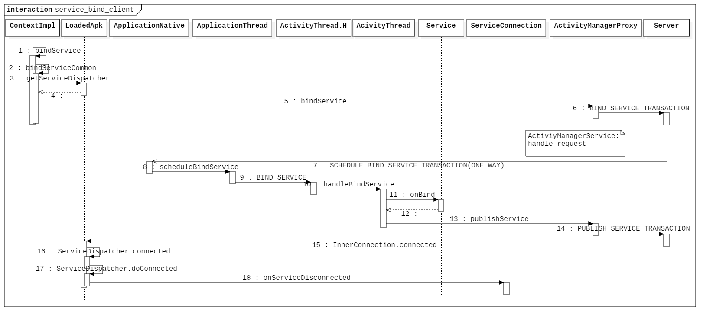
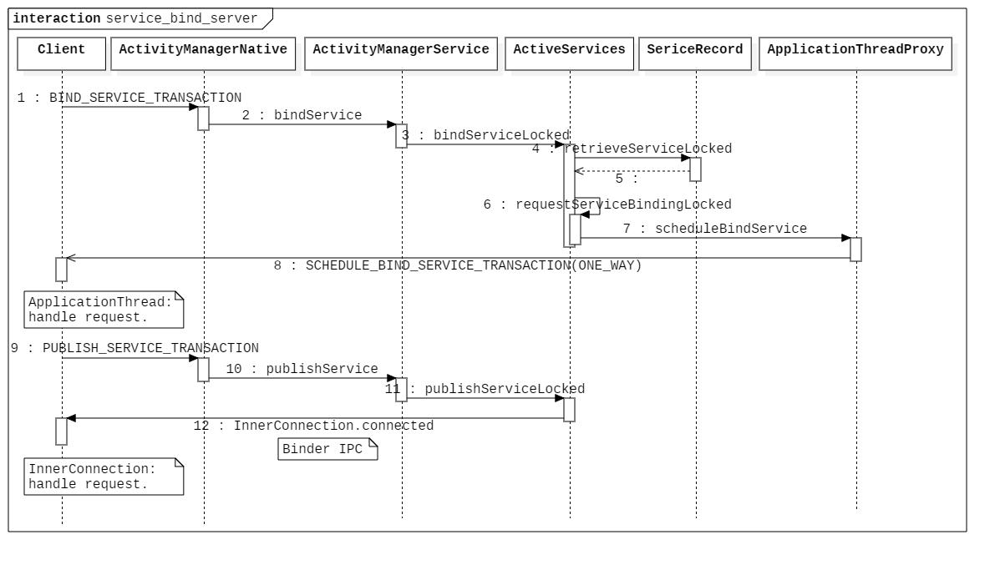

# Android Service 绑定流程分析

- [前言](#前言)
- [入口](#入口)
  - [ContextImpl](#contextimpl)
- [流程分析](#流程分析)
  - [Client](#client)
    - [ContextImpl](#contextimpl-1)
    - [LoadedApk](#loadedapk)
    - [ServiceDispatcher](#servicedispatcher)
    - [ActivityManagerProxy](#activitymanagerproxy)
  - [Server](#server)
    - [ActivityManagerNative](#activitymanagernative)
    - [ActivityManagerService](#activitymanagerservice)
    - [ActiveServices](#activeservices)
    - [ServiceRecord](#servicerecord)
    - [Records](#records)
    - [ActiveServices](#activeservices-1)
    - [ApplicationThreadProxy](#applicationthreadproxy)
  - [Client](#client-1)
    - [ApplicationThreadNative](#applicationthreadnative)
    - [ApplicationThread](#applicationthread)
    - [ActivityThread.H](#activitythreadh)
    - [ActivityThread](#activitythread)
  - [Server](#server-1)
    - [ActivityManagerService](#activitymanagerservice-1)
    - [ActiveServices](#activeservices-2)
  - [Client](#client-2)
    - [InnerConnection](#innerconnection)
    - [ServiceDispatcher](#servicedispatcher-1)
    - [RunConnection](#runconnection)
    - [ServiceDispatcher](#servicedispatcher-2)
- [时序图](#时序图)


## 前言

启动服务的方式有两种，`startService` 和 `bindService`，其中绑定服务后，可获得服务端返回的 Binder 引用，通过持有 Service 端 Binder 可向 Service 端发送请求，这里基于 Android 6.0.1 系统源码继续分析 Service 的绑定流程。

## 入口

绑定 Service 的入口在 ContextImpl。

### ContextImpl

```java
// ContextImpl.java

@Override
public boolean bindService(Intent service, ServiceConnection conn, int flags) {
    warnIfCallingFromSystemProcess();
    return bindServiceCommon(service, conn, flags, Process.myUserHandle());
}
```

下面开始跟踪绑定流程。

## 流程分析

### Client

#### ContextImpl

```java
// ContextImpl.java

private boolean bindServiceCommon(Intent service, ServiceConnection conn, int flags,
        UserHandle user) {
    IServiceConnection sd;
    if (conn == null) {
        throw new IllegalArgumentException("connection is null");
    }
    if (mPackageInfo != null) {
        // 获得服务分发器。
        sd = mPackageInfo.getServiceDispatcher(conn, getOuterContext(),
                mMainThread.getHandler(), flags);
    } else {
        throw new RuntimeException("Not supported in system context");
    }
    validateServiceIntent(service);
    try {
        // token 为 null 则不是 activity contenxt。
        IBinder token = getActivityToken();
        if (token == null && (flags&BIND_AUTO_CREATE) == 0 && mPackageInfo != null
                && mPackageInfo.getApplicationInfo().targetSdkVersion
                < android.os.Build.VERSION_CODES.ICE_CREAM_SANDWICH) {
            flags |= BIND_WAIVE_PRIORITY;
        }
        service.prepareToLeaveProcess();
        int res = ActivityManagerNative.getDefault().bindService(
            mMainThread.getApplicationThread(), getActivityToken(), service,
            service.resolveTypeIfNeeded(getContentResolver()),
            sd, flags, getOpPackageName(), user.getIdentifier());
        if (res < 0) {
            throw new SecurityException(
                    "Not allowed to bind to service " + service);
        }
        return res != 0;
    } catch (RemoteException e) {
        throw new RuntimeException("Failure from system", e);
    }
}
```

首先看获取的 Service 分发器实现：

#### LoadedApk

```java
// ContextImpl.java

public final IServiceConnection getServiceDispatcher(ServiceConnection c,
        Context context, Handler handler, int flags) {
    synchronized (mServices) {
        LoadedApk.ServiceDispatcher sd = null;
        ArrayMap<ServiceConnection, LoadedApk.ServiceDispatcher> map = mServices.get(context);
        if (map != null) {
            sd = map.get(c);
        }
        if (sd == null) {
            // 创建 Service 分发对象。
            sd = new ServiceDispatcher(c, context, handler, flags);
            if (map == null) {
                map = new ArrayMap<ServiceConnection, LoadedApk.ServiceDispatcher>();
                // 存入此 Context 对应的服务连接对象和分发对象的 map 中。
                mServices.put(context, map);
            }
            map.put(c, sd);
        } else {
            sd.validate(context, handler);
        }
        return sd.getIServiceConnection();
    }
}
```

看一下 `ServuceDispatcher` 的实现。

#### ServiceDispatcher

```java
// LoadedApk.java - class ServiceDIspatcher

static final class ServiceDispatcher {
    private final ServiceDispatcher.InnerConnection mIServiceConnection;
    // Service 连接对象。
    private final ServiceConnection mConnection;
    private final Context mContext;
    // 主线程 H 类。
    private final Handler mActivityThread;
    private final ServiceConnectionLeaked mLocation;
    // 参数 Flags。
    private final int mFlags;

    private RuntimeException mUnbindLocation;

    private boolean mDied;
    private boolean mForgotten;

    private static class InnerConnection extends IServiceConnection.Stub {
        final WeakReference<LoadedApk.ServiceDispatcher> mDispatcher;

        InnerConnection(LoadedApk.ServiceDispatcher sd) {
            mDispatcher = new WeakReference<LoadedApk.ServiceDispatcher>(sd);
        }

        public void connected(ComponentName name, IBinder service) throws RemoteException {
            LoadedApk.ServiceDispatcher sd = mDispatcher.get();
            if (sd != null) {
                sd.connected(name, service);
            }
        }
    }

    private final ArrayMap<ComponentName, ServiceDispatcher.ConnectionInfo> mActiveConnections
        = new ArrayMap<ComponentName, ServiceDispatcher.ConnectionInfo>();

    ServiceDispatcher(ServiceConnection conn,
            Context context, Handler activityThread, int flags) {
        mIServiceConnection = new InnerConnection(this);
        mConnection = conn;
        mContext = context;
        mActivityThread = activityThread;
        mLocation = new ServiceConnectionLeaked(null);
        mLocation.fillInStackTrace();
        mFlags = flags;
    }
    
    IServiceConnection getIServiceConnection() {
        return mIServiceConnection;
    }
    ...
}
```

可以看到，`getIServiceConnection` 最终返回的是 `ServiceDispatcher` 的内部类 `InnerConnection`  的对象，它是一个 Binder 服务端对象，内部持有 `ServiceDispatcher` 的弱引用，并在自身的 `connected` 方法被调用时立即调用 `ServiceDispatcher` 的 `connected` 方法，这里先回到上面。

下一步就是通过 `ActivityManagerNative` 向 AMS 发送 `bindeService` 请求了。

#### ActivityManagerProxy

```java
// ActivityManagerNative.java - class ActivityManagerProxy

public int bindService(IApplicationThread caller, IBinder token,
        Intent service, String resolvedType, IServiceConnection connection,
        int flags,  String callingPackage, int userId) throws RemoteException {
    Parcel data = Parcel.obtain();
    Parcel reply = Parcel.obtain();
    data.writeInterfaceToken(IActivityManager.descriptor);
    data.writeStrongBinder(caller != null ? caller.asBinder() : null);
    data.writeStrongBinder(token);
    service.writeToParcel(data, 0);
    data.writeString(resolvedType);
    data.writeStrongBinder(connection.asBinder());
    data.writeInt(flags);
    data.writeString(callingPackage);
    data.writeInt(userId);
    mRemote.transact(BIND_SERVICE_TRANSACTION, data, reply, 0);
    reply.readException();
    int res = reply.readInt();
    data.recycle();
    reply.recycle();
    return res;
}
```

### Server

#### ActivityManagerNative

```java
// ActivityManagerNative.java

@Override
public boolean onTransact(int code, Parcel data, Parcel reply, int flags)
        throws RemoteException {
    switch (code) {
    ...
    case BIND_SERVICE_TRANSACTION: {
        data.enforceInterface(IActivityManager.descriptor);
        IBinder b = data.readStrongBinder();
        IApplicationThread app = ApplicationThreadNative.asInterface(b);
        IBinder token = data.readStrongBinder();
        Intent service = Intent.CREATOR.createFromParcel(data);
        String resolvedType = data.readString();
        b = data.readStrongBinder();
        int fl = data.readInt();
        String callingPackage = data.readString();
        int userId = data.readInt();
        IServiceConnection conn = IServiceConnection.Stub.asInterface(b);
        int res = bindService(app, token, service, resolvedType, conn, fl,
                callingPackage, userId);
        reply.writeNoException();
        reply.writeInt(res);
        return true;
    }
    ...
}
```

#### ActivityManagerService

```java
// ActivityManagerService.java

public int bindService(IApplicationThread caller, IBinder token, Intent service,
        String resolvedType, IServiceConnection connection, int flags, String callingPackage,
        int userId) throws TransactionTooLargeException {
    enforceNotIsolatedCaller("bindService");

    // 拒接 Intent 携带文件描述符。
    if (service != null && service.hasFileDescriptors() == true) {
        throw new IllegalArgumentException("File descriptors passed in Intent");
    }

    if (callingPackage == null) {
        throw new IllegalArgumentException("callingPackage cannot be null");
    }

    synchronized(this) {
        // 调用 ActiveServices 方法。
        return mServices.bindServiceLocked(caller, token, service,
                resolvedType, connection, flags, callingPackage, userId);
    }
}
```

#### ActiveServices

```java
// ActiveServices.java

int bindServiceLocked(IApplicationThread caller, IBinder token, Intent service,
        String resolvedType, IServiceConnection connection, int flags,
        String callingPackage, int userId) throws TransactionTooLargeException {
    if (DEBUG_SERVICE) Slog.v(TAG_SERVICE, "bindService: " + service
            + " type=" + resolvedType + " conn=" + connection.asBinder()
            + " flags=0x" + Integer.toHexString(flags));
    // 获得调用者进程记录。
    final ProcessRecord callerApp = mAm.getRecordForAppLocked(caller);
    if (callerApp == null) {
        throw new SecurityException(
                "Unable to find app for caller " + caller
                + " (pid=" + Binder.getCallingPid()
                + ") when binding service " + service);
    }

    ActivityRecord activity = null;
    // token 不为空，则启动者 context 为 Activity。
    if (token != null) {
        activity = ActivityRecord.isInStackLocked(token);
        if (activity == null) {
            Slog.w(TAG, "Binding with unknown activity: " + token);
            return 0;
        }
    }

    int clientLabel = 0;
    PendingIntent clientIntent = null;

    if (callerApp.info.uid == Process.SYSTEM_UID) {
        // 系统进程处理。
        ...
    }

    if ((flags&Context.BIND_TREAT_LIKE_ACTIVITY) != 0) {
        mAm.enforceCallingPermission(android.Manifest.permission.MANAGE_ACTIVITY_STACKS,
                "BIND_TREAT_LIKE_ACTIVITY");
    }

    // 是否前台执行。
    final boolean callerFg = callerApp.setSchedGroup != Process.THREAD_GROUP_BG_NONINTERACTIVE;

    // 查询目标 ServiceRecord。
    ServiceLookupResult res =
        retrieveServiceLocked(service, resolvedType, callingPackage,
                Binder.getCallingPid(), Binder.getCallingUid(), userId, true, callerFg);
    if (res == null) {
        return 0;
    }
    if (res.record == null) {
        return -1;
    }
    // 目标 Service 记录。
    ServiceRecord s = res.record;

    final long origId = Binder.clearCallingIdentity();

    try {
        // 取消服务重启的安排。
        if (unscheduleServiceRestartLocked(s, callerApp.info.uid, false)) {
            if (DEBUG_SERVICE) Slog.v(TAG_SERVICE, "BIND SERVICE WHILE RESTART PENDING: "
                    + s);
        }

        if ((flags&Context.BIND_AUTO_CREATE) != 0) {
            // 更新最后活动时间。
            s.lastActivity = SystemClock.uptimeMillis();
            if (!s.hasAutoCreateConnections()) {
                // 这里是首次绑定，所以让跟踪器知晓。
                ProcessStats.ServiceState stracker = s.getTracker();
                if (stracker != null) {
                    stracker.setBound(true, mAm.mProcessStats.getMemFactorLocked(),
                            s.lastActivity);
                }
            }
        }

        mAm.startAssociationLocked(callerApp.uid, callerApp.processName,
                s.appInfo.uid, s.name, s.processName);

        // 1. 获得应用程序绑定记录。
        AppBindRecord b = s.retrieveAppBindingLocked(service, callerApp);
        // 创建单个 Service 绑定记录（activity 和 service 对应的描述）。
        ConnectionRecord c = new ConnectionRecord(b, activity,
                connection, flags, clientLabel, clientIntent);

        IBinder binder = connection.asBinder();
        // s.connections 是 IBinder -> List<ConnectionRecord> 的 map
        // （表示所有绑定到此 Service 的客户端记录）。
        ArrayList<ConnectionRecord> clist = s.connections.get(binder);
        if (clist == null) {
            clist = new ArrayList<ConnectionRecord>();
            // 将单个绑定记录存入 Service 的所有记录中。
            s.connections.put(binder, clist);
        }
        clist.add(c);
        // b.connections 是 List<ConnectionRecord>
        // （表示此应用程序中所有绑定的客户端）。
        b.connections.add(c);
        if (activity != null) {
            if (activity.connections == null) {
                activity.connections = new HashSet<ConnectionRecord>();
            }
            // 记录到 activity 的所有绑定记录中。
            activity.connections.add(c);
        }
        // 记录到应用程序的所有绑定记录中。
        b.client.connections.add(c);
        if ((c.flags&Context.BIND_ABOVE_CLIENT) != 0) {
            b.client.hasAboveClient = true;
        }
        if (s.app != null) {
            updateServiceClientActivitiesLocked(s.app, c, true);
        }
        clist = mServiceConnections.get(binder);
        if (clist == null) {
            clist = new ArrayList<ConnectionRecord>();
            mServiceConnections.put(binder, clist);
        }
        clist.add(c);

        if ((flags&Context.BIND_AUTO_CREATE) != 0) {
            s.lastActivity = SystemClock.uptimeMillis();
            // 启动 service 流程。
            if (bringUpServiceLocked(s, service.getFlags(), callerFg, false) != null) {
                return 0;
            }
        }

        if (s.app != null) {
            if ((flags&Context.BIND_TREAT_LIKE_ACTIVITY) != 0) {
                s.app.treatLikeActivity = true;
            }
            // 这里可能会提高服务的优先级。
            mAm.updateLruProcessLocked(s.app, s.app.hasClientActivities
                    || s.app.treatLikeActivity, b.client);
            mAm.updateOomAdjLocked(s.app);
        }

        if (DEBUG_SERVICE) Slog.v(TAG_SERVICE, "Bind " + s + " with " + b
                + ": received=" + b.intent.received
                + " apps=" + b.intent.apps.size()
                + " doRebind=" + b.intent.doRebind);

        if (s.app != null && b.intent.received) {
            // Service 已经在运行了，所以我们可以立即发布连接。
            try {
                // 2. conn 为上面的 connection（IServiceConnection）。
                c.conn.connected(s.name, b.intent.binder);
            } catch (Exception e) {
                Slog.w(TAG, "Failure sending service " + s.shortName
                        + " to connection " + c.conn.asBinder()
                        + " (in " + c.binding.client.processName + ")", e);
            }

            // 如果这是第一个连接到此绑定的应用，并且 Service 之前已被被告知重新
            // 被绑定，则这样做。
            if (b.intent.apps.size() == 1 && b.intent.doRebind) {
                // 回调 onRebind 方法。
                requestServiceBindingLocked(s, b.intent, callerFg, true);
            }
        } else if (!b.intent.requested) {
            // 2. 请求绑定服务。
            requestServiceBindingLocked(s, b.intent, callerFg, false);
        }

        getServiceMap(s.userId).ensureNotStartingBackground(s);

    } finally {
        Binder.restoreCallingIdentity(origId);
    }

    return 1;
}
```

首先看 1 处的 `s.retrieveAppBindingLocked` 是怎样获取绑定记录的。

#### ServiceRecord

```java
// ServiceRecord.java

public AppBindRecord retrieveAppBindingLocked(Intent intent,
        ProcessRecord app) {
    // 创建 Intent 比较器对象。
    Intent.FilterComparison filter = new Intent.FilterComparison(intent);
    // bindings 是 FilterComparison -> IntentBindRecord 的 map。
    // 首先获取绑定到 Service 的 Intent 记录。
    IntentBindRecord i = bindings.get(filter);
    if (i == null) {
        // 没有获取到，则创建新的记录。
        i = new IntentBindRecord(this, filter);
        bindings.put(filter, i);
    }
    AppBindRecord a = i.apps.get(app);
    // 获取绑定到此 Intent 上的应用程序记录。
    if (a != null) {
        return a;
    }
    // 如果没有则创建新的记录。
    a = new AppBindRecord(this, i, app);
    // 将应用程序记录存入。
    i.apps.put(app, a);
    return a;
}
```

可以看到上面出现了好几个 Record 类型，这里首先使用伪代码它们和服务绑定记录相关数据结构，这里以 `{}` 表示类型。

#### Records

```java
// 描述绑定到 Service 的 Intent 记录。
IntentBindRecord {
	ServiceRecord service;      // 绑定的 Service 记录。
	FilterComparison intent;    // Intent 比较器。
	Map<ProcessRecord, AppBindRecord> apps; // 所有绑定到此 Intent 的应用程序。
    ...
}

// 描述一个和 Service 相绑定的应用程序记录。
AppBindRecord {
	ServiceRecord service;      // 绑定的 Service 记录。
	IntentBindRecord intent;    // 对应的 Intent 绑定描述。
	ProcessRocord client;       // 应用程序对应的进程记录。
	Set<ConnectionRecord> apps; // 应用程序所有的绑定记录。
    ...
}

// 描述单个绑定记录。
ConnectionRecord {
	AppBindRocord binding;      // 对应的应用程序绑定描述。
	ActivityRecord activity;    // 对应的绑定 Activity 记录。
	IServiceConnection conn;    // 绑定连接。
    ...
}

// 描述 Service 记录。
ServiceRecord {
	Map<FilterComparison, IntentBindRecord> bindings; // 所有活动绑定 Service 的记录。
	Map<IBinder, List<ConnectionRecord>> connections; // 所有绑定 Service 的客户端记录。
    ...
}

// 描述 Activity 记录。
ActivityRecord {
    HashSet<ConnectionRecord> connections;  // Activity 中的所有绑定记录。
}

// 描述应用程序记录。
ProcessRecord {
    // 应用程序中的所有绑定记录。
    final ArraySet<ConnectionRecord> connections = new ArraySet<>();
    ...
}
```

通过枚举这些绑定记录相关的数据结构，再看上面的分析就清晰很多，都是一些保存数据的操作。

接下来看 2 处 的 `requestServiceBindingLocked` 方法是如何请求绑定服务的。

#### ActiveServices

```java
// ActiveServices.java

private final boolean requestServiceBindingLocked(ServiceRecord r, IntentBindRecord i,
        boolean execInFg, boolean rebind) throws TransactionTooLargeException {
    if (r.app == null || r.app.thread == null) {
        // 如果 Service 当前没有运行，则无法绑定。
        return false;
    }
    if ((!i.requested || rebind) && i.apps.size() > 0) {
        try {
            // 发送绑定超时的消息，和 startService 类似。
            bumpServiceExecutingLocked(r, execInFg, "bind");
            r.app.forceProcessStateUpTo(ActivityManager.PROCESS_STATE_SERVICE);
            // 安排客户端进程执行绑定 Service。
            r.app.thread.scheduleBindService(r, i.intent.getIntent(), rebind,
                    r.app.repProcState);
            if (!rebind) {
                i.requested = true;
            }
            i.hasBound = true;
            i.doRebind = false;
        } catch (TransactionTooLargeException e) {
            // 保持 executeNesting 计数准确。
            if (DEBUG_SERVICE) Slog.v(TAG_SERVICE, "Crashed while binding " + r, e);
            final boolean inDestroying = mDestroyingServices.contains(r);
            serviceDoneExecutingLocked(r, inDestroying, inDestroying);
            throw e;
        } catch (RemoteException e) {
            if (DEBUG_SERVICE) Slog.v(TAG_SERVICE, "Crashed while binding " + r);
            // 保持 executeNesting 计数准确。
            final boolean inDestroying = mDestroyingServices.contains(r);
            serviceDoneExecutingLocked(r, inDestroying, inDestroying);
            return false;
        }
    }
    return true;
}
```

下一步安排客户端进程执行 Service 绑定操作。

#### ApplicationThreadProxy

```java
// ApplicationThreadNative.java - class ApplicationThreadProxy

public final void scheduleBindService(IBinder token, Intent intent, boolean rebind,
        int processState) throws RemoteException {
    Parcel data = Parcel.obtain();
    data.writeInterfaceToken(IApplicationThread.descriptor);
    data.writeStrongBinder(token);
    intent.writeToParcel(data, 0);
    data.writeInt(rebind ? 1 : 0);
    data.writeInt(processState);
    // FLAG_ONEWAY 是异步的不阻塞。
    mRemote.transact(SCHEDULE_BIND_SERVICE_TRANSACTION, data, null,
            IBinder.FLAG_ONEWAY);
    data.recycle();
}

```

### Client

#### ApplicationThreadNative

```java
// ApplicationThreadNative.java

@Override
public boolean onTransact(int code, Parcel data, Parcel reply, int flags)
        throws RemoteException {
    switch (code) {
    ...
    case SCHEDULE_BIND_SERVICE_TRANSACTION: {
        data.enforceInterface(IApplicationThread.descriptor);
        IBinder token = data.readStrongBinder();
        Intent intent = Intent.CREATOR.createFromParcel(data);
        boolean rebind = data.readInt() != 0;
        int processState = data.readInt();
        scheduleBindService(token, intent, rebind, processState);
        return true;
    }
    ...
    }
    ...
}   
```

#### ApplicationThread

```java
// ActivityThread.java - class ApplicationThread

public final void scheduleBindService(IBinder token, Intent intent,
        boolean rebind, int processState) {
    updateProcessState(processState, false);
    BindServiceData s = new BindServiceData();
    s.token = token;
    s.intent = intent;
    s.rebind = rebind;

    if (DEBUG_SERVICE)
        Slog.v(TAG, "scheduleBindService token=" + token + " intent=" + intent + " uid="
                + Binder.getCallingUid() + " pid=" + Binder.getCallingPid());
    sendMessage(H.BIND_SERVICE, s);
}
```

#### ActivityThread.H

```java
// ActivityThread.java - class H

public void handleMessage(Message msg) {
    if (DEBUG_MESSAGES) Slog.v(TAG, ">>> handling: " + codeToString(msg.what));
    switch (msg.what) {
    ...
    case BIND_SERVICE:
        Trace.traceBegin(Trace.TRACE_TAG_ACTIVITY_MANAGER, "serviceBind");
        handleBindService((BindServiceData)msg.obj);
        Trace.traceEnd(Trace.TRACE_TAG_ACTIVITY_MANAGER);
        break;
    ...
    }
    ...
}
```

#### ActivityThread

```java
// ActivityThread.java

private void handleBindService(BindServiceData data) {
    // 获得对应的 Service 对象。
    Service s = mServices.get(data.token);
    if (DEBUG_SERVICE)
        Slog.v(TAG, "handleBindService s=" + s + " rebind=" + data.rebind);
    if (s != null) {
        try {
            data.intent.setExtrasClassLoader(s.getClassLoader());
            data.intent.prepareToEnterProcess();
            try {
                if (!data.rebind) {
                    // 获得 Service 回调的 IBinder 对象。
                    IBinder binder = s.onBind(data.intent);
                    // 发布 IBinder 对象。
                    ActivityManagerNative.getDefault().publishService(
                            data.token, data.intent, binder);
                } else {
                    s.onRebind(data.intent);
                    ActivityManagerNative.getDefault().serviceDoneExecuting(
                            data.token, SERVICE_DONE_EXECUTING_ANON, 0, 0);
                }
                ensureJitEnabled();
            } catch (RemoteException ex) {
            }
        } catch (Exception e) {
            if (!mInstrumentation.onException(s, e)) {
                throw new RuntimeException(
                        "Unable to bind to service " + s
                        + " with " + data.intent + ": " + e.toString(), e);
            }
        }
    }
}

```

辗转调用到了 `ActivityThread` 的 `handleBindService` 方法中。

这里可以看到，直接调用 `Service` 的 `onBinder` 获取提供的 Binder 对象，然后通过 AMS 发布。

### Server

#### ActivityManagerService

```java
// ActivityManagerService.java

public void publishService(IBinder token, Intent intent, IBinder service) {
    // 拒绝 Intent 携带（泄露）文件描述符。
    if (intent != null && intent.hasFileDescriptors() == true) {
        throw new IllegalArgumentException("File descriptors passed in Intent");
    }

    synchronized(this) {
        if (!(token instanceof ServiceRecord)) {
            throw new IllegalArgumentException("Invalid service token");
        }
        // 下一步。
        mServices.publishServiceLocked((ServiceRecord)token, intent, service);
    }
}
```

#### ActiveServices

```java
// ActiveServices.java

void publishServiceLocked(ServiceRecord r, Intent intent, IBinder service) {
    final long origId = Binder.clearCallingIdentity();
    try {
        if (DEBUG_SERVICE) Slog.v(TAG_SERVICE, "PUBLISHING " + r
                + " " + intent + ": " + service);
        if (r != null) {
            Intent.FilterComparison filter
                    = new Intent.FilterComparison(intent);
            // 获得绑定到 Service 的 Intent 记录。
            IntentBindRecord b = r.bindings.get(filter);
            if (b != null && !b.received) {
                b.binder = service;
                b.requested = true;
                b.received = true;
                for (int conni=r.connections.size()-1; conni>=0; conni--) {
                    // 获得绑定到 Service 的所有绑定记录。
                    ArrayList<ConnectionRecord> clist = r.connections.valueAt(conni);
                    for (int i=0; i<clist.size(); i++) {
                        ConnectionRecord c = clist.get(i);
                        if (!filter.equals(c.binding.intent.intent)) {
                            if (DEBUG_SERVICE) Slog.v(
                                    TAG_SERVICE, "Not publishing to: " + c);
                            if (DEBUG_SERVICE) Slog.v(
                                    TAG_SERVICE, "Bound intent: " + c.binding.intent.intent);
                            if (DEBUG_SERVICE) Slog.v(
                                    TAG_SERVICE, "Published intent: " + intent);
                            continue;
                        }
                        if (DEBUG_SERVICE) Slog.v(TAG_SERVICE, "Publishing to: " + c);
                        try {
                            // IPC 回调对应的 IServiceConnection 的 connected 方法。
                            c.conn.connected(r.name, service);
                        } catch (Exception e) {
                            Slog.w(TAG, "Failure sending service " + r.name +
                                  " to connection " + c.conn.asBinder() +
                                  " (in " + c.binding.client.processName + ")", e);
                        }
                    }
                }
            }

            serviceDoneExecutingLocked(r, mDestroyingServices.contains(r), false);
        }
    } finally {
        Binder.restoreCallingIdentity(origId);
    }
}
```

### Client

#### InnerConnection

```java
// LoadedApk.java - class ServiceDispatcher$InnerConnection

private static class InnerConnection extends IServiceConnection.Stub {
    final WeakReference<LoadedApk.ServiceDispatcher> mDispatcher;

    InnerConnection(LoadedApk.ServiceDispatcher sd) {
        mDispatcher = new WeakReference<LoadedApk.ServiceDispatcher>(sd);
    }

    public void connected(ComponentName name, IBinder service) throws RemoteException {
        LoadedApk.ServiceDispatcher sd = mDispatcher.get();
        if (sd != null) {
            sd.connected(name, service);
        }
    }
}
```

#### ServiceDispatcher

```java
// LoadedApk.java - class ServiceDispatcher

public void connected(ComponentName name, IBinder service) {
    if (mActivityThread != null) {
        mActivityThread.post(new RunConnection(name, service, 0));
    } else {
        doConnected(name, service);
    }
}
```

#### RunConnection

```java
// LoadedApk.java - class ServiceDispatcher$RunConnection

private final class RunConnection implements Runnable {
    RunConnection(ComponentName name, IBinder service, int command) {
        mName = name;
        mService = service;
        mCommand = command;
    }

    public void run() {
        if (mCommand == 0) {
            doConnected(mName, mService);
        } else if (mCommand == 1) {
            doDeath(mName, mService);
        }
    }

    final ComponentName mName;
    final IBinder mService;
    final int mCommand;
}
```

#### ServiceDispatcher

```java
// LoadedApk.java - class ServiceDispatcher

public void doConnected(ComponentName name, IBinder service) {
    ServiceDispatcher.ConnectionInfo old;
    ServiceDispatcher.ConnectionInfo info;

    synchronized (this) {
        if (mForgotten) {
            // 我们在收到连接之前解除绑定，忽略接收到的任何连接。
            return;
        }
        // mActiveConnections = ComponentName -> ConnectionInfo
        old = mActiveConnections.get(name);
        if (old != null && old.binder == service) {
            // 嗯，已经有这个了，那好吧。
            return;
        }

        if (service != null) {
            // 一个新的 Service 正在被连接……设置一切。
            mDied = false;
            info = new ConnectionInfo();
            info.binder = service;
            info.deathMonitor = new DeathMonitor(name, service);
            try {
                service.linkToDeath(info.deathMonitor, 0);
                // 存入活动的连接中。
                mActiveConnections.put(name, info);
            } catch (RemoteException e) {
                // 这个服务再我们得到之前已经死了……只是不要对它做任何事。
                mActiveConnections.remove(name);
                return;
            }

        } else {
            // Service 正在断开连接……清理掉。
            mActiveConnections.remove(name);
        }

        if (old != null) {
            old.binder.unlinkToDeath(old.deathMonitor, 0);
        }
    }

    // 如果有就的 Service，则不会断开连接。
    if (old != null) {
        mConnection.onServiceDisconnected(name);
    }
    // 如果有新 Service，则现在已连接。
    if (service != null) {
        // 回调 ServiceConnection。
        mConnection.onServiceConnected(name, service);
    } 	
}
```

最后回调了 `ServiceConnection` 的 `onServiceConnected` 方法将 Service 提供的 `IBinder` 对象回调出去，结束整个绑定流程。

下面用时序图描述这个过程。

## 时序图

首先是应用客户端进程流程：



服务端流程：

