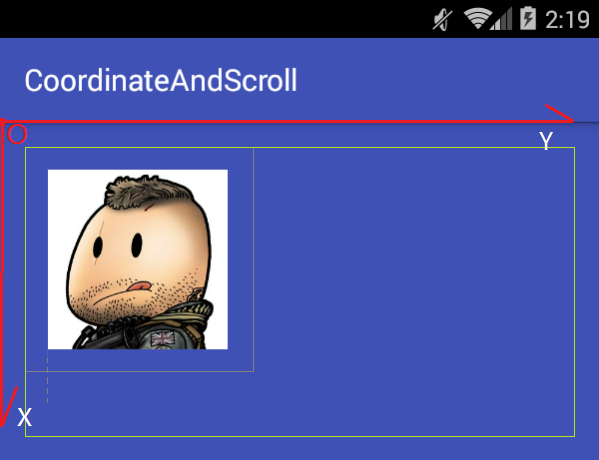
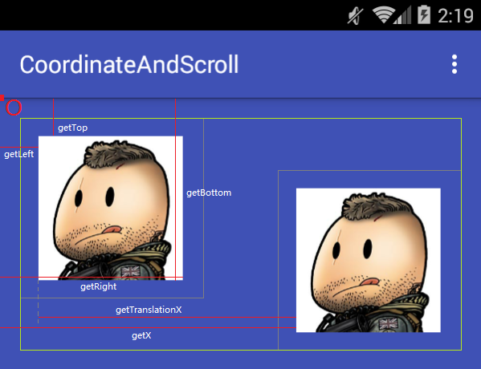
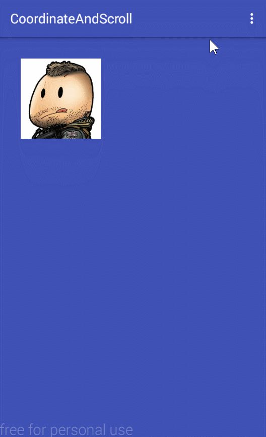
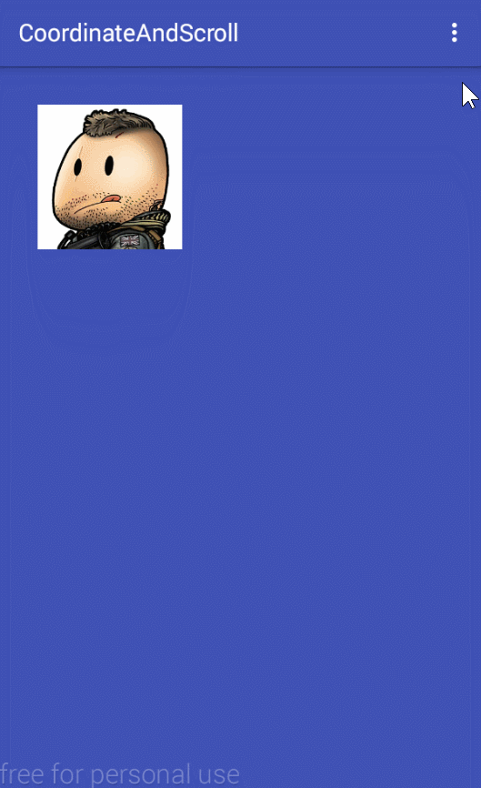

# Android 坐标系和view滑动方法

* [android二维坐标系](#android二维坐标系) 
  * [parent view](#parent_view)
  * [motion event](#motion_event)
  * [child view](#child_view)
* [view滑动方法](#view滑动方法)
  * [拖拽滑动实例](#拖拽滑动实例)
  * [translation](#translation)
  * [scroll to](#scroll_to)
  * [layout fun](#layout_fun)
  * [offsetXXAndXX](#offsetXXAndXX)
  * [Layout Params](#layout_params)
* [弹性滑动](#弹性滑动)
  * [Animator](#animator)
  * [Scroller](#scroller)
  * [Handler](#handler)
* [滑动方法总结](#滑动方法总结)
* [源码](#源码)

## android二维坐标系

和java图形化界面开发类似，android也有一种坐标系，这里说说二维平面的坐标系，在android中，坐标起始点以左上角为原点，竖直向下是y轴的方向，横向向右是x轴延伸方向，对于android中的view来说，它本身所具有的一些位置相关的参数会根据这个坐标系来确定数值和正负，掌握这些有助于理解view在布局层次中所处位置的意义。

下面用一个典型例子来说明android中的坐标系：



上图中的布局包含两个view，一个是外层的 `parent view` 和内部的一个 `child view`，其中 parent view设置了`padding="16dp"`的属性，child view 设置了 `layout_margin="16dp"`的属性，为了更明显的表现布局的，其中绿色区域表示parent view设置padding后绘制子view的区域，灰色区域表示child view设置margin值后所占的空间。

```xml
<!-- parent view -->
<com.runing.corrdinateandscroll.ScrollerLayout
    xmlns:android="http://schemas.android.com/apk/res/android"
    xmlns:tools="http://schemas.android.com/tools"
    android:id="@+id/fl_parent"
    android:layout_width="match_parent"
    android:layout_height="240dp"
    android:background="@color/colorPrimary"
    android:padding="16dp"
    tools:context="com.runing.corrdinateandscroll.MainActivity">

	<!-- child view -->
    <ImageView
        android:id="@+id/iv_target"
        android:layout_width="120dp"
        android:layout_height="120dp"
        android:layout_margin="16dp"
        android:contentDescription="@string/app_name"
        android:src="@drawable/img0"/>

</com.runing.corrdinateandscroll.ScrollerLayout>
```
下面分主要从和几个角度分析和child view 相关的坐标参数

<h3 id="parent_view">parent view</h3>

下面两个方法都是对child view调用的，他们返回的是两个重要位置参数的值，`mScrollX` 和 `mScrollY`

- `getScrollX` 返回相对于view左边缘x轴滑动的偏移量，它会影响view内容的绘制位置，如果向右偏移，返回的都是负值，反之返回正值，下面会细说它的含义。
- `getScrollY` 返回相对于view上边缘y轴滑动的偏移量，如果向下偏移，返回的都是负值，反之返回正值。

<h3 id="motion_event">motion event</h3>

现在假设在child view上发生一个触摸事件，下面将会是从child view的 `onTouchEvent(MotionEvent event)` 或者 `onTouchListener` 的 `onTouch(MotionEvent event)` 方法中的 `event` 对象中获取的值。


- `getRawX` 触摸事件发生点相对屏幕左边缘的x轴偏移，因为触点一定会在屏幕内，所以一直是正值。
- `getRawY` 触摸事件发生点相对屏幕上边缘的y轴偏移，同上一直会是正值。
- `getX` child view触摸事件发生点相对自身左边缘的x轴偏移，如果触点在自身左边缘的左边，值会为负。
- `getY` child view触摸事件发生点相对自身上边缘的y轴偏移，如果触点在自身上边缘的上面，值会为负。

<h3 id="child_view">child view</h3>

下图是一个view调用 `setTranslation` 的方法使view发生偏移前后的两个view的位置。    

下面的方法均是针对child view来说的。

- `getLeft` child view左边缘距离parent view左边缘的x轴偏移量，相对于parent view右边时为正数。由图上看出，`getLeft` 的值会受到 parent view的 `padding` 和 child view自身的 `layout_margin`  属性的影响。
- `getTop` child view上边缘距离parent view上边缘的y轴偏移量，相对于parent view偏下时为正数，`getTop` 的值会受到 parent view的 `padding` 和 child view自身的 `layout_margin`  属性的影响。
- `getRight` child view右边缘距离parent view左边缘的x轴偏移量，即 `getLeft` 加view自身宽度。
- `getBottom` child view下边缘距离parent view上边缘的y轴偏移量，即 `getRight` 加view自身高度。
- `getTranslationX` child view相于自身 `getLeft` 向右的x轴偏移量，改变这个值不会改变 `getLeft` 的值。
- `getTranslationY` child view相于自身 `getTop` 向下的y轴偏移量，改变这个值不会改变 `getTop` 的值。
- `getX` child view发生 translationX 平移后的自身左边缘距离parent view左边缘的x轴偏移，即 `getLeft + getTranslationX `。
- `getY` child view发生 translationY 平移后的自身左边缘距离parent view左边缘的y轴偏移，即 `getTop + getTranslationY `。


上面只是简单列举了android中与view中坐标相关的一些属性，下面将介绍view滑动的几种方法，了解上面这些有助于理解view 滑动的一些原理，下面将会把这些知识融入到view滑动的实例中去。

## view滑动方法

下面通过一个实例的实现来介绍5种view的滑动方法，并用这些方法实现相同需求的view滑动示例。

### 拖拽滑动实例

首先确定实例需求，基于上面的条件来确定一些需求，并依次递进实现每一个需求：

1. 一个ViewGroup中放置一个ImageView
2. 其中可以使用手指触摸和拖动其中的ImageView，并让其跟随触摸点自由移动。
3. 在拖动过程中需要保证ImageView只能在ViewGroup的范围内滑动，并保持ViewGroup设置的 `padding` 属性和ImageView设置的 `layout_margin` 属性依然有效。
4. 模拟悬浮窗的横向吸附效果，当松手时，如果ImageView偏左，则ImageView会平滑吸附到ViewGroup的左边缘，反之吸附到右边缘。


针对以上需求，使用以下5种方法一一实现，其中第4个需求属于弹性滑动也就是平滑滚动，这里先实现上面3种需求。

现在在外部对ImageView设置 `OnTouchListener` 来监听 它的触摸事件，使用两个变量来标记手指按下的坐标，在手指移动时即可计算平移的偏移量，注意 `onTouch` 返回 `true` 消耗事件，这将作为滑动的基础数值，对于每种滑动都会针对这个偏移值进行处理。

```java
private int mLastX;
private int mLastY;
mTarget.setOnTouchListener(new View.OnTouchListener() {
      @Override
      public boolean onTouch(View v, MotionEvent event) {
        final int x = (int) event.getX();
        final int y = (int) event.getY();
        switch (event.getActionMasked()) {
          case MotionEvent.ACTION_DOWN:
            /* 手指按下的坐标 */
            mLastX = x;
            mLastY = y;
            break;
          case MotionEvent.ACTION_MOVE:
            /* 偏移量 */
            int xOffset = x - mLastX;
            int yOffset = y - mLastY;
            break;
        }
        return true;
      }
    });
```

### translation

使用view的 `setTranslationX` 和 `setTranslationY` 方法可直接使view发生平移，所以让view根据偏移滑动可以这样写，其中累加 `getTranslation`的结果是为了基于当前位置滑动，而不是从头开始：

```java
private void scrollByOffset(int xOffset, int yOffset) {
  mTarget.setTranslationX(mTarget.getTranslationX() + xOffset);
  mTarget.setTranslationY(mTarget.getTranslationY() + yOffset);
}
```

这样view就会跟随手指滑动了，下面将会限制view滑动范围，逻辑就是先计算出 `translation` 在x轴和y轴的滑动上限和下限，再判断新的 `translation` 位置否超出限制，如果超出限制，则限制原始偏移值。

这里由于初始位置的 `translationX` 和 `translationY` 都为0，则他们的下限就是0

```java
final int transXLowerLimit = 0;
final int transYLowerLimit = 0;
```

假设view已经通过 `translation` 滑动到右下角边缘，现在可以计算出最大上限了。


从图上简单分析，很容易就能计算了：

```java
// 其中P = Padding，M = Margin，W = width，H = height
final int transXUpperLimit = mParentW - mTargetW - mParentPL - mParentPR - mTargetML - mTargetMR;
final int transYUpperLimit = mParentH - mTargetH - mParentPT - mParentPB - mTargetMT - mTargetMB;
```

那么根据这四个变量值即可限制 `translation` 的变化，下面是完整代码：

```java
/**
 * 使用 translation 的方法进行滑动
 */
private void startScrollWithTranslation() {
  mTarget.setOnTouchListener(new View.OnTouchListener() {
    @Override
    public boolean onTouch(View v, MotionEvent event) {
      final int x = (int) event.getX();
      final int y = (int) event.getY();
      switch (event.getActionMasked()) {
        case MotionEvent.ACTION_DOWN:
          stopAllAnimAndThread();
          mLastX = x;
          mLastY = y;
          break;
        case MotionEvent.ACTION_MOVE:
          int xOffset = x - mLastX;
          int yOffset = y - mLastY;
          final int oldTransX = (int) mTarget.getTranslationX();
          final int newTransX = oldTransX + xOffset;
          final int transXLowerLimit = 0;
          if (newTransX < transXLowerLimit) {
            /* 重新设置偏移量，使其在范围内滚动，下同 */
            xOffset = transXLowerLimit - oldTransX;
          }
          final int transXUpperLimit = mParentW - mTargetW - mParentPL - mParentPR - mTargetML - mTargetMR;
          if (newTransX > transXUpperLimit) {
            xOffset = transXUpperLimit - oldTransX;
          }

          final int oldTransY = (int) mTarget.getTranslationY();
          final int newTransY = oldTransY + yOffset;
          final int transYLowerLimit = 0;
          if (newTransY < transYLowerLimit) {
            yOffset = transYLowerLimit - oldTransY;
          }
          final int transYUpperLimit = mParentH - mTargetH - mParentPT - mParentPB - mTargetMT - mTargetMB;
          if (newTransY > transYUpperLimit) {
            yOffset = transYUpperLimit - oldTransY;
          }

          scrollByOffset(xOffset, yOffset);
          break;
      }
      return true;
    }
  });
}
```

这样就完成了第一种方法了。

<h3 id="scroll_to">scroll to</h3>

`scrollTo` 和 `scrollBy` 可以对view绘制内容进行滑动，实质上是对canvas 绘制区域的滚动。下面是view 的 `draw(Canvas canvas)` 的部分源码，可以体现 `scrollTo` 方法对绘制的影响。

```java
int left = mScrollX + paddingLeft;
int right = left + mRight - mLeft - mPaddingRight - paddingLeft;
int top = mScrollY + getFadeTop(offsetRequired);
int bottom = top + getFadeHeight(offsetRequired);
...
if (solidColor == 0) {
  final int flags = Canvas.HAS_ALPHA_LAYER_SAVE_FLAG;
  if (drawTop) {
    canvas.saveLayer(left, top, right, top + length, null, flags);
  }
  ...
}
...
if (drawTop) {
  matrix.setScale(1, fadeHeight * topFadeStrength);
  matrix.postTranslate(left, top);
  fade.setLocalMatrix(matrix);
  p.setShader(fade);
  canvas.drawRect(left, top, right, top + length, p);
}
```

其中的 `mScrollX` 和 `mScrollY` 的值，会受到 `scrollTo` 的影响而发生改变 

```java
/**
 * Set the scrolled position of your view. This will cause a call to
 * {@link #onScrollChanged(int, int, int, int)} and the view will be
 * invalidated.
 * @param x the x position to scroll to
 * @param y the y position to scroll to
 */
public void scrollTo(int x, int y) {
  if (mScrollX != x || mScrollY != y) {
    int oldX = mScrollX;
    int oldY = mScrollY;
    mScrollX = x;
    mScrollY = y;
    invalidateParentCaches();
    onScrollChanged(mScrollX, mScrollY, oldX, oldY);
    if (!awakenScrollBars()) {
      postInvalidateOnAnimation();
    }
  }
}
```

`scollBy` 帮我们处理了相对当前位置滑动的问题。

```java
/**
 * Move the scrolled position of your view. This will cause a call to
 * {@link #onScrollChanged(int, int, int, int)} and the view will be
 * invalidated.
 * @param x the amount of pixels to scroll by horizontally
 * @param y the amount of pixels to scroll by vertically
 */
public void scrollBy(int x, int y) {
  scrollTo(mScrollX + x, mScrollY + y);
}
```

这里需要让ImageView滑动，就是调用 parent view的 `scrollBy` 方法，来进行内容的滑动，但是有一个弊端是，parent view内部的所有子view都会滑动，所以这个方法更适用于对view内容的滑动，并不只限制于ViewGroup，还可以对View进行内容的滑动，比如ImageView中可对绘制的图片进行滑动，如果扩展一下，就可以做出一个图片浏览控件。

下面根据之前 `translation` 的套路，还是先实现自由滚动，上代码：

```java
private void scrollByOffset(int xOffset, int yOffset) {
  mParent.scrollBy(-xOffset, -yOffset);
}
```

由于scroll和坐标系方向是相反的，所以这里为负值。接下来计算上下和下限。

下限默认是0，上限也和之前 `translation` 的计算是相同的。


```java
final int scrollXLowerLimit = 0;
final int scrollYLowerLimit = 0;
final int scrollXUpperLimit = mParentW - mTargetW - mParentPL - mParentPR - mTargetML - mTargetMR;
final int scrollYUpperLimit = mParentH - mTargetH - mParentPT - mParentPB - mTargetMT - mTargetMB;
```

得到最终偏移值的完整代码：

```java
/**
 * 使用 scroll to 的方法进行滑动
 */
private void startScrollWithScrollTo() {
  mTarget.setOnTouchListener(new View.OnTouchListener() {
    @Override
    public boolean onTouch(View v, MotionEvent event) {
      final int x = (int) event.getX();
      final int y = (int) event.getY();
      switch (event.getActionMasked()) {
        case MotionEvent.ACTION_DOWN:
          mLastX = x;
          mLastY = y;
          break;
        case MotionEvent.ACTION_MOVE:
          int xOffset = x - mLastX;
          int yOffset = y - mLastY;

          final int oldScrollX = -mParent.getScrollX();
          final int newScrollX = oldScrollX + xOffset;
          final int scrollXLowerLimit = 0;
          if (newScrollX < scrollXLowerLimit) {
            xOffset = scrollXLowerLimit - oldScrollX;
          }
          final int scrollXUpperLimit = mParentW - mTargetW - mParentPL - mParentPR - mTargetML - mTargetMR;
          if (newScrollX > scrollXUpperLimit) {
            xOffset = scrollXUpperLimit - oldScrollX;
          }
          final int oldScrollY = -mParent.getScrollY();
          final int newScrollY = oldScrollY + yOffset;
          final int scrollYLowerLimit = 0;
          if (newScrollY < scrollXLowerLimit) {
            yOffset = scrollYLowerLimit - oldScrollY;
          }
          final int scrollYUpperLimit = mParentH - mTargetH - mParentPT - mParentPB - mTargetMT - mTargetMB;
          if (newScrollY > scrollYUpperLimit) {
            yOffset = scrollYUpperLimit - oldScrollY;
          }
          scrollByOffset(xOffset, yOffset);
          break;
      }
      return true;
    }
  });
}
```

<h3 id="layout_fun">layout fun</h3>

使用 `layout` 方法对目标view进行重新布局，也可以做到对view的滑动，那么对于针对偏移的滑动就可以这样写。

```java
private void scrollByOffset(int xOffset, int yOffset) {
  mTarget.layout(mTarget.getLeft() + xOffset, mTarget.getTop() + yOffset,
                 mTarget.getRight() + xOffset, mTarget.getBottom() + yOffset);
}
```

注意这种方法只是在滑动时临时改变view的 `mLeft,mRight,mTop,mBottom` 属性，如果view重新调用 `requesstLayout` 方法请求布局的重绘，view将会重新回到初始位置，可以提前保存view位置并还原。

接下来是计算layout绘制的上下限：


可以看出，view的 `getLeft` 是有初始值的，同理 `getTop` 也是一样，那么这就是它们的下限。

```java
/* 原始left值，也可以在前面直接保存getLeft值，这里重新计算了left值 */
final int leftLowerLimit = mParentPL + mTargetML;
final int topLowerLimit = mParentPT + mTargetMT;
```

那么上限就是：

```java
final int leftUpperLimit = mParentW - mTargetW - mParentPR - mTargetMR;
final int topUpperLimit = mParentH - mTargetH - mParentPB - mTargetMB;
```

由此可以限制偏移值了，完整代码：

```java
/**
 * 使用 layout 方法进行滑动
 */
private void startScrollWithOffsetFun() {
  mTarget.setOnTouchListener(new View.OnTouchListener() {
    @Override
    public boolean onTouch(View v, MotionEvent event) {
      final int x = (int) event.getX();
      final int y = (int) event.getY();
      switch (event.getActionMasked()) {
        case MotionEvent.ACTION_DOWN:
          stopAllAnimAndThread();
          mLastX = x;
          mLastY = y;
          break;
        case MotionEvent.ACTION_MOVE:
          int xOffset = x - mLastX;
          int yOffset = y - mLastY;
          final int oldLeft = mTarget.getLeft();
          final int newLeft = oldLeft + xOffset;
          final int leftLowerLimit = mParentPL + mTargetML;
          if (newLeft < leftLowerLimit) {
            xOffset = leftLowerLimit - oldLeft;
          }
          final int leftUpperLimit = mParentW - mTargetW - mParentPR - mTargetMR;
          if (newLeft > leftUpperLimit) {
            xOffset = leftUpperLimit - oldLeft;
          }
          final int oldTop = mTarget.getTop();
          final int newTop = oldTop + yOffset;
          final int topLowerLimit = mParentPT + mTargetMT;
          if (newTop < topLowerLimit) {
            yOffset = topLowerLimit - oldTop;
          }
          final int topUpperLimit = mParentH - mTargetH - mParentPB - mTargetMB;
          if (newTop > topUpperLimit) {
            yOffset = topUpperLimit - oldTop;
          }
          scrollByOffset(xOffset, yOffset);
          break;
      }
      return true;
    }
  });
}
```

<h3 id="offsetXXAndXX">offsetXXAndXX</h3>

使用 `offsetLeftAndRight` 和 `offsetTopAndBottom` 两种方法可以直接对view进行滑动，使用这两种方法和layout相同，只不过更方便一些，直接传入偏移值即可使view滑动，经过测试，它和调用 `layout` 方法所照成的影响一致，都会使 `mLeft,mRight,mTop,mBottom` 发生变化，当view调用 `requestLayout` 后，view依然会回到原始位置。

那么直接就直接使用吧：

```java
mTarget.offsetLeftAndRight(xOffset);
mTarget.offsetTopAndBottom(yOffset);
```

既然和 `layout` 方法一样，那么对边界限制的代码也是一模一样，这里就不用写了，和 `layout` 是一样的。

在android中存在一个view拖动的辅助类 `ViewDragHelper` ，使用它可以很方便的对view进行拖拽和边界限制，这里就不说了，其内部滑动就是调用了 `offsetXXAndXX` 系列方法，下面是它内部的一个方法：

```java
private void dragTo(int left, int top, int dx, int dy) {
  int clampedX = left;
  int clampedY = top;
  final int oldLeft = mCapturedView.getLeft();
  final int oldTop = mCapturedView.getTop();
  if (dx != 0) {
    clampedX = mCallback.clampViewPositionHorizontal(mCapturedView, left, dx);
    ViewCompat.offsetLeftAndRight(mCapturedView, clampedX - oldLeft);
  }
  if (dy != 0) {
    clampedY = mCallback.clampViewPositionVertical(mCapturedView, top, dy);
    ViewCompat.offsetTopAndBottom(mCapturedView, clampedY - oldTop);
  }

  if (dx != 0 || dy != 0) {
    final int clampedDx = clampedX - oldLeft;
    final int clampedDy = clampedY - oldTop;
    mCallback.onViewPositionChanged(mCapturedView, clampedX, clampedY,
                                    clampedDx, clampedDy);
  }
}
```

<h3 id="layout_params">Layout params</h3>

使用 `LayoutParams` 就有很灵活了，它是作为view的布局参数映射类而存在的，最简单的是动态更改view设置的 `layout_margin` 属性，即可做到view位置的更改，也就能控制view的滑动了，不过必须在支持 `layout_margin` 的父布局中才可以使用，所以相对于父布局来说，只要是支持view位置的属性，都可以拿来用，并不限制于 `layout_margin` 参数。

下面，我们在FrameLayout里面进行滑动，那么可以这样来：

```java
private void scrollByOffset(int xOffset, int yOffset) {
  FrameLayout.LayoutParams params = (FrameLayout.LayoutParams) mTarget.getLayoutParams();
  params.leftMargin += xOffset;
  params.topMargin += yOffset;
  mTarget.setLayoutParams(params);
}
```

处理上下限也很好弄了。


下限不用说，就是 `marginLeft` 和 `marginTop` 的初始值：

```java
final int marginLeftLowerLimit = mTargetML;
final int marginTopLowerLimit = mTargetMT;
```

上限从图上分析也很容易计算：

```java
final int marginLeftUpperLimit = mParentW - mTargetW - mParentPL - mParentPR - mTargetMR;
final int marginTopUpperLimit = mParentH - mTargetH - mParentPT - mParentPB - mTargetMB;
```

那么完整的就是：

```java
/**
 * 使用 layout params 的方法进行滑动
 */
private void startScrollWithLayoutParams() {
  mTarget.setOnTouchListener(new View.OnTouchListener() {
    @Override
    public boolean onTouch(View v, MotionEvent event) {
      final int x = (int) event.getX();
      final int y = (int) event.getY();
      switch (event.getActionMasked()) {
        case MotionEvent.ACTION_DOWN:
          stopAllAnimAndThread();
          mLastX = x;
          mLastY = y;
          break;
        case MotionEvent.ACTION_MOVE:
          int xOffset = x - mLastX;
          int yOffset = y - mLastY;
          FrameLayout.LayoutParams params = (FrameLayout.LayoutParams) mTarget.getLayoutParams();
          final int oldMarginLeft = params.leftMargin;
          final int newMarginLeft = oldMarginLeft + xOffset;
          final int marginLeftLowerLimit = mTargetML;
          if (newMarginLeft < marginLeftLowerLimit) {
            xOffset = marginLeftLowerLimit - oldMarginLeft;
          }
          final int marginLeftUpperLimit = mParentW - mTargetW - mParentPL - mParentPR - mTargetMR;
          if (newMarginLeft > marginLeftUpperLimit) {
            xOffset = marginLeftUpperLimit - oldMarginLeft;
          }
          final int oldMarginTop = params.topMargin;
          final int newMarginTop = oldMarginTop + yOffset;
          final int marginTopLowerLimit = mTargetMT;
          if (newMarginTop < marginLeftLowerLimit) {
            yOffset = marginTopLowerLimit - oldMarginTop;
          }
          final int marginTopUpperLimit = mParentH - mTargetH - mParentPT - mParentPB - mTargetMB;
          if (newMarginTop > marginTopUpperLimit) {
            yOffset = marginTopUpperLimit - oldMarginTop;
          }
          scrollByOffset(xOffset, yOffset);
          break;
      }
      return true;
    }
  });
}
```

那么最终就可以达到这样的效果：



其中的信息输出是一个 `Toast` ，可以在 `move` 事件中加入。

```java
...
case MotionEvent.ACTION_MOVE:
  ...
  scrollByOffset(xOffset, yOffset);
  /* 打印滑动时的view信息 */
  printViewInfo(event, xOffset, yOffset);
  break;
```

```java
/**
   * 在屏幕打印坐标信息
   *
   * @param event   触摸事件
   * @param xOffset x轴偏移
   * @param yOffset y轴偏移
   */
  private void printViewInfo(MotionEvent event, final int xOffset, final int yOffset) {
    T.show(
        getOutPutString(
            mParent.getScrollX(), mParent.getScrollY(),
            (int) event.getX(), (int) event.getY(), (int) event.getRawX(), (int) event.getRawY(),
            xOffset, yOffset,
            mTarget.getWidth(), mTarget.getHeight(),
            (int) mTarget.getX(), (int) mTarget.getY(),
            mTarget.getScrollX(), mTarget.getScrollY(),
            (int) mTarget.getTranslationX(), (int) mTarget.getTranslationY(),
            mTarget.getLeft(), mTarget.getRight(), mTarget.getTop(), mTarget.getBottom()
        )
    );
  }

  /**
   * 获取格式化的坐标信息字符串
   *
   * @param pScrollX      parent view getScrollX
   * @param pScrollY      parent view getScrollY
   * @param mGetX         motion event getX
   * @param mGetY         motion event getY
   * @param mGetRawX      motion event getRawX
   * @param mGetRawY      motion event getRawY
   * @param mOffsetX      x轴偏移
   * @param mOffsetY      y轴偏移
   * @param tWidth        target view width
   * @param tHeight       target view height
   * @param tGetX         target view getX
   * @param tGetY         target view getY
   * @param tScrollX      target view getScrollX
   * @param tScrollY      target view getScrollY
   * @param tTranslationX target view getTranslationX
   * @param tTranslationY target view getTranslationY
   * @param tLeft         target view getLeft
   * @param tRight        target view getRight
   * @param tTop          target view getTop
   * @param tBottom       target view getBottom
   * @return result string
   */
  private static String getOutPutString(int pScrollX, int pScrollY,
                                        int mGetX, int mGetY, int mGetRawX, int mGetRawY,
                                        int mOffsetX, int mOffsetY,
                                        int tWidth, int tHeight, int tGetX, int tGetY,
                                        int tScrollX, int tScrollY,
                                        int tTranslationX, int tTranslationY,
                                        int tLeft, int tRight, int tTop, int tBottom) {
    return "Parent: {" +
        "\nscrollX: " + pScrollX +
        "\nscrollY: " + pScrollY +
        "\n}\n" +
        "MotionEvent: {" +
        "\n" + "getX: " + mGetX +
        "\ngetY: " + mGetY +
        "\ngetRawX: " + mGetRawX +
        "\ngetRawY: " + mGetRawY +
        "\noffsetX: " + mOffsetX +
        "\noffsetY:" + mOffsetY +
        "\n}\n" +
        "TargetView: {" +
        "\nwidth: " + tWidth +
        "\nheight: " + tHeight +
        "\ngetX: " + tGetX +
        "\ngetY: " + tGetY +
        "\ngetScrollX: " + tScrollX +
        "\ngetScrollY: " + tScrollY +
        "\ngetTranslationX: " + tTranslationX +
        "\ngetTranslationY: " + tTranslationY +
        "\ngetLeft: " + tLeft +
        "\ngetRight: " + tRight +
        "\ngetTop: " + tTop +
        "\ngetBottom: " + tBottom +
        "\n}";
  }
```

```java
/* toast 工具类 */
public final class T {

  private static Toast sToast;

  @SuppressLint("ShowToast")
  public static void init(Context context) {
    sToast = Toast.makeText(context, "", Toast.LENGTH_SHORT);
    TextView view = new TextView(context);
    view.setTextColor(Color.BLACK);
    view.setLayoutParams(
      new ViewGroup.LayoutParams(
        ViewGroup.LayoutParams.WRAP_CONTENT,
        ViewGroup.LayoutParams.WRAP_CONTENT
      )
    );
    sToast.setView(view);
  }

  public static void show(String text) {
    ((TextView)sToast.getView()).setText(text);
    sToast.setDuration(Toast.LENGTH_SHORT);
    sToast.show();
  }
}
```

## 弹性滑动

上面介绍了view的滑动方法，也实现了实例中的前3个需求，但这些都只是被动的被控制的滑动，那么怎么让它自动滑动呢，就是自动从一个地方平滑到另一个地方,那么针对以上的5中方法，每种都有对应的处理方式，现在就有了以下三个方法，这些方法将被用来实现第4个需求：模拟悬浮窗的横向吸附效果，当松手时，如果ImageView偏左，则ImageView会平滑吸附到ViewGroup的左边缘，反之吸附到右边缘。 

<h3 id="animator">Animator</h3>

首先就想到了属性动画，它能使用内部线程自动更新view的属性，再通过view的重绘，使view的形态发生变化，平常都很常用的就是平移、缩放、旋转动画，其中平移动画就是更新的 `translationX` 和 `translationY` 属性，那么很自然的就把滑动方法中的 `translation` 给搞定了，当然还可以使用动画更新自定的属性，好的，现在来着手实现自动吸附吧，首先就想到是在view的触摸事件中的 `ACTION_UP` 事件中判断view的当前位置，看它偏左还是偏右，如果偏左，就让它向左平滑滑向下限位置也就是初始位置，否则向右滑向上限位置，然后在开始具体的不同方法的平滑滚动。下面是使用属性动画的两种解决方案，

- 使用 `ObjectAnimator` 更新 `translationX` 属性实现平滑滚动。

属性动画实例化：

```java
/* 初始化为默认值 */
mTransAnimator = ObjectAnimator.ofFloat(mTarget, "translationX", 0, 0);
```

处理 `ACTION_UP` 事件

```java
/**
 * (此方法将在ACTION_UP事件中调用)
 * 通过 object animator 更新 "translationX" 属性进行平滑
 */
private void scrollToSideWithTranslation() {
  /* translation滑动上限 */
  final int transXLimit = mParentW - mParentPL - mParentPR - mTargetMR - mTargetML - mTargetW;
  /* 中间值 */
  final int transXHalfLimit = transXLimit / 2;
  final float translationX = mTarget.getTranslationX();
  if (translationX == 0 || translationX == transXLimit) {
    return;
  }
  if (translationX < transXHalfLimit) {
    /* 根据滑动距离设置滑动时间 */
    mTransAnimator.setDuration((long) (SPEED_A_PIXEL * translationX));
    /* 从当前值更新到初始值0 */
    mTransAnimator.setFloatValues(translationX, 0);
  } else {
    mTransAnimator.setDuration((long) (SPEED_A_PIXEL * (transXLimit - translationX)));
    /* 从当前值更新到上限值 */
    mTransAnimator.setFloatValues(translationX, transXLimit);
  }
  mTransAnimator.start();
}
```

- 使用 `ValueAnimator` 自定义更新 `LayoutParams` 中 `margin` 属性实现平滑滚动。

初始化动画：

```java
mLayoutParamsAnimator = ValueAnimator.ofInt(0);
/* 在动画监听器中自定义更新layoutParams的属性 */
mLayoutParamsAnimator.addUpdateListener(new ValueAnimator.AnimatorUpdateListener() {
  @Override
  public void onAnimationUpdate(ValueAnimator animation) {
    final int marginLeft = (int) animation.getAnimatedValue();
    /* 动态更新layoutParams中的margin属性来做到平滑滚动 */
    FrameLayout.LayoutParams params = (FrameLayout.LayoutParams) mTarget.getLayoutParams();
    params.leftMargin = marginLeft;
    mTarget.setLayoutParams(params);
  }
});
```

实现吸附：

```java
/**
 * (此方法将在ACTION_UP事件中调用)
 * 通过使用 value animator 更新 layout params 的方法进行平滑
 */
private void scrollToSideWithLayoutParams() {
  /* marginLeft下限 */
  final int marginLeftMinLimit = mTargetML;
  /* marginLeft上限 */
  final int marginLeftMaxLimit = mParentW - mParentPR - mTargetMR - mTargetW - mParentPL;
  /* 中间分界线 */
  final int marginLeftHalfLimit = (marginLeftMaxLimit + marginLeftMinLimit) / 2;
  final int marginLeft = ((FrameLayout.LayoutParams) mTarget.getLayoutParams()).leftMargin;
  if (marginLeft < marginLeftHalfLimit) {
    /* 滚动到下限也就是初始位置 */
    mLayoutParamsAnimator.setIntValues(marginLeft, marginLeftMinLimit);
    mLayoutParamsAnimator.setDuration(SPEED_A_PIXEL * (marginLeft - marginLeftMinLimit));
  } else {
    /* 滚动到上限位置 */
    mLayoutParamsAnimator.setIntValues(marginLeft, marginLeftMaxLimit);
    mLayoutParamsAnimator.setDuration(SPEED_A_PIXEL * (marginLeftMaxLimit - marginLeft));
  }
  mLayoutParamsAnimator.start();
}
```

这样就非常容易的实现吸附到边缘的效果了。注意在 `ACION_DOWM` 事件中停止动画，还有最后对动画的回收。

```java
/**
 * 停止所有可能的动画
 */
private void stopAllAnimAndThread() {
  if (mTransAnimator != null && mTransAnimator.isRunning()) {
    mTransAnimator.cancel();
  }
  if (mLayoutParamsAnimator != null && mLayoutParamsAnimator.isRunning()) {
    mLayoutParamsAnimator.cancel();
  }
}
```

这里已经实现了 `translation` 和 `layout params ` 两种方法的滑动解决方案。

<h3 id="scroller">Scroller</h3>

`Scroller` 是android的api提供的一个帮助平滑滚动的工具类，它专为 `scrollTo`方法设计，可以轻易的实现view内容的平滑滚动，首先介绍它的使用方法：

实例化对象：

```java
mScroller = new Scroller(mParent.getContext());
```

在使用它来平滑滚定之前需要在view的 `void computeScroll()` 方法中实现它滑动所必须的逻辑，因为它本身不具备直接使view滑动的能力，：

```java
@Override
public void computeScroll() {
  /* 继续滚动直到到mScroller设置的结束点 */
  if (mScroller.computeScrollOffset()) {
    /* 调用scrollTo对view内容进行滚动 */
    view.scrollTo(mScroller.getCurrX(), mScroller.getCurrY());
  }
}
```

`Scroller` 提供了3个api以供使用。

```java
/* 开始平滑滚动，start为scroll 起始值，d为偏移量，向右偏移 */
void startScroll(int startX, int startY, int dx, int dy);
/* 这个可以指定时间 */
void startScroll(int startX, int startY, int dx, int dy, int duration);
/* 模拟抛出的动作，start为起始值，velocity为初速度，min为下限，max上限 */
void fling(int startX, int startY, int velocityX, int velocityY, int minX, int maxX, int minY, int maxY);
```

这里平滑滚动可使用前两个，最后一个可以模拟抛出，可以用这个实现listview的抛出效果。

那么直接可以使用这个来实现了，首先需要重写 `computeScroll()` 方法，但是现在是从外部调用触摸事件的，而且需要对parent view进行滚动的，怎么办，有一个办法就是实现parent view的子类，写一个回调监听就行，这里继承了 FrameLayout 写了一个 `ScrollerLayout`，其中就有 `computeScroll()` 对外部的回调

```java
public final class ScrollerLayout extends FrameLayout {
   ...//此处省略构造器
   private OnComputeScrollListener mOnComputeScrollListener;

  public void setOnComputeScrollListener(OnComputeScrollListener onComputeScrollListener) {
    this.mOnComputeScrollListener = onComputeScrollListener;
  }

  public interface OnComputeScrollListener {
    void onComputeScroll();
  }

  @Override
  public void computeScroll() {
    if (mOnComputeScrollListener != null) {
      mOnComputeScrollListener.onComputeScroll();
    }
  }
}
```

现在可以初始化 `Scroller` 了：

```java
mScroller = new Scroller(mParent.getContext());
((ScrollerLayout) mParent).setOnComputeScrollListener(
  new ScrollerLayout.OnComputeScrollListener() {
    @Override
    public void onComputeScroll() {
      if (mScroller.computeScrollOffset()) {
        mParent.scrollTo(mScroller.getCurrX(), mScroller.getCurrY());
      }
    }
  });
```

初始化完毕，现在可以直接使用了。

```java
/**
 * 通过 Scroller 进行平滑
 */
private void scrollToSideWithScrollTo() {
  /* scroll最大值 */
  final int scrollXLimit = mParentW - mParentPR - mTargetMR - mTargetW - mTargetML;
  final int scrollX = -mParent.getScrollX();
  /* 中值 */
  final int scrollXHalfLimit = scrollXLimit / 2;
  if (scrollX < scrollXHalfLimit) {
    /* 向x轴的起始位置滚动 */
    mScroller.startScroll(mParent.getScrollX(), mParent.getScrollY(), scrollX, 0,
        SPEED_A_PIXEL * scrollX);
  } else {
    /* 向x轴的终点位置滚动 */
    mScroller.startScroll(mParent.getScrollX(), mParent.getScrollY(), -(scrollXLimit - scrollX),
        0, SPEED_A_PIXEL * (scrollXLimit - scrollX));
  }
  /* 激活computeScroll的回调 */
  mParent.invalidate();
}
```

<h3 id="handler">Handler</h3>

使用 `Handler` 进行平滑处理的方法主要是在它的消息处理方法中不断调用view的滑动方法，以此达到view不断滑动的效果，可以使用线程向 `Handler` 不断发送消息，也可以使用 `Handler`的 `post` 方法发送 `Runnable` 任务，在 `Runnable` 中再次发送自身即可，不断更新handler。

那么现在还剩下 `offsetXXAndXX` 和 `layout` 方法没有对应的平滑处理方法了，现在就用 handler来完成它们的平滑处理吧。

初始化：

```java
private Handler mLayoutHandler = new Handler(new Handler.Callback() {
  @Override
  public boolean handleMessage(Message msg) {
    /* arg1为需要滚动的x轴偏移 */
    scrollByOffset(msg.arg1, 0);
    return true;
  }
});
```

```java
private void scrollByOffset(int xOffset, int yOffset) {
  mTarget.offsetLeftAndRight(xOffset);
  mTarget.offsetTopAndBottom(yOffset);
  //mTarget.layout(mTarget.getLeft() + xOffset, mTarget.getTop() + yOffset,
  //               mTarget.getRight() + xOffset, mTarget.getBottom() + yOffset);
}
```

实现：

```java
/**
 * 通过使用 thread 发送至 handler 不断调用 offset 或 scroll to 方法进行平滑
 */
private void scrollToSideWithLayoutOrOffsetFun() {

  final int layoutXMaxLimit = mParentW - mParentPR - mTargetMR - mTargetW;
  final int layoutXMinLimit = mParentPL + mTargetML;
  final int layoutXHalfLimit = (layoutXMaxLimit + layoutXMinLimit) / 2;
  final int targetLeft = mTarget.getLeft();
  if (targetLeft == layoutXMinLimit || targetLeft == layoutXMaxLimit) {
    return;
  }
  mStartLayoutThread = true;
  if (targetLeft < layoutXHalfLimit) {
    final int transDistance = targetLeft - layoutXMinLimit;
    final int time = SPEED_A_PIXEL * transDistance;
    /* 以10ms为单位计算每次需要累加的偏移 */
    final int buffer = transDistance * 10 / time;
    mLayoutThread = new Thread(new Runnable() {
      @Override
      public void run() {
        int left = targetLeft;
        while (mStartLayoutThread) {
          Message msg = Message.obtain(mLayoutHandler);
          left -= buffer;
          if (left < layoutXMinLimit) {
            msg.arg1 = -(layoutXMinLimit - left);
            msg.sendToTarget();
            break;
          } else {
            msg.arg1 = -buffer;
            msg.sendToTarget();
          }
          if (left == layoutXMinLimit) {
            break;
          }
          try {
            Thread.sleep(10);
          } catch (InterruptedException e) {
            e.printStackTrace();
          }
        }
      }
    });
  } else {
    final int transDistance = layoutXMaxLimit - targetLeft;
    final int time = SPEED_A_PIXEL * transDistance;
    /* 以10ms为单位计算每次需要累减的偏移 */
    final int buffer = transDistance * 10 / time;
    mLayoutThread = new Thread(new Runnable() {
      @Override
      public void run() {
        int left = targetLeft;
        while (mStartLayoutThread) {
          Message msg = Message.obtain(mLayoutHandler);
          left += buffer;
          if (left > layoutXMaxLimit) {
            msg.arg1 = layoutXMaxLimit - left;
            msg.sendToTarget();
            break;
          } else {
            msg.arg1 = buffer;
            msg.sendToTarget();
          }
          try {
            Thread.sleep(10);
          } catch (InterruptedException e) {
            e.printStackTrace();
          }
        }
      }
    });
  }
  mLayoutThread.start();
}
```

在 `ACTION_DOWM` 事件里面检查并关闭线程：

```java
/**
 * 停止所有可能执行的线程
 */
private void stopAllThread() {
  if (mLayoutThread != null) {
    mStartLayoutThread = false;
    mLayoutThread = null;
  }
}
```

最终效果如下，这里我把这几种方法整合到菜单里了，这和一种方法的效果是一样的：



## 滑动方法总结

首先总结5中滑动方法：

1. 通过改变 `translation` 的值使view的位置发生平移，但是并未真正改变view的布局位置，可以使用属性动画直接对其进行刚更新，可以很方便的做出各种平移效果。
2. 通过改变 view`LayoutParams` 的 `margin` 属性使view发生平移，比较灵活，但是受到父view的限制，父view必须支持 `margin` 等一些属性，并且改变 `margin` 值可能会对同一个父view下的其他子view造成影响。
3. 使用 `offsetXXAndXX` 和 `layout` 方法使view平移，这两种方法所造成的影响是一致的，它们是通过直接改变view的位置参数来使view发生平移的，但是要注意调用`requestLayout` 会使view重新布局导致它的 `mLeft,mRight` 等属性重新赋值，view会还原到原位置。
4. 使用 `scrollTo` 和 `scrollBy` 方法使view的内容发生滚动，这个方法不使用于单个view的平移，更适合做一些内容滑动的控件，类似的有 `ScrollView` 和 `ListView` 这种控件。

平滑滚动：

1. `Animators` 使用属性动画，可以直接使用view已经有的属性 `translation` 来进行平滑，还可以自定义动画来更新自定义的属性。它比线程更优秀，同时还能使用丰富的差值器来改变平移时的速率，非常灵活。
2. 使用 `Scroller` 它只配合于 `scrolleTo` 方法来使view的内容发生平滑滚动，使用方便，还有一个方法可以模拟甩出的动作，可以用它来做一些内部滑动的控件。
3. 使用 `Handler` ，`Handler` 能干很多事，它是android中很重要的线程间通讯工具，配合线程可以自由的选择view的平移方式，但是使用起来可能麻烦一些，因为需要自己控制线程，但是自由发挥的空间更大。 

## 源码

[https://github.com/wangruning/AnalysisAndCreate/tree/master/coordinateandscroll](https://github.com/wangruning/AnalysisAndCreate/tree/master/coordinateandscroll)