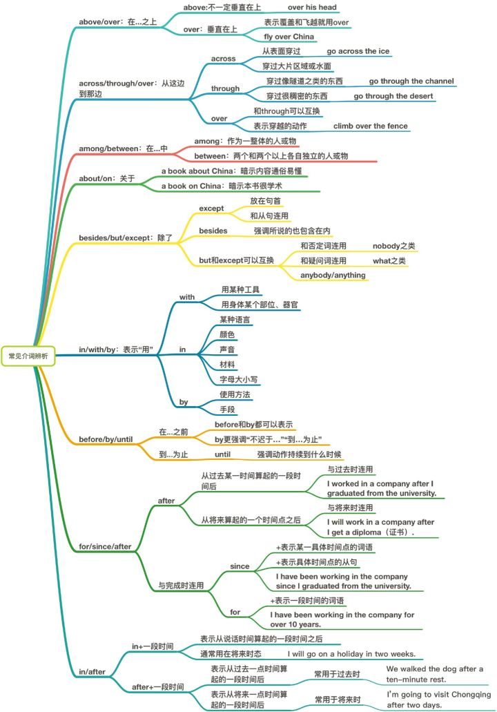

## 一些英语介词

- [常用介词表格](#常用介词表格)
- [思维导图](#思维导图)
- [引用](#引用)

## 常用介词表格

记录一些英语介词含义和用法。

| 介词   | 含义及用法                                                   | 例句                                                         |
| ------ | ------------------------------------------------------------ | ------------------------------------------------------------ |
| above  | 1. 在 ...... 上方（不接触，不一定垂直）。 2. （温度、海拔等刻度）高于。 | 1. The plane flew above the clouds. 飞机在云层上面飞行。 2. The mountain is about 3000 meters above the sea. 那座山海拔约三千米。 |
| as     | 1. 像；如同。 2. 作为，当作。                           | 1. He speaks English as an Englishman. 他像一个英国人那样讲英语。 2. You can use that glass as a vase. 你可以把那个玻璃杯当作花瓶用。 |
| at     | 1. 在（+ 地点/时刻/...... 岁/某方面）。 2. 朝；向。 3. 以，大（用于速率、比率等）。 | 1. at the corner of the street 在街角； at the bank 在银行；at two o'clock 在两点钟。 2. look at 看。 3. He was driving at 70 mph.他以每小时 70 英里的速度驾车行驶。 |
| by     | 1. 靠近；在 ...... 旁边。 2. 表示方式。 3. 不迟于，在 ...... 之前。 4. 被，由。 5. 经过。 | 1. by the window. 在窗户旁边。 2. by hand 手工；by plane 乘飞机。 3. I will finish the work by Friday. 最晚星期五，我会完成这项工作。 4. Fan Bingbing is loved by many people. 范冰冰被很多人喜爱。 5. go/walk/pass by 经过。 |
| during | 在 ...... 期间                                               | 1. during the night 在夜间。 2. during my stay in Zhengzhou 我在郑州逗留期间。 |
| for    | 1. 给，对，供（表对象、用途）。 2. 为了（表目的）。 3. 支持，拥护。 4. 因为，由于。 5. 就 ...... 而言；对某人来说。 6. 表示一段时间。 7. 向；往（表示方向或目标）。 | 1. There is a letter for you. 有你的一封信。 It's a book for children. 这是一本儿童读物。 2. go for a walk 去散步； Can you translate this letter for me? 你能为我翻译这封信吗？ 3. I think you'll be for my opinion. 我认为你会赞成我的观点的。 4. be famous for 因 ...... 著名。 5. She is tall for her age. 从她这个年龄看她个子算高的了。 6. for a few days 几天。 7. Is this the bus for Zhengzhou University? 这是去郑州大学的公交车吗？ |
| in     | 1. 在（范围或空间的某一点）。 2. 在 ...... 内/中。 3. 在某段时间内/后。 4. 穿着。 5. 用（语言或材料等）。 6. 关于；在 ...... 方面。 | 1.  in China 在中国；in the street 在街上。 2. lie in bed 躺在床上。in water 在水中。 3. in spring 在春天；in a few days 几天后。 4. the man in a hat 戴着帽子的男人。 5. in English 用英语；in a low voice 低声。 6. be rich in 富含。do well in 擅长。 |
| into   | 1. 到 ...... 里面；进入。 2. 撞上；碰上。               | 1. Come into the house. 进屋里来吧。 2. The truck crashed into a parked car. 卡车撞上了一辆停放着的小汽车。 |
| on     | 1. 在 ...... 上（接触/构成物体表面）。 2. 在（某一天）。 3. 关于。 4. 在，向，对（表示方向）。 5. 通过；使用；借助于。  | 1. on the desk 在书桌上；on the wall 在墙上。 2. on Sunday 星期天；on May the first 在五月一日；on the evening of May the first 在五月一日晚上。 3. a book on South Africa 一本关于南非的书。 4. on the right/left 在右边/左边；a town on the coast 沿海的城镇。 5. on the Internet/phone 从互联网上/通过电话。 |
| over   | 1. 在 ...... 正上方，反义词为 under。 2. （覆盖）在 ...... 上方。 3. 跨过，跨越。 4. 多于（时间、数量、花费等）。 5. 在期间 ...... 之后。 | 1. The bridge over the river has a long history. 河上的这座桥历史悠久。 2. Mrs. King put a coat over the sleeping girl. 金太太给那个熟睡的女孩盖了一件外套。 3. jump over the fence 跳过篱笆。 4. over a month 一个多月； He is over sixty 他六十多岁了。 5. We'll discuss it over lunch. 我们吃饭时商量此事吧。 |
| to     | 1. 到，往（地点或方向）。 2. 到，达（某处）。 3. 直到 ...... 为止。 4. 被逐出两个地理位置的相互关系时，to 表示在某一地域之外且不接壤。 | 1. the way to . . . 去 ...... 的路上。 2. Her hair fell to her waist. 她的头发一直垂到腰部。 3. We'll fight to the end. 我们将战斗到底。 4. Japan lies to the east of China. 日本位于中国东面。 |
| with   | 1. 和 ...... 一起，与 ......。 2. 具有，带有。 3. 用，以，借助于。表示方式，用于具体的有形的工具前。 | 1. We saw a woman with two children walking down the road. 我们看见一位妇女和两个孩子沿着这条路走。 2. Do you have any money with you? 你带钱了吗？ 3. I cut the apple with a knife. 我用刀切开了苹果。 |

## 思维导图

## 引用

- [英语介词用法归纳！](http://baijiahao.baidu.com/s?id=1602946431649838573&wfr=spider&for=pc)

- [英语的介词应该如何使用？ - Vivian的回答 - 知乎](https://www.zhihu.com/question/20530689/answer/99978363)